# LVGL 2D/3D 混合低功耗渲染后端改造方案（修订版）

> **LVGL**：本方案指在 LVGL 上扩展的 **2D/3D 混合渲染后端**（`lv_draw_gpu_composite` + 3D 子系统）。下文「LVGL 后端」= 本设计整体；API 前缀仍沿用 `lv_` 以兼容 LVGL 生态。

## 0. 产品目标：智能眼镜彩色 1080p AR

### 0.1 显示环境与硬约束

| 项 | 目标 |
|----|------|
| **设备** | 智能眼镜，彩色 **1080p** 级显示（典型 1920×1080 或单目等效分辨率） |
| **AR 穿透** | 未绘制像素 **alpha=0**，用户看到前方真实世界；UI/3D 内容为半透明或 opaque 局部 |
| **GPU** | Mali-400 基线 + 可选自研 IP（§2.8 `[HW:xxx]`） |
| **功耗** | 多应用缩略图并存时仍须可控（快照缓存 + 静态跳过 + 动效时才满帧） |

**合成链路（LVGL 负责段）**：

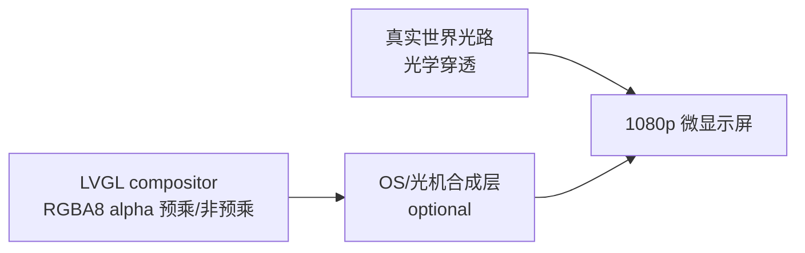

- LVGL **默认清屏 alpha=0**（非现有 demo 的黑底 opaque）
- 2D widget：`lv_obj` opa + 背景色 alpha；LAYER 子树支持半透明
- 3D mesh：`lv_3d_material_t` 含 **opacity + blend mode**（opaque / alpha / additive）
- 与 OS 光机 final composite 的接口留在 **display driver**（EGL window alpha、hardware overlay），LVGL 输出须保证 **color buffer 带有效 alpha 通道**

**1080p + Mali-400 策略**：全屏 RGBA8 1080p 每帧完整重绘不可接受 → **脏区 + 静态 scene 跳过 + 缩略图 Retainer 缓存 + 动效阶段才 60fps**（§2.6 Invalidation、§2.7 OnDemandRendering）。

---

### 0.2 场景一：多应用 3D 启动器（9 宫格 + 侧翼 + 全屏展开）

#### 视觉与交互描述

- 系统打开多个应用；眼镜展示 **最近 9 个** 的应用界面 **缩小图**
- **背景全透明**（穿透真实世界）
- **3×3 排列**：**从下到上** 三行，对应 **从近到远** 三个立体深度层（Z 不同 + 可选轻微 scale 差；最下一行最大/最近，最上一行最小/最远）
- **左、右两列外侧** 各露出 **第 10、11 个** 应用的一小条截屏，**Y 轴倾斜**（rotation.y），增强立体感
- 用户 ** gaze / 触控 / 手势** 选中其一 → **动效过渡** 至该应用 **全屏**；其余缩略图淡出或退远

#### 布局示意（屏幕 Y：自下而上 = 由近及远）

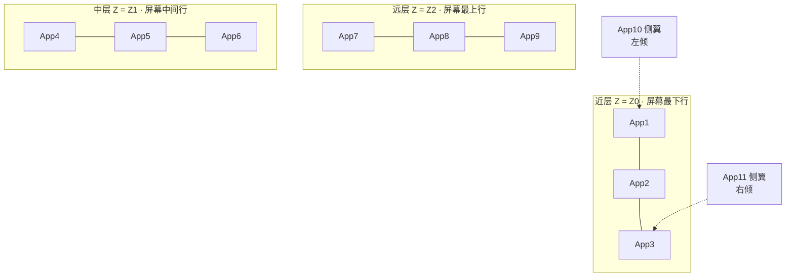

#### 架构映射

| UI 元素 | 实现方式 | 路径 |
|---------|---------|------|
| 全屏 AR 根 | `lv_screen_active()` 背景 **opa=0** 或 screen 级 `LV_DISPLAY_FLAG_AR_PASSTHROUGH` | compositor |
| 3D 空间容器 | `lv_3dviewport` 铺满 1080p + `lv_3dcamera` 透视 | 路径 B |
| 9 个缩略图 | 每个应用 UI 子树 → **`LV_3D_RENDER_PLANE`**（路径 A）或烘焙 quad | 路径 A |
| 深度分层 | `lv_3dstack` **布局 helper**（见下）按 row 写 position.z | 新增 |
| 侧翼预览 | 额外 2 个 plane，`rotation.y` 约 ±15°~25°，x 负/正偏移，部分 clip | 路径 A + transform |
| 缩略图内容 | **静态快照纹理**（推荐）或 VOLATILE live subtree | Phase 2 Retainer |
| 选中交互 | `lv_3dviewport_pick()` → focus tile | Phase 2 |
| 全屏动效 | `lv_anim` 驱动 **scale / position.z / opa**（选中 tile）+ 相机 optional dolly | Phase 2 |

**新增布局 helper（非独立 widget 种类）** — `lv_3dstack`：

```c
/* 3D 网格/stack 布局：将 N 个子 obj（已开 3D PLANE）按行列 + 深度层排布 */
lv_obj_t * lv_3dstack_create(lv_obj_t * parent);
void lv_3dstack_set_grid(lv_obj_t * stack, uint8_t cols, uint8_t rows);
void lv_3dstack_set_row_depth(lv_obj_t * stack, uint8_t row, float z);
void lv_3dstack_set_cell_spacing(lv_obj_t * stack, float x_gap, float y_gap);
void lv_3dstack_set_peek_tiles(lv_obj_t * stack, lv_obj_t * left, lv_obj_t * right,
                               float yaw_deg, float x_offset);  /* 侧翼 */
void lv_3dstack_focus_to_fullscreen(lv_obj_t * stack, lv_obj_t * tile,
                                  uint32_t anim_ms);             /* 场景一核心动效 */
```

**动效状态机**：

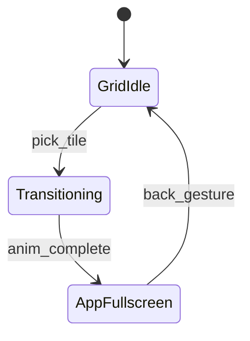

- **GridIdle**：9+2 plane，静态时可 **跳过 GPU**（全 STATIC + 快照纹理）
- **Transitioning**：仅 anim 相关 subtree 标记 VOLATILE，adaptive 30～60fps
- **AppFullscreen**：选中 tile scale→1、z→0、居中；其余 alpha→0；最终 2D UI 可切回 **Screen Space overlay** 模式

---

### 0.3 场景二：导航车道透视（两侧楼群后移）

#### 视觉描述

- 类似 **地图导航车道**：中央为车道/路线 UI（2D overlay 或地面 plane）
- **道路两侧楼房** 立体排列，随前进 **向后方移动**（parallax / 相对相机 z 减小）
- 楼体 **面片可透明**（仅线框）或 **简单示意贴图/纯色材质**（非真实纹理-heavy）

#### 架构映射

| 元素 | 实现 |
|------|------|
| 中央车道 | 2D `lv_obj` Screen Space overlay（`LV_UI_SPACE_OVERLAY`）或地面 `lv_3dmesh` plane |
| 楼群 | 多个 `lv_3dmesh_set_box()` + `wireframe` 或 **alpha 材质** |
| 后移运动 | `lv_anim` 或每帧 `position.z -= speed`；相机 fixed 或 slow dolly |
| 无限长度 | **`lv_3d_segment_pool`**：楼段 mesh 实例池，出屏后 **回收复用**（Unity 式 spawn/recycle） |
| 材质 | `LV_3D_MAT_ALPHA_WIREFRAME` / `LV_3D_MAT_SIMPLE_TEX`（ETC1 示意贴图，Phase 2） |
| 功耗 | 仅 **VOLATILE** 段参与每帧更新；静态楼段 STATIC |

**新增模块** — `lv_3d_segment_pool.c`（`lvgl/src/3d/`）：

```c
typedef struct {
    float segment_length;   /* 每段深度间距 */
    float scroll_speed;     /* 相对相机 z 速度 */
    uint16_t pool_size;     /* 同时可见段数 */
} lv_3d_segment_pool_cfg_t;

lv_3d_segment_pool_t * lv_3d_segment_pool_create(lv_obj_t * scene, const lv_3d_segment_pool_cfg_t * cfg);
void lv_3d_segment_pool_set_building_factory(lv_3d_segment_pool_t * pool,
    lv_3d_mesh_data_t (*build)(uint32_t seg_id, void * user), void * user);
void lv_3d_segment_pool_tick(lv_3d_segment_pool_t * pool, float dt);
```

**与现有 skyline demo 关系**：[`building_renderer.c`](building_renderer.c) 线框楼群逻辑 **迁入** `lv_3dmesh` + segment_pool；demo Phase 2 做 **场景二** 可滚动版。

---

### 0.4 两场景对后端的核心需求汇总

| 需求 | 场景一 | 场景二 | 计划章节 |
|------|--------|--------|---------|
| **全局 alpha / 穿透** | 必须 | 必须（楼体可半透明） | §0.1、§7 compositor |
| **2D UI 贴 3D 平面** | 缩略图 | 车道 overlay | §3 路径 A PLANE |
| **深度分层 / 透视** | 9 宫格从下到上、近到远 | 楼群 Z 深度 | §4 `lv_3dviewport` + camera |
| **Transform 动画** | 全屏展开 | 后移 parallax | `lv_anim` + 3D props |
| **3D pick / 焦点** | 选应用 | 可选 | Phase 2 |
| **快照缓存降功耗** | 9 路 live UI 太贵 | 楼段 mesh 复用 | Phase 2 Retainer / segment_pool |
| **线框 / 简单材质** | 缩略图边框 optional | 楼体主路径 | §4.3 box + wireframe |
| **1080p 帧预算** | 静态 grid 低 fps | 滚动时中等 fps | Phase 3 adaptive |

---

### 0.5 场景驱动的 Phase / Demo 优先级（修订）

| 阶段 | 交付物 | 验收场景 |
|------|--------|---------|
| **Phase 1** | compositor **alpha=0 清屏** + box/wireframe + viewport | 场景二 **静态** 线框楼群（透明底） |
| **Phase 2** | 路径 A PLANE + `lv_3dstack` + pick + `lv_anim` 过渡 | 场景一 **9 宫格 + 侧翼 + 全屏动效**（可用 placeholder 色块代缩略图） |
| **Phase 2** | `lv_3d_segment_pool` + 简单材质 | 场景二 **楼群后移** |
| **Phase 3** | Retainer 快照 + OnDemandRendering | 场景一 9 路 **真实应用缩略图** 低功耗 |
| **Phase 3+** | `[HW:TILE_COMPOSITOR]` 等 | 1080p 全场景带宽优化 |

本仓库 [`main.c`](main.c) 演进路线：**Phase 1 静态 skyline → Phase 2 场景二滚动 → Phase 2/3 场景一 launcher**。

---

### 0.6 场景验证：设计缺口与修订（以场景反推后端）

两典型场景是 **LVGL 后端的验收基准**。对照后原设计存在以下缺口，**本节修订已写入后文各章**：

| 缺口 | 场景需求 | 原设计不足 | **修订** |
|------|---------|-----------|---------|
| G1 穿透合成 | 两场景背景透明 | 仅 §0 描述，compositor 未强制 RGBA8 | §7.4 **Display 须 RGBA8888**；§7.6 **禁止 AR 下纯 RGB565** |
| G2 PLANE 缩略图 | 场景一 9+2 块 UI 贴 3D 平面 | `LV_3D_RENDER_PLANE` 无烘焙管线，易退回 SW 离屏老路 | §3.4 **`lv_3d_plane_bake`**：GPU 子 pass 烘焙，快照纹理复用 |
| G3 重复绘制 | PLANE tile 不应再画 2D pass | 未规定 | §3.2 **`LV_3D_RENDER_PLANE` 时跳过 2D DRAW_MAIN 输出** |
| G4 帧 pass 顺序 | 场景二 3D 楼群 + 2D 车道 overlay | 2D/3D 同 FBO 但顺序未定义 | §7.5 **帧图**：Clear → 3D viewport → 2D OVERLAY |
| G5 半透明排序 | 场景二透明楼体 | 3D batch 仅 depth，alpha 面会错 | §7.2 **alpha mesh 按相机距离 back-to-front sort** |
| G6 侧翼裁剪 | 场景一 peek 只露一条 | 无 3D/屏幕 clip | §3.1 `LV_STYLE_3D_CLIP_AABB` + viewport scissor |
| G7 布局/动效 API | 场景一 grid + 全屏过渡 | `lv_3dstack` 仅在 §0，未进 widget/anim | §4.4 `lv_3dstack`；§3.5 **`lv_anim_3d_*`** |
| G8 无限楼群 | 场景二 parallax | segment_pool 仅在 §0 | §5 纳入 **`lv_3d_segment_pool.c`** |
| G9 材质枚举 | 线框/透明/示意贴图 | `lv_3d_material.c` 过简 | §5 **`lv_3d_material_t` 扩展**（见下） |
| G10 静态功耗 | 场景一 idle 几乎不耗 GPU | Retainer 推到 Phase 3 过晚 | Phase 2 **最小快照 bake**；Phase 3 完整 Retainer + **event-driven 0fps** |
| G11 空间模式切换 | 场景一 Grid → App 全屏 | Canvas 三模式未绑场景 | §2.7 **`lv_ui_mode_t` 场景状态机** |
| G12 验收脚本 | 可回归 | 无场景级测试 | §0.7 + `verify_scenario*.sh` todo |

**扩展 `lv_3d_material_t`（场景二 + 场景一边框）**：

```c
typedef enum {
    LV_3D_MAT_OPAQUE,
    LV_3D_MAT_ALPHA,              /* 半透明面，场景二可选 */
    LV_3D_MAT_WIREFRAME,          /* 面 alpha=0，棱边 alpha=1，场景二主路径 */
    LV_3D_MAT_WIREFRAME_TEX,      /* 线框 + ETC1 示意贴图 Phase 2 */
    LV_3D_MAT_PLANE_SNAPSHOT,     /* 场景一缩略图 PLANE 专用 */
} lv_3d_material_kind_t;
```

**`lv_ui_mode_t`（场景一状态 ↔ Unity Canvas 语义）**：

```c
typedef enum {
    LV_UI_MODE_AR_LAUNCHER,       /* 3D grid + 穿透底，场景一 */
    LV_UI_MODE_APP_FULLSCREEN,    /* 选中应用全屏 2D，opaque 区域可覆盖 */
    LV_UI_MODE_NAV_AR,            /* 场景二：3D 楼群 + 2D 车道 overlay */
} lv_ui_mode_t;
```

### 0.7 场景验收标准（后端必须满足）

| 检查项 | 场景一 | 场景二 | 方法 |
|--------|--------|--------|------|
| 未绘制区 alpha=0 | 必须 | 必须 | 读 back buffer α 通道 |
| 1080p 静态 idle GPU 调用 ≈0 | GridIdle 态 | 停车态 | trace draw call / 帧跳过计数 |
| 3D 深度分层可见 | 从下到上、近到远三行 | 楼群 Z 递进 | 视觉 + depth buffer |
| 侧翼倾斜 | ±yaw peek | — | 视觉 |
| pick 选中 | 射线命中 tile | — | 自动化注入坐标 |
| 全屏动效 | anim 结束切 APP_FULLSCREEN | — | 状态机断言 |
| 楼群后移 | — | segment_pool tick | z 单调递减 / 回收计数 |
| 车道 UI 在最上 | — | overlay 不被楼遮挡 | 截图 compare |
| 动效期 fps | 30～60 | 滚动时 30 | 帧时间统计 |

#### 0.7.1 像素格式分档验收

| 档位 | `LV_GPU_COMPOSITE_COLOR_FORMAT` | 必须通过项 | 可降级项 |
|------|--------------------------------|-----------|---------|
| **FULL** | RGBA8888 | §0.7 全部 | — |
| **NEAR_FULL** | **RGB565+A8** | 穿透、淡出、半透明线框、pick、parallax | 565 **色带**可目视接受；driver 出口 8888 转换可接受 |
| **DEGRADED_16** | RGBA4444 | 穿透、pick、线框、scale 动效 | 淡出 banding；半透明勉强 |
| **BINARY_16** | RGBA5551 | 穿透、线框二值 α、pick、scale 动效 | 禁止 opa 淡出；禁止半透明楼体面 |

---

## 修订说明（相对初版）

**初版错误假设**：3D 继续走 `lv_3dtexture` + 外部 OpenGL 纹理句柄。

**修订后正确定位**：
1. **路径 A**：为现有每个 `lv_obj` 增加可选 **3D 属性**（Transform / RenderMode），使 2D widget 可嵌入 3D 空间渲染。
2. **路径 B**：新增 **原生 3D widget 体系**（参考 Unity3D / OSG 最基础概念），由 **`lv_draw_gpu_composite` 后端内部** 完成 mesh 绘制与合成。

`lv_3dtexture` / 外部 `tex_id` 仅保留为 **兼容层（deprecated）**，不再是主设计。

---

## 1. 现状与问题

当前 [`lv_draw_opengles.c`](lvgl/src/draw/opengles/lv_draw_opengles.c) 的问题：

| 问题 | 说明 |
|------|------|
| 2D 高功耗 | 复杂 widget SW 离屏 → 上传纹理 → blit |
| 3D 模型错误 | 3D = 外部纹理 blit，应用自行 OpenGL，与 LVGL 生命周期/状态割裂 |
| 无 scene graph | 无法表达层级、相机、mesh 集合 |
| 无统一 3D 属性 | 2D widget 与 3D 空间脱节 |

**目标**：单一 GPU compositor，**2D UI + 内置 3D scene** 同帧合成；3D 数据来自 LVGL 对象树，而非应用侧 GL 纹理。

**产品场景（§0）**：智能眼镜 1080p AR — **穿透透明底** + **场景一 3D 应用启动器** + **场景二 导航车道楼群透视**。

---

## 2. 目标架构

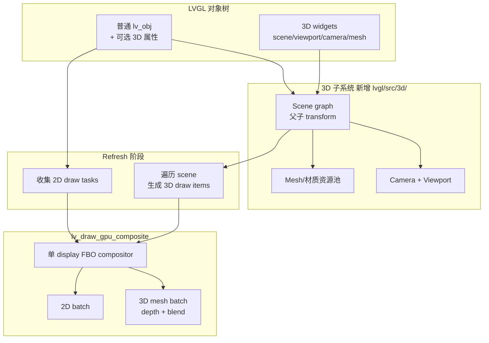

**帧合成顺序（场景二必须，场景一同类）** — 见 §7.5：

```
1. Clear RGBA (0,0,0,0)
2. 3D viewport pass（楼群 / launcher grid）
3. 2D batch — 仅 lv_ui_space == OVERLAY 的对象（车道、HUD）
4. （可选）2D Screen Space 全屏应用层 — APP_FULLSCREEN 模式
```

---

## 2.5 设计参考框架

本设计不照搬任一引擎，而是按 **职责** 选取可映射到 LVGL 嵌入式约束（C API、retained tree、draw task、低功耗）的概念。

| 参考来源 | 主要借鉴 | 与本目标匹配度 |
|---------|---------|--------------|
| **LVGL 内部** | `lv_obj` 树、style、layer、draw task、invalidation | **最高** — 一切 3D 扩展必须对齐 |
| **Qt Quick Scene Graph** | 脏区传播、2D batch、3D viewport 嵌入 UI | **高** — compositor 与 refresh 模型 |
| **Godot** | `Node3D` / `SubViewport` / `Camera3D` API 划分 | **高** — 轻量 3D widget 命名与职责 |
| **Unity** | Transform、Canvas 空间模式、MeshRenderer、SRP Batch、OnDemandRendering | **中高** — 见 §2.7 展开 |
| **OSG** | Group / Transform / Geode 场景图 | **中** — scene collect 遍历结构 |
| **Unreal UMG (+ Slate)** | 2D/3D UI 空间模式、invalidation、Retainer、3D Widget 交互 | **中高** — 见下节展开 |
| **Android SurfaceView** | UI 树中嵌入 GPU 矩形视口 | **中** — `lv_3dviewport` 生命周期 |

---

## 2.6 Unreal UMG 展开分析（与目标匹配功能）

UMG 构建在 **Slate** 之上。分析时须区分：**Slate 层**（绘制、脏区、batch）与 **UMG 层**（Widget 类型、布局、3D 挂载）。与本设计相关的主要是 Slate 刷新模型 + UMG 的 **2D/3D 空间切换** 与 **3D 场景中的 UI 挂载**。

### 2.6.1 UMG / Slate 架构（与本设计的关系）

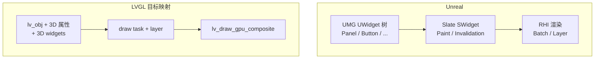

| Unreal 层 | LVGL 映射 |
|-----------|----------|
| `UWidget` 树 | `lv_obj` 树 + `lv_3d*` widget |
| Slate `SWidget::Paint` | `LV_EVENT_DRAW_MAIN` → draw task |
| Slate Invalidation | `lv_obj_invalidate` + inv_areas |
| Slate LayerId / batch | compositor 2D batch + z-order |
| RHI Render Pass | 单 display FBO + viewport sub-pass |

### 2.6.2 匹配功能一览（按优先级）

#### A. 直接采纳（Phase 1～2）

| UMG / Slate 功能 | 行为摘要 | 本设计映射 | 匹配目标 |
|-----------------|---------|-----------|---------|
| **Screen Space UI** | 默认 HUD，按屏幕像素布局 | 现有 `lv_screen_active()` 2D 层 | 2D UI 基线 |
| **World Space UI** | UI 存在于 3D 世界，随相机透视 | 路径 A：`LV_OBJ_FLAG_3D_ENABLED` + `LV_3D_RENDER_PLANE/BILLBOARD` | 2D/3D 混合 |
| **Widget Component** | 将 UMG 子树渲染到 Render Target，贴到 3D mesh | **语义借鉴、实现不照搬 RT**：compositor 将 obj 子 layer **直接烘焙为 3D quad**（同 pass），避免每 widget 独立 RT | 3D 空间 UI、低功耗 |
| **Draw Size / Desired Size** | Widget 布局尺寸与绘制尺寸分离 | 已有 `lv_obj` layout；3D 投影用 **屏幕 AABB** 作 dirty 区域 | 脏区精确裁剪 |
| **Clipping**（`SClippingWidget` / clip to bounds） | 子树裁剪到矩形 | `lv_obj` clip + compositor `glScissor` | 降低 overdraw |
| **Z-Order / Paint order** | 兄弟节点绘制顺序 | draw task 链表顺序 + 3D depth（mesh）/ painter's order（2D） | 正确叠层 |
| **Invalidation Panel**（Slate） | 标记 volatile/static；仅重绘变化 subtree | **核心低功耗机制**：3D transform / mesh / 2D content 变更 → subtree dirty；静态 scene **跳过 collect** | 极低渲染功耗 |
| **Hit Test / Focus** | 指针事件沿 widget 树命中 | 扩展 `lv_indev`：2D 照常；`lv_3dviewport` 内 **射线 pick** → 投影到 UI 坐标 | 3D viewport 可交互 |
| **DPI / UI Scale** | 分辨率无关 UI | 沿用 `LV_DPI_DEF`、`lv_display_set_dpi` | 嵌入式多分辨率 |

#### B.  selective 采纳（Phase 2～3，谨慎使用）

| UMG / Slate 功能 | 行为摘要 | 本设计映射 | 注意 |
|-----------------|---------|-----------|------|
| **Retainer Box**（`SRetainerWidget`） | 将复杂 subtree 缓存到 RT，未 dirty 则复用 | 映射为 **`lv_layer` 子层 GPU 缓存**（类似现有 LAYER task，但由 compositor 管理、非每 widget SW 上传） | **仅用于复杂静态 subtree**；滥用 RT 会增加带宽 |
| **Widget Animation** | 属性时间轴动画 | `lv_anim` 驱动 3D transform / material 属性 | 不引入 Blueprint；仅数值动画 |
| **Render Transform**（2D pivot/rotate/scale） | 2D 变换 | 已有 `LV_STYLE_TRANSFORM_*`；与 3D transform **分离**：2D 仍在 layer，3D 走 scene node | 避免两套 transform 冲突 |
| **Material / Brush** | Image brush、动态材质 | `lv_3d_material_t` 纯色/线框/简单纹理；**不做** UMaterial 图编辑器 | 嵌入式可维护性 |
| **Nested Viewport** | 子视口独立渲染 | `lv_3dviewport` 嵌套（Phase 2）；子 pass 仅清 viewport 脏区 | 与 compositor sub-pass 一致 |

#### C. 明确不采纳（与目标冲突或过重）

| UMG 功能 | 不采纳原因 |
|---------|-----------|
| **Widget Blueprint / 可视化 UI 编辑** | LVGL 无编辑器生态；保持 C API |
| **每 Widget 默认 Render Target**（Widget Component 原始实现） | Mali-400 带宽与 FBO 切换成本高；改 direct quad bake |
| **Slate Draw Element 任意扩展** | 破坏 draw task 类型封闭性 |
| **Complex Material Graph** | 功耗、shader 变体爆炸 |
| **3D Widget Component + 全场景 Post Process** | 超出 UI 合成范围 |
| **Rich Game Input Mode**（Enhanced Input 全栈） | 保留 `lv_indev` 模型即可 |
| **UMG Sequence / 复杂状态机动画** | Phase 1 不做 |

### 2.6.3 三项 UMG 能力 → 本设计具体方案

#### （1）World Space UI ≈ 路径 A + `lv_3dviewport`

| UMG | 本设计 |
|-----|--------|
| Screen Space Overlay | 全屏 2D layer（默认） |
| Widget Component in world | `lv_obj` + 3D 属性，或 2D 子树挂在 `lv_3dscene` 下 |
| 独立 3D 窗口 | `lv_3dviewport` 绑定 camera + scene |

**差异（刻意）**：UMG Widget Component 默认 **RT 中继**；本设计优先 **compositor 同 pass 烘焙 quad**，减少一次 RT blit。

#### （2）Invalidation ≈ 低功耗核心

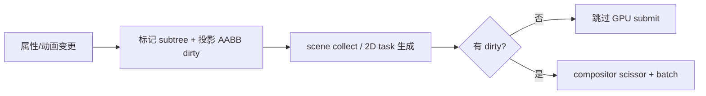

对应 Slate **InvalidationRoot** 的 volatile 标记，在 LVGL 侧建议：

- `lv_3d_node_t.flags`：`STATIC` / `VOLATILE` / `TRANSFORM_DIRTY` / `GEOMETRY_DIRTY`
- 静态 mesh + 静态 2D 子树 → Phase 3 **零 GPU** 直至相机变化

#### （3）3D 交互 ≈ `lv_indev` 扩展

| UMG | 本设计 |
|-----|--------|
| `Widget Interaction Component` + line trace | `lv_3dviewport` 注册 pick callback |
| 命中后路由到 UMG 焦点链 | 射线命中 → 转 screen-local 坐标 → `lv_indev` 注入 pointer 事件 |
| | 焦点仍走 `lv_group` / 现有 event 冒泡 |

建议 API（计划项，Phase 2）：

```c
void lv_3dviewport_set_pickable(lv_obj_t * vp, bool en);
lv_obj_t * lv_3dviewport_pick_obj(lv_obj_t * vp, lv_point3d_t ray_origin, lv_vec3_t ray_dir);
```

### 2.6.4 UMG 对照表：路径 B 3D Widget

| UMG / Unreal 概念 | 本设计 widget | 说明 |
|------------------|--------------|------|
| Actor + SceneComponent 层级 | `lv_3dscene` | 场景根 / Group |
| CameraComponent | `lv_3dcamera` | view / proj |
| （无直接等价，用 SceneCapture 近似） | `lv_3dviewport` | 屏幕矩形内 3D pass |
| Static Mesh Component | `lv_3dmesh` | box / line / custom mesh |
| Skeletal Mesh | — | Phase 3+ 可选，非 Phase 1 |
| Widget Component | 路径 A render_mode | 2D→3D，非独立 Actor |
| Directional Light | `lv_3dlight` | Phase 3 可选 |

### 2.6.5 对 compositor 设计的 UMG 启示

1. **Pass 划分**：全屏 2D UI pass + 可选 **viewport sub-pass**（类似 UMG 在 3D 中单独 Render Target，但合并到单 FBO 的不同 viewport/scissor 区域）。
2. **缓存策略**：仅对 **Retainer 等价** 的复杂静态 layer 保留 GPU 缓存 id；动态 3D mesh 用 VBO 池，不每帧 RT。
3. **Overdraw 控制**：Slate 的 culling + clipping → compositor scissor + 3D depth test（mesh）+ 2D painter order。
4. **不引入 UMG 默认 RT 链**：当前 OpenGLES 后端 “SW→texture→blit” 已证明高功耗；UMG Widget Component 若照搬 RT 模式会重蹈覆辙。

---

## 2.7 Unity 展开分析（取其精华）

Unity 与本设计相关的部分主要在 **Transform 层级**、**Canvas 三种 Render Mode**、**MeshRenderer 管线** 与 **URP 批处理/按需渲染**。不采纳 ECS、Asset Pipeline、Animator、Physics 等游戏全栈能力。

### 2.7.1 Unity 架构分层（与本设计映射）

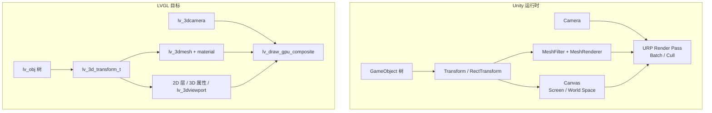

| Unity 概念 | LVGL 映射 |
|-----------|----------|
| `GameObject` + 父子 `Transform` | `lv_obj` parent/child + `lv_3d_node_t` 级联矩阵 |
| `RectTransform`（2D UI 布局） | 现有 `lv_obj` 坐标 + flex/grid；**不另建 RectTransform 类型** |
| `Transform`（3D 局部/世界） | `LV_STYLE_3D_*` + `lv_3d_transform_get_world()` |
| `Canvas` | 全屏 2D screen 或 `lv_3dviewport` 内 UI 子树 |
| `MeshFilter` / `MeshRenderer` | `lv_3dmesh` 几何与材质拆分 |
| `Camera` | `lv_3dcamera` |
| URP Draw / Batch | compositor 2D/3D batch |

### 2.7.2 匹配功能一览（按优先级）

#### A. 直接采纳（Phase 1～2）— Unity 精华

| Unity 功能 | 行为摘要 | 本设计映射 | 匹配目标 |
|-----------|---------|-----------|---------|
| **Transform 层级** | localPosition/Rotation/Scale，父子矩阵级联 | `lv_3d_node_t` 挂到 obj/3D widget；refresh 时一次 DFS 算 world matrix | scene graph 基础 |
| **Canvas Render Mode: Screen Space Overlay** | HUD，不受相机影响 | 默认 `lv_screen_active()` 2D 绘制 | 现有 UI |
| **Canvas Render Mode: Screen Space Camera** | UI 贴在某 Camera 前（有距离/FOV） | `lv_3dviewport` 内 2D 子树 + 绑定 `lv_3dcamera`；2D 按 camera 投影到 viewport 矩形 | 3D 窗口内 HUD |
| **Canvas Render Mode: World Space** | UI 作为 3D 平面存在于场景 | 路径 A：`LV_3D_RENDER_PLANE` / `BILLBOARD`；Canvas 等价于 **带 3D 属性的 obj 子树** | 2D/3D 混合 |
| **MeshFilter + MeshRenderer** | 几何与渲染属性分离 | `lv_3dmesh_set_box()` 建 geometry；`lv_3dmesh_set_color/wireframe` 为 material 参数 | 清晰 API |
| **Camera（Perspective / Orthographic）** | 投影矩阵 + clear flags | `lv_3dcamera_set_perspective/ortho()`；viewport pass 清 depth/color | 3D 视图 |
| **LineRenderer**（线框模式） | 3D 空间折线/框 | `lv_3dmesh_set_wireframe(true)` + 程序化 edge mesh；**skyline demo 直接对标** | 线框楼群 |
| **Sorting Layer / Order in Layer** | 2D 绘制优先级 | 映射为 draw task 顺序 + `lv_obj` 兄弟 z-order；3D mesh 用 depth + material pass | 叠层正确 |
| **CanvasGroup alpha** | 子树整体透明度 | 已有 `lv_obj` opa 级联；3D 侧 material 继承 `opa` | 半透明 UI |
| **GraphicRaycaster** | UI 射线/矩形命中 | 2D：`lv_indev`；3D viewport：与 UMG pick 合并为 `lv_3dviewport_pick_obj` | 交互 |

#### B. selective 采纳（Phase 2～3）

| Unity 功能 | 行为摘要 | 本设计映射 | 注意 |
|-----------|---------|-----------|------|
| **Static Batching / SRP Batcher** | 同材质 mesh 合并 draw call | compositor **3D batch**：按 `material_id` 合并 VBO index；静态 mesh 标记 `LV_3D_NODE_STATIC` | 降 draw call、降功耗 |
| **Dynamic Batching** | 小 mesh 运行时合并 | 仅小 box/line 在 CPU 侧 merge index（Phase 3） | Mali-400 阈值需实测 |
| **Frustum Culling** | 相机视锥外不提交 | scene collect 时 AABB vs frustum，不可见 node 不生成 draw item | 3D 场景变大后必需 |
| **Occlusion / LOD** | 遮挡与层级细节 | Phase 3+；嵌入式 UI 场景通常 **仅 frustum cull** 即可 | 勿过度设计 |
| **RenderTexture** | 相机输出到 RT | **仅** viewport sub-pass 写 display FBO 的子区域；**禁止**每 Canvas 一张 RT | 与 UMG Retainer 同戒 |
| **OnDemandRendering** | 无变化时降低帧率/GPU 提交 | Phase 3：`lv_display_set_refresh_mode()` — 无 dirty 则跳过 `lv_refr`/GPU；有 3D 动画时按区域提频 | **极低功耗核心** |
| **Canvas Scaler** | 参考分辨率缩放 | 沿用 `lv_display` DPI + zoom；3D viewport 独立 scale 可选 | 多分辨率 |
| **Prefab** | 可复用对象模板 | Phase 2：`lv_3dmodel` / scene preset（如 skyline 楼群模板） | 非编辑器，仅 C API 工厂 |
| **Simple Animation (AnimationClip)** | 关键帧插值 | `lv_anim` on 3D transform；不引入 Animator 状态机 | 旋转楼群等 |

#### C. 明确不采纳

| Unity 功能 | 不采纳原因 |
|-----------|-----------|
| **DOTS / ECS** | 与 `lv_obj` 面向对象树冲突 |
| **Animator Controller / Timeline** | 状态机过重 |
| **Physics (Rigidbody/Collider 全栈)** | 非 UI 框架职责；3D pick 只需射线- AABB |
| **Skinned Mesh / Avatar** | Phase 1 不做骨骼动画 |
| **Shader Graph / URP 全定制** | 嵌入式固定 shader 集 |
| **AssetDatabase / Addressables** | 无 Unity 编辑器生态 |
| **Post Processing Stack** | 功耗与 scope 不符 |
| **Multi-Scene / DontDestroyOnLoad** | 嵌入式单 scene 为主 |
| **每 Canvas 独立 RenderTexture 链** | 高带宽，与 compositor 目标相反 |

### 2.7.3 Canvas 三模式 → 本设计统一模型（精华）

Unity UI 最强大的可借鉴点是 **同一套 widget 树，三种空间语义**。本设计用 **一个 `lv_obj` 模型 + 枚举** 覆盖，无需单独 `Canvas` 类（降低 API 面）：

| Unity Canvas 模式 | 本设计等价 | 渲染路径 |
|------------------|-----------|---------|
| Screen Space - Overlay | 普通 screen 上 2D obj | compositor 2D batch（全屏） |
| Screen Space - Camera | `lv_3dviewport` 的子 obj 树 + 绑定 camera | viewport 内 2D batch（带 camera 投影矩形） |
| World Space | `LV_OBJ_FLAG_3D_ENABLED` + `PLANE/BILLBOARD` | 3D quad pass + 可选 depth |

```c
/* 统一空间模式（建议新增 display/viewport 级或 obj 级枚举） */
typedef enum {
    LV_UI_SPACE_SCREEN_OVERLAY,   /* 默认 */
    LV_UI_SPACE_SCREEN_CAMERA,    /* lv_3dviewport 内 */
    LV_UI_SPACE_WORLD,            /* 3D 属性开启 */
} lv_ui_space_t;
```

**精华**：不复制 Unity `Canvas` 组件，而复制其 **空间语义三分法**，与 UMG Screen/World 对齐。

### 2.7.4 Transform 精华 → `lv_3d_node_t`

Unity `Transform` 最值得移植的三条规则：

1. **层级级联**：子节点 local TRS × 父 world = 子 world（与 OSG `Transform` 一致，但 Unity API 更直观）。
2. **分离 2D layout 与 3D TRS**：2D 仍用 `lv_obj` x/y/w/h；3D 仅在有 `LV_OBJ_FLAG_3D_ENABLED` 或 3D widget 时参与 scene collect。
3. **变更传播**：Transform 改变 → 标记 subtree dirty + 重算 world AABB（对标 Unity `OnTransformChildrenChanged` 语义，内部实现即可）。

建议内部 API：

```c
void lv_3d_transform_set_local(lv_3d_node_t * n, const lv_vec3_t * t, const lv_vec3_t * r_euler, const lv_vec3_t * s);
void lv_3d_transform_get_world(const lv_3d_node_t * n, lv_mat4_t * out);
void lv_3d_transform_mark_dirty(lv_3d_node_t * n);  /* 向上/向下传播 */
```

### 2.7.5 MeshRenderer 精华 → compositor 3D batch

| Unity MeshRenderer | 本设计 |
|-------------------|--------|
| sharedMaterial | `lv_3d_material_t`（纯色/线框/纹理） |
| shadowCasting | Phase 3 可选，默认 off |
| receiveShadows | 嵌入式 UI 默认 off |
| sortingOrder | material pass + depth |
| **相同 material 合批** | compositor `batch_3d.c` 按 material_id 合并 |

**LineRenderer 精华**（skyline demo）：Unity 用连续 3D 点 + 宽度；本设计 Phase 1 用 **box 12 棱边 → line mesh** 或 `lv_3dmesh_set_wireframe`，避免 LineRenderer 运行时动态细分（嵌入式更可控）。

### 2.7.6 低功耗：Unity OnDemandRendering + Static Batching

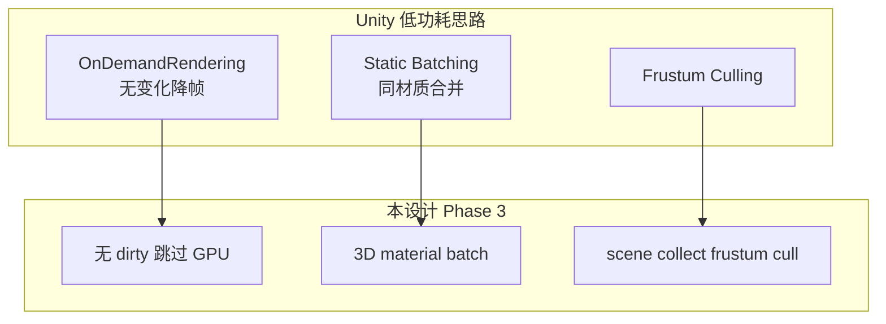

| Unity | 本设计 API（计划） |
|-------|------------------|
| `OnDemandRendering.renderFrameInterval` | `lv_display_set_refresh_period(disp, ms)` + 内部 dirty 聚合 |
| `Application.targetFrameRate` | 与 3D 动画/触摸事件联动 adaptive |
| Static Editor flag | `lv_3d_node_add_flag(n, LV_3D_NODE_STATIC)` |

### 2.7.7 Unity vs UMG 重复能力（合并结论）

以下能力 Unity 与 UMG 均覆盖，**本设计只实现一次**：

| 能力 | 主要参考 |
|------|---------|
| World Space UI | Unity Canvas World Space（语义）+ UMG Widget Component（避免 RT） |
| 3D 射线交互 | Unity GraphicRaycaster + UMG Widget Interaction → 统一 `lv_3dviewport_pick` |
| 脏区/静态优化 | UMG Invalidation（细）+ Unity Static Batching（3D batch） |
| Viewport 内 UI | Unity Screen Space Camera + Godot SubViewport（API 形） |

### 2.7.8 路径 B Widget 对照（Unity 组件 → LVGL）

| Unity 组件 | 本设计 | Phase |
|-----------|--------|-------|
| `Transform` | `lv_3d_node_t` / obj 3D 属性 | 1 |
| `Camera` | `lv_3dcamera` | 1 |
| `MeshFilter` + `MeshRenderer` | `lv_3dmesh` | 1 |
| `LineRenderer` | `lv_3dmesh` wireframe | 1 |
| `Canvas` | space 枚举 + viewport/screen | 1～2 |
| `CanvasGroup` | `lv_obj` opa 级联 | 已有 |
| `EventSystem` + `GraphicRaycaster` | `lv_indev` + pick | 2 |
| `Light` | `lv_3dlight` | 3 |
| `Prefab` | scene/mesh preset API | 2 |
| `SkinnedMeshRenderer` | — | 不做 |

---

## 2.8 Mali-400 / GLES 能力标记与后端分层（设计修改）

**背景**：Mali-400（Utgard）仅 **OpenGL ES 2.0** + 有限扩展，**不支持 OpenGL ES 3.x 核心**。当前仓库 [`lv_opengles_driver.c`](lvgl/src/drivers/glfw/lv_opengles_driver.c)、[`building_renderer.c`](building_renderer.c) 均硬编码 `#version 300 es`，在 Mali-400 上 **无法运行**。新后端必须从设计层引入 **能力标记 + 双路径降级**。

**设计动机（自研硬件）**：标记体系的目标不仅是「标准 Mali-400 ↔ 新 Mali」降级，更是为 **基于 Mali-400 基座、后续叠加自研硬件能力** 预留扩展位。基线永远按 `[GL2]` 可跑；当 SoC 增加定制单元（2D 合成器、硬件 instancing、专用 depth、tile compositor 等）时，只需在板级 probe 中置位 `[HW:xxx]`，compositor **自动选用更优路径**，无需重写上层 LVGL 逻辑。

### 2.8.1 需做的设计修改（总览）

| # | 设计修改 | 原因 |
|---|---------|------|
| 1 | 新增 **`lv_gpu_composite_caps_t` 能力探测层**（启动时读 GL 版本 + extension） | 同一套代码适配 Mali-400 与新 Mali |
| 2 | **渲染 API 双轨**：`gles2`（Mali-400 主路径）与 `gles3`（可选）分离为独立 `.c` + shader 集 | 避免 `#ifdef` 散落 |
| 3 | **特性标记语法**：设计/代码中每条 GPU 能力带 `[GL2]` `[GL3]` `[EXT:xxx]` `[HW:xxx]` `[CPU]` 标签 | 标准 GLES + 自研硬件 + CPU 降级统一描述 |
| 4 | **VAO 抽象层**：ES3 用 VAO；ES2 用手动 attrib 或 `OES_vertex_array_object` | Mali-400 无 GLES3 核心 VAO |
| 5 | **Shader 规范**：ES2 禁用 `bool` uniform、`layout(location=)`、`in/out`；提供 ES 1.00 变体 | 对齐 [`lv_opengles_driver.c`](lvgl/src/drivers/glfw/lv_opengles_driver.c) 现有 GLES3 写法 |
| 6 | **Phase 功能分级**：Instancing/UBO/MRT 等标 `[GL3]` 或 `[CPU-fallback]` | Unity batch 在 Mali-400 上 CPU 合批 |
| 7 | **配置项**：`LV_GPU_COMPOSITE_GLES_API = 2 | 3 | AUTO` | 量产板可强制 ES2 |
| 8 | **evaluate 降级**：`[GL3-only]` 的 2D 特效 task 回落 SW draw unit | 功能不丢、路径可降级 |
| 9 | **测试矩阵**：smoke 增加 **GLES2 context** profile | 防止开发机 ES3 掩盖嵌入式问题 |
| 10 | **板级 vendor hook**：`caps_probe_vendor()` + `hw_features` 位域 + 可选 `gles_hw.c` | 自研 IP 叠加在 Mali-400 基座上，不 fork LVGL |

### 2.8.2 能力标记约定

```
[GL2]           — OpenGL ES 2.0 核心即可（Mali-400 基线，永远保留）
[GL3]           — 需要 OpenGL ES 3.0+（标准 Mali-400 不可用，须降级）
[EXT:OES_xxx]   — 依赖 Khronos/厂商 GL 扩展；启动时探测，无则降级
[HW:xxx]        — 自研 SoC 硬件能力（非标准 GLES）；由板级 vendor probe 置位
[CPU]           — 不依赖 GPU 特性（scene cull、matrix、batch 合并）
[POT]           — 需 2 的幂纹理尺寸（ES2 mipmap 限制）
```

**路径解析优先级**（每条 compositor 功能注册多个候选路径，按序选用第一个可用）：

```
[HW:xxx]  →  [GL3]  →  [EXT:xxx]  →  [GL2]  →  [CPU]
```

示例：Instanced draw 注册为 `[HW:INSTANCED_DRAW] | [GL3] | [EXT:ANGLE_instanced_arrays] | [CPU:merge_index]`。纯 Mali-400 走 CPU 合批；若未来自研 IP 支持硬件 instancing，板级 probe 置位后 **同一套 LVGL 代码自动升级路径**，无需改 widget/scene 层。

**内部标记的好处**：

| 好处 | 说明 |
|------|------|
| **基线与增强解耦** | Phase 1 只实现 `[GL2]`/`[CPU]` 路径即可量产；自研能力后补 `[HW]` 分支 |
| **可审计** | 设计文档、draw task、`evaluate_cb` 共用同一套 tag，验收时可对照 caps 日志 |
| **无 fork** | 不因「定制 Mali-400」维护独立 LVGL 分支，仅板级 `caps_probe_vendor` + 可选 `gles_hw.c` |
| **渐进启用** | 新硬件 IP 可先 stub（flag=0 走降级），驱动就绪后开 flag 即生效 |
| **测试可复现** | smoke 可 mock `hw_features` 位，在 x86 开发机上验证 `[HW]` 路径逻辑 |

运行时结构（计划新增 [`lv_gpu_composite_caps.h`](lvgl/src/draw/gpu_composite/lv_gpu_composite_caps.h)）：

```c
/* 标准 GL 能力 */
typedef struct {
    uint8_t  gles_major;              /* 2 或 3 */
    bool     has_vao;                 /* [GL3] 或 [EXT:OES_vertex_array_object] */
    bool     has_fbo;
    bool     has_depth24;
    bool     has_npot_mipmap;
    bool     has_instancing;          /* [GL3] / [EXT:ANGLE_instanced_arrays] */
    bool     has_ubo;                 /* [GL3] */
    bool     has_msaa;
    bool     has_fbo_rgba4444;        /* GL_RGBA4 attachment */
    bool     has_fbo_rgb5_a1;         /* GL_RGB5_A1，即 RGBA5551 */
    bool     has_fbo_alpha8;           /* GL_ALPHA / A8 独立平面 */
    bool     has_hw_565_a8;            /* [HW:565_A8] 单 pass */
    int32_t  max_texture_size;

    /* 自研硬件能力位域 — 由板级 vendor 填充，LVGL 核心只读 */
    uint64_t hw_features;             /* LV_GPU_HW_* 宏组合 */
} lv_gpu_composite_caps_t;

/* 自研能力示例（板级头文件 lv_gpu_composite_caps_vendor.h 定义具体 bit） */
#define LV_GPU_HW_BLIT2D          (1ULL << 0)  /* 硬件 2D blit/compose */
#define LV_GPU_HW_INSTANCED_DRAW  (1ULL << 1)  /* 覆盖 [GL3] instancing 降级 */
#define LV_GPU_HW_DEPTH24         (1ULL << 2)  /* 硬件 depth24，覆盖 DEPTH16 */
#define LV_GPU_HW_TILE_COMPOSITOR (1ULL << 3)  /* tile-based 低功耗合成 */
#define LV_GPU_HW_ETC_FASTPATH    (1ULL << 4)  /* 专用 ETC 解压/采样 */
#define LV_GPU_HW_565_A8          (1ULL << 5)  /* RGB565+A8 单 pass / 送显 */
/* … 后续 IP 继续追加 bit，不改 caps 结构体布局 */

void lv_gpu_composite_caps_probe(lv_gpu_composite_caps_t * caps);
/* 板级实现：读 MMIO / 专用 ioctl / 厂商 GL extension 字符串，写入 hw_features */
void lv_gpu_composite_caps_probe_vendor(lv_gpu_composite_caps_t * caps);

/* feature_flag 可同时查 GL 标准位与 LV_GPU_HW_* */
bool lv_gpu_composite_caps_has(const lv_gpu_composite_caps_t * caps, uint32_t feature_flag);
bool lv_gpu_composite_caps_resolve_path(const lv_gpu_composite_caps_t * caps,
                                        const uint32_t * candidates, uint32_t count,
                                        uint32_t * out_chosen);
```

### 2.8.3 Mali-400 缺失的 GLES 3.x 能力 → 标记与降级

#### A. 当前代码已踩坑（必须改）

| 现用法 | 位置 | 标记 | Mali-400 降级 |
|--------|------|------|--------------|
| `#version 300 es` + `in/out` | opengles_driver, building_renderer, gltf_loader | **[GL3]** | GLSL ES 1.00 + attribute/varying |
| `glGenVertexArrays` | opengles_driver, building_renderer | **[GL3]** / [EXT:OES_vertex_array_object] | 每 draw 手动 `glVertexAttribPointer` |
| `layout(location=0) out` | fragment shader | **[GL3]** | `gl_FragColor` |
| `uniform bool u_IsFill` | opengles_driver | **[GL3]** | `uniform float u_IsFill` (0/1) |
| `GL_DEPTH_COMPONENT24` RBO | building_renderer | **[GL3]** 部分驱动 | `GL_DEPTH_COMPONENT16` |
| NPOT + `glGenerateMipmap` | building_renderer, opengles | **[POT]** / [GL3] 行为差异 | 禁 mip 或 alloc POT |
| `glBindFramebuffer` 原生 | 多处 | **[GL2]** via OES | 探测 OES_fbo；无则不可用 GPU 后端 |

#### B. 计划中的 compositor 功能 — 能力标记表

| 计划功能 | 标记 | Mali-400 策略 |
|---------|------|--------------|
| 单 display FBO RGBA8 | [GL2][EXT:OES_framebuffer_object] | 主路径 |
| 2D fill/image quad batch | [GL2] | 主路径 |
| 3D mesh + depth test | [GL2] | 主路径（RBO depth16） |
| viewport sub-pass + scissor | [GL2] | `glViewport` + `glScissor` |
| Glyph atlas TEXTURE2D | [GL2] | 主路径 |
| ETC1 压缩纹理 | [GL2] | **Mali 优势**，优先于 RGBA |
| VBO 持久化池 | [GL2] | 主路径 |
| 手动 GL 状态 reset | [CPU] | 不依赖 GL 版本 |
| scene frustum cull | [CPU] | 不依赖 GL 版本 |
| 3D material batch（同 shader 合并 draw） | [GL2] | CPU 合并 index；单次 `glDrawElements` |
| **Instanced draw**（Unity Dynamic Batch） | [HW:INSTANCED_DRAW] → **[GL3]** → [EXT] → **[CPU]** | 自研 IP 可替代 GL3；否则 CPU 合批 |
| **UBO 传 MVP/material** | [HW:UNIFORM_RING] → **[GL3]** → **[CPU]** | 自研 uniform ring buffer 或逐 draw |
| **2D layer 合成** | [HW:BLIT2D] → [GL2] quad | 自研 2D 合成器可 bypass shader blit |
| **Display 呈现** | [HW:TILE_COMPOSITOR] → [GL2] FBO blit | tile 合成器降低带宽/功耗 |
| **Depth buffer** | [HW:DEPTH24] → [GL3] → [GL2] depth16 | 自研 depth 单元可优于 ES2 RBO16 |
| **MRT**（多 render target） | **[GL3]** | 不需要；单 RGBA8 |
| **Depth texture 采样**（后处理） | **[GL3]** | 不做；RBO depth 仅测试 |
| **glBlitFramebuffer** | **[GL3]** | 全屏 quad 拷贝 |
| **Transform Feedback** | **[GL3]** | 不用 |
| **3D texture / 体积数据** | **[GL3]** | 不用 |
| **Integer/float 渲染目标** | **[GL3]** | RGBA8 / RGB565 即可 |
| **MSAA resolve** | [EXT:…] / **[GL3]** | Phase 3 可选；默认 off |
| **Compute shader** | **Vulkan** | 不在 GLES 范围 |
| **VAO 持久 attrib 布局** | **[GL3]** | EXT VAO 或 manual bind |
| **sRGB framebuffer** | **[GL3]** / [EXT] | Phase 3；默认 linear |
| **PBO 异步上传** | [EXT:…] | 可选优化；同步 upload 降级 |

#### C. 3D 子系统 / Widget — 标记

| 功能 | 标记 | 说明 |
|------|------|------|
| Transform 层级矩阵 | [CPU] | 与 GL 版本无关 |
| `lv_3dmesh` box/line wireframe | [GL2] | Phase 1 主路径 |
| Billboard 2D→3D quad | [GL2] | 同 2D texture shader |
| `lv_3dlight` 简单 Lambert | [GL2] | 固定 function shader |
| Skinned mesh | **[GL3]**+ | 不规划 |
| glTF PBR | **[GL3]**+ | 不规划 |

### 2.8.4 架构修改：能力感知 compositor（含自研硬件）

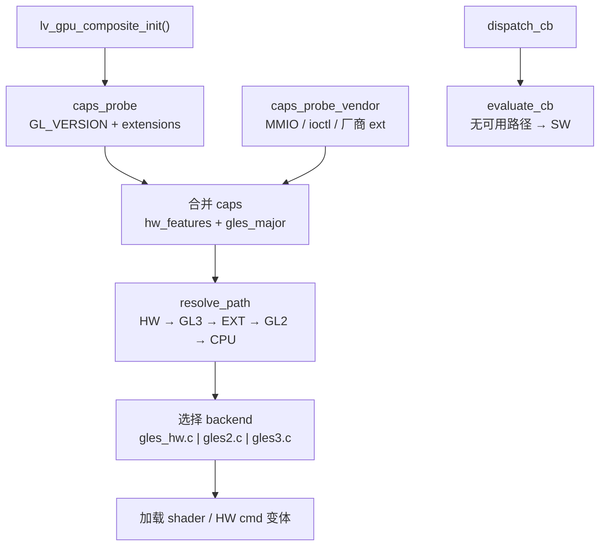

**新增文件**：

```
lvgl/src/draw/gpu_composite/
  lv_gpu_composite_caps.h/c           # 标准 GL 探测 + resolve_path
  lv_gpu_composite_caps_vendor.h      # LV_GPU_HW_* 位定义（板级可 override）
  lv_gpu_composite_gles2.c            # [GL2] Mali-400 基线，永远保留
  lv_gpu_composite_gles3.c            # [GL3] 新 Mali 可选
  lv_gpu_composite_gles_hw.c          # [HW] 自研 IP 路径（弱符号 / 板级链接）
  lv_gpu_composite_shader_es2.c       # GLSL 1.00 源码
  lv_gpu_composite_shader_es3.c       # GLSL 3.00 源码
  lv_gpu_composite_vao.h/c            # VAO 抽象（manual / OES / core）

lvgl/src/drivers/<board>/             # 板级目录（示例）
  lv_gpu_composite_caps_vendor.c      # 实现 caps_probe_vendor()
```

**`gles_hw.c` 链接策略**：LVGL 核心提供空 stub（所有 `[HW]` 路径 fallthrough）；量产板卡链接板级实现覆盖 stub，**不改 LVGL 上游源码**。

**`evaluate_cb` / `dispatch_cb` 修改逻辑**：

- 每个 draw task 携带 **候选路径列表**（与 §2.8.2 标记一致）
- `resolve_path()` 选中第一条可用路径；选中 `[HW]` 时分发到 `gles_hw` 对应 handler
- 全部候选不可用 → 不认领，交 SW draw unit
- 启动日志示例：`caps: GLES2 depth=16 instancing=cpu_fallback hw=BLIT2D|DEPTH24`（便于验收自研 IP 是否生效）

### 2.8.5 配置项修订（§8 合并）

```c
#define LV_GPU_COMPOSITE_GLES_API     2    /* 2=Mali-400 强制, 3=新 GPU, 0=AUTO */
#define LV_GPU_COMPOSITE_LOG_CAPS     1    /* 启动打印 caps 表 */
#define LV_GPU_COMPOSITE_DEPTH_BITS   16   /* Mali-400: 16；新 GPU: 24 */
#define LV_GPU_COMPOSITE_USE_ETC1       1    /* Mali 优先压缩格式 [GL2] */
#define LV_GPU_COMPOSITE_ALLOW_GLES3    0    /* 量产 Mali-400 板卡设为 0 */
```

### 2.8.6 对现有仓库的直接影响

| 文件 | 现状 | 设计动作 |
|------|------|---------|
| [`building_renderer.c`](building_renderer.c) | GLES3 + VAO | 标记 Legacy；demo 迁移到 `lv_3dmesh` 后删除 |
| [`lv_opengles_driver.c`](lvgl/src/drivers/glfw/lv_opengles_driver.c) | GLES3 | 新后端 **`lv_gpu_composite_*`** 替代；旧驱动保留 legacy |
| [`gltf_loader.c`](gltf_loader.c) | GLES3 shader | `lv_3dmodel` Phase 2 需 **ES2 shader 变体** 或 SW 预处理 |

### 2.8.7 Phase 修订（与能力标记对齐）

| Phase | 内容 | 最低 GL |
|-------|------|--------|
| **1** | caps 探测 + **gles2 全路径** + mesh/viewport + ES2 shader | **[GL2]** |
| **2** | glyph atlas、pick、Canvas 三模式 | **[GL2]** |
| **3** | frustum cull、CPU batch、OnDemandRendering | **[CPU]** + [GL2] |
| **3+** | instancing、UBO、MSAA、sRGB | **[GL3]** / **[HW]** / [EXT] 可选模块 |
| **HW** | 自研 IP 路径（`gles_hw.c` + vendor probe） | **[HW]**，基线仍 **[GL2]** |
| **4** | Vulkan backend | 非 GLES |

**Phase 1 验收标准（Mali-400）**：在 **GLES2 context + caps 强制 gles2** 下 skyline demo 可运行；日志无 `[GL3]` 特性硬调用失败。

---

## 3. 路径 A：通用 widget 3D 属性

在 [`lv_obj`](lvgl/src/core/lv_obj.h) 上增加 **可选 3D 扩展**（`LV_USE_3D` 开关），不破坏现有 2D 行为。

### 3.1 新增 style / local 属性（示例）

| 属性 | 类型 | 含义 |
|------|------|------|
| `LV_STYLE_3D_POSITION_X/Y/Z` | int/float | 相对父节点局部坐标 |
| `LV_STYLE_3D_ROTATION_X/Y/Z` | int(0.1°) | 欧拉角 |
| `LV_STYLE_3D_SCALE_X/Y/Z` | int(256=1.0) | 非均匀缩放 |
| `LV_STYLE_3D_RENDER_MODE` | enum | 见下表 |
| `LV_STYLE_3D_DEPTH_TEST` | bool | 是否参与 depth |
| `LV_STYLE_3D_BILLBOARD` | enum | none / y_axis / full |
| `LV_STYLE_3D_CLIP_AABB` | area | 屏幕/局部裁剪（**场景一侧翼 peek**） |
| `LV_STYLE_3D_PLANE_SOURCE` | enum | LIVE / SNAPSHOT（**场景一缩略图**） |

**RenderMode（2D widget 在 3D 中的呈现方式）**：

| 模式 | 行为 |
|------|------|
| `LV_3D_RENDER_OFF` | 默认，纯 2D（现有逻辑） |
| `LV_3D_RENDER_BILLBOARD` | 2D 内容烘焙为 quad，始终朝向相机（适合 UI 标签） |
| `LV_3D_RENDER_PLANE` | 2D 内容贴 3D 平面；**仅 3D pass 绘制，跳过 2D pass**（G3） |
| `LV_3D_RENDER_MESH` | 绑定简单 extrude/box 网格（按钮立体化） |

### 3.2 Refresh 行为

- 对象 **`LV_OBJ_FLAG_3D_ENABLED`** 开启时，向 scene collector 注册 **3D draw item**
- **`LV_3D_RENDER_PLANE` / BILLBOARD**：`LV_EVENT_DRAW_MAIN` **不再**向 2D batch 提交（避免双份绘制与 SW 离屏）；改由 **`lv_3d_plane_bake`** 提供纹理
- **`LV_3D_RENDER_OFF`**：现有 2D 逻辑不变
- **脏区**：3D transform 变化 → scene subtree dirty + 屏幕投影 AABB dirty

### 3.3 API 示例

```c
lv_obj_add_flag(btn, LV_OBJ_FLAG_3D_ENABLED);
lv_obj_set_style_3d_position(btn, 0, 100, -200, 0);
lv_obj_set_style_3d_rotation(btn, 0, 450, 0, 0);  /* yaw 45° */
lv_obj_set_style_3d_render_mode(btn, LV_3D_RENDER_BILLBOARD, 0);
```

### 3.4 PLANE 烘焙管线（场景一核心，修订 G2/G3）

**问题**：旧 OpenGLES 后端「SW 渲染整棵 subtree → upload → blit」无法在 9 路缩略图下存活。

**LVGL 方案** — compositor 内 **GPU bake pass**（非应用侧 GL）：

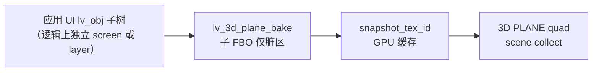

```c
typedef enum {
    LV_3D_PLANE_SRC_LIVE,       /* 子树 dirty 时每帧 bake（仅过渡动效短窗口） */
    LV_3D_PLANE_SRC_SNAPSHOT,   /* 子树 STATIC，仅 app 内容变更时 bake（场景一默认） */
} lv_3d_plane_src_t;

lv_3d_snapshot_id_t lv_3d_plane_bake(lv_obj_t * obj, lv_3d_plane_src_t src);
void lv_3d_plane_invalidate(lv_obj_t * obj);  /* app 前台更新缩略图 */
```

- bake 在 **`lv_draw_gpu_composite` dispatch** 内完成，与 3D pass 共享 GL 上下文
- **Phase 2**：单 tile bake + 9 路 SNAPSHOT；**Phase 3**：Retainer 合并多 tile 脏区调度（G10）
- OS **应用管理器**负责切换前台 app；LVGL 只接收「哪个 `lv_obj` 子树作为 tile 源」

### 3.5 3D 属性动画（场景一全屏过渡，修订 G7）

```c
void lv_anim_3d_position(lv_obj_t * obj, float x, float y, float z, uint32_t ms);
void lv_anim_3d_rotation(lv_obj_t * obj, float pitch, float yaw, float roll, uint32_t ms);
void lv_anim_3d_scale(lv_obj_t * obj, float sx, float sy, float sz, uint32_t ms);
void lv_anim_3d_opa(lv_obj_t * obj, lv_opa_t opa, uint32_t ms);
/* lv_3dstack_focus_to_fullscreen 内部组合上述 anim + 切换 lv_ui_mode */
```

---

## 4. 路径 B：原生 3D Widget 体系

参考 **Unity** 与 **OSG** 的最小子集，新增 widget 目录 [`lvgl/src/widgets/3d/`](lvgl/src/widgets/3d/)：

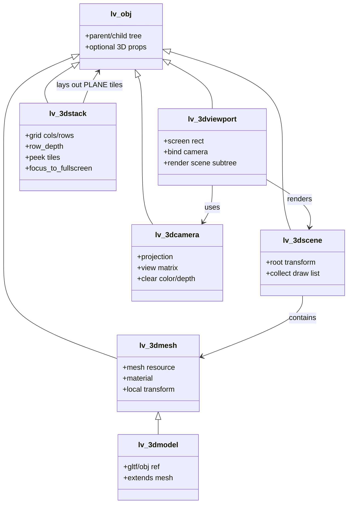

### 4.1 Widget 对照（Unity / OSG → LVGL）

| Unity 概念 | OSG 概念 | LVGL widget / 模块 |
|-----------|---------|-------------------|
| Empty / Scene | Group | `lv_3dscene` |
| Camera | Camera | `lv_3dcamera` |
| MeshFilter + MeshRenderer | Geode + Geometry | `lv_3dmesh` |
| Prefab / Model | Node + Drawable | `lv_3dmodel`（Phase 2） |
| Canvas (World Space) | — | 普通 `lv_obj` + 3D 属性 |
| Viewport Rect | Viewport | `lv_3dviewport` |
| Transform | Transform | `lv_3d_transform_t`（scene 核心，obj 共用） |
| Directional Light | LightSource | `lv_3dlight`（Phase 3，可选） |
| App Launcher Grid | — | **`lv_3dstack`**（场景一） |
| Endless scroll buildings | — | **`lv_3d_segment_pool`**（场景二，§5） |

### 4.2 最小 API（Phase 1 可验收）

```c
/* Scene */
lv_obj_t * lv_3dscene_create(lv_obj_t * parent);

/* Camera */
lv_obj_t * lv_3dcamera_create(lv_obj_t * parent);
void lv_3dcamera_set_perspective(lv_obj_t * cam, float fov_deg, float near, float far);
void lv_3dcamera_look_at(lv_obj_t * cam, lv_vec3_t eye, lv_vec3_t target, lv_vec3_t up);

/* Viewport：屏幕上的一个 3D 窗口 */
lv_obj_t * lv_3dviewport_create(lv_obj_t * parent);
void lv_3dviewport_set_camera(lv_obj_t * vp, lv_obj_t * camera);
void lv_3dviewport_set_scene(lv_obj_t * vp, lv_obj_t * scene);

/* Mesh：内置 box/line mesh + 程序化顶点 */
lv_obj_t * lv_3dmesh_create(lv_obj_t * parent);
void lv_3dmesh_set_box(lv_obj_t * mesh, float w, float h, float d);
void lv_3dmesh_set_wireframe(lv_obj_t * mesh, bool en);
void lv_3dmesh_set_color(lv_obj_t * mesh, lv_color_t c);
```

本仓库 **skyline demo** 应改为：`lv_3dscene` + 多个 `lv_3dmesh_set_box` 线框楼群 + `lv_3dviewport`，**删除** [`building_renderer.c`](building_renderer.c) 中应用侧 OpenGL FBO 渲染。

### 4.3 几何基元：业界做法 vs「每种形状一个 widget」

**结论：主流 3D 引擎通常不会为长方体、圆柱体等分别定义独立 widget/组件类**；而是 **少量场景节点 + 一个 Mesh/Geometry 实体 + 基元类型或 Mesh 资源工厂**。

#### 业界对照

| 引擎/框架 | 3D「形状」怎么表达 | 是否「一形状一 widget」 |
|-----------|-------------------|------------------------|
| **Unity** | `GameObject` + `MeshFilter`/`MeshRenderer`；菜单 **3D Object → Cube/Sphere/Cylinder/…** 实为 **内置 Mesh 资产** 挂到同一组件上 | 否 — 一个 MeshRenderer，多种 primitive source |
| **Unreal** | `StaticMeshComponent` + Static Mesh 资产；Editor 可放 **Shape**（Cube/Sphere/Cylinder/Cone） | 否 — 同一 Component 类型 |
| **Godot 4** | `MeshInstance3D` + **`BoxMesh` / `SphereMesh` / `CylinderMesh`** 等资源类 | 否 — Mesh **资源**，非 Scene 节点种类 |
| **Qt Quick 3D** | `Model { source: "#Cube" }` 或外部 mesh | 否 — 一个 `Model` 节点 |
| **OSG** | `Geode` + **`ShapeDrawable`(Box/Sphere/Cylinder/Cone/Capsule)** 或 `Geometry` | 否 — Drawable 类型枚举 |
| **Three.js** | `Mesh(geometry, material)`；`BoxGeometry` / `CylinderGeometry` 工厂 | 否 — Geometry 工厂函数 |
| **SceneKit** | `SCNBox` / `SCNSphere` / `SCNCylinder` 等 **几何类**，挂到 `SCNNode` | 接近「一类一型」，但仍挂在 **统一 Node** 下，非 UI widget 树 |

#### 两种常见分层（引擎 vs UI）

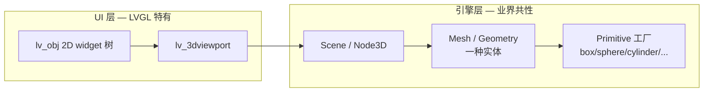

- **引擎层**：形状是 **mesh 数据或 primitive 枚举**，不是 widget 种类。
- **UI 层**（LVGL）：`lv_3dscene` / `lv_3dviewport` / `lv_3dcamera` 才是 **widget**；几何体属于 scene 内容。

#### 本设计策略（与业界一致，控制 API 面）

| 层级 | 做法 | Phase |
|------|------|-------|
| **Widget** | 仅保留 `lv_3dmesh`（+ Phase 2 `lv_3dmodel`），**不**新增 `lv_3dcube` / `lv_3dcylinder` … | 1～2 |
| **基元 API** | 在 `lv_3dmesh` 上提供 **setter / 枚举**，内部生成共享 mesh 模板 | 1～2 |
| **Mesh 池** | `lv_3d_mesh.c` 缓存 **unit box/sphere/cylinder** 的 VBO（按 segment 参数分档） | 1～3 |

计划 Phase 1～2 基元 API（示例，均挂在 `lv_3dmesh` 上）：

```c
typedef enum {
    LV_3D_PRIMITIVE_NONE = 0,
    LV_3D_PRIMITIVE_BOX,
    LV_3D_PRIMITIVE_PLANE,      /* 单面 quad */
    LV_3D_PRIMITIVE_SPHERE,     /* Phase 2 */
    LV_3D_PRIMITIVE_CYLINDER,   /* Phase 2 */
    LV_3D_PRIMITIVE_CONE,       /* Phase 3 可选 */
    LV_3D_PRIMITIVE_CUSTOM,     /* 用户顶点/索引 */
} lv_3d_primitive_t;

void lv_3dmesh_set_primitive(lv_obj_t * mesh, lv_3d_primitive_t type);
void lv_3dmesh_set_box(lv_obj_t * mesh, float w, float h, float d);           /* = BOX 快捷 */
void lv_3dmesh_set_sphere(lv_obj_t * mesh, float radius, uint16_t segments);  /* Phase 2 */
void lv_3dmesh_set_cylinder(lv_obj_t * mesh, float r, float h, uint16_t seg); /* Phase 2 */
void lv_3dmesh_set_custom_mesh(lv_obj_t * mesh, const lv_3d_mesh_data_t * data);
```

**刻意不做**（嵌入式 + Mali-400 低功耗）：

- 不为每种形状单独建 widget 类（避免类爆炸、draw 路径分裂）
- Phase 1 不承诺 torus、capsule、复杂 CSG — 需要时用 `CUSTOM` 或 `lv_3dmodel` glTF
- 不做 Blender 级建模；基元仅服务 **UI 装饰、线框、简单 3D 图标**

**与路径 A 的关系**：2D button 立体化走 `LV_3D_RENDER_MESH` + `lv_3dmesh_set_box()` extrude，而非新建 `lv_3dcube_button` widget。

### 4.4 `lv_3dstack`（场景一 launcher，修订 G7）

路径：[`lvgl/src/widgets/3d/lv_3dstack.c`](lvgl/src/widgets/3d/lv_3dstack.c)

- 继承 `lv_obj`，子节点为 **已配置 PLANE 的 tile**
- `lv_3dstack_focus_to_fullscreen()` → 触发 §3.5 anim + `lv_ui_mode` 切 `LV_UI_MODE_APP_FULLSCREEN`
- `lv_3dstack_set_peek_tiles()` → 侧翼 tile 的 yaw/x_offset + **`LV_STYLE_3D_CLIP_AABB`**

默认布局参数（1080p 示例，可 style 覆盖）：

| 参数 | 建议值 |
|------|--------|
| row 0→2（屏幕 Y） | **最下行→最上行**，对应 **近→远** |
| row Z | near=-400, mid=-700, far=-1000（单位：场景 mm 或相对单位） |
| row scale | 1.0 / 0.92 / 0.85 |
| peek yaw | ±18° |
| peek x_offset | ±520（部分出屏） |

---

## 5. 3D 子系统核心（`lvgl/src/3d/`）

```
lvgl/src/3d/
  lv_3d.h
  lv_3d_transform.c
  lv_3d_mesh.c
  lv_3d_scene.c
  lv_3d_camera.c
  lv_3d_material.c           # LV_3D_MAT_* 枚举（§0.6）
  lv_3d_plane_bake.c         # PLANE 快照 bake（§3.4，场景一）
  lv_3d_segment_pool.c       # 场景二楼群 parallax 回收（§0.3）
  lv_3d_invalidation.c       # STATIC/VOLATILE 节点标记（§2.6）
  lv_3d_pick.c               # viewport 射线 pick（场景一）
  lv_3d_resource_pool.c
  lv_3d_ui_mode.c            # lv_ui_mode_t 状态与 pass 可见性
```

**与 lv_obj 集成**：
- 每个 3D widget 的 `struct _lv_xxx_t` 内含 `lv_3d_node_t * node`
- `lv_3d_node_t` 挂到 scene graph，保存 mesh ref、transform、visible flag
- Refresh 时：`lv_3d_scene_collect(disp)` → 输出 `lv_3d_draw_item_t[]`

---

## 6. Draw 层改造（替代 tex_id 模型）

### 6.1 扩展 draw descriptor

**废弃主路径**：[`lv_draw_3d_dsc_t`](lvgl/src/draw/lv_draw_3d.h) 中的 `lv_3dtexture_id_t tex_id`。

**新 descriptor**（[`lv_draw_3d.h`](lvgl/src/draw/lv_draw_3d.h) 修订）：

```c
typedef enum {
    LV_3D_DRAW_KIND_MESH,
    LV_3D_DRAW_KIND_BILLBOARD,
    LV_3D_DRAW_KIND_PLANE,        /* 场景一：snapshot_tex + 3D transform（G2） */
    LV_3D_DRAW_KIND_VIEWPORT_PASS
} lv_3d_draw_kind_t;

typedef struct {
    lv_draw_dsc_base_t base;
    lv_3d_draw_kind_t kind;
    lv_3d_mesh_id_t mesh_id;
    lv_3d_snapshot_id_t snapshot_id;  /* PLANE / BILLBOARD bake 结果 */
    lv_matrix4_t model;
    lv_3d_material_t material;
    lv_opa_t opa;
    lv_obj_t * camera;
    lv_obj_t * scene;
    lv_area_t viewport_area;
} lv_draw_3d_dsc_t;
```

保留 `tex_id` 字段仅当 `LV_USE_3DTEXTURE_LEGACY` 开启（兼容旧 demo）。

### 6.2 Draw task 流程

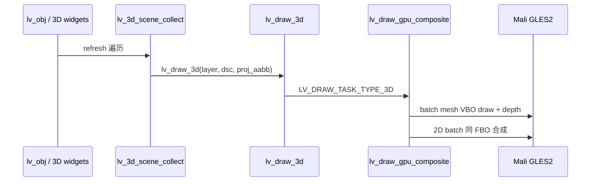

### 6.3 [`lv_3dtexture`](lvgl/src/widgets/3dtexture/) 定位

| 状态 | 说明 |
|------|------|
| Deprecated | 新设计不推荐使用 |
| Legacy | `LV_USE_3DTEXTURE_LEGACY=1` 时保留 `set_src(tex_id)` |
| 迁移 | 文档引导改用 `lv_3dviewport` + `lv_3dmesh` 或 obj 3D 属性 |

---

## 7. `lv_draw_gpu_composite` 后端（Compositor）

### 7.1 与初版相同的部分

- Draw Unit：`evaluate_cb` / `dispatch_cb` / `delete_cb`
- 单 display FBO、脏区 scissor、帧跳过
- 2D 原生 GPU batch（FILL/IMAGE/LABEL/LAYER）
- Mali-400 ES2 为主

### 7.2 3D pass 修订（非 external texture）

```c
/* compositor 内 */
void lv_gpu_composite_draw_mesh(const lv_draw_3d_dsc_t * dsc);
void lv_gpu_composite_draw_viewport_pass(const lv_draw_3d_dsc_t * dsc);
```

**Viewport pass 流程**：
1. 根据 `lv_3dviewport` 屏幕区域设置 viewport + scissor
2. 绑定 camera 的 view/proj
3. **AR 模式**：color clear **alpha=0**（`glClearColor(0,0,0,0)`）；depth 仍清 1.0
4. 遍历 scene draw items；**opaque 按 material batch**；**alpha/wireframe 按相机距离排序**（G5）
5. depth test on；blend 见 §7.4
6. **Pass 2 — 2D OVERLAY**（§7.5）：仅 `LV_UI_SPACE_OVERLAY` 且当前 `lv_ui_mode` 允许的对象

**功耗要点**：
- mesh VBO **持久化**，仅在 geometry 变更时 upload
- 静态 scene **跳过 collect**（无 transform 变化）
- viewport 子 pass 仅清 depth/color 的 **投影脏区**

### 7.4 AR 穿透合成（智能眼镜必须） `[GL2]`

| 项 | 行为 |
|----|------|
| Display FBO 格式 | **RGBA8888**（非 RGB565 opaque） |
| 帧初 clear | RGB=0，**A=0** → 穿透 |
| 2D FILL/IMAGE | shader 输出 `gl_FragColor.a`；与 obj/style opa 相乘 |
| 3D mesh 材质 | `lv_3d_material_t.opa` + `blend_mode`；线框可 **仅描边 alpha=1、面 alpha=0** |
| 全屏 opaque 应用 | 场景一 **AppFullscreen** 态可局部 opaque；GridIdle 态尽量透明底 |
| OS 交接 | display driver 暴露 **带 alpha 的 buffer** 给 EGL/光机合成；见 `lv_gpu_composite_display` |

**场景一/二共用**：任何「未覆盖像素」必须保持 alpha=0，否则破坏 AR 穿透。

### 7.5 帧图与 `lv_ui_mode_t`（修订 G4/G11）

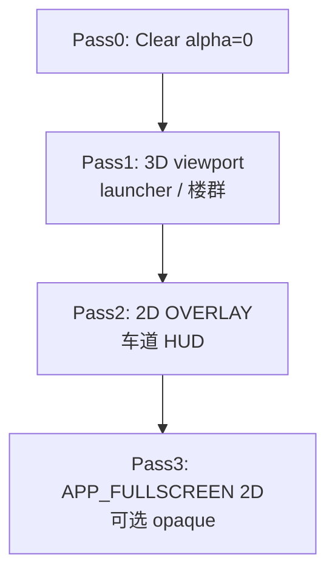

| `lv_ui_mode_t` | Pass1 3D | Pass2 OVERLAY | Pass3 全屏 2D |
|----------------|----------|---------------|---------------|
| `AR_LAUNCHER` | 9+2 PLANE grid | 可选状态栏 | 关 |
| `APP_FULLSCREEN` | 关或淡出 | 关 | 前台 app |
| `NAV_AR` | segment_pool 楼群 | **车道/路线 UI** | 关 |

- `lv_3d_ui_mode.c` 在 refresh 前决定 **哪些 collect 路径启用**
- **`LV_DISPLAY_RENDER_MODE_EVENT_DRIVEN`**：GridIdle / 停车时无 invalidation → **跳过整帧**（G10）

### 7.6 像素格式：RGBA8888 / RGBA5551 / RGB565 等（修订）

**结论摘要**：

| 格式 | 能否作 AR Display FBO | 相对 RGBA8888 |
|------|----------------------|---------------|
| **RGBA8888** | **默认推荐** | 基准 |
| **RGBA4444**（类似，4bit/通道） | **有条件可用** | 带宽减半；α 仅 16 级，动效/半透明可接受降级 |
| **RGBA5551 / RGB5_A1** | **仅极简 AR** | 带宽减半；**α 只有 0/1**；场景验收多项降级 |
| **RGB565** | AR **不可用** | 无 α |
| **RGB565 + A8** | **推荐省带宽 AR 路径** | ~75%  framebuffer 字节；**256 级 α**；双平面 compositor |

#### 格式对照表（1080p 全屏缓冲）

| 格式 | bit/px | 1080p | R:G:B | α | GLES2 常见名 |
|------|--------|-------|-------|---|-------------|
| RGBA8888 | 32 | ~8.3 MB | 8:8:8 | 256 级 | `GL_RGBA` / `UNSIGNED_BYTE` |
| **RGBA5551** | 16 | ~4.1 MB | 5:5:5 | **2 级 (0/1)** | `GL_RGB5_A1` |
| **RGBA4444** | 16 | ~4.1 MB | 4:4:4 | **16 级** | `GL_RGBA4` |
| RGB565 | 16 | ~4.1 MB | 5:6:5 | 无 | `GL_RGB565` |
| RGB565+A8 | 24 | ~6.2 MB | 565 色平面 | **256 级** | 双 FBO / `[HW:565_A8]` |

> **RGBA5551** 在部分文档/SDK 里也称 **RGB5_A1**、**ARGB1555**（仅通道顺序不同）；LVGL 内部统一称 **`LV_GPU_COLOR_RGBA5551`**，由 driver 处理 byte order。

#### 对照两 AR 场景验收（§0.7）

| 验收项 | RGBA8888 | **RGB565+A8** | RGBA4444 | RGBA5551 | RGB565 |
|--------|----------|---------------|----------|----------|--------|
| 未绘制区穿透 (α=0) | 通过 | **通过** | 通过 | 通过 | 失败 |
| 场景一 tile **淡出**动效 | 通过 | **通过** | 阶梯感 | 失败 | 失败 |
| 场景二 **半透明**楼体面 | 通过 | **通过** | 勉强 | 失败 | 失败 |
| 线框面 α=0 / 棱 α=1 | 通过 | **通过** | 通过 | 通过 | 失败 |
| 2D 圆角/抗锯齿 | 通过 | **通过**（565 色阶略差于 8888） | 较差 | 很差 | 差 |
| 色带（渐变 UI） | 通过 | **565 色带可接受** | 可见 | 可见 | 可见 |
| 1080p 缓冲大小 | 8.3 MB | **6.2 MB（-25%）** | 4.1 MB | 4.1 MB | 4.1 MB |

#### RGB565 + A8 — 省带宽且保留完整 AR（§7.6.1 实现）

**定位**：在必须压缩 Display 缓冲、又 **不能牺牲 α 动效/半透明** 时，**优先于 RGBA4444 / RGBA5551**。

**内存布局**（1080p）：

```
color_plane: 1920×1080 × 2 B  ≈ 4.0 MB   GL_RGB565
alpha_plane: 1920×1080 × 1 B  ≈ 2.0 MB   GL_ALPHA / LUMINANCE8
合计                         ≈ 6.2 MB   （vs RGBA8888 8.3 MB）
```

**Mali-400 / GLES2 实现**（无 MRT 时）：

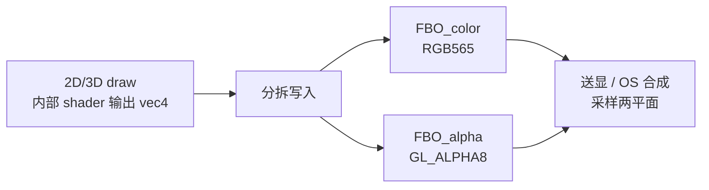

- **Pass A**：绑定 color RBO `GL_RGB565`，shader 写 `gl_FragColor.rgb`（565 量化）
- **Pass B**：绑定 alpha RBO `GL_ALPHA`（或 `GL_LUMINANCE`），同一几何 **再画一遍** 写 `gl_FragColor.a`；或使用 **单 pass 双 target** 若 `[HW:565_A8]` / 板级扩展支持
- **Clear**：color=0，alpha=0（穿透）
- **2D/3D blend**：在写 alpha 平面时 respect `lv_opa`；color 平面 premultiply 可选
- **送显**：display driver 将两平面交给 OS；或由 **`[HW:TILE_COMPOSITOR]`** 单片合成

**LVGL 模块**（新增）：

```
lv_gpu_composite_buffer_565a8.c   # 双平面 alloc / clear / resolve
lv_gpu_composite_shader_es2.c     # 变体：WRITE_RGB565 / WRITE_A8 / COMPOSITE_OUT
```

**caps**：

```c
bool has_fbo_rgb565;           /* 已有 */
bool has_fbo_alpha8;           /* GL_ALPHA attachment */
bool has_hw_565_a8;            /* [HW:565_A8] 单 pass 写入 */
/* resolve_path: HW → dual_pass_gles2 → RGBA8888 */
```

**与 RGBA8888 差异（须接受）**：
- 色彩 **5:6:5**，精细渐变/照片 UI 色带略多于 8888，**一般 launcher 缩略图可接受**
- compositor 实现 **更复杂**；debug 需导出两平面
- 部分 EGL/光机 **只认 RGBA8888** → driver 出口做一次 **565+A8→8888** 转换（仅 scan-out，仍可在 GPU 内用 565+A8 渲染省带宽）

#### RGBA5551 若要坚持用 — 设计约束（须改场景或验收）

1. **场景一**：全屏过渡改用 **scale + translate**，不用 opa 淡出；或 `[HW]` 在合成层做渐变
2. **场景二**：楼体 **仅 `LV_3D_MAT_WIREFRAME`**（二值 α），不做半透明面
3. **2D UI**：接受硬边；或 overlay 仍走 **8bit 顶点 α** 与 5551 混合（仅整 quad 0/1，非像素级）
4. **FBO 探测**：`caps.has_fbo_rgb5_a1`；无则回退 RGBA8888 或 RGBA4444

#### RGBA4444 — 更合理的 16bpp 折中

- α 有 **16 级**，短动效（~300ms 淡出）可用但可能有 **banding**
- 色彩 4bit，缩略图/线框可接受；精细照片 UI 不推荐
- Mali-400 ES2 常支持 `GL_RGBA4` FBO attachment → **`LV_GPU_COLOR_RGBA4444`** 可作为 **`LV_GPU_COMPOSITE_COLOR_FORMAT` 备选**

```c
typedef enum {
    LV_GPU_COLOR_RGBA8888 = 0,   /* 默认，FULL 验收 */
    LV_GPU_COLOR_RGB565_A8,      /* 推荐省带宽 AR；§0.7.1 NEAR_FULL */
    LV_GPU_COLOR_RGBA4444,       /* 16bpp；DEGRADED_16 */
    LV_GPU_COLOR_RGBA5551,       /* 二值 α；BINARY_16 */
    LV_GPU_COLOR_RGB565,         /* 非 AR Display */
} lv_gpu_color_format_t;

/* caps 降级链：565_A8 → 8888；4444/5551 见原文 */
```

**允许使用 RGB565 / 5551 / 4444 的位置**：

| 用途 | 格式 | 说明 |
|------|------|------|
| **plane_bake 内部快照** | RGB565 或 ETC1 | 缩略图内容本身可 opaque；贴到 PLANE 时由 **quad 顶点 α** 控制整体 |
| **glyph atlas / 示意贴图** | RGB565 / ETC1 | 采样后与 material opa 相乘 |
| **`LV_UI_MODE_APP_FULLSCREEN` 独占态** | 可选 RGB565 子路径 | 全屏 opaque 应用、**无穿透**时可配置；与 AR 模式 **互斥** |
| **最终送显** | **RGBA8888 默认**；量产可 **565+A8** | 见 §7.6.1；OS 若仅收 8888 则在 driver 出口转换 |

**配置（§8）**：

```c
#define LV_GPU_COMPOSITE_COLOR_FORMAT   LV_GPU_COLOR_RGBA8888  /* 8888 | 565_A8 | 4444 | 5551 */
#define LV_GPU_COMPOSITE_BAKE_FORMAT      LV_GPU_COLOR_RGB565
/* 565_A8 → NEAR_FULL 验收；4444/5551 → DEGRADED / BINARY（§0.7.1） */
```

**带宽策略优先级**（智能眼镜 1080p）：
1. event-driven **0fps idle**
2. 脏区 / scissor、SNAPSHOT 不每帧 bake
3. ETC1、**`[HW:TILE_COMPOSITOR]`** / **`[HW:565_A8]`**
4. Display 改 **RGB565+A8**（**完整 AR 验收，省 ~25% 缓冲**）
5. 仍不够再 **RGBA4444**（16bpp，α 变差）
6. 最后 **RGBA5551**（仅线框 + scale 动效）

### 7.3 目录结构（更新）

```
lvgl/src/draw/gpu_composite/
  lv_draw_gpu_composite.c
  lv_gpu_composite_gles2.c
  lv_gpu_composite_batch_2d.c
  lv_gpu_composite_batch_3d.c    # mesh + depth + alpha sort
  lv_gpu_composite_plane_bake.c  # 场景一 PLANE 烘焙（§3.4）
  lv_gpu_composite_viewport.c
  lv_gpu_composite_framegraph.c  # pass 顺序 + ui_mode（§7.5）
  lv_gpu_composite_res.c

lvgl/src/3d/                     # 见第 5 节
lvgl/src/widgets/3d/             # scene/viewport/camera/mesh/...
```

---

## 8. 配置项（修订）

```c
#define LV_USE_GPU_COMPOSITE           1
#define LV_USE_DRAW_GPU_COMPOSITE      1
#define LV_USE_3D                      1   /* 3D 子系统 + widget + obj 3D 属性 */
#define LV_USE_3D_WIDGETS              1   /* lv_3dscene/mesh/... */
#define LV_USE_3D_OBJ_PROPERTIES       1   /* 通用 obj 3D 属性 */
#define LV_USE_3DTEXTURE_LEGACY        0   /* 旧 external tex，默认关 */
#define LV_GPU_COMPOSITE_GLES_API      2   /* 2=Mali-400 强制, 3=新 GPU, 0=AUTO */
#define LV_GPU_COMPOSITE_ALLOW_GLES3   0   /* 量产 Mali-400 板卡设为 0 */
#define LV_GPU_COMPOSITE_DEPTH_BITS    16  /* Mali-400: 16；新 GPU: 24 */
#define LV_GPU_COMPOSITE_USE_ETC1      1   /* Mali 优先 ETC1 [GL2] */
#define LV_GPU_COMPOSITE_LOG_CAPS      1   /* 启动打印 caps 表 */
#define LV_GPU_COMPOSITE_AR_PASSTHROUGH 1  /* 1=RGBA8888+α=0；0 才允许 Display 用 RGB565 */
#define LV_GPU_COMPOSITE_COLOR_FORMAT   LV_GPU_COLOR_RGBA8888  /* 8888|4444|5551，caps 自动降级 */
#define LV_GPU_COMPOSITE_BAKE_FORMAT    LV_GPU_COLOR_RGB565
#define LV_DISPLAY_RENDER_MODE         LV_DISPLAY_RENDER_MODE_EVENT_DRIVEN  /* 静态 launcher idle 0fps */
#define LV_DISPLAY_WIDTH               1920
#define LV_DISPLAY_HEIGHT              1080
#define LV_USE_3DSTACK                 1   /* 场景一 launcher */
#define LV_USE_3D_SEGMENT_POOL         1   /* 场景二楼群 */
```

与 `LV_USE_DRAW_OPENGLES` **互斥**。

---

## 9. 实施阶段（修订）

### Phase 1 — 3D 核心 + compositor + **AR 透明底**（**[GL2]**）
- `lv_gpu_composite_caps` 探测 + **gles2 全路径**
- compositor **RGBA8 + alpha=0 clear**（§7.4）
- `lvgl/src/3d/`：transform、mesh(box/line)、camera、scene collect
- Widgets：`lv_3dscene`、`lv_3dcamera`、`lv_3dviewport`、`lv_3dmesh`
- Demo：**场景二静态** — 透明底 + 线框楼群（替代 `building_renderer.c`）
- 验收：GLES2 smoke； framebuffer 未绘制区 **alpha=0**

### Phase 2 — **场景一 + 场景二**（PLANE bake + 帧图 + 交互）
- **`lv_3d_plane_bake`** 最小快照（G2）；PLANE **跳过 2D 重复绘制**（G3）
- compositor：**帧图 pass 顺序** §7.5；3D **alpha sort**（G5）
- **`lv_3dstack`** + pick + **`lv_anim_3d_*`** + **`lv_ui_mode_t`**
- **`lv_3d_segment_pool`** + `LV_3D_MAT_WIREFRAME` / alpha
- Demo + **`verify_scenario1.sh` / `verify_scenario2.sh`**（§0.7）

### Phase 3 — 量产低功耗
- Retainer 多 tile  bake 调度；**event-driven 0fps idle**（G10）
- frustum cull、脏区 scissor、动效期 OnDemandRendering 提帧
- ETC1 示意贴图；`lv_3dlight` 可选

### Phase 4 — Vulkan 可选 backend

---

## 10. 本仓库 demo 迁移（修订）

| 现在 | 迁移后 |
|------|--------|
| [`building_renderer.c`](building_renderer.c) 应用侧 OpenGL | 删除；逻辑迁入 `lv_3dmesh` + segment_pool |
| 黑底 opaque 预览 | **透明底 AR** compositor |
| [`lv_3dtexture`](lvgl/src/widgets/3dtexture/) + `set_src` | `lv_3dviewport` + scene |
| [`main.c`](main.c) 单 skyline | Phase1 静态楼群 → Phase2 **场景二滚动** → Phase2/3 **场景一 9 宫格 launcher** |

---

## 11. 不建议的做法

- **不要**以 external `tex_id` 作为 3D 主路径
- **不要**让应用在 `lv_timer_handler` 外直接操作 GL 渲染 3D 内容
- **不要**复制 OpenGLES 的 per-widget SW→texture 路径
- **不要**在没有 scene graph 的情况下逐个 mesh 硬编码 draw call
- **不要**在 AR 穿透场景下把 **Display FBO 改为纯 RGB565**（无 α，破坏场景一/二；见 §7.6）
- **不要**在 AR 眼镜上使用 opaque 黑底作为主路径
- **不要**场景一同时 **9 路 live 全 UI 刷新** 而不做快照/Retainer（1080p 会爆功耗）

---

## 12. 总结

修改 LVGL/LVGL 需 **三条线并行**，**以 §0 两场景为验收基准**：

1. **Render 后端**：`lv_draw_gpu_composite` — AR 穿透、**帧图 pass**、plane bake、3D alpha sort、低功耗
2. **3D 对象模型**：scene graph + **`lv_3dstack` / segment_pool / plane_bake / ui_mode**
3. **2D/3D 统一**：PLANE 缩略图（场景一）+ wireframe 楼群（场景二）+ OVERLAY 车道

**场景验证**：§0.6 缺口已闭合；§0.7 指标 + `verify_scenario*.sh` 为后端完成定义。

---

## 13. 在 `lv_port_linux` 工程中落地（跨 Cursor 窗口操作指南）

**目标工程路径**（本机）：[`/home/gz/lv_port_linux`](/home/gz/lv_port_linux)  
**设计文档路径**（当前 Cursor 工作区）：[`/home/gz/.cursor/plans/2d3d混合渲染后端_35797c38.plan.md`](/home/gz/.cursor/plans/2d3d混合渲染后端_35797c38.plan.md)

> Cursor 的 **Plan / 对话上下文按工作区隔离**。在 `lv_port_linux` 窗口里 Agent **看不到** 本仓库的对话，须 **拷贝设计文档** 或 **@ 引用文件**。

### 13.1 推荐操作步骤

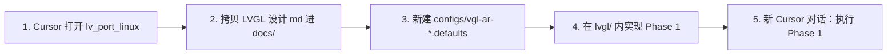

| 步骤 | 操作 |
|------|------|
| **1** | Cursor → **File → Open Folder** → `/home/gz/lv_port_linux`（新窗口或替换当前工作区） |
| **2** | 拷贝设计文档到目标工程，便于 @ 引用与版本管理：<br>`cp ~/.cursor/plans/2d3d混合渲染后端_35797c38.plan.md lv_port_linux/docs/LVGL_2D3D_BACKEND_PLAN.md` |
| **3** | 在新窗口 Chat 第一条消息示例：<br>「按 `@docs/LVGL_2D3D_BACKEND_PLAN.md` 在 lv_port_linux 执行 Phase 1，开发用 glfw，1080p AR 透明底。」 |
| **4** | 实现代码主要改 **`lv_port_linux/lvgl/`**（子模块），端口层改 **`src/`、`configs/`** |
| **5** | 验收跑 `configs/vgl-ar-glfw.defaults` 构建的 simulator |

### 13.2 与 `lv_port_linux` 现有结构的对照

| LVGL 设计模块 | `lv_port_linux` 落点 |
|-------------|---------------------|
| `lv_draw_gpu_composite/` | `lvgl/src/draw/gpu_composite/` |
| `lvgl/src/3d/` | 同路径（新增） |
| `lvgl/src/widgets/3d/` | 同路径（新增） |
| display driver / AR α | 扩展 **`lvgl/src/drivers/`** 下当前 backend（GLFW / DRM / Wayland） |
| 场景 demo | `src/main.c` 或 `src/demos/lvgl_scenario*.c` |
| 构建配置 | **`configs/vgl-ar-glfw.defaults`**（新建） |
| 后端选择 | 现有 **`src/lib/driver_backends.c`** + `-b glfw` |

**现有可复用配置**（开发机 3D，**非 LVGL 目标架构**）：

| 现有 config | 用途 | 与 LVGL 关系 |
|------------|------|------------|
| [`configs/glfw-3d.defaults`](/home/gz/lv_port_linux/configs/glfw-3d.defaults) | GLFW + `LV_USE_DRAW_OPENGLES` + `lv_3dtexture` | **Legacy 参考**；LVGL 应 **`LV_USE_DRAW_GPU_COMPOSITE`** |
| [`configs/drm-egl-3d.defaults`](/home/gz/lv_port_linux/configs/drm-egl-3d.defaults) | 嵌入式 DRM + 3D texture | 量产眼镜更接近此路径 |
| [`lv_conf.defaults`](/home/gz/lv_port_linux/lv_conf.defaults) | 默认 `LV_COLOR_DEPTH 16`、fbdev | AR 须 **独立 config**，见下 |

### 13.3 新建 `configs/vgl-ar-glfw.defaults`（模板，Phase 1 起）

```ini
# 基于 glfw-3d，切 LVGL compositor + AR
LV_USE_GLFW 1
LV_USE_OPENGLES 1
LV_USE_DRAW_OPENGLES 0
LV_USE_DRAW_GPU_COMPOSITE 1
LV_USE_GPU_COMPOSITE 1
LV_USE_3D 1
LV_USE_3D_WIDGETS 1
LV_USE_3DTEXTURE_LEGACY 0
LV_USE_3DTEXTURE 0

LV_COLOR_DEPTH 32
LV_GPU_COMPOSITE_AR_PASSTHROUGH 1
LV_GPU_COMPOSITE_COLOR_FORMAT LV_GPU_COLOR_RGBA8888
LV_GPU_COMPOSITE_GLES_API 2
LV_DISPLAY_RENDER_MODE LV_DISPLAY_RENDER_MODE_EVENT_DRIVEN

# Phase 1 demo 可先 800x480；场景验收再 1920x1080
```

构建：

```bash
cd /home/gz/lv_port_linux
cmake -B build-vgl -DCONFIG=vgl-ar-glfw
cmake --build build-vgl -j
./build-vgl/bin/lvglsim -b glfw -W 1920 -H 1080
```

（`CONFIG=vgl-ar-glfw` 须在 **`configs/vgl-ar-glfw.defaults`** 创建后生效。）

### 13.4 两仓库如何分工（避免重复）

| 仓库 | 角色 |
|------|------|
| **`lv_example_3dtexture`** | 原型验证、`building_renderer` 经验教训、`verify.sh` 脚本来源 |
| **`lv_port_linux`** | **LVGL 主集成工程**：多 backend（GLFW/DRM/Wayland）、simulator、接近量产 |

**推荐**：在 `lv_port_linux/lvgl` 做 LVGL 核心实现；验证脚本可 **复制/adapt** 自 `lv_example_3dtexture/scripts/`。若两仓库共用同一 `lvgl` fork，用 **git submodule / remote** 对齐，避免双份 patch。

### 13.5 与 `lv_example_3dtexture` 的差异注意

| 项 | lv_example_3dtexture | lv_port_linux |
|----|------------------------|---------------|
| 入口 | 单一 [`main.c`](/home/gz/lv_example_3dtexture/main.c) | [`src/main.c`](/home/gz/lv_port_linux/src/main.c) + backend 参数 |
| 显示 | GLFW 固定 | **多 backend** 可选 |
| lv_conf | 仓库内 CMake | **`configs/*.defaults` → 生成 lv_conf.h** |
| 默认色深 | 视 CMake | 默认 **16bit** → AR config **必须 32 或 565+A8** |

### 13.6 在新 Cursor 窗口里一句话启动实施

```
请阅读 docs/LVGL_2D3D_BACKEND_PLAN.md，在 lv_port_linux 执行 Phase 1：
新增 configs/vgl-ar-glfw.defaults、lv_draw_gpu_composite 骨架、
透明底静态场景二 demo，构建命令 cmake -B build-vgl -DCONFIG=vgl-ar-glfw。
```

---
