# DrawUnitG100 设计规格

> **DrawUnitG100**：LVGL **新增** Draw Unit（`lvgl/src/draw/g100/`），专门驱动 **G100** —— 你方 **OpenGL ES 2.0 硬件 GPU**。  
> 目标：把 GLES2 能承担的绘制工作收拢到 DrawUnitG100；做不到的 task 由 `draw/sw` 兜底。  
> 关联：[gles2_gpu_porting_plan.md](./gles2_gpu_porting_plan.md)、[opengles2_gpu_integration_guide.md](./opengles2_gpu_integration_guide.md)、**[g100_3d_draw_tasks_design.md](./g100_3d_draw_tasks_design.md)**（3D Draw Task 全族，**已认可**）

---

## 0. 术语（必读）

| 名称 | 是什么 | 不是什么 |
|------|--------|----------|
| **G100** | **GLES 2.0 硬件 GPU**（SoC 内图形加速器 + 驱动提供的 EGL/GLES2 API） | 不是 DrawUnit 名字本身 |
| **DrawUnitG100** | LVGL **新增**软件模块：`draw/g100/`，实现 `evaluate` / `dispatch`，把 draw task 变成 GL 绘制命令 | 不是 GPU 驱动，不是 EGL |
| **drivers/opengles** | LVGL 内 GLES **基础设施**（context、shader 管理、纹理、flush 辅助） | 不是 DrawUnit，被 DrawUnitG100 **调用** |
| **draw/sw** | CPU 软绘 Draw Unit，G100 做不了时的 **兜底** | 与 G100 GPU 并列，不替代主路径 |

关系一句话：**应用 → LVGL → DrawUnitG100 → drivers/opengles → libGLESv2 → G100 硬件 GPU → 屏幕**。

---

## 1. 定位

| 项 | 说明 |
|----|------|
| **硬件** | **G100** = GLES 2.0 GPU（板载图形硬件） |
| **软件（新增）** | **DrawUnitG100** = `lv_draw_g100`，Unit ID `DRAW_UNIT_ID_G100 = 11` |
| **配置宏** | `LV_USE_DRAW_G100=1`（与 `LV_USE_DRAW_NANOVG`、`LV_USE_DRAW_OPENGLES` **互斥**） |
| **依赖** | `LV_USE_OPENGLES=1` + G100 上 EGL/GLES2 context 已创建 |
| **兜底** | `LV_USE_DRAW_SW=1` 保留 |
| **替代** | 上线 DrawUnitG100 后 **关闭** NanoVG unit、draw/opengles unit |

### 1.1 与现有 unit 的关系

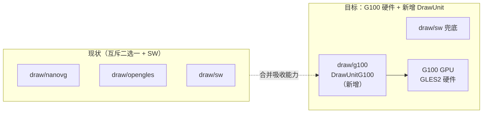

**DrawUnitG100 不是 NanoVG 改名**，而是面向 **G100 硬件 GPU** 的新增 unit：

- 吸收 NanoVG / draw/opengles 的可复用思路
- 针对 **G100** 做 shader、cache、batch、零拷贝优化
- 通过 `drivers/opengles` 下发 draw call 到 **G100**

---

## 2. 整体技术架构

### 2.0 总览（应用 → G100 硬件 → 屏幕）

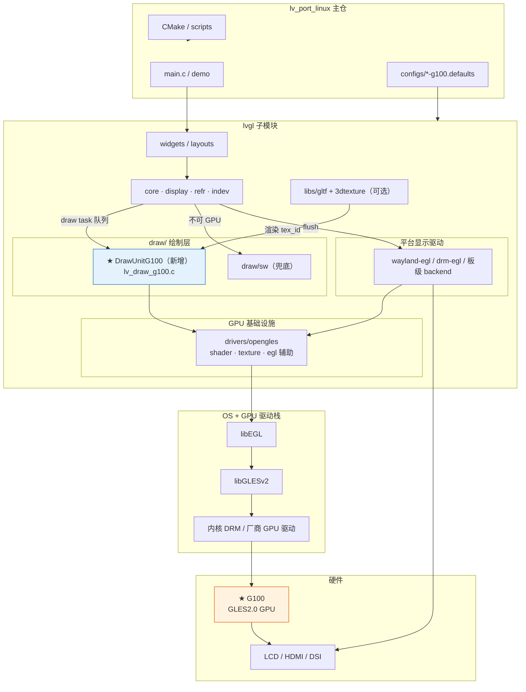

### 2.1 Draw Unit 与 G100 硬件关系

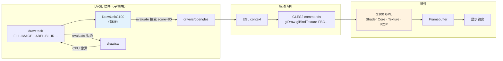

### 2.2 DrawUnitG100 内部分层

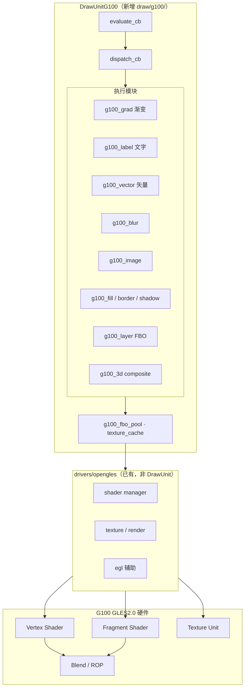

### 2.3 一帧数据流（G100 主路径）

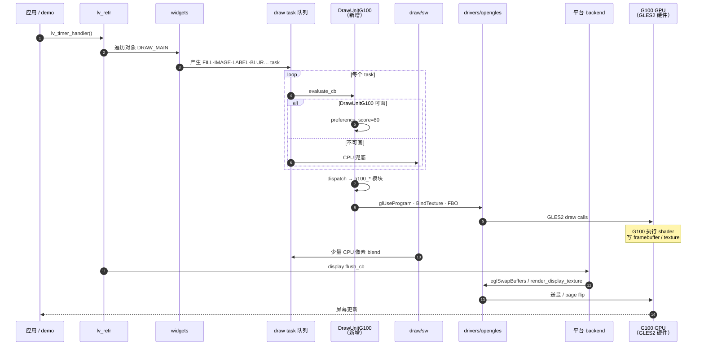

### 2.4 主仓与子模块分工（相对 G100）

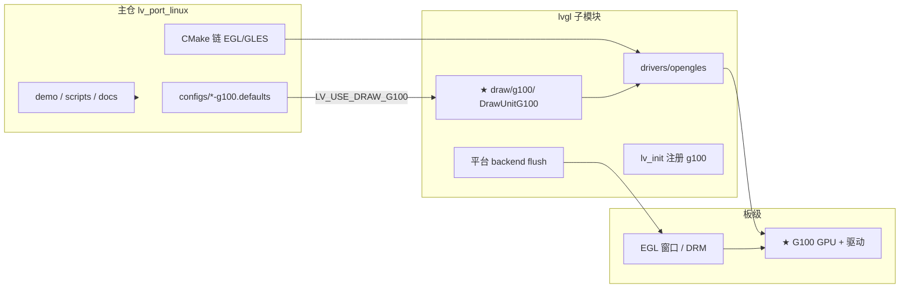

### 2.5 模块分层（简图，与 §2.0 一致）

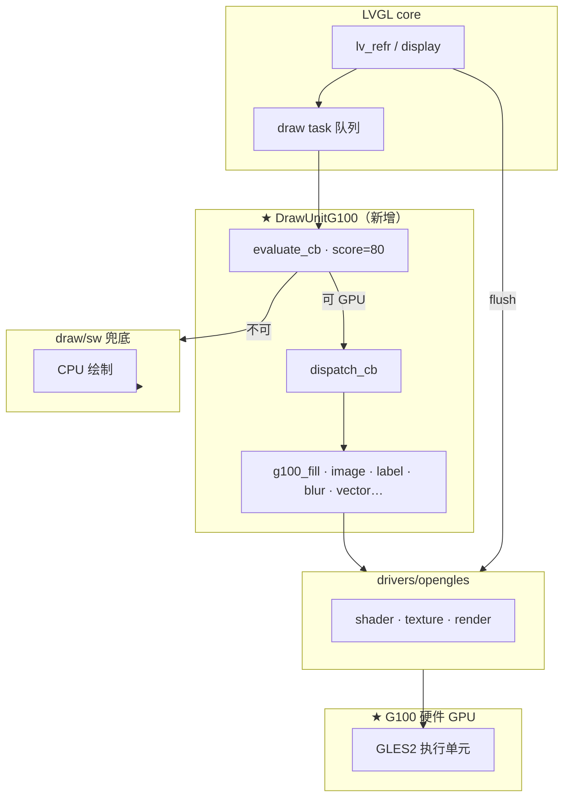

### 2.6 一帧内 DrawUnitG100 与 SW 协作

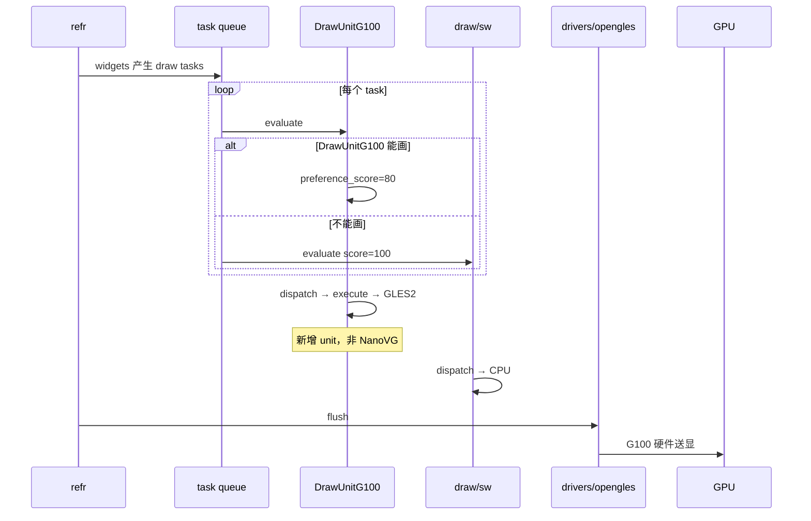

### 2.7 目录结构（lvgl 子模块）

#### 2.7.1 规划目标（G1+ 终态）

G1+ 有两条可行路径：**默认路径**（推荐先做）与 **可选 `libs/g100` 分层**（规模变大或板级/SDK 要求时再引入）。

##### 路径 A — 默认（G1～G6）：`draw/g100/` + `drivers/opengles/`

不新建 `libs/g100`。GLES2 原语（shader、quad、blend、FBO）放在 `draw/g100/lv_g100_*.c`，平台/EGL 继续复用 `drivers/opengles/`（含 `opengl_shader/`）。终态 **`LV_USE_NANOVG=0`**，彻底移除 `libs/nanovg/` 依赖。

```
lvgl/src/draw/g100/
├── lv_draw_g100.c              # unit 注册、evaluate、dispatch、layer 事件
├── lv_draw_g100.h
├── lv_draw_g100_private.h
├── lv_g100_context.c           # GL state、当前 layer/FBO、matrix（规划）
├── lv_g100_shader.c            # G100 专用 GLES2 program（薄封装 opengles_shader）
├── lv_g100_texture_cache.c     # 图片/字形纹理缓存（或由 image_cache 演进）
├── lv_g100_fbo_cache.c         # layer / blur FBO（G0 已有）
├── lv_draw_g100_fill.c
├── lv_draw_g100_grad.c         # §4.8.1/4.8.2 多 stop + extend（必达）
├── lv_draw_g100_border.c
├── lv_draw_g100_box_shadow.c
├── lv_draw_g100_image.c
├── lv_draw_g100_label.c        # §4.8.4 内容 hash（必达）
├── lv_draw_g100_text_hash.c    # 字符串 hash 缓存（规划）
├── lv_draw_g100_line.c
├── lv_draw_g100_arc.c
├── lv_draw_g100_triangle.c
├── lv_draw_g100_layer.c
├── lv_draw_g100_mask_rect.c
├── lv_draw_g100_vector.c       # LV_USE_VECTOR_GRAPHIC
├── lv_draw_g100_blur.c         # §4.8.5/4.8.6 Kawase（必达）
├── lv_g100_fbo_pool.c          # FBO 池化 + 降级重试（规划）
└── lv_draw_g100_3d.c           # LV_USE_3DTEXTURE

lvgl/src/drivers/opengles/      # 不变：EGL、display quad、通用 shader 基础设施
```

##### 路径 B — 可选（G7 或板级交付前）：新增 `libs/g100/`

当满足下列**任一**条件时，将 **GLES2 运行时** 从 `draw/g100/` 下沉到 `libs/g100/`（类比 `libs/nanovg` 与 `draw/nanovg` 的分工，但 **API 为 G100 专用**，不复制 `nvg*` 接口）：

| 触发条件 | 说明 |
|----------|------|
| 多模块复用 | 除 DrawUnitG100 外，还有 snapshot、3D composite、板级 SDK 需同一套 GL 原语 |
| 代码体量 | `lv_g100_shader` + FBO 池 + batch 超过 ~3k 行，draw 层过肥 |
| 交付边界 | SoC 厂商要求「渲染库 (`libs/g100`)」与「LVGL 适配 (`draw/g100`)」分离 |
| 测试隔离 | 需在无 LVGL widget 的环境下单测 GLES2 路径（类似 nanovg 可独立编译） |

```
lvgl/src/libs/g100/                    # ★ 可选：G100 GLES2 运行时（非 LVGL task 语义）
├── g100.h                             # 公共类型、能力查询 g100_caps
├── g100_context.c / .h                # 当前 GL 状态、layer/FBO 栈、viewport
├── g100_shader.c / .h                 # program 缓存、uniform 绑定（GLES2 only）
├── g100_geometry.c / .h               # 共享 VBO/IBO、全屏 quad、路径顶点上传
├── g100_fbo.c / .h                    # FBO 创建/池化/降级（从 lv_g100_fbo_pool 下沉）
├── g100_blend.c / .h                  # premul/straight alpha、blend mode
├── g100_path.c / .h                   # 可选：圆角/弧/宽线 CPU 细分（类比 nanovg.c 几何部分）
└── shaders/                           # 或嵌入 .c：fill、grad、blur、text、vector 等 .glsl

lvgl/src/draw/g100/                    # LVGL 适配层（task → libs/g100 原语）
├── lv_draw_g100.c                     # evaluate/dispatch 不变
├── lv_draw_g100_fill.c                # 调 g100_draw_solid_rect() 等
├── lv_draw_g100_grad.c                # 调 g100_grad_apply()
├── lv_draw_g100_blur.c                # 调 g100_blur_kawase()
└── …                                  # 其余 task 文件仅保留 LVGL dsc → 参数映射
```

**`libs/g100` 与 `libs/nanovg` 对照（职责，非 API 兼容）：**

| | `libs/nanovg/` | `libs/g100/`（规划） |
|--|----------------|----------------------|
| 定位 | 通用 2D 矢量 API（`NVGcontext`） | **G100 专用** GLES2 原语库 |
| CPU 侧 | 路径 stroke/fill、三角化、`nvg*` 命令录制 | 可选 `g100_path`；矢量主路径仍可走 ThorVG → draw |
| GPU 侧 | `nanovg_gl.h` 内嵌 shader + `glDraw*` flush | `g100_shader` + `g100_geometry` 显式模块 |
| FBO/模糊 | `nanovg_gl_utils.h`（`NVGLUframebuffer`、`nvgluBlur`） | `g100_fbo` + draw 层 Kawase blur |
| LVGL 耦合 | 无（第三方风格 API） | 无；**仅** `draw/g100` 调用 |
| 配置宏 | `LV_USE_NANOVG` | 建议新增 `LV_USE_G100_LIB`（与 `LV_USE_DRAW_G100` 独立，便于单测） |

##### 路径选型决策

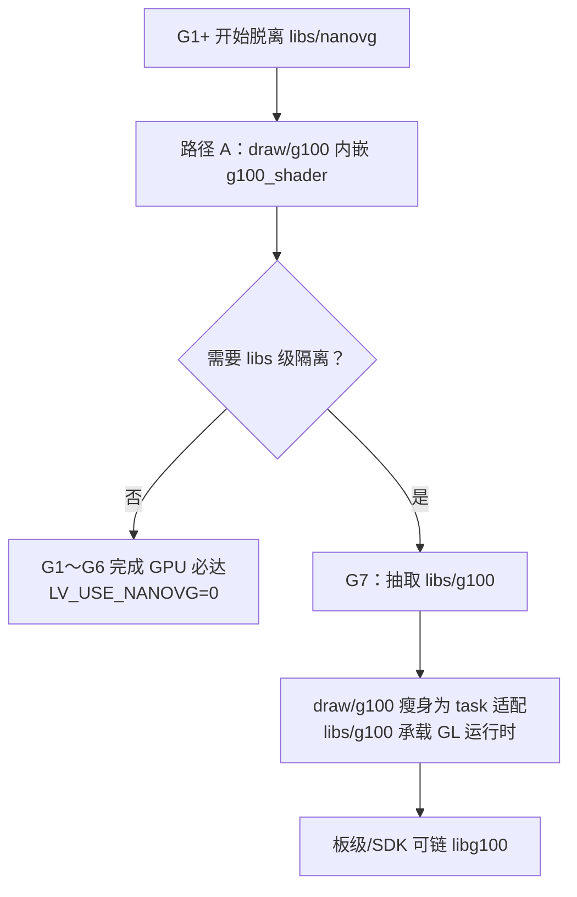

| 阶段 | 推荐路径 | `libs/nanovg` | `libs/g100` |
|------|----------|---------------|-------------|
| G0（已完成） | Bootstrap | ✅ 后端 | — |
| G1～G6 | **路径 A** | ❌ 逐步移除 | — |
| G7 / 板级 | **路径 B**（按需） | ❌ | ✅ 可选 |

> **原则：** G1 不必等待 `libs/g100` 目录存在；先让 `lv_draw_g100_grad` 等直接在 `draw/g100` 里调 `glUseProgram`（经 `lv_g100_shader`），跑通 §4.8 必达后再做库级抽取，避免过早抽象。

##### G1+ 终态架构（路径 A，默认）

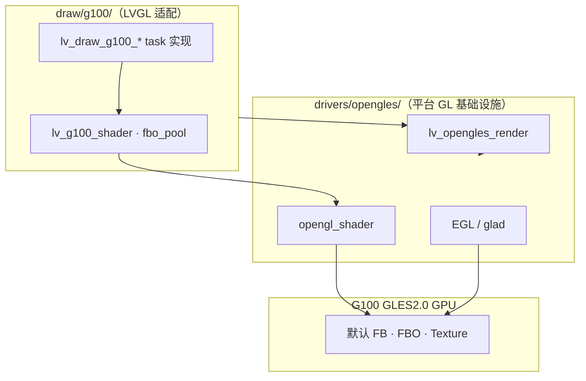

##### G1+ 终态架构（路径 B，可选 libs/g100）

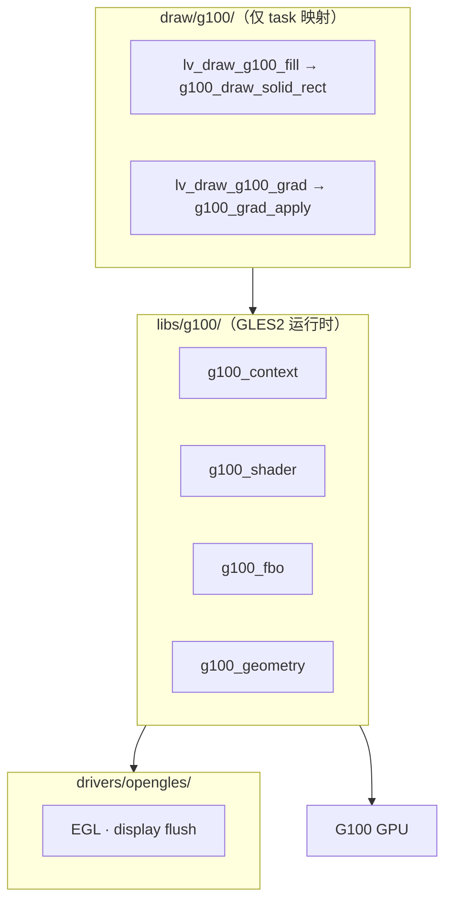

#### 2.7.2 G0 当前实现（WSLg Bootstrap，已完成）

自 `draw/nanovg/` **复制并独立维护** 于 `draw/g100/`，与 NanoVG Draw Unit **代码解耦**（编译守卫互斥），Bootstrap 阶段仍通过 `LV_USE_NANOVG=1` 链接 **NanoVG GLES2 渲染库**（`libs/nanovg/`）作为内部后端。

```
lvgl/src/draw/g100/                    # 22 个源文件（G0）
├── lv_draw_g100.c                    # Unit ID=11，evaluate/dispatch/event
├── lv_draw_g100.h
├── lv_draw_g100_private.h            # lv_draw_g100_unit_t、task 原型
├── lv_g100_utils.c / .h              # transform、clip、end_frame、clean_up
├── lv_g100_math.h                    # 路径/矩阵辅助
├── lv_g100_fbo_cache.c / .h          # layer 离屏 FBO LRU
├── lv_g100_image_cache.c / .h        # 图片纹理 LRU
├── lv_draw_g100_fill.c
├── lv_draw_g100_border.c
├── lv_draw_g100_box_shadow.c
├── lv_draw_g100_image.c
├── lv_draw_g100_label.c              # 字形 letter_cache
├── lv_draw_g100_layer.c
├── lv_draw_g100_line.c
├── lv_draw_g100_arc.c
├── lv_draw_g100_triangle.c
├── lv_draw_g100_mask_rect.c
├── lv_draw_g100_blur.c               # nvgluBlur（Bootstrap）
├── lv_draw_g100_grad.c               # 矢量渐变（需 VECTOR 宏）
├── lv_draw_g100_vector.c
└── lv_draw_g100_3d.c
```

**符号命名（G0 拆分规则）：**

| 原 NanoVG 共用 | G100 独立 |
|----------------|-----------|
| `lv_draw_nanovg_*()` | `lv_draw_g100_*()` |
| `lv_nanovg_*()` | `lv_g100_*()` |
| `lv_draw_nanovg_unit_t` | `lv_draw_g100_unit_t` |
| `#if LV_USE_DRAW_NANOVG \|\| LV_USE_DRAW_G100` | G100 文件：`#if LV_USE_DRAW_G100`；nanovg 文件：`#if LV_USE_DRAW_NANOVG` |

**基础设施仍在** `drivers/opengles/`，G100 **调用**而非复制。

### 2.8 G0 Bootstrap 与 NanoVG 后端关系

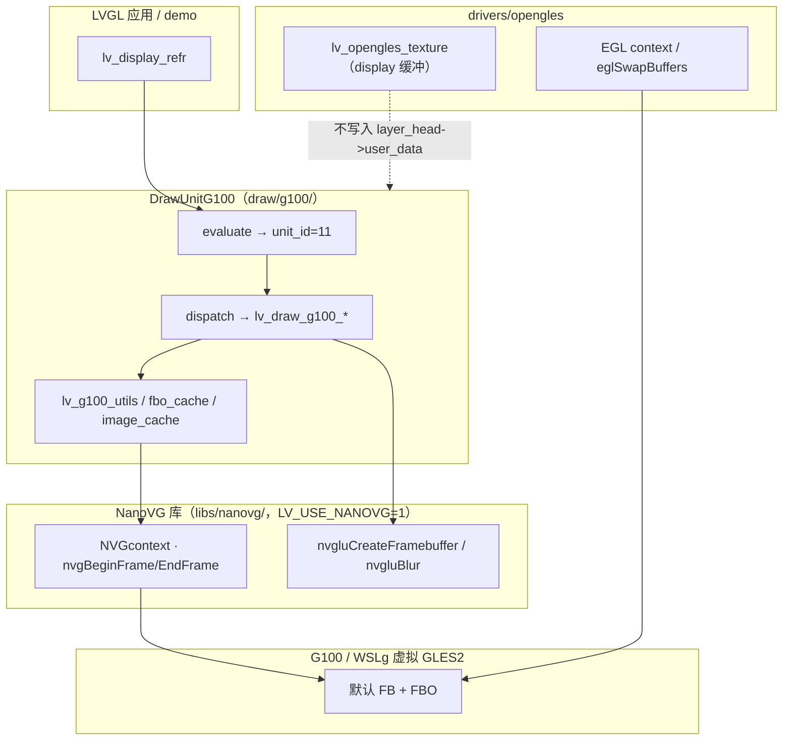

| 层级 | G0 策略 | G1+ 目标 |
|------|---------|----------|
| Draw Unit 入口 | `lv_draw_g100_init()`，**不**注册 `lv_draw_nanovg_init()` | 保持 |
| 绘制实现 | `lv_draw_g100_*.c` 调 NanoVG API | 逐文件换 `g100_shader` / 原生 GLES2 |
| 配置 | `LV_USE_DRAW_G100=1`，`LV_USE_DRAW_NANOVG=0`，**`LV_USE_NANOVG=1`**（库） | 最终可关 `LV_USE_NANOVG` |
| 互斥 | 与 `LV_USE_DRAW_NANOVG`、`LV_USE_DRAW_OPENGLES` **编译期 `#error`** | 保持 |

### 2.9 Wayland EGL 集成要点（G0 已修）

G100 与 NanoVG 主屏一样：**直接画在 EGL 默认 framebuffer**，flush 仅 `eglSwapBuffers`，**不做** CPU `glTexImage2D` 回灌。

| 文件 | G100 必要行为 |
|------|----------------|
| `lv_opengles_texture.c` | `#if !LV_USE_DRAW_NANOVG && !LV_USE_DRAW_G100` 时才把 `texture_id` 写入 `layer_head->user_data`；G100 根 layer **必须** `user_data==NULL`（否则 dispatch 误当 FBO cache entry → SIGSEGV） |
| `lv_wayland_backend_egl.c` | flush 走 `#if LV_USE_DRAW_OPENGLES \|\| LV_USE_DRAW_NANOVG \|\| LV_USE_DRAW_G100` 分支（直接 swap） |
| 同上 | `lv_display_set_render_mode(..., FULL)` 当 `LV_USE_DRAW_NANOVG \|\| LV_USE_DRAW_G100` |
| 同上 | EGL config 选择：`is_nanovg_compatible \|\| (!NANOVG && !G100)` |

**CMake 注意：** `env_support/cmake/main.cmake` 用 `GLOB_RECURSE` 收集 `src/*.c`；**新增 `draw/g100/*.c` 后须重新 `cmake -B <build>`**，否则链接缺符号。


## 3. Draw Task 覆盖总表

LVGL 全部 `LV_DRAW_TASK_TYPE_*` 与 G100 关系：

| Task 类型 | G100 GPU | 说明 |
|-----------|:--------:|------|
| `FILL` | ✅ | 纯色、圆角、线性/径向渐变（需 `LV_USE_VECTOR_GRAPHIC` 或内置 2-stop shader） |
| `BORDER` | ✅ | 圆角边框、partial side |
| `BOX_SHADOW` | ✅ | GPU 近似阴影（blur + offset shader） |
| `LETTER` | ✅ **必达** | 单字形纹理 + LRU；动态文本见 §4.8.4 |
| `LABEL` | ✅ **必达** | 内容 hash 缓存，禁止指针 key |
| `IMAGE` | ✅/⚠️ | 见 §4.2；部分格式/模式降级 SW |
| `LAYER` | ✅ | FBO 离屏 + alpha blend 合成 |
| `LINE` | ✅ | 宽线、端点/连接样式 |
| `ARC` | ✅ | 圆弧描边/填充 |
| `TRIANGLE` | ✅ | 纯色；渐变需 VECTOR |
| `MASK_RECTANGLE` | ✅ | scissor 或 stencil 矩形裁剪 |
| `MASK_BITMAP` | ❌ | **不做** → SW |
| `BLUR` | ✅ **必达** | Dual Kawase + FBO 池；见 §4.8.6 |
| `VECTOR` | ✅ **必达** | ThorVG 全 style GPU；`LV_USE_VECTOR_GRAPHIC` 强制开 |
| `3D` | ✅ | 合成外部 GL 纹理（`lv_opengles_render_texture`）；**不**在 unit 内跑 glTF 解析 |
| `NONE` | — | 忽略 |

图例：✅ 全权 GPU；⚠️ 有条件 GPU；❌ 明确不做。

---

## 4. G100 承担的 GPU 工作（完整清单）

以下均为 **GLES 2.0 在规范与工程上可落地** 的工作，G100 **应全部实现**。

### 4.1 几何与矩形

| 能力 | GPU 实现要点 |
|------|-------------|
| 轴对齐矩形填充 | `glClear` / 全屏 quad + uniform color |
| 圆角矩形 | SDF round-rect shader 或 NanoVG 路径 tessellation |
| 线性渐变填充 | 2+ stop 渐变纹理或 varying 插值 |
| 径向渐变填充 | radial gradient shader |
| 边框 | stroke round-rect 或内外 rect 差集 |
| 盒阴影 | 偏移 + 高斯近似 separable blur |
| 三角形 | 三顶点 rasterize |
| 线段 | quad expansion / NanoVG stroke |
| 圆弧 | 三角扇或路径逼近 |

### 4.2 图片（`IMAGE` / `LAYER`）

| 能力 | GPU 实现要点 |
|------|-------------|
| 纹理上传与缓存 | `glTexImage2D` / `EGLImage` / PBO（扩展） |
| 支持色彩格式 | A8、RGB565、RGB888、ARGB8888、XRGB8888、ARGB8888_PREMULTIPLIED |
| 平移 / 缩放 / 旋转 | `lv_matrix` → MVP uniform |
| 透明度 `opa` | alpha blend |
| 重着色 `recolor` | fragment shader uniform（免 CPU 重刷纹理） |
| 平铺 `tile` | repeat sampler；**NPOT** 见 §5.2 |
| Layer 离屏合成 | FBO render-to-texture + blend |
| Display 主屏 | 直接 bind 默认 FB 或 display texture |
| 子 layer readback | 仅在需要 CPU 访问时 readback（屏切换等事件） |

### 4.3 文字（`LETTER` / `LABEL`）

| 能力 | GPU 实现要点 |
|------|-------------|
| Bitmap 字形 | 上传 A8/ARGB 纹理，alpha blend |
| SDF 字形（若字体支持） | SDF shader + 边缘平滑 |
| 字形缓存 | `(font, glyph_id, size)` → texture handle |
| 静态字符串缓存 | 可选整句 bake 纹理（`text_static`） |
| 旋转/缩放/颜色 | matrix + text color uniform |

### 4.4 矢量（`VECTOR`，需 `LV_USE_VECTOR_GRAPHIC`）

| 能力 | GPU 实现要点 |
|------|-------------|
| ThorVG 路径 → GPU | 路径 flatten + triangulation / stencil cover |
| 实心/渐变填充 | solid / linear / radial gradient |
| 描边 | stroke extrusion |
| SVG/Lottie 输出 | 走 VECTOR task 链 |
| 渐变 stop | 建议支持 ≥2 stop（优于 NanoVG 仅 2-stop 限制） |

### 4.5 特效

| 能力 | GPU 实现要点 |
|------|-------------|
| `BLUR` | 双 pass separable blur（需 RGBA FBO） |
| `MASK_RECTANGLE` | `glScissor` 或 stencil mask |
| 图层 alpha 混合 | premultiplied / straight alpha 分支 |
| 3D 纹理合成 `3D` | `lv_opengles_render_texture` + h/v flip |

### 4.6 变换与合成

| 能力 | GPU 实现要点 |
|------|-------------|
| Layer 全局 matrix | `LV_DRAW_TRANSFORM_USE_MATRIX` |
| Clip area | scissor + 逻辑 clip |
| 多 layer 嵌套 | FBO 栈 + cache |
| 透明屏清屏 | GPU clear alpha=0（避免残影） |
| GL 状态恢复 | flush / 3D 后 `lv_opengles_reinit_state` |

### 4.7 性能基础设施（GPU 侧，非单 task）

| 能力 | 说明 |
|------|------|
| 纹理 LRU 缓存 | 图片、字形、layer 结果 |
| Draw call batching | 同 shader/纹理合并 |
| VBO 复用 | 常用 quad、path 顶点 |
| 零拷贝纹理 | `EGLImage` / dma-buf（扩展，板级） |
| Display 纹理直显 | flush 无多余 `ReadPixels` |

### 4.8 GPU 必达：渐变 / 矢量 / 文字 / BLUR

> **原则**：以下四类是 G100 的 **硬性 GPU 目标**。NanoVG / draw/opengles 的缺口 **不得在 G100 上原样继承**；  
> 须在 GPU 上实现对应能力，**仅当 G100 初始化彻底失败**（如无 GL context）才整体拒接，**不得**逐 task 退回 SW。

| 维度 | G100 目标 | 相对 NanoVG 的改进 |
|------|-----------|-------------------|
| **渐变** | FILL/TRIANGLE/VECTOR 全走 GPU shader | 不依赖 `LV_USE_VECTOR_GRAPHIC` 才能画渐变 |
| **矢量** | ThorVG 常用 style 全覆盖 | pattern、dash 等补齐 |
| **文字** | 动态/静态字符串均 GPU 绘制 | 内容 hash 缓存，不用裸指针 |
| **BLUR** | 全半径范围 GPU blur | Dual Kawase + 降采样，打破 256 限制 |

#### 4.8.1 渐变 — 无 VECTOR 的多 stop FILL

| | |
|--|--|
| **原缺口** | NanoVG 无 `LV_USE_VECTOR_GRAPHIC` 时对 `grad.dir != NONE` 直接 warn 跳过。 |
| **G100 GPU 方案** | **内置多 stop 渐变 shader**（`g100_grad.frag`），与 VECTOR 宏 **解耦**： |
| | ① `stops_count` ≤ 16：uniform 数组传入 color+stop，片元里按 `t` 二分/线性插值 |
| | ② 或 bake 1D gradient texture（256×1 RGBA），stop 多时一次采样 |
| | ③ 支持 `LV_GRAD_DIR_VER/HOR/LINEAR/RADIAL/CONICAL` 各算投影参数 `t` |
| | ④ `FILL`/`TRIANGLE`/`BORDER`/`BOX_SHADOW` 凡带 `lv_grad_dsc_t` 均走同一套 grad 模块 |
| **验收** | 关闭 `LV_USE_VECTOR_GRAPHIC` 时 `lv_demo_render` 渐变矩形仍 GPU 绘制；apitrace 可见 grad shader |

#### 4.8.2 渐变 — REFLECT / REPEAT extend

| | |
|--|--|
| **原缺口** | NanoVG 对未知 extend 退 PAD；REFLECT/REPEAT 未实现。 |
| **G100 GPU 方案** | 在 grad shader 算出 **归一化参数 `t` 后**做 extend 映射（GLES2 fragment 即可）： |
| | • `PAD`：`t = clamp(t, 0, 1)` |
| | • `REPEAT`：`t = fract(t)` |
| | • `REFLECT`：`t = 1.0 - abs(mod(t, 2.0) - 1.0)` |
| | 线性/径向/锥形各自先算几何 `t`，再 **共用** 同一 `g100_grad_extend(t, mode)` |
| **验收** | `LV_GRAD_EXTEND_REPEAT/REFLECT` 与 SW 截图一致（容差内） |

#### 4.8.3 矢量 — 扩展 style（含 PATTERN）

| | |
|--|--|
| **原缺口** | NanoVG 对 `LV_VECTOR_DRAW_STYLE_PATTERN` 等 warn 后跳过。 |
| **G100 GPU 方案** | 分阶段 **全部 GPU**，不回退 SW： |
| | • **SOLID / GRADIENT**：路径 tessellation + grad shader（§4.8.1） |
| | • **PATTERN**：pattern 图上传纹理，`image_pattern` shader 按 path bbox 平铺 |
| | • **虚线 dash**：CPU 侧 path dash 细分（ThorVG API）→ 短路径段 GPU stroke；或 line stipple shader |
| | • **复杂 blend**：单 pass 不够时 **FBO ping-pong** 多 pass，仍留在 GPU |
| **配置要求** | `LV_USE_VECTOR_GRAPHIC=1`（G100 板级 config **强制开启**） |
| **验收** | Lottie/SVG demo 无 `unsupported style` warn；VECTOR task 无 SW 接管 |

#### 4.8.4 文字 — 非 `text_static` 动态字符串

| | |
|--|--|
| **原缺口** | draw/opengles 对非 static 放弃缓存，内部走 SW 画到 ARGB 再上传。 |
| **G100 GPU 方案** | **始终 GPU 逐 glyph 绘制**，字符串级缓存用 **内容 hash** 而非指针： |
| | • cache key = `(font, font_size, text_len, xxHash(text bytes), color, letter_space, …)` |
| | • 每帧对非 static 文本 **重算 hash**；变化则 miss，仍 GPU 画 glyph（不缓存或短帧缓存） |
| | • **禁止**用 `label_dsc->text` 指针作 key（避免 realloc 野指针） |
| | • 可选优化：连续 N 帧 hash 相同则 bake 为 **单张 glyph-atlas 纹理** 一次 blit |
| | • 字形级缓存仍用 `(font, glyph_id, size)` → texture（LRU） |
| **验收** | 动态 `lv_label_set_text` 动画无 SW label task；apitrace 无 ReadPixels 文字路径 |

#### 4.8.5 BLUR — FBO 创建失败

| | |
|--|--|
| **原缺口** | `nvgluCreateBlurState()` 失败则 evaluate=0，整类 blur 交 SW。 |
| **G100 GPU 方案** | **启动期 FBO 池化 + 多级降级**，尽量不把 blur 交给 SW： |
| | ① `lv_draw_g100_init()` 预分配：layer FBO 池 + blur ping-pong（RGBA8888） |
| | ② 失败时依次尝试：`RGBA8888` → `RGBA4444` → `RGB565`（无 alpha blur 时）→ 缩小 50% 池 |
| | ③ 与 layer 共用 `g100_fbo_cache`，避免重复申请 |
| | ④ 记录 `g100_caps.fbo_ok`；仅当 **全部重试失败** 才 log error，该帧 blur **跳过**（非 SW 替代） |
| **验收** | 目标板 EGL 初始化后 `g100_caps.fbo_ok==true`；stress 中 blur 对象可见 |

#### 4.8.6 BLUR — 大半径 / 大图

| | |
|--|--|
| **原缺口** | NanoVG 硬限 `blur_radius > 256` skip；全屏 blur 采样爆炸。 |
| **G100 GPU 方案** | **Dual Kawase / 金字塔 separable blur**（全 GPU）： |
| | ① 仅对 **脏区 ∪ blur padding** 做 FBO，非全屏 |
| | ② `radius > 64`：先 **1/2、1/4 降采样** chain，在低分辨率做宽核 blur |
| | ③ 每 pass 固定 5–9 tap，靠 **多级迭代** 等效大半径（可达 512+） |
| | ④ `blur_radius` 无硬顶；超大时增加 downsample 级数而非单 pass 加 tap |
| | ⑤ 与 `BOX_SHADOW` 共用 blur 管线 |
| **验收** | `blur_radius=400` 全屏 widget 仍可交互 FPS；无 NanoVG 256 skip log |

#### 4.8.7 四维能力依赖关系

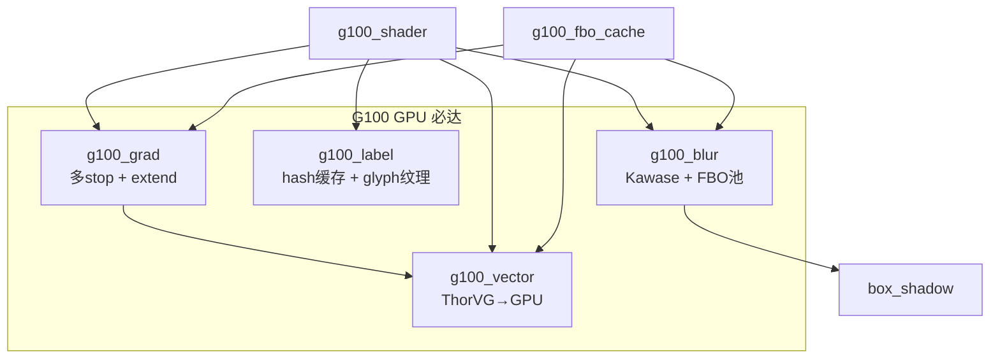

---

## 5. G100 做不到 / 不做的（单独罗列 + 理由）

以下 task 或条件 **evaluate 返回 0**，交给 **`draw/sw`**（或由其他模块负责）。  
每项均说明：**为什么不交给 G100**、**技术依据**、**兜底方案**。

---

### 5.1 整类 Task 不做

#### `LV_DRAW_TASK_TYPE_MASK_BITMAP`

| | |
|--|--|
| **为什么不交给 G100** | 这是「用任意形状 bitmap 当蒙版」的 task，蒙版与前景像素要做 **逐像素 alpha 乘法**（`dst.a *= mask.a`），形状无规律，无法压成一次矩形 scissor。 |
| **技术依据** | GLES2 的 `glScissor` 只能裁 **轴对齐矩形**；stencil 需先把 bitmap **三角化/栅格化成 stencil buffer**，成本接近 CPU 软绘。NanoVG、VG-Lite、OpenGLES unit 均 **未实现** 此 task；仅 Dave2D、NemaGFX 等带 **专用 2D 蒙版硬件** 的 IP 才接。 |
| **兜底** | `draw/sw`（`lv_draw_sw_mask.c` 等逐像素路径） |

#### Canvas / 非 display 刷新目标（`lv_refr_get_disp_refreshing() == NULL`）

| | |
|--|--|
| **为什么不交给 G100** | Canvas、snapshot、离屏 `draw_buf` 的目标是 **CPU 可寻址内存**（`lv_draw_buf_t *`），不是 GL 纹理/FBO。G100 输出在 GPU 显存，若要写回 CPU 需 `glReadPixels`，慢且破坏流水线。 |
| **技术依据** | 现有 `draw/opengles` 在 evaluate 中同样拒绝：`/* not refreshing the display probably it's a canvas rendering which is not supported in OpenGL as it's not a texture. */`（`lv_draw_opengles.c`）。 |
| **兜底** | `draw/sw` 直接写 `layer->draw_buf` |

#### `LV_DRAW_TASK_TYPE_3D` 内的 glTF 解析 / 骨骼 / 动画 / PBR

| | |
|--|--|
| **为什么不交给 G100** | `3D` task 的语义是：**把已经渲染好的 GL 纹理** 合成进 2D UI（`tex_id` + area + opa）。glTF 加载、场景图、骨骼蒙皮、光照、动画 tick 属于 **3D 引擎职责**，不是 2D DrawUnit 职责。 |
| **技术依据** | 流程为：`lv_gltf_view_render()` → 写入 FBO/纹理 → `lv_draw_3d()` 产生 task → DrawUnit 调 `lv_opengles_render_texture()`。G100 只实现最后一步 composite。 |
| **兜底** | `libs/gltf` + widget `lv_3dtexture`；G100 负责 composite |

---

### 5.2 IMAGE / LAYER 条件降级

#### `cf >= LV_COLOR_FORMAT_PROPRIETARY_START`（NEMA_TSC4/6/12 等）

| | |
|--|--|
| **为什么不交给 G100** | 厂商 **私有压缩纹理格式**，布局与解码算法不公开，通用 GLES2 采样器无法直接 `sampler2D` 读取。 |
| **技术依据** | SW evaluate 同样 `return 0`（`lv_draw_sw.c`）。需厂商 SDK 或 CPU 解压后再 `glTexImage2D` 成 RGBA/RGB565。 |
| **兜底** | `draw/sw` 或 decoder 解压后走常规 GPU 路径 |

#### `LV_COLOR_FORMAT_I1 / I2 / I4 / I8`（索引色）

| | |
|--|--|
| **为什么不交给 G100** | 像素存的是 **调色板索引** 而非颜色值；GPU 纹理采样得到的是索引，还需 **palette lookup** 才能显示。 |
| **技术依据** | GLES2 无标准「索引纹理 + 调色板」单 pass 路径；需 CPU 展开为 RGBA 再上传，或 1D palette texture + shader（LVGL 未统一提供 palette 数据）。首版 G100 不上此 shader。 |
| **兜底** | `draw/sw`（内置索引→真彩色查表） |

#### `LV_COLOR_FORMAT_L8`（纯灰度）

| | |
|--|--|
| **为什么不交给 G100** | 每像素 1 字节亮度，无 chroma；GPU 需单独 **L8→RGBA 展开 shader** 或上传时 CPU 扩成 RGB888。 |
| **技术依据** | NanoVG image cache 仅支持 A8/RGB565/RGB888/ARGB8888/XRGB8888（`lv_nanovg_image_cache.c` switch），不含 L8。 |
| **兜底** | `draw/sw`；P2 可为 L8 增加单通道纹理 + shader |

#### `LV_COLOR_FORMAT_AL88`（亮度 8bit + Alpha 8bit 打包）

| | |
|--|--|
| **为什么不交给 G100** | 每像素 16bit 非标准打包（L 与 A 各 8bit），与 RGB565/ARGB1555 布局不同，需 **专用 unpack shader**。 |
| **技术依据** | 无 GLES2 内建格式对应；实现成本低但 LVGL 使用面窄，首版不纳入 G100 格式表。 |
| **兜底** | `draw/sw`（或 P2 扩展） |

#### `LV_COLOR_FORMAT_RGB565A8`（RGB565 色 plane + 独立 A8 plane）

| | |
|--|--|
| **为什么不交给 G100** | **双 plane 布局**：颜色与 alpha 分两块内存，stride/偏移与单纹理不一致。 |
| **技术依据** | SW 在 `bitmap_mask_src` 组合时亦拒（`masked && cf == RGB565A8` → `return 0`）。GPU 需双纹理或打包上传，复杂度高。 |
| **兜底** | `draw/sw` |

#### `LV_COLOR_FORMAT_RGB565_SWAPPED`（字节序对调）

| | |
|--|--|
| **为什么不交给 G100** | 16bit 字内 R/B 或高低字节与 GPU 默认 `GL_UNSIGNED_SHORT_5_6_5` 布局不一致。 |
| **技术依据** | 上传前须 CPU swap 或专用 unpack；错误上传会导致花屏。 |
| **兜底** | `draw/sw` 或上传前 CPU 转换 |

#### `LV_COLOR_FORMAT_ARGB2222 / 1555 / 4444 / 8565`

| | |
|--|--|
| **为什么不交给 G100** | 非常规 bpp 打包，GLES `glTexImage2D` 无直接 type/format 对应。 |
| **技术依据** | 必须 CPU 转为 RGBA8888/RGB565 再上传；首版不在 G100 内做实时转换以控制复杂度。 |
| **兜底** | `draw/sw` 或 decoder 侧转换 |

#### `LV_COLOR_FORMAT_YUY2`（YUV 4:2:2）

| | |
|--|--|
| **为什么不交给 G100** | 视频常用 **YUV 色彩空间**，RGB 显示需 **YUV→RGB 矩阵变换**。 |
| **技术依据** | GLES2 核心无 YUV sampler；部分平台有 `GL_EXT_YUV_target` 等扩展，不可移植。 |
| **兜底** | `draw/sw` 或平台专用视频层 |

#### `bitmap_mask_src != NULL` 且 cf 为 `A8` 或 `RGB565A8`

| | |
|--|--|
| **为什么不交给 G100** | 图片/图层绘制时要 **用另一张 bitmap 的 alpha 调制本图每个像素**，属于 per-pixel 蒙版合成，不是矩形 clip。 |
| **技术依据** | SW：`lv_draw_sw_layer` → `apply_mask()` 逐像素处理。GPU 可用双纹理 shader，但 A8/RGB565A8 与主图格式组合多、与 LVGL blend 语义需逐项对齐；首版与 SW 保持一致拒接。 |
| **兜底** | `draw/sw`（`lv_draw_sw_img.c` `apply_mask`） |

#### `skew_x != 0 || skew_y != 0`（图片 task 级斜切）

| | |
|--|--|
| **为什么不交给 G100** | 斜切使纹理映射为 **平行四边形**，需 4 顶点非矩形 quad + 正确 UV；与 scale/rotate 的 ortho 管线不同。 |
| **技术依据** | SW evaluate 明确 `/* not support skew */` 并 `return 0`。NanoVG image 矩阵路径未覆盖 skew dsc 字段。对象级 skew 若通过 layer `matrix` 走 VECTOR/LAYER 仍可 GPU。 |
| **兜底** | `draw/sw` |

#### NPOT 尺寸 + `tile` repeat（非 2 幂次平铺）

| | |
|--|--|
| **为什么不交给 G100（首版）** | GLES2 规范：当 `GL_TEXTURE_WRAP` 为 `REPEAT` 时，若纹理宽高 **非 2 的幂**，行为 **未定义** 或驱动直接不支持。 |
| **技术依据** | NanoVG 注释：`/* GLES2 does not support sampling non-power-of-2 textures in repeating mode. */`，退化为 CPU 侧 `fill_repeat_tile_image()` 多 quad 模拟。G100 首版与 SW 对齐；后续可做 GPU 多 draw 模拟但 draw call 暴增。 |
| **兜底** | `draw/sw` 或 G100 多 quad 模拟（性能差，标为 ⚠️） |

---

### 5.3～5.5 渐变 / 矢量 / 文字 / BLUR — 已移至 §4.8（GPU 必达）

以下条目 **不再** 作为 SW 降级理由。G100 须在 GPU 上实现，方案见 **§4.8**：

| 原「可降级」条件 | G100 策略摘要 | SW 兜底 |
|------------------|---------------|---------|
| 无 VECTOR 的渐变 FILL | 内置多 stop grad shader，与 VECTOR 宏解耦 | ❌ 不做 |
| REFLECT/REPEAT extend | shader `fract` / 镜像映射 | ❌ 不做 |
| VECTOR 未知 style | PATTERN 纹理填充、dash 细分、FBO 多 pass | ❌ 不做 |
| 非 `text_static` | 内容 **hash** 缓存 + 每帧 GPU 逐 glyph | ❌ 不做 |
| FBO 创建失败 | 启动期 FBO 池 + 格式/尺寸降级重试 | 仅 init 全失败时跳过该帧 blur |
| blur 半径过大 | Dual Kawase + 降采样金字塔 | ❌ 不做 |

> **板级 config 强制**：`LV_USE_VECTOR_GRAPHIC=1`，确保矢量/渐变/Lottie 链路启用。

---

### 5.6 不属于 DrawUnit 的系统级工作

| 项 | 不纳入 G100 的理由 | 负责模块 |
|----|---------------------|----------|
| EGL display / surface / context | 窗口与 GL 上下文生命周期属于 **平台驱动**，DrawUnit 只消费已激活的 context | `drivers/opengles` + wayland/drm backend |
| `eglSwapBuffers` / drm page flip | **送显**是 display flush 回调，在 refr 之后、与 draw task 队列分离 | `lv_wayland_backend_egl.c` 等 |
| glTF 场景渲染 | 3D 管线（mesh、shader、uniform）体量大，已在独立库实现 | `libs/gltf` |
| 图片文件解码 PNG/JPG/WebP | 解压、色彩转换在 CPU，GPU 只接收解码后的像素 | `lv_image_decoder` |
| 输入、布局、样式计算 | 无像素输出，纯 CPU 逻辑 | core / widgets |
| Snapshot 到 CPU buffer | 需要 `glReadPixels` 或全程 SW 绘制到 `draw_buf` | `draw/snapshot` |

---

### 5.7 GLES 2.0 规范硬限制（任何 GPU unit 均无法突破）

| 限制 | 理由 | 对 G100 的影响 |
|------|------|----------------|
| **无 Compute Shader** | GLES2 只有 vertex + fragment；模糊、后处理、通用并行像素运算 **不能** GPGPU，只能多 pass fragment | BLUR/SHADOW 用 separable pass，无法用 compute 优化 |
| **无 Geometry Shader** | 路径细分、动态扩点不能在 GPU 几何阶段完成 | VECTOR 路径细分、宽线 join 须在 CPU 或 vertex 预计算 |
| **NPOT + REPEAT/MIRROR** | 规范要求 POT 才保证 repeat 语义（见 §5.2 NPOT tile） | 平铺背景图尺寸需 POT 或 CPU/GPU 模拟 |
| **`GL_MAX_TEXTURE_SIZE`** | 单纹理边长上限（常见 2048/4096） | 超大 layer 须分块或降分辨率 |
| **`mediump` 默认精度** | fragment 中 float 有效位数少，大坐标 UV 易 **阶梯/闪烁** | 高 DPI 全屏变换宜用 `highp` 或相对坐标 |
| **单 color attachment** | FBO 一次只能绑一个 color buffer（GLES2） | 无 MRT，deferred 类效果需多 pass |
| **MSAA 受限** | 无 GL 4.x 通用 MSAA resolve；依赖 `OES_standard_derivatives` 做 AA 近似 | 细线/矢量边缘靠 shader 导数或超采样 |
| **纹理单元数有限** | `GL_MAX_TEXTURE_IMAGE_UNITS` 通常 8～16 | 多纹理 blend（mask+图+渐变）需合并 pass |
| **同步与读回慢** | `glReadPixels` 阻塞 GPU 流水线 | Canvas/snapshot 避免 GPU 路径 |

---

### 5.8 汇总：拒接决策流程

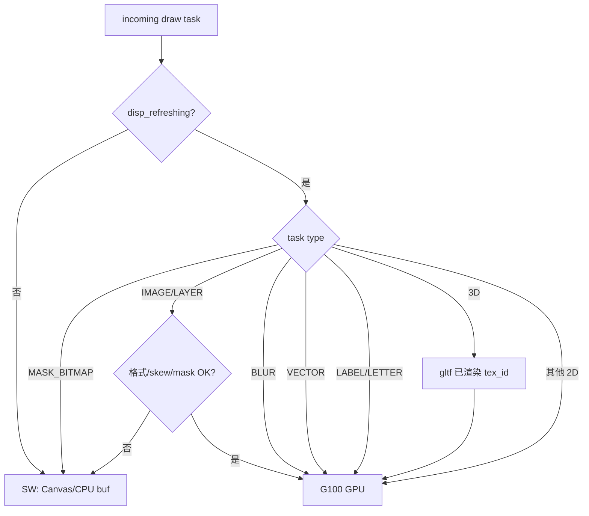


---

## 6. evaluate / dispatch 策略

### 6.1 preference_score

| Unit | score | 说明 |
|------|-------|------|
| **G100** | **90** | 主 GPU 路径，优先于 SW(100) 以外的竞争 |
| SW | 100 | 仅当 G100 evaluate=0 时接管 |
| ~~NanoVG~~ | 80 | G100 上线后关闭 |
| ~~OpenGLES~~ | 0 | G100 上线后关闭 |

> 注：LVGL 选 **score 更低** 的 preferred unit（见 NanoVG `preference_score = 80`）。G100 用 90 确保在可 GPU 时抢在 SW 前，但低于 NanoVG 时需确认调度逻辑——**建议 G100=80 与 NanoVG 同级且互斥宏关闭 NanoVG**。

**修正：与现有代码一致，G100 应设 `preference_score = 80`**（数值越小越优先）。

### 6.2 evaluate 伪代码

```c
static int32_t g100_evaluate(lv_draw_unit_t * u, lv_draw_task_t * t)
{
    if(!g100_gl_ready()) return 0;
    if(lv_refr_get_disp_refreshing() == NULL) return 0; /* canvas → SW */

    switch(t->type) {
        case LV_DRAW_TASK_TYPE_MASK_BITMAP:
            return 0;
        case LV_DRAW_TASK_TYPE_IMAGE:
        case LV_DRAW_TASK_TYPE_LAYER:
            if(!g100_image_supported(t->draw_dsc)) return 0;
            break;
        case LV_DRAW_TASK_TYPE_BLUR:
        case LV_DRAW_TASK_TYPE_VECTOR:
        case LV_DRAW_TASK_TYPE_LABEL:
        case LV_DRAW_TASK_TYPE_LETTER:
            /* GPU 必达：§4.8，不在 evaluate 降级 SW */
            break;
        case LV_DRAW_TASK_TYPE_3D:
#if !LV_USE_3DTEXTURE
            return 0;
#endif
            break;
        /* FILL, BORDER, BOX_SHADOW, LETTER, LABEL, LINE, ARC,
           TRIANGLE, MASK_RECTANGLE → 默认接受 */
        default:
            if(!g100_task_type_known(t->type)) return 0;
            break;
    }

    if(t->preference_score > 80) {
        t->preference_score = 80;
        t->preferred_draw_unit_id = DRAW_UNIT_ID_G100;
    }
    return 1;
}
```

---

## 7. 配置与主仓改造

### 7.1 lvgl 子模块

| 项 | 内容 |
|----|------|
| 新增宏 | `LV_USE_DRAW_G100` in `lv_conf_template.h` / Kconfig |
| 互斥 | `LV_USE_DRAW_G100` 时禁止 `LV_USE_DRAW_NANOVG` + `LV_USE_DRAW_OPENGLES` |
| 注册 | `lv_draw_g100_init()` in `lv_init.c`（`#if LV_USE_DRAW_G100`） |
| 可选库宏 | `LV_USE_G100_LIB`（规划）：启用 `libs/g100/` GLES2 运行时；与 `LV_USE_DRAW_G100` 独立，默认 0 |
| 驱动挂钩 | `lv_opengles_driver.c`：G100 时调 `lv_draw_g100_init()` 替代 `lv_draw_nanovg_init()` |
| CMake | `draw/g100/*.c` 编入 `lvgl` target；`libs/g100/*.c` 在 `LV_USE_G100_LIB=1` 时编入 |

### 7.2 lv_port_linux 主仓

| 项 | 内容 |
|----|------|
| config | `configs/<soc>-g100.defaults`：`LV_USE_DRAW_G100=1`，关 NANOVG/DRAW_OPENGLES |
| CMake | 无额外库；仍链 `EGL` `GLESv2` |
| demo | 现有 stress/benchmark/gltf 复用 |
| 文档 | 本文件 + 更新 porting_plan 路线 C 为 G100 |

示例 config 片段（`configs/wayland-g100.defaults`，G0 Bootstrap）：

```ini
LV_USE_OPENGLES         1
LV_USE_DRAW_G100        1
LV_USE_DRAW_NANOVG      0      # 关闭 NanoVG Draw Unit
LV_USE_DRAW_OPENGLES    0
LV_USE_DRAW_SW          1
LV_USE_NANOVG           1      # ★ G0：仍链 NanoVG GLES2 库作渲染后端

# §4.8 GPU 必达依赖
LV_USE_VECTOR_GRAPHIC   1
LV_USE_FLOAT            1
LV_USE_MATRIX           1
LV_USE_THORVG_INTERNAL  1
```

> **G1+ 终态**：实现原生 `g100_shader` 后可设 `LV_USE_NANOVG=0`，彻底脱离 NanoVG 库。

主仓构建示例：

```bash
cmake -B build-g100-stress -DCONFIG=wayland-g100 -DLVGL_APP_DEMO=stress
cmake --build build-g100-stress -j$(nproc)
./build-g100-stress/bin/lvglsim -b wayland -W 800 -H 480
```

---

## 8. 实施阶段（G100 专项）与总体计划

> **本文 §8 为总体实施计划主索引。** 分步动作见 [gles2_gpu_porting_plan.md §4](./gles2_gpu_porting_plan.md#4-分阶段实施计划drawunitg100)；3D Draw Task 字段级规格见 [g100_3d_draw_tasks_design.md](./g100_3d_draw_tasks_design.md)；用例见 [drawunit_g100_test_cases.md](./drawunit_g100_test_cases.md)。

### 8.0 双轨架构（G 轨 + 3D Task 轨）

| 轨道 | 阶段 | 回答的问题 | 交付物 |
|------|------|------------|--------|
| **G 轨（DrawUnit / 2D GPU）** | G0～G7 | G100 能否 GPU 画 2D UI？能否稳定送显？ | `draw/g100/*`、原生 shader、benchmark |
| **3D Task 轨** | G6（BLIT）+ **G8**（全族） | 3D 能否作为 **first-class DrawTask** 与 2D 同帧组合？ | 8 类 3D task、viewport/scene widget |

```text
G0 ✅ → G1～G5（2D GPU 必达 + 完整 2D）→ G7（性能/交付）
              │
G6（3D_BLIT 合成，可与 G1～G5 并行）───┐
              │                         ▼
              └──────────────► G8.0～G8.6（3D Draw Task 族 + Widget）
```

**关键分工：**

| 项 | G6 | G8 |
|----|----|-----|
| 3D 语义 | 仅 **外部 tex** → `3D_BLIT` | **VP/MESH/SCENE** 等在 DrawUnit 内光栅化 |
| gltf | **暂** 在 event 内 render → tex | **G8.3** 改为 `3D_SCENE` task |
| Widget | `lv_3dtexture` | `lv_3dviewport` / `lv_3dmesh` / `lv_3dscene` |

### 8.1 总览表（G0～G8）

| 阶段 | 名称 | DrawUnit / 3D Task 交付 | Widget / API | 门禁用例 | 状态 |
|:--:|------|-------------------------|--------------|----------|:--:|
| **G0** | 骨架 Bootstrap | `draw/g100/*` 22 文件；Wayland EGL；`g100_3d` blit 骨架 | — | G0-01～08, PF-01 | ✅ |
| **G1** | 主屏 + 渐变 | `g100_fill/border/image`；**`g100_grad`** 多 stop | — | GR-03～06, GR-12, D2-01, AP-01～03 | 🔲 |
| **G2** | 文字 | **`g100_label`** + text hash + glyph LRU | — | TX-02～04, AP-06 | 🔲 |
| **G3** | 矢量 | **`g100_vector`** SOLID/GRADIENT/**PATTERN** | — | VC-01～04 | 🔲 |
| **G4** | BLUR | **`g100_blur`** Kawase；**FBO 池** | — | BL-03～05 | 🔲 |
| **G5** | 完整 2D | line/arc/triangle/layer/mask_rect；grad extend | — | D2-09～14, SW-01～02 | 🔲 |
| **G6** | 3D BLIT | **`3D_BLIT`** + **`3D_SYNC`**（`g100_3d_blit.c`） | `lv_3dtexture`；gltf 同屏（legacy） | D3-01～05 | 🔲 |
| **G7** | 性能/交付 | batch/EGLImage；可选 **`libs/g100/`** | 脚本、板级文档 | PF-01～02, PF-03～07 | 🔲 |
| **G8.0** | 3D Viewport | **`3D_VIEWPORT`** + **`3D_CLEAR`** | **`lv_3dviewport`** | D3-06, D3-16～17 | 🔲 设计已认可 |
| **G8.1** | 3D 相机/线 | **`3D_LINE`** + **`3D_CALLBACK`** | camera API；grid/axes | D3-07～08, AP-08 | 🔲 |
| **G8.2** | 3D Mesh | **`3D_MESH`**；`g100_mesh.c` | **`lv_3dmesh`** | D3-11, D3-18 | 🔲 |
| **G8.3** | 3D Scene | **`3D_SCENE`** | **`lv_3dscene`**；**gltf→SCENE** | D3-12, D3-01 回归, D3-19 | 🔲 |
| **G8.4** | 材质/灯光 | MESH/SCENE dsc 扩展 | phong；**`lv_3dlight`** | D3-13 | 🔲 |
| **G8.5** | 拾取/加载 | pick；resource cache | events；OBJ loader；**`lv_3dcaps`** | D3-14 | 🔲 |
| **G8.6** | 3D Theme | — | **`LV_STYLE_3D_*`**；default theme | D3-15 | 🔲 |

### 8.2 3D Draw Task 全族（G8 核心，已认可）

| Task | 代号 | G100 handler | 首次引入 |
|------|------|--------------|----------|
| `LV_DRAW_TASK_TYPE_3D_BLIT` | BLIT | `lv_draw_g100_3d_blit` | **G6** |
| `LV_DRAW_TASK_TYPE_3D_SYNC` | SYNC | `lv_draw_g100_3d_sync` | **G6** |
| `LV_DRAW_TASK_TYPE_3D_VIEWPORT` | VP | `lv_draw_g100_3d_viewport` | **G8.0** |
| `LV_DRAW_TASK_TYPE_3D_CLEAR` | CLR | `lv_draw_g100_3d_clear` | **G8.0** |
| `LV_DRAW_TASK_TYPE_3D_LINE` | LINE3D | `lv_draw_g100_3d_line` | **G8.1** |
| `LV_DRAW_TASK_TYPE_3D_CALLBACK` | CB | `lv_draw_g100_3d_cb` | **G8.1** |
| `LV_DRAW_TASK_TYPE_3D_MESH` | MESH | `lv_draw_g100_3d_mesh` | **G8.2** |
| `LV_DRAW_TASK_TYPE_3D_SCENE` | SCENE | `lv_draw_g100_3d_scene` | **G8.3** |

同帧组合示例：`FILL → 3D_VIEWPORT[CLR,MESH*]→resolve → LABEL → 3D_BLIT → …`（详见 [g100_3d_draw_tasks_design.md §7](./g100_3d_draw_tasks_design.md#7-一帧-task-队列示例)）。

### 8.3 配置宏（按阶段启用）

| 阶段 | 建议 `lv_conf` / defaults |
|:--:|---------------------------|
| G0～G5 | `LV_USE_DRAW_G100=1` `LV_USE_OPENGLES=1` `LV_USE_NANOVG=1`（G0 Bootstrap）→ G1+ 目标 `LV_USE_NANOVG=0` |
| G6 | + `LV_USE_3DTEXTURE=1`（含 3D_BLIT） |
| G8.0+ | + `LV_USE_3D_DRAW_TASKS=1` `LV_USE_3DVIEWPORT=1` |
| G8.2+ | + `LV_USE_3DMESH=1` `LV_USE_MATRIX=1` |
| G8.3+ | + `LV_USE_3DSCENE=1` `LV_USE_GLTF=1` |
| G7 可选 | `LV_USE_G100_LIB=1` → `libs/g100/` |

### 8.4 依赖与并行

| 关系 | 说明 |
|------|------|
| G8.0 依赖 G6.1 | composite 通道必须先通（3D_BLIT 验证） |
| G8.2 依赖 G1 `g100_shader` | mesh 需原生 GLES2 program，不宜长期靠 NVG 后端 |
| G6 ∥ G1～G5 | gltf 同屏验收可与 2D 必达并行 |
| G8.0～G8.1 ∥ G7 | 视口 widget 与 benchmark/板级交付可并行 |
| G7.6 `libs/g100` | **非** G8 门禁；G8 默认走路径 A（`draw/g100` 内嵌） |

### 8.5 MVP 发布集（建议）

| 里程碑 | 包含阶段 | 必过用例 |
|--------|----------|----------|
| **MVP-2D** | G0～G5 + G7 PF | 原 P0 35 项 + PF-01～02 |
| **MVP-3D-BLIT** | + G6 | + D3-01～02 |
| **MVP-3D-VP** | + G8.0～G8.1 | + D3-06～08, D3-16～17 |
| **MVP-3D-FULL** | + G8.2～G8.4 | + D3-11～13, D3-18～19 |

### 8.6 文档索引

| 文档 | 内容 |
|------|------|
| **本文 §8** | **总体实施计划主索引（G0～G8）** |
| [gles2_gpu_porting_plan.md §4](./gles2_gpu_porting_plan.md#4-分阶段实施计划drawunitg100) | 每阶段步骤编号 G0.1、G1.1… |
| [g100_3d_draw_tasks_design.md](./g100_3d_draw_tasks_design.md) | 3D task dsc 字段、VP 子队列、Widget 映射 |
| [opengles2_gpu_integration_guide.md §4](./opengles2_gpu_integration_guide.md#4-3d-路径draw-task-体系与-widget) | 3D 与 Widget 体系、集成总览 |
| [drawunit_g100_test_cases.md](./drawunit_g100_test_cases.md) | GR/TX/VC/BL/D2/D3/SW/PF/AP 用例 |

---

### 8.7 阶段状态简表（WSLg）

| 阶段 | 子模块交付 | 验收 | 状态（WSLg） |
|------|-----------|------|--------------|
| **G0 骨架** | `lv_draw_g100.c` + `draw/g100/*` 自 `nanovg/` 拆分；Wayland EGL 对齐 | 编译通过；stress 不崩溃；日志 `DrawUnitG100 ready` | ✅ **已完成** |
| **G1 主屏** | fill/border/image + **g100_grad（多 stop）** + 默认 FB | simple_button；无 VECTOR 宏也能渐变 | 🔲 Bootstrap 功能已有，grad 仍依赖 VECTOR |
| **G2 文字** | **g100_label** 内容 hash + glyph LRU；动态 `set_text` GPU | 无 SW label；apitrace 无 ReadPixels | 🔲 |
| **G3 矢量** | **g100_vector** SOLID/GRADIENT/PATTERN/dash | `lv_demo_render` / Lottie GPU | 🔲 Bootstrap 有 vector，缺 PATTERN 等 |
| **G4 BLUR** | **g100_blur** Kawase + FBO 池 + shadow 共用 | `blur_radius>256` 可用；无 SW blur | 🔲 Bootstrap 用 nvgluBlur，有 256 限制 |
| **G5 完整 2D** | line/arc/triangle/layer/mask_rect + extend REFLECT/REPEAT | stress FPS | 🔲 stress ~175 FPS（与 NanoVG 基线相当） |
| **G6 3D BLIT** | `g100_3d_blit` + `3D_SYNC`；gltf 同屏（**暂** event 渲染） | D3-01～05 | 🔲 |
| **G7 优化** | batch/EGLImage/atlas；**可选** `libs/g100/` 抽取 | benchmark 达标 | 🔲 |
| **G8 3D Task 族** | G8.0～G8.6：VP/MESH/SCENE… | 见 §8.1 | 🔲 设计已认可 |

**G6 与 G8 分工：** 见 §8.0。

**G0 stress 参考（800×480，45s，`DRAW_MULT=1`）：**

| 配置 | fps_avg | cpu | flush |
|------|---------|-----|-------|
| `wayland-egl`（NanoVG unit） | ~175 | ~4% | ~14.5ms |
| `wayland-g100`（DrawUnitG100） | ~175 | ~8% | ~14.5ms |

日志：`benchmark_logs/stress_g100_800x480.log`

**实施前验证用例**见 [drawunit_g100_test_cases.md](./drawunit_g100_test_cases.md)（按阶段 GR/TX/VC/BL/D2/SW/PF/AP 编号）。

---

## 9. 能力对照图

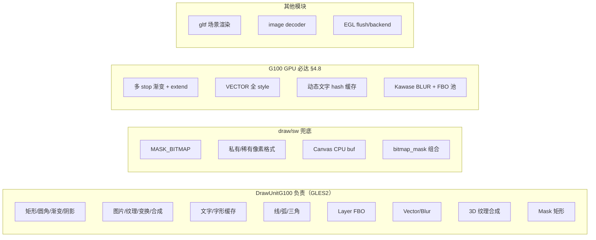

---

## 10. 相关源码索引（实现参考）

| 参考 | 路径 | 借鉴点 |
|------|------|--------|
| **G100 实现（当前）** | `lvgl/src/draw/g100/` | G0 全量 task 分派、layer 事件、FBO/纹理缓存 |
| **G100 GLES2 库（可选 G7）** | `lvgl/src/libs/g100/`（规划） | GLES2 运行时；见 [§2.7.1 路径 B](./drawunit_g100_design.md#271-规划目标g1-终态) |
| NanoVG 库（G0 后端，G1+ 移除） | `lvgl/src/libs/nanovg/` | `nanovg_gl.h` 等；终态 `LV_USE_NANOVG=0` |
| NanoVG unit（对照） | `lvgl/src/draw/nanovg/` | 与 g100 已解耦；仅 `LV_USE_DRAW_NANOVG` 时编译 |
| OpenGLES unit | `lvgl/src/draw/opengles/` | 纹理缓存、3D composite、display texture |
| GLES 驱动 | `lvgl/src/drivers/opengles/` | shader、render、EGL；G100 init 钩子 |
| Wayland EGL | `lvgl/src/drivers/wayland/lv_wayland_backend_egl.c` | G100 flush / render_mode / EGL config |
| 3D Widget（G8 规划） | `lvgl/src/widgets/3dviewport/` 等 | 3D Draw Task 体系；见 [g100_3d_draw_tasks_design.md](./g100_3d_draw_tasks_design.md) |
| Widget 全览 | [lvgl_submodule_code_layout.md §「LVGL 内置 Widget 全览」](./lvgl_submodule_code_layout.md#lvgl-内置-widget-全览) | 42 个一级 widget 大表 |
| 主仓 config | `configs/wayland-g100.defaults` | G0 默认开关 |
| 主仓脚本 | `scripts/build_wayland_g100.sh` | 一键构建 |
| SW 拒绝条件 | `lvgl/src/draw/sw/lv_draw_sw.c` evaluate | image skew/mask/format |
| Task 枚举 | `lvgl/include/lvgl/draw/lv_draw.h` | 全部 task 类型 |

---

## 11. 总结

**DrawUnitG100** = 在 **GLES 2.0** 上尽可能接管 LVGL 全部 **可 GPU 化** 的 draw task（15 类中 **14 类**有 GPU 路径，其中 **1 类整类不做**）。

| 分类 | 数量 |
|------|------|
| **全权 GPU** | FILL, BORDER, BOX_SHADOW, LETTER, LABEL, LINE, ARC, TRIANGLE, MASK_RECTANGLE, LAYER, 3D composite |
| **条件 GPU** | IMAGE（格式限制见 §5.2） |
| **GPU 必达** | **渐变、VECTOR、文字、BLUR**（§4.8，不降级 SW） |
| **明确不做** | **MASK_BITMAP** |
| **非 DrawUnit** | glTF 渲染、`lv_3dview` 视口渲染（`render_cb`）、解码、EGL 送显、Canvas 刷新 |

上线后：**关闭 NanoVG + draw/opengles**，**保留 draw/sw**，形成 **G100 + SW** 双 unit 架构。
