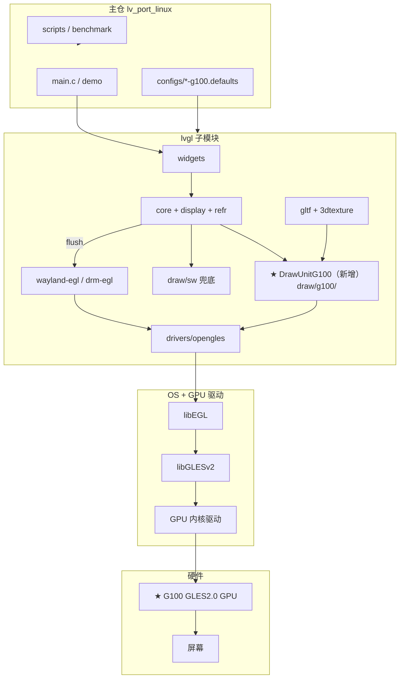
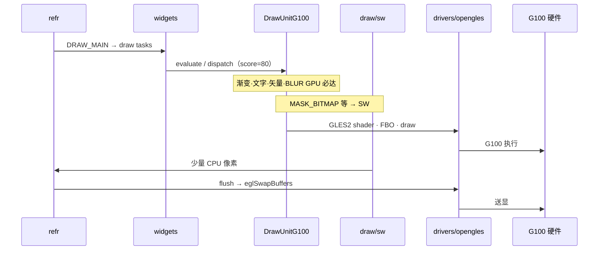
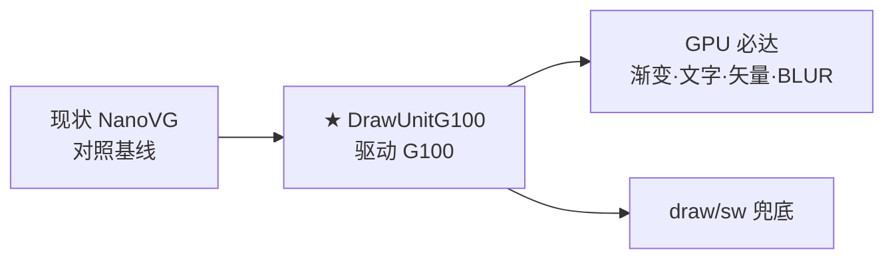
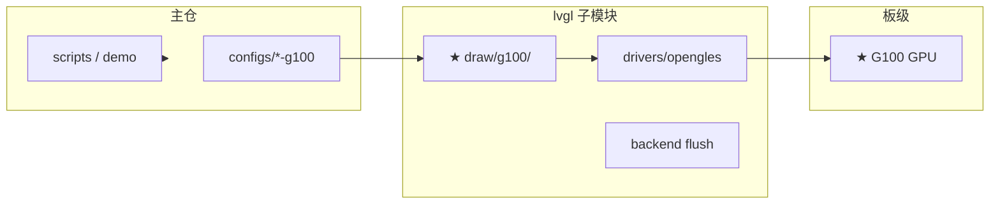
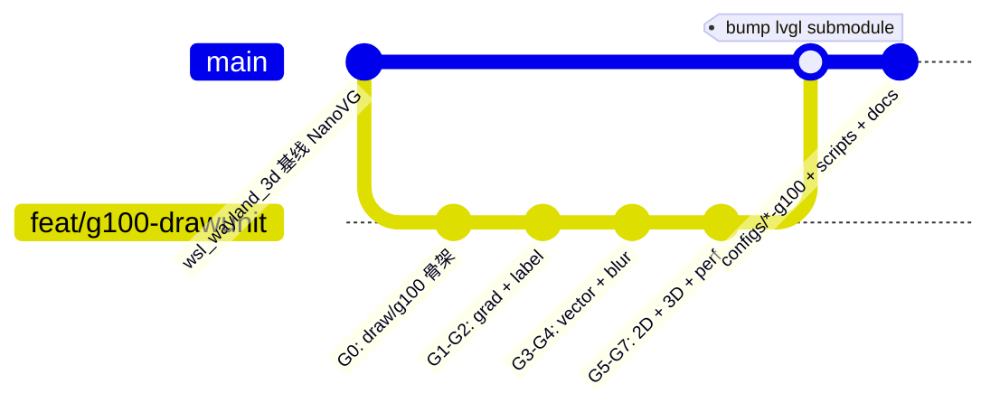
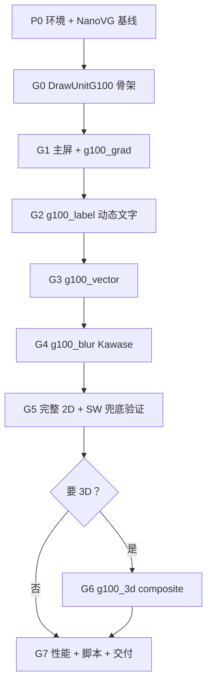

# GLES 2.0 GPU 硬件接入改造计划

> 目标：在 **G100（GLES 2.0 硬件 GPU）** 上，通过 **新增 DrawUnitG100** 让 LVGL **稳定跑在 GPU 主路径**，可展示、可测、可维护。  
> 适用范围：`lv_port_linux` 主仓 + `lvgl` 子模块；参考分支 `wsl_wayland_3d`（现状为 NanoVG，作对照基线）。  
> 关联：[opengles2_gpu_integration_guide.md](./opengles2_gpu_integration_guide.md) · [drawunit_g100_design.md §8 总体计划](./drawunit_g100_design.md#8-实施阶段g100-专项与总体计划) · [g100_3d_draw_tasks_design.md](./g100_3d_draw_tasks_design.md) · [drawunit_g100_test_cases.md](./drawunit_g100_test_cases.md)

---

## 0. 术语

| 名称 | 含义 |
|------|------|
| **G100** | **GLES 2.0 硬件 GPU**（SoC 图形加速器 + 厂商 EGL/GLES 驱动） |
| **DrawUnitG100** | LVGL **新增** Draw Unit：`lvgl/src/draw/g100/` |
| **现状基线** | `wayland-egl.defaults` + NanoVG（WSLg 已验证，非最终目标） |

链路：**应用 → LVGL → DrawUnitG100 → drivers/opengles → libGLESv2 → G100 硬件 → 屏幕**

---

## 1. 目标与约束

### 1.1 目标

| 层级 | 目标 |
|------|------|
| **硬件 G100** | GLES2 GPU 承担 2D UI 主绘制 +（可选）3D 纹理合成 |
| **DrawUnitG100** | 新增 unit 接管 GPU 可画 task；渐变/矢量/文字/BLUR **GPU 必达** |
| **基础设施** | `drivers/opengles` + 平台 EGL backend + flush 与 layer 模型对齐 |
| **主仓** | `configs/*-g100.defaults`、构建脚本、demo、benchmark、文档可复现 |
| **向上** | sysmon FPS、apitrace 验收、[验证用例](./drawunit_g100_test_cases.md) 全过 |

### 1.2 约束（GLES 2.0 + G100）

- 仅 **OpenGL ES 2.0**（无 compute / geometry shader）
- Shader 注意 `mediump`/`highp`（大坐标、高 DPI）
- **DrawUnitG100** 与 NanoVG、draw/opengles **互斥**（`LV_USE_DRAW_G100=1` 时关闭后两者）
- **保留 `LV_USE_DRAW_SW=1`**：MASK_BITMAP、Canvas、稀有像素格式等兜底
- **强制** `LV_USE_VECTOR_GRAPHIC=1`（矢量/渐变/Lottie GPU 必达依赖）

### 1.3 前置信息（实施前必填）

| 项 | 示例 |
|----|------|
| SoC / **G100 GPU** | 目标芯片型号、GLES 驱动版本 |
| 显示接口 | DRM/KMS+GBM、Wayland、厂商 SDK |
| 色彩 | RGB565 / RGBA8888，与 `LV_COLOR_DEPTH` 一致 |
| 分辨率 | 800×480、1920×1080 等 |
| 3D/glTF | 是 / 否 |
| 零拷贝 | dma-buf / EGLImage（可选 P3+） |

---

## 2. 技术架构总览

> 完整架构图（§1.2～§1.7）见 [opengles2_gpu_integration_guide.md](./opengles2_gpu_integration_guide.md#1-g100-硬件与-drawunitg100-整体架构)。

### 2.1 端到端分层



### 2.2 一帧数据流



### 2.3 技术路线

| 路线 | 配置 | 定位 | 本仓库 |
|------|------|------|--------|
| **A NanoVG** | `DRAW_NANOVG=1` | 现状基线 / 对照 | ✅ `wayland-egl.defaults` |
| **B draw/opengles** | `DRAW_OPENGLES=1` | 桌面 GLFW 纹理路径 | `glfw-3d.defaults` |
| **C DrawUnitG100** | `DRAW_G100=1` | **G100 硬件目标** | 规划，见 [design](./drawunit_g100_design.md) |



**推荐路径：** 用路线 A 验证 EGL/送显 → **直接实施路线 C（DrawUnitG100）** 对接 G100，不再在 NanoVG 上堆长期优化。

---

## 3. 子模块 vs 主仓职责

| 改造项 | **lvgl 子模块** | **lv_port_linux 主仓** |
|--------|----------------|----------------------|
| **DrawUnitG100（新增）** | ✅ `draw/g100/*.c`（22 文件，自 nanovg 拆分）、`lv_draw_g100_init()` | `LV_USE_DRAW_G100` in defaults |
| EGL/GLES 基础设施 | ✅ `drivers/opengles/` | 链接 `libEGL` `libGLESv2` |
| 平台 flush | ✅ `*_backend_egl.c`（G100 与 NanoVG 同路径 swap） | 选 Wayland/DRM config |
| 关闭 NanoVG/OGL unit | ✅ `lv_opengles_driver.c` 改 init 钩子 | 关 `DRAW_NANOVG` / `DRAW_OPENGLES` |
| G0 代码解耦 | ✅ `draw/g100/` 独立符号与编译守卫 | `draw/nanovg/` 仅 NANOVG unit |
| GPU 必达模块 | 🔲 `g100_grad/label/vector/blur` 原生实现 | Bootstrap 暂用 NanoVG 库后端 |
| demo / benchmark | ✅ `demos/` | `main.c`、`LVGL_APP_DEMO` |
| 验证 | — | 按 [test_cases](./drawunit_g100_test_cases.md) 执行；**Checkpoint** 见 [design §8.8](./drawunit_g100_design.md#88-checkpoint-步步为营验证与提交) |
| 文档 | API 注释 | `docs/*.md`、`boards/` |



---

## 4. 分阶段实施计划（DrawUnitG100 + G8 3D）

> **总体计划主索引：** [drawunit_g100_design.md §8](./drawunit_g100_design.md#8-实施阶段g100-专项与总体计划)（G0～G8 贯通表、MVP、3D Task 全族）。  
> **3D Draw Task 规格：** [g100_3d_draw_tasks_design.md](./g100_3d_draw_tasks_design.md)。  
> 本节为 **逐步动作**（G0.1、G1.1…）；门禁见 [test_cases §12](./drawunit_g100_test_cases.md#12-阶段门禁实施勾选表)。

### 4.0 阶段一览（Quick Reference）

| 阶段 | 焦点 | 关键产出 |
|:--:|------|----------|
| G0 | Bootstrap | `draw/g100/` ✅ |
| G1～G5 | 2D GPU 必达 | grad/label/vector/blur/完整 2D |
| G6 | 3D BLIT legacy | `3D_BLIT` + gltf 同屏 |
| G7 | 性能/交付 | stress/benchmark；可选 `libs/g100` |
| G8.0～G8.6 | 3D Draw Task 族 | VP→MESH→SCENE→theme |

---

### P0 — 环境与基线（主仓）

| 步骤 | 动作 | 产出 | 验证 ID |
|------|------|------|---------|
| 0.1 | G100 驱动 + `eglInitialize` | 板级环境说明 | — |
| 0.2 | 最小 EGL 三角 / `eglinfo` | GLES2 OK | — |
| 0.3 | NanoVG 基线 FPS（对照） | `benchmark_logs/` | PF-01 参照 |
| 0.4 | 新建 `configs/<soc>-g100.defaults` 草案 | config 文件 | G0-01 |

**门禁：** EGL 裸跑 OK；LVGL SHM/SW demo 可跑。

---

### G0 — DrawUnitG100 骨架（子模块）✅ WSLg 已完成

| 步骤 | 动作 | 关键路径 | 验证 ID | 状态 |
|------|------|----------|---------|------|
| G0.1 | 新增 `draw/g100/`，`LV_USE_DRAW_G100` 宏 | `lv_conf_template.h`、`configs/wayland-g100.defaults` | G0-01 | ✅ |
| G0.2 | `lv_draw_g100_init()`；`lv_opengles_driver.c` 挂钩 | `lv_draw_g100.c`、`lv_opengles_driver.c` | G0-02 | ✅ |
| G0.3 | evaluate/dispatch 全 task 类型（Bootstrap） | `lv_draw_g100.c`，unit_id=11 | G0-03 | ✅ |
| G0.4 | **自 `draw/nanovg/` 复制 22 文件到 `draw/g100/`** 并重命名符号 | 见 [design §2.7](./drawunit_g100_design.md#27-目录结构lvgl-子模块) | G0-07 | ✅ |
| G0.5 | Wayland EGL：`layer_head->user_data`、flush、render_mode | `lv_opengles_texture.c`、`lv_wayland_backend_egl.c` | G0-08 | ✅ |
| G0.6 | stress 跑通（800×480） | `build-g100-stress`、`benchmark_logs/` | PF-01 | ✅ ~175 FPS |

**门禁：** G0-01～03、G0-07～08；`simple_button` / `lv_demo_stress` 可启动；日志含 `DrawUnitG100 ready (bootstrap GLES2 backend, unit_id=11)`。

**待 G1+：** 路径 A — `draw/g100` 内 `lv_g100_shader`、`g100_grad` 等原生 GLES2，`LV_USE_NANOVG=0`；路径 B（可选 G7）— 抽取 `libs/g100/`。

---

### G1 — 主屏 + 渐变（GPU 必达之一）

> **分层：** G1～G6 走 [design §2.7.1 路径 A](./drawunit_g100_design.md#271-规划目标g1-终态)（`draw/g100` + `drivers/opengles`，**不建** `libs/g100`）。`libs/g100` 留待 G7 按需抽取。

| 步骤 | 动作 | 验证 ID |
|------|------|---------|
| G1.1 | `g100_fill` / `border` / `image` + 默认 FB bind | D2-01, D2-03 |
| G1.2 | **`g100_grad`**：多 stop，**不依赖** `LV_USE_VECTOR_GRAPHIC` | GR-03～06, **GR-12** |
| G1.3 | flush 对齐 NanoVG 主屏路径（`eglSwapBuffers`） | AP-01～03 |
| G1.4 | `simple_button` / stress 跑通 | G1 门禁 |

**门禁：** GR-12（关 VECTOR 宏仍 GPU 渐变）；apitrace 无 ReadPixels。

---

### G2 — 文字（GPU 必达之二）

| 步骤 | 动作 | 验证 ID |
|------|------|---------|
| G2.1 | `g100_label` + glyph LRU | TX-01 |
| G2.2 | **`g100_text_hash`**：动态串内容 hash，禁止指针 key | TX-02～04 |
| G2.3 | 每帧 GPU 逐 glyph（非 static 不转 SW） | AP-06 |

**门禁：** TX-02～04；动态 `lv_label_set_text` 无 SW 路径。

---

### G3 — 矢量（GPU 必达之三）

| 步骤 | 动作 | 验证 ID |
|------|------|---------|
| G3.1 | `g100_vector`：SOLID / GRADIENT | VC-01～03 |
| G3.2 | **PATTERN** style GPU 纹理平铺 | VC-04 |
| G3.3 | dash / Lottie / SVG 子集 | VC-06～08 |
| G3.4 | config 强制 `LV_USE_VECTOR_GRAPHIC=1` | — |

**门禁：** VC-01～04；无 `unsupported style` warn。

---

### G4 — BLUR（GPU 必达之四）

| 步骤 | 动作 | 验证 ID |
|------|------|---------|
| G4.1 | `g100_blur` separable pass + **FBO 池** | BL-01, BL-07 |
| G4.2 | **Dual Kawase** + 降采样，打破 256 限制 | BL-03, BL-04 |
| G4.3 | 脏区局部 FBO；`box_shadow` 共用管线 | BL-05, BL-06 |
| G4.4 | FBO 失败：格式降级重试，**不转 SW** | BL-08 |

**门禁：** BL-03～05；`blur_radius>256` 可用。

---

### G5 — 完整 2D + SW 兜底

| 步骤 | 动作 | 验证 ID |
|------|------|---------|
| G5.1 | line / arc / triangle / layer / mask_rect | D2-09～14 |
| G5.2 | grad **REFLECT/REPEAT** extend | GR-08～10 |
| G5.3 | 确认 SW 兜底：MASK_BITMAP、Canvas、稀有格式 | SW-01～02 |
| G5.4 | `lv_demo_render` 全场景 | GR/D2 系列 |

**门禁：** SW-01～02 预期走 SW；其余 2D 走 G100。

---

### G6 — 3D BLIT 合成（legacy 路径）

| 步骤 | 动作 | 验证 ID |
|------|------|---------|
| G6.1 | `g100_3d_blit`（现 `g100_3d.c`）：`lv_opengles_render_texture` | D3-01～02 |
| G6.2 | `lv_demo_gltf` + 2D UI 同屏（**暂** event 内 render） | D3-01 |
| G6.3 | `3D_SYNC` / GL 状态恢复 | D3-05 |

**说明：** 新 3D task 族（VP/MESH/SCENE）在 **G8** 实现，规格见 [g100_3d_draw_tasks_design.md](./g100_3d_draw_tasks_design.md)。

---

### G8 — 3D Draw Task 族 + Widget 栈（设计已认可）

| 步骤 | Draw Task | Widget / 迁移 | 验证 ID |
|------|-----------|---------------|---------|
| G8.0 | `3D_VIEWPORT` + `3D_CLEAR` | `lv_3dviewport` | D3-06, D3-16～17 |
| G8.1 | `3D_LINE` + `3D_CALLBACK` | camera、grid | D3-07～08 |
| G8.2 | `3D_MESH` | `lv_3dmesh` | D3-11, D3-18 |
| G8.3 | `3D_SCENE` | `lv_3dscene`；gltf → SCENE task | D3-12, D3-19 |
| G8.4 | material / light | phong | D3-13 |
| G8.5 | pick + loader | events、OBJ | D3-14 |
| G8.6 | 3D style/theme | `LV_STYLE_3D_*` | D3-15 |

**门禁：** G8.0 通过 D3-16（apitrace VP+resolve）；G8.3 通过 D3-19（gltf 无 event 内 glDraw）。

---

### G7 — 平台送显 + 性能 + 交付

| 步骤 | 动作 | 验证 ID |
|------|------|---------|
| G7.1 | DRM/Wayland 长时间 stress | PF-03 |
| G7.2 | benchmark + stress 脚本 | PF-01～02 |
| G7.3 | 可选 dma-buf / EGLImage | P3 扩展 |
| G7.4 | `scripts/build_<soc>_g100.sh`、文档、子模块 tag | M5 |
| G7.5 | batch / cache 优化 | PF-04～07 |
| G7.6 | **可选** 抽取 `libs/g100/`（路径 B） | 见 [design §2.7.1](./drawunit_g100_design.md#271-规划目标g1-终态) |

**门禁：** PF-01～02；[MVP 35 项 P0](./drawunit_g100_test_cases.md#15-最小发布集p0-共-35-项) 全过。`libs/g100` 非 G7 门禁必需项。

---

## 5. 改造文件清单

### 5.1 lvgl 子模块（DrawUnitG100）

| 优先级 | 路径 | 说明 | G0 |
|--------|------|------|:--:|
| P0 | `src/draw/g100/lv_draw_g100.c` | unit 注册、evaluate、dispatch | ✅ |
| P0 | `src/draw/g100/lv_draw_g100_private.h` | `lv_draw_g100_unit_t`、task 原型 | ✅ |
| P0 | `src/draw/g100/lv_g100_utils.c` | transform、end_frame、clean_up | ✅ |
| P0 | `src/draw/g100/lv_g100_fbo_cache.c` | layer FBO LRU | ✅ |
| P0 | `src/draw/g100/lv_g100_image_cache.c` | 图片纹理 LRU | ✅ |
| P0 | `src/draw/g100/lv_draw_g100_{fill,border,image,label,layer,...}.c` | 全 2D task（Bootstrap） | ✅ |
| P0 | `src/drivers/opengles/lv_opengles_driver.c` | G100 init 钩子 | ✅ |
| P0 | `src/drivers/opengles/lv_opengles_texture.c` | G100 不写 `layer_head->user_data` | ✅ |
| P0 | `src/drivers/wayland/lv_wayland_backend_egl.c` | G100 flush / FULL mode | ✅ |
| P0 | `src/draw/g100/lv_draw_g100_grad.c` | 多 stop + extend（必达） | 🔲 有文件，仍 NVG 后端 |
| P0 | `src/draw/g100/lv_draw_g100_label.c` | 文字 + hash 缓存（必达） | 🔲 |
| P0 | `src/draw/g100/lv_draw_g100_vector.c` | 矢量 + PATTERN（必达） | 🔲 |
| P0 | `src/draw/g100/lv_draw_g100_blur.c` | Kawase blur（必达） | 🔲 |
| P0 | `src/draw/g100/lv_g100_fbo_pool.c` | FBO 池 + 降级 | 🔲 规划 |
| P2 | `src/widgets/3dview/`（可选，G6） | `lv_3dview` 通用 3D 视口；`LV_USE_3DVIEW` | 🔲 见 integration guide §4.3 |
| P2 | `src/libs/g100/`（可选，G7） | GLES2 运行时库；`LV_USE_G100_LIB` | 🔲 见 design §2.7.1 路径 B |
| P1 | `src/lv_init.c` | 可选显式 `lv_draw_g100_init()` | 经 opengles_driver |
| P2 | `lv_conf_template.h` / Kconfig | `LV_USE_DRAW_G100` | ✅ |

### 5.2 lv_port_linux 主仓

| 优先级 | 路径 | 说明 |
|--------|------|------|
| P0 | `configs/<soc>-g100.defaults` | G100 目标配置 |
| P0 | `CMakeLists.txt` | 链接 EGL/GLES |
| P0 | `src/main.c` | demo 路由（stress/benchmark/gltf/render） |
| P1 | `scripts/build_<soc>_g100.sh` | 一键构建 |
| P1 | `scripts/verify_g100.sh`（规划） | 按 test_cases 跑验 |
| P2 | `boards/<soc>/README.md` | 板级说明 |
| P2 | `docs/g100_test_results.md`（规划） | 勾选结果 |
| P2 | `.gitmodules` | 子模块 SHA |

---

## 6. 配置模板（G100 + DrawUnitG100）

`configs/<soc>-g100.defaults`：

```ini
LV_COLOR_DEPTH 16
LV_DEF_REFR_PERIOD 33

# 显示后端（二选一）
LV_USE_WAYLAND 1
# LV_USE_LINUX_DRM 1
# LV_LINUX_DRM_USE_EGL 1

# ★ G100 硬件 + DrawUnitG100（G0 Bootstrap）
LV_USE_OPENGLES         1
LV_USE_DRAW_G100        1
LV_USE_DRAW_NANOVG      0      # 关闭 NanoVG Draw Unit
LV_USE_DRAW_OPENGLES    0
LV_USE_NANOVG           1      # G0：仍链 NanoVG GLES2 库；G1+ 可改为 0
LV_USE_DRAW_SW          1

# GPU 必达依赖
LV_USE_VECTOR_GRAPHIC   1
LV_USE_FLOAT            1
LV_USE_MATRIX           1
LV_USE_THORVG_INTERNAL  1

# 3D 可选
LV_USE_3DTEXTURE        1
LV_USE_GLTF             1
LV_USE_DEMO_GLTF        1

# 性能观测
LV_USE_SYSMON                   1
LV_USE_PERF_MONITOR             1
LV_USE_PERF_MONITOR_LOG_MODE    1
```

构建与运行：

```bash
cmake -B build-g100 -DCONFIG=<soc>-g100 -DLVGL_APP_DEMO=stress
cmake --build build-g100 -j$(nproc)
./build-g100/bin/lvglsim -b wayland -W 800 -H 480 2>run.log
```

---

## 7. 里程碑与验收

| 里程碑 | 内容 | 验收 |
|--------|------|------|
| **M0** | EGL + SW LVGL | 三角 + demo |
| **M1** | DrawUnitG100 骨架 + 主屏 | G0 门禁 |
| **M2** | GPU 必达四维 | GR/TX/VC/BL P0 用例 |
| **M3** | 完整 2D + SW 兜底 | `lv_demo_render` + SW-01/02 |
| **M4** | 3D 合成（可选） | `lv_demo_gltf` |
| **M5** | 性能 + 交付 | PF-01/02 + MVP 35 项 + 文档 |

### apitrace 验收（DrawUnitG100 主路径）

- [ ] 主屏：**无**每帧全屏 `glReadPixels`
- [ ] 主屏：**无**每帧全屏 `glTexImage2D(fb1)`
- [ ] flush：`eglSwapBuffers` 或 `render_display_texture` + swap
- [ ] 渐变：可见 `g100_grad` 对应 `glUseProgram`
- [ ] 动态文字：**无** SW blend 再上传（AP-06）
- [ ] 3D：`lv_gltf_view_render` 后 `lv_opengles_render_texture`

---

## 8. 风险与回退

| 风险 | 缓解 |
|------|------|
| G100 与 NanoVG/OGL 宏冲突 | defaults 模板 + 构建互斥检查 |
| FBO 创建失败 | `g100_fbo_pool` 多级降级（§4.8.5） |
| GL 状态被 3D 破坏 | `lv_opengles_reinit_state` |
| 子模块/主仓漂移 | 锁定 submodule SHA |
| DrawUnitG100 未就绪 | 临时回退 **NanoVG 基线**（`wayland-egl.defaults`） |
| 完全无 GPU | `wayland.defaults` 纯 SHM/SW |

---

## 9. 分支与协作



| 实践 | 说明 |
|------|------|
| 子模块分支 | `feat/g100-drawunit` 或 `wsl_wayland_3d` 跟踪 |
| 提交粒度 | G0～G7 分阶段 commit；文档与 config 在主仓 |
| 推送 | 子模块 `git@github.com-ganzhong:.../lvgl.git` |

---

## 10. 实施顺序总图



**人力参考（G100 + DrawUnitG100 全路径）：**

| 阶段 | 预估 |
|------|------|
| P0 | 2–3 天 |
| G0 | 2–3 天 |
| G1～G2 | 1 周（渐变 + 文字） |
| G3～G4 | 1～2 周（矢量 + blur） |
| G5～G7 | 1 周（2D 收尾 + 性能 + 交付） |
| **合计** | **约 4～6 周** |

---

## 11. 相关文档

| 文档 | 内容 |
|------|------|
| [opengles2_gpu_integration_guide.md](./opengles2_gpu_integration_guide.md) | **整体架构** §1、集成指南、能力清单 |
| [drawunit_g100_design.md](./drawunit_g100_design.md) | DrawUnitG100 规格、GPU 必达、SW 兜底理由 |
| [drawunit_g100_test_cases.md](./drawunit_g100_test_cases.md) | **验证用例**与阶段门禁 |
| [lvgl_submodule_code_layout.md](./lvgl_submodule_code_layout.md) | 子模块目录与调用链 |
| [simple_button_guide.md](./simple_button_guide.md) | Wayland SHM/EGL 对照 |
| [benchmark_stress_2x_10x_wslg.md](./benchmark_stress_2x_10x_wslg.md) | NanoVG 基线 stress 数据 |

---

## 12. 本仓库现状对照

| 项 | 现状 | 目标 |
|----|------|------|
| GPU unit | NanoVG（`wayland-egl.defaults`） | **DrawUnitG100** |
| 硬件 | WSLg 虚拟 GLES2 | **G100 板载 GPU** |
| 渐变无 VECTOR | NanoVG warn 跳过 | **g100_grad GPU 必达** |
| 动态文字 | opengles 内部 SW | **g100_label hash GPU** |
| blur >256 | NanoVG skip | **Kawase GPU** |
| 文档 | 已齐 | 随 G0～G7 更新 test_results |
