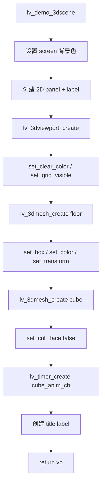
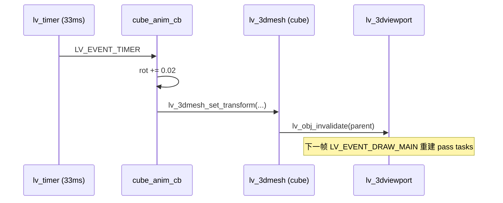
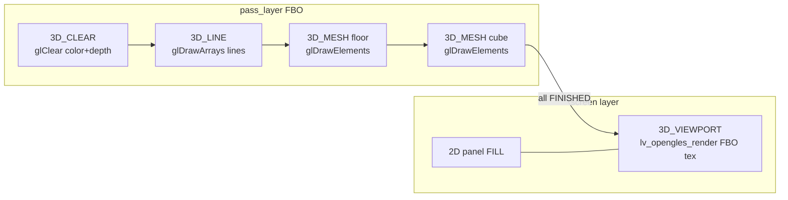
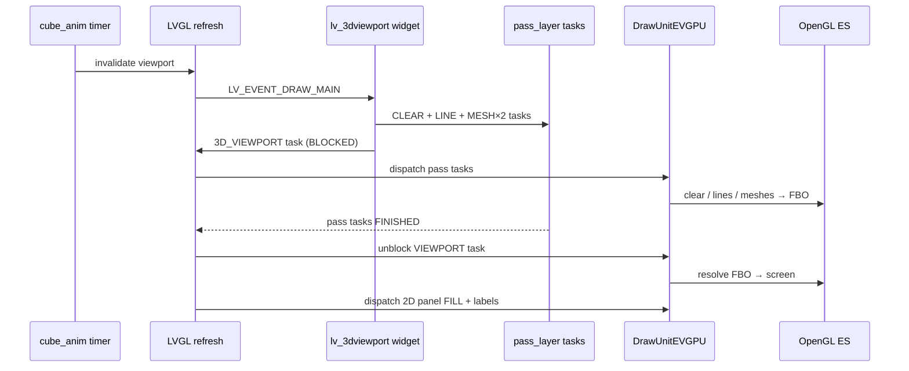

# lv_demo_3dscene 设计说明与代码路径剖析

> **文档状态：** 基于当前实现（G8.2 / CP-10）  
> **源码：** `lvgl/demos/3dscene/lv_demo_3dscene.c`  
> **关联验收：** CP-10、D3-11（MESH task）、D3-16～17（VIEWPORT pass）、D3-18（depth 遮挡）  
> **设计规格：** [evgpu_3d_draw_tasks_design.md](./evgpu_3d_draw_tasks_design.md)

---

## 1. 概述

`lv_demo_3dscene` 是 EVGPU 3D Draw Task 体系在 **G8.2（3D_MESH）** 阶段的集成验证 Demo。它在单个 `lv_3dviewport` 中放置地板与旋转立方体两个 `lv_3dmesh`，并与左上角 2D 面板、顶部标题 label 同屏渲染，用于证明：

1. **`3D_MESH` task** 经 DrawUnitEVGPU 正确光栅化到 FBO；
2. **`3D_VIEWPORT` task** 将 FBO 纹理 resolve 回父 layer，与 2D task 交错合成；
3. **深度缓冲** 在地板 / 立方体 / 网格线之间正确遮挡（D3-18）；
4. **轨道相机** 可通过拖拽旋转视角（D3-08，由 viewport widget 提供）。

本 Demo **不使用** Phong 光照、`lv_3dlight`、OBJ 加载或拾取——这些能力分别由 `lv_demo_3dview` 等后续 Demo 覆盖。

---

## 2. 在 EVGPU 路线图中的定位

| 维度 | 说明 |
|------|------|
| 实施阶段 | **G8.2** — `LV_DRAW_TASK_TYPE_3D_MESH` + `lv_3dmesh` widget |
| 检查点 | **CP-10** — `scripts/verify_evgpu.sh CP-10` |
| 测试用例 | **D3-11**（MESH 绘制）、**D3-18**（depth 遮挡）；间接覆盖 **D3-16/17**（VP pass + 2D/3D 交错） |
| 里程碑 | CP-10 PASS 后进入 G8.3（`3D_SCENE` / glTF） |

与相邻 Demo 的分工：

| Demo | 阶段 | 核心验证 |
|------|------|----------|
| `lv_demo_3dviewport` | G8.1 | `3D_CLEAR` / `3D_LINE` / `3D_CALLBACK` + 网格 |
| **`lv_demo_3dscene`** | **G8.2** | **`3D_MESH` + 多 mesh depth** |
| `lv_demo_gltf` | G8.3 | `3D_SCENE` task，glTF 整场景 batch |
| `lv_demo_3dview` | G8.4～8.6 | Phong、`lv_3dlight`、pick、OBJ、3D theme |

---

## 3. 场景设计说明

### 3.1 视觉构成

```text
┌─────────────────────────────────────────────────────────┐
│  screen (bg #202020)                                    │
│  ┌──────────┐  "G8.2 mesh: floor + cube ..."  (label)  │
│  │ 2D FILL  │                                           │
│  │  panel   │     ┌─────────────────────────┐          │
│  │ #3949AB  │     │   lv_3dviewport 420×280 │          │
│  └──────────┘     │  clear #121212 + grid   │          │
│                   │       ┌───┐             │          │
│                   │       │ ■ │ orange cube │          │
│                   │  ─────┴───┴──── floor   │          │
│                   └─────────────────────────┘          │
└─────────────────────────────────────────────────────────┘
```

### 3.2 3D 场景参数

| 对象 | 类型 | 几何 | 颜色 | 变换 | 备注 |
|------|------|------|------|------|------|
| floor | `lv_3dmesh` | box 5×0.05×5 | `#505050` | Y = -0.025 | 薄板作地面 |
| cube | `lv_3dmesh` | box 0.7×0.7×0.7 | `#F27321` | 位置 (0, 0.35, 0)；Y 轴自转 | `cull_face = false` |
| grid | viewport 内置 | 88 个顶点线段 | `#808080` | Y = -0.01 | `3D_LINE` task |
| camera | viewport 内置 | 轨道相机 | — | yaw=0.6, pitch=0.35, dist=4.5（默认） | 可拖拽 |

### 3.3 动画

- `lv_timer_create(cube_anim_cb, 33, NULL)` — 约 30 FPS
- 每 tick：`rot_y += 0.02`，调用 `lv_3dmesh_set_transform(cube, ..., rot_y, ...)`
- `set_transform` 会 `lv_obj_invalidate(parent)`，触发 viewport 重绘

### 3.4 关键设计决策

**关闭立方体背面剔除（`lv_3dmesh_set_cull_face(cube, false)`）**

源码注释说明：在 Y 轴大角度旋转时，若开启 cull，立方体底面内侧面会被剔除，导致网格线从底部"漏出"。关闭 cull 后，内部面可遮挡网格，视觉更稳定。地板仍使用默认 `cull_face = true`。

**不使用 Phong**

本 Demo 刻意走 **flat color shader**（`mesh_vert` + `mesh_frag`），减少 G8.2 验收变量，光照留待 G8.4。

**2D 面板故意叠加在 viewport 外**

左上角蓝色 `lv_obj` panel 用于验证 **D3-17**：同一帧内 2D FILL 与 3D VIEWPORT resolve 按 task 顺序正确合成。

---

## 4. 对象树

```text
lv_screen_active()
├── lv_obj (panel, 120×60, TOP_LEFT)          ← 2D
│   └── lv_label ("2D FILL")
├── lv_3dviewport (420×280, CENTER)           ← 3D 容器
│   ├── lv_3dmesh (floor)
│   └── lv_3dmesh (cube, s_cube)
└── lv_label (title, TOP_MID)                   ← 2D
```

`lv_3dmesh` 是逻辑子对象（`LV_OBJ_FLAG_IGNORE_LAYOUT`，尺寸 1×1），不参与 2D 布局，仅在 viewport 的 `LV_EVENT_DRAW_MAIN` 中被遍历提交到 3D pass layer。

---

## 5. 编译与运行

### 5.1 Kconfig 依赖

```c
LV_USE_DEMO_3DSCENE   1
LV_USE_3D_DRAW_TASKS  1
LV_USE_3DVIEWPORT     1
LV_USE_3DMESH         1
LV_USE_DRAW_EVGPU      1
LV_USE_OPENGLES       1
```

### 5.2 入口

`src/main.c` 在定义 `LVGL_APP_DEMO_3DSCENE` 时调用：

```c
lv_demo_3dscene();
```

### 5.3 验证脚本

```bash
./scripts/verify_evgpu.sh CP-10
```

Gate 条件：

- 日志含 `EVGPU 3D mesh ready`（MESH shader 初始化）
- 日志含 `DrawUnitEVGPU ready`
- Demo 运行 45s 无 crash

---

## 6. Demo 层代码路径

### 6.1 初始化流程



对应源码（精简）：

```34:75:lvgl/demos/3dscene/lv_demo_3dscene.c
lv_obj_t * lv_demo_3dscene(void)
{
    lv_obj_t * scr = lv_screen_active();
    // ... 2D panel ...

    lv_obj_t * vp = lv_3dviewport_create(scr);
    lv_obj_set_size(vp, 420, 280);
    lv_obj_center(vp);
    lv_3dviewport_set_clear_color(vp, lv_color_hex(0x121212), LV_OPA_COVER);
    lv_3dviewport_set_grid_visible(vp, true);

    lv_obj_t * floor = lv_3dmesh_create(vp);
    lv_3dmesh_set_box(floor, 5.f, 0.05f, 5.f);
    // ...

    s_cube = lv_3dmesh_create(vp);
    lv_3dmesh_set_box(s_cube, 0.7f, 0.7f, 0.7f);
    lv_3dmesh_set_cull_face(s_cube, false);
    // ...

    lv_timer_create(cube_anim_cb, 33, NULL);
    return vp;
}
```

### 6.2 动画更新路径



---

## 7. Widget 层代码路径

### 7.1 lv_3dmesh：几何与提交

**创建立方体几何时**（`lv_3dmesh_set_box`）：

1. 分配 8 顶点 + 36 索引（12 三角形，共享顶点模式）
2. 按 `(sx, sy, sz)` 缩放单位 cube 顶点
3. 数据存于 `lv_3dmesh_t::vertices / indices`

**每帧绘制时**（由 viewport 触发，非 mesh 自身 draw）：

1. `lv_3dviewport` → `draw_3dviewport()` → `lv_3dmesh_submit_tree(vp, pass_layer)`
2. 深度优先遍历 viewport 子树，对每个 `lv_3dmesh` 调用 `lv_3dmesh_submit()`
3. `lv_3dmesh_submit()` 构建 `lv_draw_3d_mesh_dsc_t`：
   - 拷贝 vertices/indices（draw 层再次 malloc 快照）
   - `build_model_matrix()`：T × Ry × Rx × Rz × S
   - `lv_draw_3d_mesh(pass_layer, &dsc)` → 向 **pass 子 layer** 追加 `3D_MESH` task

**变换矩阵构建**（`build_model_matrix`）：

```412:439:lvgl/src/widgets/3dmesh/lv_3dmesh.c
void build_model_matrix(const lv_3dmesh_t * mesh, float out[LV_3D_MESH_MODEL_SIZE])
{
    // mat4_translate → mat4_rotate_y/x/z → mat4_scale
    // out = T * R * S
}
```

### 7.2 lv_3dviewport：Draw 事件主路径

viewport 的核心逻辑在 `draw_3dviewport()`（`LV_EVENT_DRAW_MAIN`）：

```225:282:lvgl/src/widgets/3dviewport/lv_3dviewport.c
static void draw_3dviewport(lv_event_t * e)
{
    // 1. 创建/更新 pass_layer（FBO 离屏层）
    // 2. lv_draw_3d_pass_set_camera()
    // 3. lv_draw_3d_clear()           → 3D_CLEAR task
    // 4. submit_grid_lines()          → 3D_LINE task（88 顶点）
    // 5. lv_3dmesh_submit_tree()      → 3D_MESH task × N
    // 6. [可选] lv_draw_3d_callback() → 3D_CALLBACK task
    // 7. lv_draw_3d_viewport()        → 3D_VIEWPORT task（BLOCKED）
    // 8. lv_draw_3d_viewport_end()    → pass_layer->all_tasks_added = true
}
```

**pass_layer 生命周期：**

- 首次 draw：`lv_draw_3d_pass_layer_create()` → 子 `lv_layer_t` + `lv_3d_pass_layer_ud_t`（含 camera、view_proj、FBO）
- 后续帧：更新 `buf_area` / clip，重置 `all_tasks_added = false`，重新填充子 task 列表
- 销毁：`lv_3dviewport_destructor` → `lv_draw_3d_pass_layer_destroy()` 释放 FBO

**轨道相机交互**（`on_pointer_event`）：

- `PRESSING`：修改 `camera.yaw / pitch`，`lv_obj_invalidate`
- 本 Demo 未注册 mesh 点击回调；短按释放时 viewport 会尝试 pick（`lv_3dviewport_pick_at`），但 3dscene 未依赖此行为

---

## 8. Draw Task 管线剖析（核心）

### 8.1 单帧 Task 队列结构

Demo 一帧刷新时，**屏幕 layer** 与 **pass 子 layer** 上的 task 关系如下：

```text
screen layer (父)
├── [2D] FILL          panel 背景
├── [2D] LABEL         panel 文字
├── [3D] VIEWPORT      ← BLOCKED，等待 pass_layer 子 task 全部 FINISHED
├── [2D] LABEL         title 文字
│
pass_layer (viewport 子 layer, 420×280)
├── [3D] CLEAR         清 color #121212 + depth
├── [3D] LINE          网格 44 线段（88 点）
├── [3D] MESH          floor
└── [3D] MESH          cube
```

Task 提交顺序即 GPU 执行顺序（同一 pass 内）：**先清屏 → 网格 → 地板 → 立方体**。立方体后画，且 Y 更高、更靠近相机，depth test 下正确遮挡网格与地板（D3-18）。

### 8.2 BLOCKED / 解除阻塞机制

`lv_draw_3d_viewport()` 创建 task 时立即设为 `LV_DRAW_TASK_STATE_BLOCKED`：

```66:80:lvgl/src/draw/lv_draw_3d_viewport.c
void lv_draw_3d_viewport(lv_layer_t * layer, const lv_draw_3d_viewport_dsc_t * dsc, ...)
{
    lv_draw_task_t * t = lv_draw_add_task(layer, coords, LV_DRAW_TASK_TYPE_3D_VIEWPORT);
    lv_memcpy(t->draw_dsc, dsc, sizeof(*dsc));
    t->state = LV_DRAW_TASK_STATE_BLOCKED;
    lv_draw_finalize_task_creation(layer, t);
}
```

当 pass_layer 上所有子 task 完成后（`draw_task_head == NULL` 且 `all_tasks_added == true`），`lv_draw_dispatch()` 扫描父 layer，找到引用该 pass_layer 的 VIEWPORT task，将其置为 `WAITING` 并重新 dispatch：

```277:296:lvgl/src/draw/lv_draw.c
if(layer->parent && layer->all_tasks_added && layer->draw_task_head == NULL) {
    // ...
    else if(t_src->type == LV_DRAW_TASK_TYPE_3D_VIEWPORT && t_src->state == BLOCKED) {
        if(vp_dsc->pass_layer == layer) {
            t_src->state = LV_DRAW_TASK_STATE_WAITING;
            lv_draw_dispatch_request();
        }
    }
}
```

这与 2D `LAYER` task 的 blocked 语义一致（见 `evgpu_3d_draw_tasks_design.md` §4）。

### 8.3 DrawUnitEVGPU 分发

EVGPU unit 的 `draw_evaluate()` 接受全部 3D task 类型；`draw_execute()` 按 type 路由：

| Task 类型 | EVGPU 处理器 | 本 Demo 是否使用 |
|-----------|-------------|------------------|
| `3D_CLEAR` | `lv_draw_evgpu_3d_clear` | ✓ |
| `3D_LINE` | `lv_draw_evgpu_3d_line` | ✓（网格） |
| `3D_MESH` | `lv_draw_evgpu_3d_mesh` | ✓（×2） |
| `3D_VIEWPORT` | `lv_draw_evgpu_3d_viewport` | ✓（resolve） |

---

## 9. EVGPU GPU 执行路径

### 9.1 FBO 分配（pass 级）

`lv_evgpu_3d_pass_ensure()` 在首次 CLEAR 或 MESH 执行时创建：

- **color_tex**：RGBA8888，viewport 尺寸（420×280）
- **depth_tex**：depth component（`LV_GL_PREFERRED_DEPTH`）
- **framebuffer**：color + depth 附件

### 9.2 子 Task GPU 操作



**3D_CLEAR**（`lv_draw_evgpu_3d_clear`）：

- bind FBO → `glClearColor` + `glClear(DEPTH|COLOR)`

**3D_LINE**（`lv_draw_evgpu_3d_line`）：

- bind FBO → 上传 grid 顶点 → MVP = view_proj × identity → `glDrawArrays(GL_LINES, ...)`
- `depth_test = true`

**3D_MESH**（`lv_draw_evgpu_3d_mesh`）：

- bind FBO → 上传 VBO/IBO（`GL_STREAM_DRAW`，每 task 快照）
- MVP = view_proj × model_matrix
- flat shader：`gl_FragColor = u_color`（本 Demo 无 Phong 分支）
- depth_test / cull_face 按 dsc.flags
- `glDrawElements(GL_TRIANGLES, ...)`

**3D_VIEWPORT resolve**（`lv_draw_evgpu_3d_viewport`）：

- `lv_evgpu_end_frame()` — 结束 NanoVG 2D 帧
- `lv_opengles_reinit_state()` — 恢复 GL 状态（D3-05）
- `lv_opengles_render()` — 将 `pass->fbo.color_tex` 合成到 screen layer 对应区域
- `v_flip = true` — 匹配 FBO 与 LVGL 坐标系

### 9.3 相机矩阵

默认轨道参数（`lv_3d_camera_init`）：

| 参数 | 默认值 |
|------|--------|
| yaw | 0.6 rad |
| pitch | 0.35 rad |
| distance | 4.5 |
| target | (0, 0, 0) |
| fov_y | 45° |
| near / far | 0.1 / 100 |

每帧 `lv_draw_3d_pass_set_camera()` → `lv_3d_camera_compute_mvp()` → 存入 `pass_layer->user_data->view_proj`，供 LINE/MESH task 使用。

---

## 10. 端到端帧时序



---

## 11. 内存与数据拷贝

| 阶段 | 行为 |
|------|------|
| `set_box` | mesh widget 堆上持有 vertices/indices（持久） |
| `lv_draw_3d_mesh` | **再次 malloc** 拷贝顶点和索引到 task dsc（帧快照，task 完成后释放） |
| pass_layer | viewport 实例级缓存，跨帧复用 FBO（尺寸变化时 rebuild） |
| timer 动画 | 仅更新 transform 浮点数组，不重建几何 |

这意味着每帧 2 个 MESH task 各有独立顶点缓冲快照，代价可接受（8 顶点 × 2）。

---

## 12. 与其他 Demo 对比

| 特性 | 3dviewport | **3dscene** | 3dview | gltf |
|------|------------|-------------|--------|------|
| 3D_VIEWPORT | ✓ | ✓ | ✓ | 独立路径 |
| 3D_MESH | — | **✓** | ✓ | — |
| 3D_LINE 网格 | ✓ | ✓ | ✓ | — |
| 3D_CALLBACK | ✓ | — | — | — |
| Phong / light | — | — | ✓ | ✓ |
| OBJ / pick | — | — | ✓ | — |
| 3D_SCENE | — | — | — | ✓ |
| 2D 叠加 panel | ✓ | ✓ | ✓ | ✓ |

---

## 13. 验收标准摘要

| 用例 | 通过标准（3dscene 视角） |
|------|--------------------------|
| D3-11 | floor + cube 两个 MESH 在 VP 内可见；flat 着色正确 |
| D3-16 | apitrace：FBO bind → 子 task → resolve composite |
| D3-17 | 2D panel 与 3D viewport 同帧无覆盖异常 |
| D3-18 | 旋转 cube 时，近处 mesh 遮挡远处 grid/floor；cull 关闭时底部不"漏网格" |
| D3-08 | 拖拽 viewport 可 orbit；yaw/pitch 变化反映到 MVP |

---

## 14. 相关文件索引

| 层级 | 文件 |
|------|------|
| Demo | `lvgl/demos/3dscene/lv_demo_3dscene.c`, `.h` |
| 入口 | `src/main.c`（`LVGL_APP_DEMO_3DSCENE`） |
| Widget | `lvgl/src/widgets/3dviewport/lv_3dviewport.c` |
| Widget | `lvgl/src/widgets/3dmesh/lv_3dmesh.c` |
| Draw API | `lvgl/src/draw/lv_draw_3d_viewport.c`, `lv_draw_3d_mesh.c`, `lv_draw_3d_clear.c`, `lv_draw_3d_line.c` |
| Camera | `lvgl/src/draw/lv_draw_3d_camera.c` |
| EVGPU 后端 | `lvgl/src/draw/evgpu/lv_draw_evgpu_3d_*.c`, `lv_evgpu_3d_pass.c` |
| 调度 | `lvgl/src/draw/lv_draw.c`（BLOCKED 解除） |
| 验证 | `scripts/verify_evgpu.sh` CP-10 |
| 设计 | `docs/evgpu_3d_draw_tasks_design.md`, `docs/drawunit_evgpu_design.md` §8 |

---

## 15. 扩展建议（非本 Demo 范围）

若从 3dscene 演进到更复杂场景，典型路径为：

1. **加 Phong + light** → 参考 `lv_demo_3dview`（G8.4）
2. **加 pick 交互** → `lv_obj_add_event_cb(mesh, ..., LV_EVENT_CLICKED)`
3. **加载外部模型** → `lv_3dmesh_load_obj()` + `lv_3dcaps_has(OBJ_LOADER)`
4. **整场景 glTF** → 迁移到 `lv_gltf` + `3D_SCENE` task（G8.3）

3dscene 刻意保持最小集，作为 **MESH + VIEWPORT + depth** 的回归基准。
