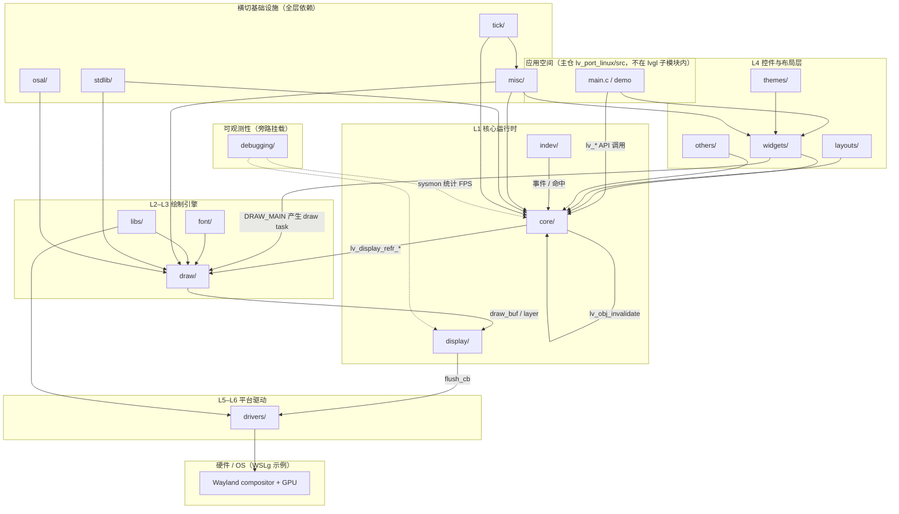
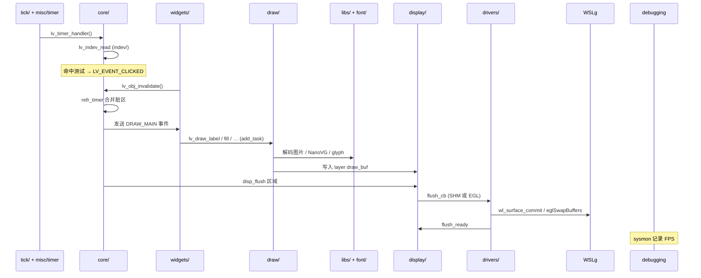
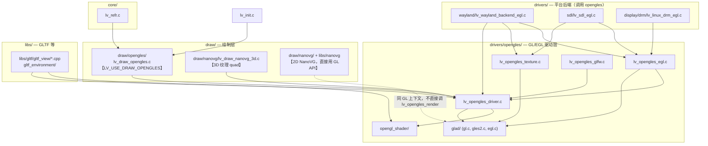
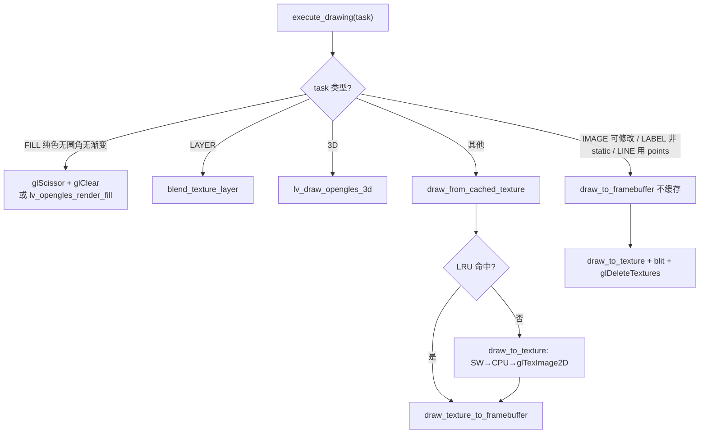
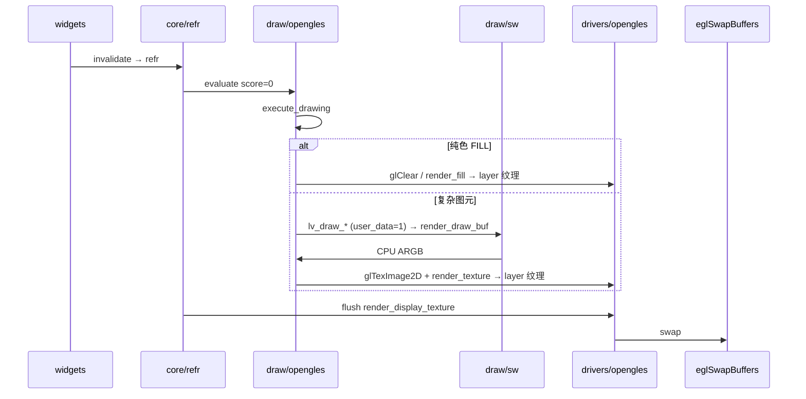
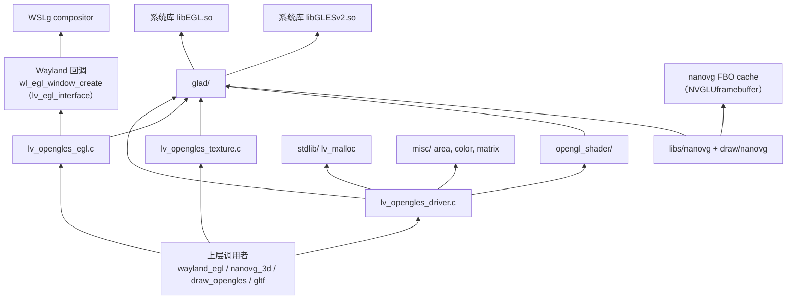
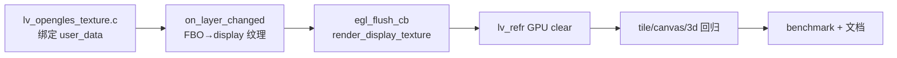
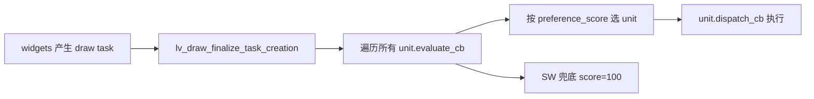

# lvgl 子模块代码目录说明

> 基于当前 `wsl_wayland_3d` 分支上的 `lvgl` 子模块结构整理。  
> 主仓路径：`lv_port_linux/lvgl/`（git submodule）

## 结论（先说）

**不完全是。** `lvgl/src` 是 LVGL **库实现**的主目录，但子仓里“有效、会被构建或对外使用的代码/头文件”还分布在其它目录。

若指：

- **库核心逻辑** → 主要在 `lvgl/src/`
- **完整可构建产物** → `src/` + `include/lvgl/` +（可选）`demos/`、`examples/` + 构建脚本 `env_support/`、`scripts/`

应用层代码（如 `main.c`、`simple_button.c`、Wayland 封装）在**主仓** `lv_port_linux/src/`，不在子仓内。

---

## 顶层目录一览

```
lvgl/
├── src/           # 库实现（.c / .cpp）— 核心
├── include/lvgl/  # 公共 API 头文件（新结构）
├── demos/         # 官方 demo（stress、widgets 等）
├── examples/      # 官方示例
├── env_support/   # CMake / 各平台移植
├── scripts/       # lv_conf 生成、预处理等
├── tests/         # 单元测试
├── docs/          # LVGL 文档源
├── configs/       # Kconfig / defconfig
└── lv_conf_template.h 等配置模板
```

---

## CMake 构建时编译哪些目录

来源：`lvgl/env_support/cmake/main.cmake`

| 目录 | 内容 | 是否进入 `lvglsim` 链接 |
|------|------|-------------------------|
| **`src/`** | 库实现：core、draw、drivers、widgets、indev、libs（NanoVG、ThorVG 等） | ✅ 始终 → `liblvgl` |
| **`include/lvgl/`** | 对外头文件 | ✅ include 路径（无 `.c`） |
| **`demos/`** | `lv_demo_stress`、`lv_demo_widgets` 等 | ✅ 可选（`LV_BUILD_DEMOS=1`） |
| **`examples/`** | 控件/特性示例 | ✅ 可选（`LV_BUILD_EXAMPLES=1`） |
| **`env_support/`** | CMake 模块、ESP/QNX 等移植 | 构建系统，非 UI 运行时逻辑 |
| **`scripts/`** | Python：生成 `lv_conf.h`、预处理等 | 配置阶段使用 |
| **`tests/`** | 自动化测试 | 仅 `cmake --build` 测试目标时 |

核心规则（摘录）：

```cmake
file(GLOB_RECURSE SOURCES ${LVGL_ROOT_DIR}/src/*.c ...)
file(GLOB_RECURSE EXAMPLE_SOURCES ${LVGL_ROOT_DIR}/examples/*.c)
file(GLOB_RECURSE DEMO_SOURCES ${LVGL_ROOT_DIR}/demos/*.c)
add_library(lvgl ${SOURCES})
```

ThorVG 等 C++ 源码在 `src/libs/thorvg/`，单独编成 `liblvgl_thorvg` 再链接。

---

## `src/` 与 `include/lvgl/` 的关系

当前为**双轨**结构（迁移中）：

| 位置 | 角色 |
|------|------|
| **`src/`** | 函数/模块**实现**（`.c`），以及部分旧头文件（含 deprecated 提示，指向 `include/lvgl/...`） |
| **`include/lvgl/`** | 推荐使用的**公共 API** 头文件 |

示例：

- Wayland 驱动：`src/drivers/wayland/` + 对外声明在 `include/lvgl/drivers/...`
- 绘制：`src/draw/` + `include/lvgl/draw/lv_draw.h`
- 3D 纹理 widget：`src/widgets/3dtexture/` + `include/lvgl/widgets/lv_3dtexture.h`

阅读 API 优先看 **`include/lvgl/`**；追实现进 **`src/`** 对应子目录。

---

## `src/` 下 16 个子目录详解

`lvgl/src/` 根目录除下列 **16 个文件夹** 外，还有若干**根级文件**（不属于子目录，但同属 `src` 实现层）：

| 根级文件 | 作用 |
|----------|------|
| `lv_init.c` / `lv_init.h` | 库初始化入口 `lv_init()`，注册子系统 |
| `lvgl.h` / `lvgl_private.h` / `lvgl_public.h` | 聚合头文件、内部/对外 include 边界 |
| `lv_conf_internal.h` | 由 `lv_conf.h` 展开的配置宏（编译期开关） |
| `lv_api_map_v8.h` … `v9_5.h` | 旧版 API 名到新版的兼容映射 |

---

### 16 个文件夹总表

| # | 目录 | 层级角色 | 主要职责 | 典型内容 / 关键路径 | 与本仓库关系 |
|---|------|----------|----------|---------------------|--------------|
| 1 | **`core/`** | L1 核心 | 对象树、事件、样式、刷新调度 | `lv_obj*.c` 对象模型；`lv_refr.c` 脏区合并与刷新定时器；`lv_group.c` 焦点组 | 所有 widget 与 demo 的基础；点击 → invalidate → refr 均经此层 |
| 2 | **`display/`** | L1 显示抽象 | 屏幕/图层生命周期、分辨率、flush 回调 | `lv_display.c`：`lv_display_create()`、buffer 模式、layer 链表 | 连接 `drivers/wayland` 与上层 draw；`lvglsim -W -H` 改的就是 display 分辨率 |
| 3 | **`indev/`** | L1 输入 | 指针、键盘、encoder、手势 | `lv_indev.c` 轮询与命中测试；`lv_gridnav.c` 网格导航 | Wayland 后端创建的 pointer/keyboard 最终进 `lv_indev_read` |
| 4 | **`draw/`** | L2–L3 绘制 | Draw task 管线、各 draw unit、图像解码 | `lv_draw.c` 任务调度；`sw/` CPU 绘制；`nanovg/`、`g100/`、`opengles/`；`lv_draw_3d.c` | **wayland-egl** 走 `draw/nanovg`；**wayland-g100** 走 `draw/g100`；**wayland-shm** 走 `draw/sw` |
| 5 | **`drivers/`** | L5–L6 平台 | 对接 OS/硬件：显示、输入、GPU | `wayland/` SHM/EGL 窗口；`opengles/` EGL 上下文与纹理；`evdev/` 输入 | 本仓库 WSLg 核心：`drivers/wayland` + `drivers/opengles` |
| 6 | **`widgets/`** | L4 控件 | 内置 UI 组件实现 | `button/`、`label/`、`3dtexture/` 等；每控件 `*_class` + 事件 | `simple_button` 用的 button/label 即在此；**全量清单见本文 §「LVGL 内置 Widget 全览」** |
| 7 | **`layouts/`** | L4 布局 | Flex / Grid 等布局算法 | `flex/`、`grid/`、`lv_layout.c` | 容器内子对象排列；stress demo 里 list/flex 场景会用到 |
| 8 | **`font/`** | L3 资源 | 字体加载与内置字库 | 大量 `lv_font_montserrat_*.c`；`fmt_txt/` 文本格式；`freetype/` 接口 | Label 绘制时的 glyph 来源 |
| 9 | **`themes/`** | L4 外观 | 默认/ mono / simple 主题 | `default/` 等：统一样式、颜色、padding | 未自定义 style 时控件默认外观 |
| 10 | **`misc/`** | 横切工具 | 动画、区域、颜色、链表、矩阵、缓存等 | `lv_anim.c`、`lv_area.c`、`lv_color.c`、`lv_timer.c`、`cache/` | 全库共用基础设施 |
| 11 | **`stdlib/`** | 横切内存 | 内存、字符串、sprintf 抽象 | `lv_mem.c`；`clib/` / `builtin/` 等后端 | `LV_USE_STDLIB_*` 配置决定 malloc 实现 |
| 12 | **`osal/`** | 横切 OS | 线程、互斥、延迟（多 RTOS/OS） | `lv_linux.c`、`lv_freertos.c`、`lv_pthread` 等 | Linux/WSL 构建通常走 `lv_linux` / pthread |
| 13 | **`tick/`** | 横切时间 | 毫秒 tick，`lv_tick_get()` | `lv_tick.c` | `lv_timer_handler()` 与动画时间基准 |
| 14 | **`libs/`** | L3 内嵌库 | 第三方与编解码器源码 | `nanovg/`、`thorvg/`、`gltf/`、`g100/`（可选 G7）等 | G0：`libs/nanovg`；G1+ 目标移除 nanovg；可选 `libs/g100` 承接 GLES2 运行时 |
| 15 | **`debugging/`** | 调试/测试 | 运行时诊断与测试辅助 | `sysmon/` FPS/CPU 监控（stress 日志里的 `sysmon:`）；`monkey/` 随机测试 | stress 对比脚本解析的 FPS 即 **sysmon** 输出 |
| 16 | **`others/`** | 扩展功能 | 非核心但可选的「其他」模块 | `file_explorer/`、`fragment/`、`translation/` | 一般 demo 默认不依赖；按 `lv_conf` 开关 |

---

### 按数据流串联（便于记忆）

```
indev/ ──事件──► core/ ──invalidate──► draw/ ──像素──► display/ ──flush──► drivers/
                ▲                           ▲
         widgets/ + layouts/          libs/ + font/
                ▲
           themes/ + misc/ + tick/ + stdlib/ + osal/
```

- **输入**：`drivers/` 采集 → `indev/` 分发 → `core/` 命中与事件
- **输出**：`widgets/` 改状态 → `core/` refr → `draw/` 生成 task → `display/` flush → `drivers/` 送 Wayland/WSLg
- **debugging/sysmon** 挂在刷新链路上报 FPS（stress 测试数据来源）

---

### 各目录子模块速查（二级）

| 目录 | 重要子目录 / 文件 |
|------|-------------------|
| `core/` | `lv_obj*.c`、`lv_refr.c`、`lv_event.c`、`lv_group.c` |
| `draw/` | `sw/`（CPU）、`nanovg/`、`g100/`、`opengles/`、`lv_draw_rect/label/image*.c`、`lv_image_decoder.c` |
| `drivers/` | `wayland/`、`opengles/`、`evdev/`、`sdl/`、`drm/`、`x11/` |
| `widgets/` | 每控件一目录：`button/`、`label/`、`3dtexture/`、`chart/` … |
| `libs/` | `nanovg/`（G0）、`g100/`（可选 G7）、`thorvg/`、`gltf/`、`freetype/`、`lodepng/`、`libwebp/` |
| `debugging/` | `sysmon/`（性能监控）、`test/`（内部测试桩） |
| `font/` | 内嵌 Montserrat 等 `.c` 字库 + `fmt_txt/` |
| `layouts/` | `flex/`、`grid/` |
| `themes/` | `default/`、`mono/`、`simple/` |

---

## `src/` 内主要子目录（库本体）— 简表

| 子目录 | 说明 |
|--------|------|
| `core/` | 对象模型、事件、刷新 `lv_refr` |
| `draw/` | 2D/3D 绘制任务、NanoVG/OpenGLES/SW 等 draw unit |
| `display/` | `lv_display_t` 显示抽象 |
| `indev/` | 输入设备 |
| `drivers/` | Wayland、DRM、SDL、OpenGLES 等平台驱动 |
| `widgets/` | 内置控件实现 |
| `libs/` | 内嵌第三方：NanoVG、ThorVG、GLTF 等 |
| `font/`、`layouts/`、`misc/`、`osal/` | 字体、布局、工具、OS 抽象 |
| `lv_init.c` | 库初始化入口 |

---

## LVGL 软件技术架构图 + 16 个子目录映射

以下在经典 **「应用 → 核心 → 绘制 → 显示 → 驱动 → 硬件」** 分层上，标注 `lvgl/src/` 下 16 个文件夹各自所在位置与相互关系（与 `hgz.md` / 官方文档中的 L1–L6 分层一致）。

### 总架构图（分层 + 16 目录）



### 同一架构的 ASCII 简图

```
┌─────────────────────────────────────────────────────────────┐
│  Application（主仓 main.c / demos/）                         │
└───────────────────────────┬─────────────────────────────────┘
                            │ API
┌───────────────────────────▼─────────────────────────────────┐
│  L4  widgets/  layouts/  themes/  others/                   │
└───────────────────────────┬─────────────────────────────────┘
                            │ 对象树 / 事件 / invalidate
┌───────────────────────────▼─────────────────────────────────┐
│  L1  core/  ←── indev/ ←── drivers/(evdev, wayland indev)   │
│       │                                                      │
│       └──► draw/ ◄── font/  libs/(nanovg, thorvg, png…)     │
│              │                                               │
│              └──► display/ ──flush──► drivers/(wayland, egl)  │
└───────────────────────────┬─────────────────────────────────┘
                            ▼
                     WSLg / LCD / GPU

  横切：misc/  stdlib/  osal/  tick/  ──► 贯穿以上各层
  旁路：debugging/(sysmon) ──► 观测 refr / flush 性能
```

---

### 16 个文件夹在架构中的「层级归属」

| 层级 | 架构角色 | 包含的 src 子目录 | 在系统中的位置 |
|------|----------|-------------------|----------------|
| **L4 应用 UI** | 控件、布局、主题 | `widgets/` `layouts/` `themes/` `others/` | 开发者直接创建的 button、label、flex 容器；**不**直接碰硬件 |
| **L1 核心** | 对象模型、刷新、输入抽象 | `core/` `indev/` `display/` | 承上启下：`core` 调度刷新；`display` 管 buffer 与 flush；`indev` 管输入语义 |
| **L2–L3 绘制** | Draw task、渲染后端、资源 | `draw/` `font/` `libs/` | 把「画什么」变成像素；`libs` 为 draw/drivers 提供 NanoVG、解码器等 |
| **L5–L6 驱动** | OS/GPU/输入 HAL | `drivers/` | Wayland SHM/EGL、OpenGLES 纹理、evdev；**唯一**与 WSLg 对话的层 |
| **横切** | 时间、内存、OS、工具 | `misc/` `stdlib/` `osal/` `tick/` | 被几乎所有模块 include；无独立业务 UI |
| **旁路** | 调试与测试 | `debugging/` | 挂接在 refr/flush 链路上报指标，不改变主数据流 |

根级 `lv_init.c` 在**最顶层**调用顺序上先于各层：初始化 `stdlib` → `tick` → `draw` → `display` → `indev` → `widgets` 等子系统。

---

### 文件夹之间的依赖关系（谁依赖谁）

#### 1. 纵向主链路（一帧 UI 更新）

```
tick/ + misc/(timer)
    → core/(lv_timer_handler → lv_refr)
        → widgets/ + layouts/（DRAW_MAIN 回调里 lv_draw_*）
            → draw/（add_task → dispatch → sw|nanovg|opengles）
                → font/ + libs/（glyph、图片、矢量）
            → display/（layer、draw_buf）
                → drivers/（flush → Wayland commit / eglSwapBuffers）
```

- **单向为主**：数据与像素从 `widgets` 向下流到 `drivers`，flush 完成后 `display` 回调 `core` 进入下一帧。
- **`indev/`** 与主链路**并行向上**：`drivers` 读输入 → `indev` → `core` 事件 → `widgets` 回调 → 再次 `invalidate`，进入下一轮 refr。

#### 2. 横向协作（同层或相邻层）

| 关系 | 目录 A | 目录 B | 说明 |
|------|--------|--------|------|
| 组合 | `widgets/` | `layouts/` | 容器用 flex/grid 排列子 widget |
| 样式 | `themes/` | `widgets/` | 主题给控件提供默认 `lv_style` |
| 文本 | `widgets/label` | `font/` | Label 通过 draw 层拉取 font glyph |
| 图像 | `widgets/image` | `libs/` + `draw/` | 解码（png/jpeg 在 libs）→ draw task |
| GPU 路径 | `draw/nanovg` | `libs/nanovg` | NanoVG 库源码在 libs，执行在 draw |
| EGL 路径 | `draw/nanovg` | `drivers/opengles` | NanoVG 帧结束后 OpenGLES flush |
| Wayland | `drivers/wayland` | `display/` | 注册 `flush_cb`，创建 indev |
| 扩展 | `others/` | `core/` | fragment 等复用对象树与事件机制 |

#### 3. 横切依赖（被多处引用）

| 目录 | 典型被谁使用 | 提供什么 |
|------|--------------|----------|
| `misc/` | core、draw、widgets | `lv_area`、`lv_color`、`lv_anim`、`lv_timer`、`lv_ll`、matrix |
| `stdlib/` | 全库 | `lv_malloc` / `lv_free` / `lv_snprintf` |
| `tick/` | misc(timer)、core(refr) | `lv_tick_get()` 毫秒时间 |
| `osal/` | draw（多线程 unit）、libs | mutex、thread sleep（Linux 上 `lv_linux`） |

#### 4. 旁路关系

| 目录 | 挂载点 | 作用 |
|------|--------|------|
| `debugging/sysmon` | `core/lv_refr`、display 刷新周期 | 输出 `sysmon: XX FPS`（stress 测试数据来源） |
| `debugging/monkey` | indev | 随机注入输入做压测 |
| `debugging/test` | 内部 | 单元测试桩，正常 lvglsim 不启用 |

---

### 一帧内的时序（结合本仓库 Wayland）



| 后端 | draw 路径 | drivers 路径 |
|------|-----------|--------------|
| **wayland-shm** | `draw/sw/` CPU 像素 | `drivers/wayland` SHM flush |
| **wayland-egl** | `draw/nanovg/` + `libs/nanovg` | `drivers/wayland` + `drivers/opengles` |
| **wayland-g100** | `draw/g100/` + `libs/nanovg`（G0） | 同上；`configs/wayland-g100.defaults` |

---

### 16 目录两两关系矩阵（简化）

行 = 依赖方，列 = 被依赖方（● = 直接依赖，○ = 间接/可选）

|  | core | display | indev | draw | drivers | widgets | layouts | font | libs | themes | misc | stdlib | osal | tick | debugging | others |
|--|:---:|:-------:|:-----:|:----:|:-------:|:-------:|:-------:|:----:|:----:|:------:|:----:|:------:|:----:|:----:|:---------:|:------:|
| **widgets** | ● | ○ | ○ | ● | ○ | | ● | ○ | ○ | ○ | ● | ● | ○ | ○ | ○ | ○ |
| **core** | | ● | ● | ● | ○ | ○ | ○ | ○ | ○ | ○ | ● | ● | ○ | ● | ○ | ○ |
| **draw** | ○ | ● | | | ○ | ○ | ○ | ● | ● | ○ | ● | ● | ○ | ○ | ○ | ○ |
| **display** | ● | | | ○ | ● | ○ | ○ | ○ | ○ | ○ | ● | ● | ○ | ○ | ● | ○ |
| **indev** | ● | ● | | ○ | ● | ○ | ○ | ○ | ○ | ○ | ● | ○ | ○ | ○ | ○ | ○ |
| **drivers** | ○ | ● | ● | ○ | | ○ | ○ | ○ | ● | ○ | ● | ● | ○ | ○ | ○ | ○ |
| **layouts** | ● | ○ | ○ | ○ | ○ | ● | | ○ | ○ | ○ | ● | ○ | ○ | ○ | ○ | ○ |
| **themes** | ○ | ○ | ○ | ○ | ○ | ● | ○ | ○ | ○ | | ○ | ○ | ○ | ○ | ○ | ○ |
| **others** | ● | ○ | ○ | ○ | ○ | ○ | ○ | ○ | ○ | ○ | ● | ● | ○ | ○ | ○ | |

读法示例：`draw` **直接依赖** `font`、`libs`、`misc`、`stdlib`；**通过** `display` **间接依赖** `drivers`。

---

### 归纳：三种关系类型

1. **主数据流（纵向）**  
   `widgets → core → draw → display → drivers`  
   负责「画出来并送到屏幕」。

2. **交互回路（纵向 + 横向）**  
   `drivers → indev → core → widgets → core(invalidate) → draw …`  
   负责「用户操作改变 UI」。

3. **基础设施（横切）**  
   `misc / stdlib / osal / tick` 被各层调用；`debugging` 观测主链路；`themes` 影响 widgets 外观但不参与像素管线。

---

## 与本仓库 `lv_port_linux` 的分工

| 仓库路径 | 职责 |
|----------|------|
| **`lvgl/`（子模块）** | LVGL 库、demo、examples、驱动实现 |
| **`lv_port_linux/src/`** | 应用入口 `main.c`、simple button demo、backend 选择封装 |
| **`lv_port_linux/configs/`** | wayland / wayland-egl 等**主仓**构建配置 |
| **`lv_port_linux/scripts/`** | WSL Wayland 构建、stress 对比脚本等 |

构建 `lvglsim` 时：主仓 CMake 拉子模块，按 `-DCONFIG=wayland` 等生成 `lv_conf.h`，再编译子模块 `lvgl` + 主仓 `src/`。

---

## OpenGLES 模块：分布、调用方与依赖

`draw/opengles/` 与 `drivers/opengles/` 是**两条不同路径**。本仓库 `wayland-egl` 配置（`configs/wayland-egl.defaults`）通常只启用后者 + NanoVG，**不启用** `draw/opengles` draw unit。

### 配置开关

| 宏 | 作用 | 本仓库 wayland-egl |
|----|------|-------------------|
| **`LV_USE_OPENGLES`** | 启用 `drivers/opengles/` GL/EGL 基础设施 | ✅ 开 |
| **`LV_USE_EGL`** | 用 EGL 上下文（Wayland Surface）而非桌面 GL | ✅ 开 |
| **`LV_USE_DRAW_NANOVG`** | 2D 绘制走 NanoVG draw unit | ✅ 开 |
| **`LV_USE_DRAW_OPENGLES`** | 2D 绘制走 `draw/opengles` draw unit | ❌ 关（与 NanoVG **互斥**） |

### 代码分布总览



### `drivers/opengles/` 内部模块

| 文件/目录 | 职责 |
|-----------|------|
| **`lv_opengles_egl.c`** | EGL Display/Surface/Context 创建、`eglSwapBuffers` |
| **`lv_opengles_driver.c`** | 底层 GLES：纹理 quad 绘制、viewport、shader 绑定、`lv_opengles_render()` |
| **`lv_opengles_texture.c`** | Display 用 GL 纹理 + CPU `fb1` 缓冲（NanoVG 读回后上传） |
| **`lv_opengles_glfw.c`** | 桌面 GLFW 窗口模拟器（多 texture 合成到窗口） |
| **`opengl_shader/`** | GLSL 编译、链接、缓存（`lv_opengl_shader_manager.c`） |
| **`assets/lv_opengles_shader.c`** | 内建 vertex/fragment shader 源码 |
| **`glad/`** | 动态加载 **libGLESv2 / libEGL**（或桌面 GL） |
| **`lv_opengles_debug.c`** | `GL_CALL()` 调试包装 |

### `draw/opengles/` 深度剖析

`draw/opengles/` 只有 **2 个文件**（`lv_draw_opengles.h` + `lv_draw_opengles.c`），对外 **3 个 API**，实现约 **800 行**。  
设计与 NanoVG **完全不同**：不是手写每种图元的 GLES 绘制，而是 **「SW 画到 CPU 缓冲 → 上传 GL 纹理 → LRU 缓存 → GPU blit 合成」** 的纹理缓存架构（与 `draw/sdl/` 同类）。

与 **`draw/nanovg`** 二选一，不能同时启用（源码 `#error`）。

#### 文件与 API

| 文件 | 内容 |
|------|------|
| `lv_draw_opengles.h` | 3 个对外函数 |
| `lv_draw_opengles.c` | unit 注册、调度、纹理缓存、全部 static 实现 |

| 对外 API | 作用 |
|----------|------|
| `lv_draw_opengles_init()` | 注册 OPENGLES draw unit，创建 LRU 纹理缓存（默认 64 项） |
| `lv_draw_opengles_deinit()` | 释放 FBO、缓存、临时 CPU 缓冲 |
| `lv_draw_opengles_clear_layer_area()` | GPU 侧清 layer 纹理脏区（透明背景必需，`lv_refr.c` 调用） |

| 内部 static 函数（主体） | 职责 |
|--------------------------|------|
| `dispatch` / `evaluate` | draw unit 调度与竞价（score=0 抢任务） |
| `execute_drawing` | 按 task 类型路由：快路径 / 缓存 / 不缓存 |
| `draw_to_texture` | **核心**：递归调 SW → CPU ARGB → `glTexImage2D` |
| `draw_from_cached_texture` | LRU 查/建缓存 → blit |
| `draw_to_framebuffer` | 不缓存：draw_to_texture + blit + 删纹理 |
| `draw_texture_to_framebuffer` | 已有 GL 纹理合成到目标 layer 纹理 |
| `blend_texture_layer` | LAYER 任务：子 layer 纹理 blend 到父 layer |
| `create_texture` / `get_framebuffer` / `layer_get_texture` | GL 资源管理 |
| `opengles_texture_cache_*` | 缓存 create/compare/free 回调 |
| `lv_draw_opengles_3d` | 3D texture（`LV_USE_3DTEXTURE`）直调 `lv_opengles_render` |

#### 核心数据结构

| 字段 | 含义 |
|------|------|
| `lv_draw_opengles_unit_t.texture_cache` | LRU，key = 宽高 + draw_dsc 字节内容 |
| `lv_draw_opengles_unit_t.render_draw_buf` | 临时 ARGB8888 CPU 缓冲，供递归 SW 绘制 |
| `lv_draw_opengles_unit_t.framebuffer` | 共享 FBO，off-screen 渲染到任意纹理 |
| `layer->user_data` | 该 layer 的 **GL 纹理 id**（非 CPU 像素） |
| `cache_data_t` | `{ draw_dsc 拷贝, w, h, texture }` |

启用 `LV_USE_DRAW_OPENGLES` 时，display 的 `draw_buf` 是 **dummy 占位**（`lv_opengles_texture.c` 里 `static dummy_buf`），真实像素在 **GPU 纹理**。

#### `user_data` 标记：OpenGLES 自己不画像素

`evaluate` 只抢 `draw_dsc->user_data == NULL` 的任务（score=0）。  
`draw_to_texture` 递归调用 `lv_draw_rect/label/image...` 前设 **`user_data = (void*)1`**，使子 task 落回 **SW** 写入 `render_draw_buf`。  
OpenGLES unit 的角色是 **orchestrate（SW + GL 上传 + 合成）**，而非实现图元。

#### `execute_drawing` 路由



| 路径 | 说明 |
|------|------|
| **纯色 FILL 快路径** | 直接在 layer 纹理上 `glClear`；半透明用 `lv_opengles_render_fill`（注释：shader fill 在 EGL 上不可靠） |
| **draw_to_texture** | 支持 FILL/BORDER/BOX_SHADOW/LABEL/ARC/LINE/TRIANGLE/IMAGE；不支持 VECTOR/BLUR/MASK 等 |
| **不缓存** | 可修改 IMAGE、`text_static=false` 的 LABEL、`points` 动态 LINE（防 stale/野指针） |
| **LAYER** | 子 layer 纹理 blend 后 **删除源纹理** |
| **3D** | 直调 `drivers/opengles` 的 `lv_opengles_render()` |

quad 绘制、shader、blend 在 **`drivers/opengles/lv_opengles_driver.c`**；`draw/opengles` 只管 **任务调度 + 纹理生命周期**。

#### 透明背景：`lv_draw_opengles_clear_layer_area`

CPU `lv_draw_buf_clear` 清不到 GPU 纹理。`lv_refr.c` 在透明屏刷新前，对 `layer_head->user_data != NULL` 的 display 调 GPU scissor + `glClearColor(0,0,0,0)`。

#### 与 NanoVG draw unit 对比

| 维度 | `draw/opengles` | `draw/nanovg` |
|------|-----------------|---------------|
| 文件 | 2 个（单 .c） | 10+ 个（每图元一文件） |
| 谁画像素 | **SW → CPU → 上传纹理** | **NanoVG GPU 矢量光栅** |
| layer 输出 | **GL 纹理**（`layer->user_data`，常驻 GPU） | **主屏**：EGL 默认 FB（GPU）；**子 layer**：FBO 纹理；**canvas/snapshot** 才 ReadPixels |
| flush | `render_display_texture` + swap | **NanoVG 配置**：直接 `eglSwapBuffers`（无整屏 glTexImage2D） |
| 缓存 | LRU **纹理**缓存（按 draw_dsc） | FBO / image / letter 缓存 |
| 本仓库 | ❌（`glfw-3d.defaults` 等） | ✅ wayland-egl |

> **易误解**：NanoVG **主屏每帧**并非 `FBO → ReadPixels → glTexImage2D`。详见下文「wayland-egl + NanoVG 路径澄清」。

#### OpenGLES draw unit 一帧数据流



#### 取舍

**优点**：代码少、复用 SW 全图元；纹理缓存减重复绘制；flush 用 display 纹理 blit（`LV_USE_DRAW_OPENGLES` 路径）。  
**代价**：缓存未命中仍 SW+上传；Canvas/非 refr 场景拒绝；`blend_texture_layer` rotation 为 TODO；与 NanoVG 互斥。

### 谁调用 OpenGLES（调用方 → 被调模块）

#### 调用 `drivers/opengles` 的模块

| 调用方 | 调用的 API / 模块 | 场景 |
|--------|-------------------|------|
| **`drivers/wayland/lv_wayland_backend_egl.c`** | `lv_opengles_egl_context_create/destroy`<br>`lv_opengles_texture_*`<br>`lv_opengles_egl_update` | **WSLg wayland-egl**：NanoVG 时 flush 仅 swap；Draw_OpenGLES 时 `render_display_texture` |
| **`drivers/sdl/lv_sdl_egl.c`** | 同上 | SDL + EGL 后端 |
| **`drivers/display/drm/lv_linux_drm_egl.c`** | 同上 | DRM/KMS + EGL |
| **`drivers/opengles/lv_opengles_glfw.c`** | `lv_opengles_init`<br>`lv_opengles_render_texture_rbswap` | 桌面 GLFW 模拟器 |
| **`drivers/opengles/lv_opengles_egl.c`** | `lv_opengles_init()` | 创建 EGL 上下文时初始化 GL 状态 |
| **`drivers/opengles/lv_opengles_texture.c`** | `lv_opengles_init()` | 创建 display 纹理时 |
| **`draw/nanovg/lv_draw_nanovg_3d.c`** | `lv_opengles_reinit_state`<br>`lv_opengles_viewport`<br>`lv_opengles_render` | **3dtexture** 平面纹理（暂停 NanoVG 帧后走 GLES blit） |
| **`draw/opengles/lv_draw_opengles.c`** | `lv_opengles_render_*`<br>`lv_opengles_render_fill` | `LV_USE_DRAW_OPENGLES=1` 时全部 2D 任务 |
| **`libs/gltf/gltf_view/*.cpp`** | `lv_opengles_private.h`<br>`opengl_shader` | GLTF 3D 模型渲染 |
| **`libs/gltf/gltf_environment/lv_gltf_ibl_sampler.c`** | 同上 | IBL 环境贴图采样 |

#### 调用 `draw/opengles` 的模块

| 调用方 | API | 条件 |
|--------|-----|------|
| **`lv_init.c`** | `lv_draw_opengles_init/deinit` | `LV_USE_DRAW_OPENGLES` |
| **`core/lv_refr.c`** | `lv_draw_opengles_clear_layer_area` | 透明背景时需清 GPU 纹理脏像素 |

#### NanoVG 与 OpenGLES 的关系（易混淆）

| 模块 | 关系 |
|------|------|
| **`draw/nanovg/`** | 2D 主路径：通过 **`libs/nanovg`** 直接调 **GLES2 API**（`nvgCreateGLES2` 等），与 `lv_opengles_driver` **并行共享** EGL 创建的 GL 上下文 |
| **`draw/nanovg/lv_draw_nanovg.c`** | 仅在 `LV_USE_OPENGLES && LV_USE_EGL` 时 include `lv_opengles_private.h`（用 glad 的 GL 符号，而非 static link GLEW） |

### OpenGLES 向下依赖什么



| 层级 | 依赖 |
|------|------|
| **系统** | `libGLESv2`、`libEGL`；WSL 上常需 `/usr/lib/wsl/lib`（Mesa D3D12） |
| **glad** | 运行时解析 GL/EGL 函数指针 |
| **Wayland** | `wl_egl_window`、`eglSwapBuffers` → WSLg |
| **LVGL 内部** | `stdlib`（内存）、`misc`（矩阵/区域）、`display`（layer 纹理 id 存在 `layer->user_data`） |
| **NanoVG** | 不经过 `lv_opengles_render()`，但共用 **同一 EGL Context** |

### 本仓库 wayland-egl 实际调用链（已按源码校正）

#### NanoVG 主屏（`configs/wayland-egl.defaults`，当前默认）

```
lv_timer_handler
  → core/refr
  → draw/nanovg
       on_layer_changed: layer_head->user_data==NULL → nvgluBindFramebuffer(NULL)  /* EGL 默认 FB */
       nvgBeginFrame → draw_execute → nvgEndFrame → glnvg__renderFlush (GPU)
  → draw/nanovg_3d（若有 3dtexture：end NanoVG → lv_opengles_render）
  → display flush_cb
  → drivers/wayland/egl_flush_cb   /* #if LV_USE_DRAW_OPENGLES || LV_USE_DRAW_NANOVG */
       → （NanoVG：无 glTexImage2D）
       → lv_opengles_egl_update（eglSwapBuffers）
       → wl_surface_commit → WSLg
```

- **`fb1` / `layer->draw_buf`**：仍由 `lv_opengles_texture.c` 分配以满足 LVGL display 抽象，**主屏 NanoVG 不写入**；`flush_cb` 的 `px_map` 被 `LV_UNUSED`。
- **`glReadPixels`**：仅 `on_layer_readback()`，由 canvas / snapshot 等触发 `LV_EVENT_SCREEN_LOAD_START` + `lv_layer_t*`，针对**带子 FBO 的 layer**，**不是**每帧主屏路径。
- **子 layer 合成**：`lv_draw_nanovg_layer.c` 用 FBO 纹理作 `nvgImage` 直接 GPU 合成，**无需 ReadPixels**。

#### 对比：三条 EGL 相关 flush 路径

| 配置 | 绘制 | flush |
|------|------|-------|
| **wayland-egl + NanoVG**（本仓库） | NanoVG → **EGL 默认 FB** | **仅 swap** |
| **wayland-egl + Draw_OpenGLES** | 纹理合成 → `layer_head->user_data` 纹理 | `render_display_texture` + swap |
| **OpenGLES 驱动、无 NanoVG/Draw_OpenGLES** | SW → `fb1` CPU | `glTexImage2D(fb1)` + `render_display` + swap |

#### stress 测试里 EGL 为何仍慢于 SHM？

与「整屏 ReadPixels + glTexImage2D」无关，更主要是：

- NanoVG **render**（~11.6 ms）：矢量 tessellation、stencil、`nvgEndFrame` 批量提交
- **flush**（~29.3 ms）：`eglSwapBuffers` + Wayland frame callback + WSLg compositor
- WSL **Mesa D3D12** GLES 栈开销；CPU ~51% 多为驱动/同步

**wayland-shm** 路径完全不经过 `drivers/opengles`，CPU 像素直送 `wl_shm`。

---

### wayland-egl + NanoVG：为何不改成 display 纹理常驻 GPU？

**结论**：主屏已是 GPU 直出 + swap，并非每帧 CPU↔GPU 往返；与 OpenGLES draw unit 的差异在于 **layer 抽象 / flush 模型**，不是 NanoVG 画不出来纹理。

| 维度 | 现状（NanoVG 主屏） | OpenGLES draw unit |
|------|---------------------|-------------------|
| 绘制目标 | EGL **默认 framebuffer** | **display 纹理**（FBO attach） |
| `layer_head->user_data` | NULL（NanoVG 时不写入 texture id） | texture id |
| flush | 直接 swap | 纹理 blit 到 surface 再 swap |
| fb1 | 占位，主屏不用 | dummy buf |

**尚未统一为 display 纹理的原因**（工程取舍，非技术禁令）：

1. **主屏已较直接**：再经 display 纹理 blit 可能多一次全屏 quad，未必更快。
2. **LVGL 核心仍围绕 CPU `draw_buf`**：partial/tile、`lv_draw_buf_clear`、RGB565 等；Draw_OpenGLES 已做 dummy buf + GPU clear workaround（`lv_refr.c` #9912）。
3. **Canvas / Snapshot 仍需 ReadPixels**：无法从架构上彻底去掉，只能缩小触发面。
4. **两条 draw unit 互斥**：NanoVG 与 Draw_OpenGLES 是产品线分叉，未回灌到 NanoVG 主路径。
5. **改造面大**：tile layer、`user_data` 语义、透明背景 GPU clear、NanoVG ↔ opengles_driver GL 状态（3D 已有 `reinit_state` 问题）。

---

### 改造方案草案：NanoVG 主屏绑定 display 纹理

> 目标：主 layer 与 Draw_OpenGLES 对齐——像素常驻 `display->layer_head->user_data` 纹理，flush 走 `render_display_texture`；**保留** canvas/snapshot 的 ReadPixels 退路。

#### 阶段 0：基线与验证

| 项 | 做法 |
|----|------|
| 分支 | `wsl_wayland_3d` 或 `feat/nanovg-display-texture` |
| 基线 FPS | `./scripts/benchmark_stress_shm_vs_egl.sh 45 1600 960 10` |
| 确认路径 | layer trace / apitrace：`egl_flush_cb` 无 `glTexImage2D`；主屏无 `glReadPixels` |
| 用例 | stress、simple_button、canvas、snapshot、带 layer 的 widget |

#### 阶段 1：display 纹理与 layer 绑定

| 文件 | 改动 |
|------|------|
| `drivers/opengles/lv_opengles_texture.c` | `#if LV_USE_DRAW_NANOVG` 时也执行 `display->layer_head->user_data = texture_id`（或新宏 `LV_NANOVG_USE_DISPLAY_TEXTURE`） |
| `draw/nanovg/lv_draw_nanovg.c` `on_layer_changed()` | 主 layer（`user_data` 为 texture id）时：FBO attach display 纹理，而非 `nvgluBindFramebuffer(NULL)` |
| `draw/nanovg/lv_draw_nanovg.c` | 区分 **display 纹理 id** 与 **FBO cache entry**（子 layer 仍用 `lv_nanovg_fbo_cache`） |

#### 阶段 2：flush 与 refr 对齐

| 文件 | 改动 |
|------|------|
| `drivers/wayland/lv_wayland_backend_egl.c` | NanoVG + display 纹理模式：`egl_flush_cb` 内调用 `lv_opengles_render_display()` 再 swap（与 Draw_OpenGLES 同段代码） |
| `core/lv_refr.c` | 透明背景：复用或泛化 `lv_draw_opengles_clear_layer_area` 为 draw-unit 无关的 GPU clear（NanoVG 主屏 `user_data` 非 NULL 后生效） |
| `drivers/display/drm/lv_linux_drm_egl.c` | 与 wayland 同步 |

#### 阶段 3：边界场景

| 场景 | 策略 |
|------|------|
| **Tile 渲染** | `lv_refr.c` 临时 tile layer 的 `user_data` 为 NULL——需明确 tile 是画到 display 纹理子区域还是仍走默认 FB |
| **Partial 模式** | wayland-egl 当前为 `RENDER_MODE_FULL`；若支持 partial，需 scissor + 局部 FBO |
| **Canvas / Snapshot** | 保持 `on_layer_readback` + `glReadPixels`；不改动 |
| **子 layer LAYER task** | 继续 FBO + `lv_draw_nanovg_layer` GPU 合成 |
| **3D texture** | 验证 `lv_draw_nanovg_3d.c` 与 display FBO 切换时的 `lv_opengles_reinit_state` |
| **旋转** | `lv_opengles_render_display` 已处理 rotation；NanoVG viewport 需一致 |

#### 阶段 4：配置与回退

```c
/* lv_conf / configs/wayland-egl.defaults 建议新增 */
#define LV_NANOVG_RENDER_TO_DISPLAY_TEXTURE 1  /* 0 = 现行默认 FB 路径 */
```

- `0`：保持现有行为，便于 A/B。
- `1`：启用 display 纹理路径。

#### 阶段 5：验收标准

| 指标 | 期望 |
|------|------|
| 功能 | stress / widgets / 3dtexture / canvas 无回归 |
| 性能 | stress 1600×960×10：对比改造前后 render/flush/FPS（**不保证一定更快**——若 blit 增加开销可能持平或略慢） |
| 路径 | apitrace 可见主屏 bind display FBO；flush 有 `render_display`；主帧仍无 `glReadPixels` |

#### 风险与回滚

| 风险 | 缓解 |
|------|------|
| 多一次全屏 blit 反而变慢 | A/B 宏默认关；benchmark 数据驱动 |
| GL 状态冲突 NanoVG ↔ opengles shader | flush 前 `lv_opengles_reinit_state`；单线程 dispatch |
| tile/user_data 语义冲突 | 阶段 3 单测 + stress 大图 |

#### 建议实施顺序（文件依赖）



### 一句话对照

| 目录 | 角色 | 本仓库是否启用 |
|------|------|----------------|
| **`drivers/opengles/`** | GL/EGL **基础设施 + 纹理 blit/flush** | ✅（wayland-egl） |
| **`draw/opengles/`** | 用 GLES 做 **完整 2D draw unit**（替代 NanoVG） | ❌ |
| **`draw/nanovg/`** | 2D 用 NanoVG 画，**共享** GL 上下文 | ✅ |
| **`libs/gltf/`** | 3D 模型，直接用 GL + shader | 仅 `LV_USE_GLTF=1` 时 |

---

## Draw Unit 全览与对比

LVGL v9 的 **Draw Unit** 是 `lv_draw.c` 调度体系中的**可插拔渲染后端**：每个 unit 注册 `evaluate_cb`（能否接任务、优先级）和 `dispatch_cb`（执行绘制）。  
同一帧内**可同时存在多个 unit**，按 `preference_score` **数值越小优先级越高**（SW 兜底为 100；GPU 专用 unit 常见 70–80；OpenGLES/SDL/EVE 等可设为 0 抢占）。

### 全部 12 个 Draw Unit

| # | 注册名 | 源码路径 | 配置宏 | 初始化入口 |
|---|--------|----------|--------|------------|
| 1 | **SW** | `draw/sw/` | `LV_USE_DRAW_SW`（默认 1） | `lv_init()` → `lv_draw_sw_init()` |
| 2 | **NANOVG** | `draw/nanovg/` + `libs/nanovg/` | `LV_USE_DRAW_NANOVG` + `LV_USE_NANOVG` | `lv_opengles_init()` 内（需 `LV_USE_OPENGLES`） |
| 2b | **G100** | `draw/g100/` + `libs/nanovg/`（G0 Bootstrap） | `LV_USE_DRAW_G100` + `LV_USE_NANOVG`（库） | `lv_opengles_init()` → `lv_draw_g100_init()`；与 NANOVG unit **互斥** |
| 3 | **OPENGLES** | `draw/opengles/` | `LV_USE_DRAW_OPENGLES` + `LV_USE_OPENGLES` | `lv_init()` → `lv_draw_opengles_init()` |
| 4 | **VG_LITE** | `draw/vg_lite/` | `LV_USE_DRAW_VG_LITE` | `lv_init()` → `lv_draw_vg_lite_init()` |
| 5 | **NEMA_GFX** | `draw/nema_gfx/` + `libs/nema_gfx/` | `LV_USE_NEMA_GFX` | `lv_init()` → `lv_draw_nema_gfx_init()` |
| 6 | **NXP_PXP** | `draw/nxp/pxp/` | `LV_USE_DRAW_PXP`（需 `LV_USE_PXP`） | `lv_init()` → `lv_draw_pxp_init()` |
| 7 | **G2D** | `draw/nxp/g2d/` | `LV_USE_DRAW_G2D`（需 `LV_USE_G2D`） | `lv_init()` → `lv_draw_g2d_init()` |
| 8 | **DMA2D** | `draw/dma2d/` | `LV_USE_DRAW_DMA2D` | `lv_init()` → `lv_draw_dma2d_init()` |
| 9 | **DAVE2D** | `draw/renesas/dave2d/` | `LV_USE_DRAW_DAVE2D` | `lv_init()` → `lv_draw_dave2d_init()` |
| 10 | **SDL** | `draw/sdl/` | `LV_USE_DRAW_SDL` | `lv_init()` → `lv_draw_sdl_init()` |
| 11 | **ESP_PPA** | `draw/espressif/ppa/` | `LV_USE_PPA` | `lv_init()` → `lv_draw_ppa_init()` |
| 12 | **EVE** | `draw/eve/` | `LV_USE_DRAW_EVE` | `lv_init()` → `lv_draw_eve_init()` |

> **注意**：NanoVG / G100 unit 不在 `lv_init.c` 里直接 init，而是在 **`drivers/opengles/lv_opengles_driver.c`** 的 `lv_opengles_init()` 中调用 `lv_draw_nanovg_init()` 或 **`lv_draw_g100_init()`**，以保证 GL 上下文已就绪。详见 [drawunit_g100_design.md §2.7～2.9](./drawunit_g100_design.md#27-目录结构lvgl-子模块)。

### 总对比表

| Draw Unit | 硬件/运行时 | 输出目标 | 典型 preference | 与本仓库关系 |
|-----------|-------------|----------|-----------------|--------------|
| **SW** | CPU（可选 NEON/Helium/RVV 加速 blend） | layer `draw_buf` 内存像素 | 100（兜底） | **wayland-shm 主路径**；egl 下作 fallback |
| **NANOVG** | GPU OpenGL/GLES（矢量 raster） | **主屏**：EGL 默认 FB；**子 layer**：FBO 纹理；ReadPixels 仅 canvas/snapshot | 80 | **wayland-egl 主路径** |
| **G100** | GPU GLES2（G0：NanoVG 库后端；G1+：原生 shader） | 同 NANOVG 主屏模型；根 layer `user_data==NULL` | 80（unit_id=11） | **wayland-g100**；`draw/g100/` 22 文件 |
| **OPENGLES** | GPU GLES 纹理缓存 | GL texture（少读回 CPU） | 0 | glfw-3d 配置；与 NanoVG **互斥** |
| **VG_LITE** | Vivante VG-Lite IP | VG-Lite 目标缓冲 | 80 | 未启用（嵌入式 SoC） |
| **NEMA_GFX** | Think Silicon Nema GPU | Nema 命令流 | 80 | 未启用（STM32U5 等） |
| **NXP_PXP** | NXP PXP 2D 引擎 | 物理连续 frame buffer | 70 | 未启用（i.MX RT）；可与 SW 共存 |
| **G2D** | NXP G2D 2D 引擎 | dmabuf 映射缓冲 | 70 | `wayland-g2d.defaults` 可选 |
| **DMA2D** | STM32 Chrom-ART | SRAM/SDRAM 像素 | 视条件 | 未启用（STM32H7 等） |
| **DAVE2D** | Renesas D/AVE 2D | D/AVE 帧缓冲 | 0 | 未启用（RA 系列 MCU） |
| **SDL** | SDL Renderer 纹理 | SDL texture | 0 | SDL 后端可选 |
| **ESP_PPA** | ESP32-P4 PPA 加速器 | PPA 目标格式 | ~70 | 未启用（Espressif） |
| **EVE** | FT81x/82x 显示协处理器 | EVE 显存（RAM_G） | 0 | 未启用（SPI 屏） |

### 任务类型支持矩阵（● 支持，○ 部分/有条件，— 不支持）

| 任务类型 | SW | NanoVG | OpenGLES | VG-Lite | Nema | PXP | G2D | DMA2D | DAVE2D | SDL | PPA | EVE |
|----------|:--:|:------:|:--------:|:-------:|:----:|:---:|:---:|:-----:|:------:|:---:|:---:|:---:|
| FILL | ● | ● | ● | ● | ● | ● | ● | ○ 纯色 | ● | ● | ○ | ● |
| BORDER | ● | ● | ● | ● | — | — | — | — | ● | ● | — | ● |
| BOX_SHADOW | ● | ● | ● | ○ | — | — | — | — | — | ● | — | — |
| LABEL/LETTER | ● | ● | ● | ● | ● | — | — | — | ● | ● | — | ● |
| IMAGE | ● | ● | ● | ○ | ● | ○ | ○ 暂禁 | ○ 简单 | ● | ● | ○ | ● |
| ARC | ● | ● | ● | ○ | ○ | — | — | — | ● | ● | — | ● |
| LINE | ● | ● | ● | ● | — | — | — | — | ● | ● | — | ● |
| TRIANGLE | ● | ● | ● | ● | ○ | — | — | — | ● | ● | — | ○ |
| LAYER | ● | ● | ● | ● | ● | ○ | — | — | ○ | ● | — | — |
| MASK_RECT | ● | ● | ● | ● | — | — | — | — | — | ● | — | — |
| VECTOR | ● | ● | — | ● | ○ | — | — | — | — | ● | — | — |
| BLUR | ● | ○ 需 FBO | — | — | — | — | — | — | — | — | — | — |
| 3D | — | ● | ● | — | — | — | — | — | — | — | — | — |

「○ 部分」常见限制：无圆角/无渐变、无旋转缩放、特定 color format、需 dmabuf 等。

### 调度机制（多 unit 如何协作）



1. 新建 task 时 `preference_score` 初值 **100**，`preferred_draw_unit_id = 0`。
2. 每个已注册 unit 的 `evaluate_cb` 若愿意接手，会把 score **改低** 并写入自己的 unit id。
3. **SW** 几乎接受所有任务（score 保持 100），专用 GPU unit 用更低 score **抢占**简单任务。
4. 复杂/不支持的任务自然落回 **SW**（本仓库 wayland-egl 下 NanoVG 处理大部分 2D，SW 补漏）。

### 互斥与组合关系

| 关系 | 说明 |
|------|------|
| **NanoVG ⊥ OpenGLES draw unit** | 源码 `#error`，二者不能同时 `=1` |
| **NanoVG → 依赖 OpenGLES 驱动** | wayland-egl / drm-egl 需 `LV_USE_OPENGLES=1` 提供 EGL/GL 上下文 |
| **OpenGLES draw unit → 依赖 OpenGLES 驱动** | 同上，纹理绘制走 `drivers/opengles` |
| **SW + 任意 GPU unit** | ✅ 常见组合：GPU 吃热点，SW 兜底 |
| **SW + NanoVG** | ✅ wayland-egl 实际配置 |
| **SW alone** | ✅ wayland-shm |

### 本仓库各 config 使用的 Draw Unit

| 配置文件 | 启用的 Draw Unit | 说明 |
|----------|------------------|------|
| `configs/wayland.defaults` | **SW** | SHM 纯 CPU 绘制 |
| `configs/wayland-egl.defaults` | **SW + NANOVG** | GPU 绘制 + CPU fallback；flush 走 `drivers/opengles` |
| `configs/glfw-3d.defaults` | **SW + OPENGLES** | 桌面 GLFW，纹理缓存路径 |
| `configs/wayland-g2d.defaults` | **SW + G2D** | NXP G2D 加速（若平台有 G2D） |
| `configs/drm-egl-2d/3d.defaults` | **SW + NANOVG**（2d）或 **OPENGLES**（3d） | DRM/KMS + EGL |

### 选型速记

| 场景 | 推荐 Draw Unit |
|------|----------------|
| 无 GPU / 最简单移植 | **SW** |
| Linux 桌面/WSLg + EGL | **NanoVG**（本仓库 wayland-egl） |
| 全 GL 纹理、少 CPU 读回 | **OpenGLES draw unit**（与 NanoVG 二选一） |
| NXP i.MX 带 PXP/G2D | **PXP / G2D** + SW |
| STM32 H7 | **DMA2D** + SW |
| STM32U5 + Nema | **NEMA_GFX** + SW |
| Vivante GPU | **VG_LITE** + SW |
| Renesas RA | **DAVE2D** + SW |
| SDL 模拟器 | **SDL** 或 SW |
| FT81x SPI 屏 | **EVE** |
| ESP32-P4 | **ESP_PPA** + SW |

---

## 常见误解

1. **“所有代码都在 `src/`”** — 错。公共头在 `include/lvgl/`；stress 等 demo 在 `demos/`。
2. **“子仓就是整个可执行程序”** — 错。可执行文件由主仓 `src/main.c` 等与子模块 `liblvgl` 链接而成。
3. **“`src/widgets` 与 `include/lvgl/widgets` 重复”** — 前者是实现，后者是 API；二者成对出现。

---

## LVGL 内置 Widget 全览

> 基于子模块 `lvgl/include/lvgl/lvgl.h` + `lv_conf_template.h`（WIDGETS 段 + 库扩展）。  
> 官方索引：[LVGL Widgets](https://docs.lvgl.io/master/widgets/index.html)

### 统计口径

| 分类 | 数量 | 说明 |
|------|:----:|------|
| **内置 Widget（`lv_conf` WIDGETS 段）** | **34** | 默认多数 `LV_USE_* = 1` |
| **库扩展 Widget（3RD PARTS / libs）** | **8** | 默认多数 `= 0`，需开宏并链库 |
| **一级 Widget 合计** | **42** | 用户可直接 `*_create()` |
| 基类 | 1 | `lv_obj`（所有 widget 父类，非业务 widget） |
| 复合控件内部 class | ~30 | Msgbox/Menu/List 等的子部件，用户通常不直接 create |

### 一级 Widget 大表（42 个）

| # | 英文名 | 中文名 | 配置宏 | 默认 | 创建 API | 源码目录 | 主要用途 | 关键依赖 |
|---|--------|--------|--------|:----:|----------|----------|----------|----------|
| 1 | AnimImage | 动画图片 | `LV_USE_ANIMIMG` | 1 | `lv_animimg_create()` | `widgets/animimage/` | 多帧图片轮播 | `lv_image` |
| 2 | Arc | 圆弧 | `LV_USE_ARC` | 1 | `lv_arc_create()` | `widgets/arc/` | 圆弧进度、旋钮 | — |
| 3 | ArcLabel | 弧形文字 | `LV_USE_ARCLABEL` | 1 | `lv_arclabel_create()` | `widgets/arclabel/` | 沿圆弧排布文字 | — |
| 4 | Bar | 进度条 | `LV_USE_BAR` | 1 | `lv_bar_create()` | `widgets/bar/` | 水平/垂直进度 | — |
| 5 | Button | 按钮 | `LV_USE_BUTTON` | 1 | `lv_button_create()` | `widgets/button/` | 可点击按钮 | — |
| 6 | ButtonMatrix | 按钮矩阵 | `LV_USE_BUTTONMATRIX` | 1 | `lv_buttonmatrix_create()` | `widgets/buttonmatrix/` | 键盘布局、多按钮网格 | — |
| 7 | Calendar | 日历 | `LV_USE_CALENDAR` | 1 | `lv_calendar_create()` | `widgets/calendar/` | 月历、日期选择 | 可选 header 子组件 |
| 8 | Canvas | 画布 | `LV_USE_CANVAS` | 1 | `lv_canvas_create()` | `widgets/canvas/` | 自绘像素 | draw_buf |
| 9 | Chart | 图表 | `LV_USE_CHART` | 1 | `lv_chart_create()` | `widgets/chart/` | 折线/柱/散点图 | — |
| 10 | Checkbox | 复选框 | `LV_USE_CHECKBOX` | 1 | `lv_checkbox_create()` | `widgets/checkbox/` | 勾选状态 | 内置 label |
| 11 | Dropdown | 下拉列表 | `LV_USE_DROPDOWN` | 1 | `lv_dropdown_create()` | `widgets/dropdown/` | 单选下拉 | `lv_label` |
| 12 | Image | 图片 | `LV_USE_IMAGE` | 1 | `lv_image_create()` | `widgets/image/` | 显示解码图片 | 图像解码器 |
| 13 | ImageButton | 图片按钮 | `LV_USE_IMAGEBUTTON` | 1 | `lv_imagebutton_create()` | `widgets/imagebutton/` | 多状态图片按钮 | `lv_image` |
| 14 | Keyboard | 虚拟键盘 | `LV_USE_KEYBOARD` | 1 | `lv_keyboard_create()` | `widgets/keyboard/` | 软键盘 | `lv_buttonmatrix` |
| 15 | Label | 标签 | `LV_USE_LABEL` | 1 | `lv_label_create()` | `widgets/label/` | 文字显示 | 字体 |
| 16 | LED | 指示灯 | `LV_USE_LED` | 1 | `lv_led_create()` | `widgets/led/` | 状态指示灯 | — |
| 17 | Line | 线段 | `LV_USE_LINE` | 1 | `lv_line_create()` | `widgets/line/` | 折线绘制 | — |
| 18 | List | 列表 | `LV_USE_LIST` | 1 | `lv_list_create()` | `widgets/list/` | 滚动列表 | `lv_button`、`lv_label` |
| 19 | Lottie | Lottie 动画 | `LV_USE_LOTTIE` | 0 | `lv_lottie_create()` | `widgets/lottie/` | Lottie JSON 动画 | `lv_canvas` + ThorVG |
| 20 | Menu | 菜单 | `LV_USE_MENU` | 1 | `lv_menu_create()` | `widgets/menu/` | 侧边栏/多级导航 | 多个内部 container |
| 21 | Msgbox | 消息框 | `LV_USE_MSGBOX` | 1 | `lv_msgbox_create()` | `widgets/msgbox/` | 对话框 | header/footer/backdrop |
| 22 | Roller | 滚轮选择器 | `LV_USE_ROLLER` | 1 | `lv_roller_create()` | `widgets/roller/` | 滚筒选项 | `lv_label` |
| 23 | Scale | 刻度尺 | `LV_USE_SCALE` | 1 | `lv_scale_create()` | `widgets/scale/` | 仪表盘刻度 | `lv_line`、`lv_image` |
| 24 | Slider | 滑块 | `LV_USE_SLIDER` | 1 | `lv_slider_create()` | `widgets/slider/` | 数值拖动 | 继承 `lv_bar` |
| 25 | Span | 富文本段 | `LV_USE_SPAN` | 1 | `lv_spangroup_create()` | `widgets/span/` | 多样式段落 | — |
| 26 | Spinbox | 数字微调框 | `LV_USE_SPINBOX` | 1 | `lv_spinbox_create()` | `widgets/spinbox/` | +/- 数字输入 | `lv_textarea` |
| 27 | Spinner | 加载圈 | `LV_USE_SPINNER` | 1 | `lv_spinner_create()` | `widgets/spinner/` | 等待动画 | 基于 `lv_arc` |
| 28 | Switch | 开关 | `LV_USE_SWITCH` | 1 | `lv_switch_create()` | `widgets/switch/` | ON/OFF | — |
| 29 | Table | 表格 | `LV_USE_TABLE` | 1 | `lv_table_create()` | `widgets/table/` | 单元格网格 | — |
| 30 | Tabview | 选项卡 | `LV_USE_TABVIEW` | 1 | `lv_tabview_create()` | `widgets/tabview/` | 多页 Tab | — |
| 31 | Textarea | 多行文本框 | `LV_USE_TEXTAREA` | 1 | `lv_textarea_create()` | `widgets/textarea/` | 多行输入 | `lv_label` |
| 32 | Tileview | 平铺视图 | `LV_USE_TILEVIEW` | 1 | `lv_tileview_create()` | `widgets/tileview/` | 滑动瓦片页 | `lv_tileview_add_tile()` |
| 33 | Win | 窗口 | `LV_USE_WIN` | 1 | `lv_win_create()` | `widgets/win/` | 带标题栏窗口 | — |
| 34 | 3DTexture | 3D 纹理 | `LV_USE_3DTEXTURE` | 0 | `lv_3dtexture_create()` | `widgets/3dtexture/` | 外部 GL 纹理贴进 2D UI | OpenGLES |
| 35 | GIF | GIF 动图 | `LV_USE_GIF` | 0 | `lv_gif_create()` | `widgets/gif/` | 播放 GIF | gif 解码 |
| 36 | QRCode | 二维码 | `LV_USE_QRCODE` | 0 | `lv_qrcode_create()` | `widgets/` + `libs/qrcode/` | 生成/显示 QR | qrcode 库 |
| 37 | Barcode | 条形码 | `LV_USE_BARCODE` | 0 | `lv_barcode_create()` | 同上 + `libs/barcode/` | 生成/显示条码 | barcode 库 |
| 38 | Rlottie | rlottie 动画 | `LV_USE_RLOTTIE` | 0 | `lv_rlottie_create()` | `widgets/` + rlottie | Lottie（rlottie） | rlottie |
| 39 | GLTF | glTF 3D 场景 | `LV_USE_GLTF` | 0 | `lv_gltf_create()` | `libs/gltf/` | 加载/渲染 glTF | `LV_USE_3DTEXTURE` |
| 40 | GStreamer | 流媒体 | `LV_USE_GSTREAMER` | 0 | `lv_gstreamer_create()` | `libs/gstreamer/` | 视频/网络流 | GStreamer |
| 41 | IME Pinyin | 拼音输入法 | `LV_USE_IME_PINYIN` | 0 | `lv_ime_pinyin_create()` | `widgets/ime/` | 中文拼音输入 | `lv_keyboard` |
| 42 | FFmpeg Player | FFmpeg 播放器 | `LV_USE_FFMPEG` | 0 | `lv_ffmpeg_player_create()` | `libs/ffmpeg/` | 视频软/硬解 | FFmpeg |

### Calendar 子组件（随 `LV_USE_CALENDAR`）

| 子组件 | 配置宏 | API |
|--------|--------|-----|
| Header Arrow | `LV_USE_CALENDAR_HEADER_ARROW` | `lv_calendar_header_arrow_create()` |
| Header Dropdown | `LV_USE_CALENDAR_HEADER_DROPDOWN` | `lv_calendar_header_dropdown_create()` |
| Chinese | `LV_USE_CALENDAR_CHINESE` | 农历 API 扩展（非独立 class） |

### 复合 Widget 内部 class（非一级 widget）

| 父 Widget | 内部 class 示例 |
|-----------|-------------------|
| Dropdown | `lv_dropdownlist_class` |
| Tileview | `lv_tileview_tile_class` |
| List | `lv_list_text_class`、`lv_list_button_class` |
| Msgbox | header/content/footer/backdrop/button 等 7 个 |
| Menu | page/cont/section/separator/sidebar 等 9 个 |

### 3D 相关 Widget 关系（规划含 `lv_3dview`）

| Widget | 层级 | 说明 |
|--------|------|------|
| `lv_3dtexture` | 显示层 | 仅 composite 已有 `tex_id` |
| **`lv_3dview`（规划）** | 视口层 | 自管 FBO + 相机 + 渲染回调；详见 [opengles2_gpu_integration_guide §4.3](./opengles2_gpu_integration_guide.md#43-lv_3dview-规划通用-3d-视口-widget) |
| `lv_gltf` | 引擎层 | glTF PBR 全栈；继承 `lv_3dtexture` |

### 辅助模块（`others/`，非 widgets/ 目录）

| 模块 | 配置宏 | API |
|------|--------|-----|
| File Explorer | `LV_USE_FILE_EXPLORER` | `lv_file_explorer_create()` |

---

## 快速定位建议

| 想查… | 去看… |
|--------|--------|
| 某 API 怎么用 | `include/lvgl/` |
| 某功能怎么实现 | `src/` 同名模块 |
| stress / widgets demo | `demos/` |
| Wayland SHM / EGL 后端 | `src/drivers/wayland/` |
| OpenGLES 驱动（EGL/纹理/flush） | `src/drivers/opengles/` |
| OpenGLES draw unit（替代 NanoVG） | `src/draw/opengles/`（见「draw/opengles 深度剖析」） |
| NanoVG 路径澄清 / display 纹理改造 | 本文「wayland-egl 实际调用链」与「改造方案草案」 |
| 全部 Draw Unit 对比 | 本文「Draw Unit 全览与对比」 |
| LVGL 全部 Widget 清单 | 本文「LVGL 内置 Widget 全览」 |
| 3D Widget 设计与 `lv_3dview` 规划 | [opengles2_gpu_integration_guide.md §4](./opengles2_gpu_integration_guide.md#4-3d-路径lv_draw_task_type_3d-与-widget) |
| NanoVG 绘制 | `src/draw/nanovg/` + `src/libs/nanovg/` |
| 构建选项从哪来 | 主仓 `configs/*.defaults` → 生成 `lv_conf.h` |
