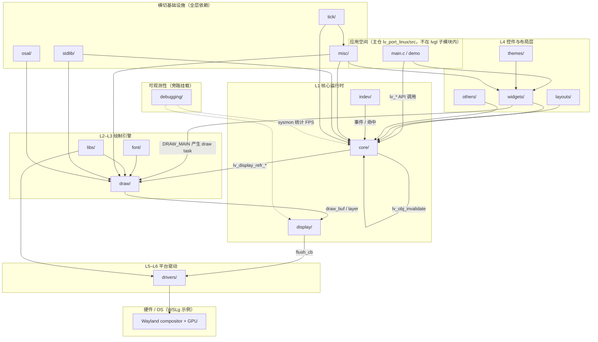
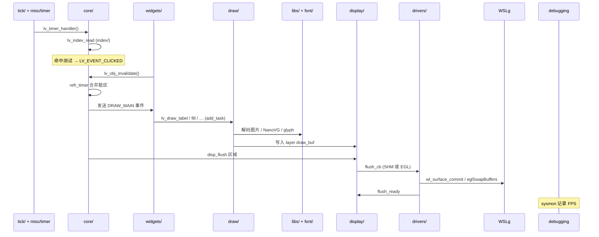
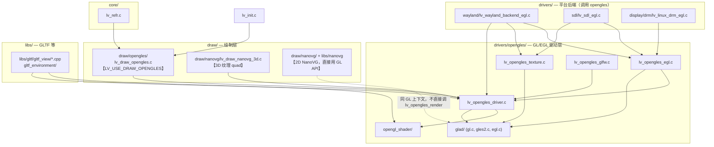
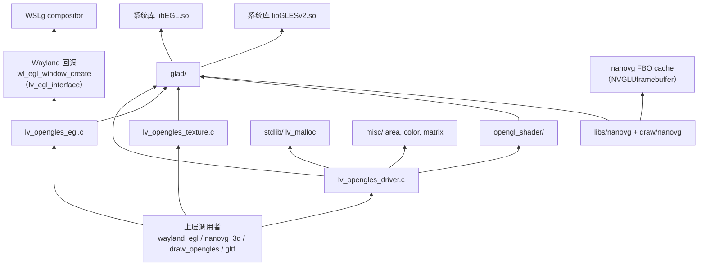

# lvgl 子模块代码目录说明

> 基于当前 `wsl_wayland_3d` 分支上的 `lvgl` 子模块结构整理。  
> 主仓路径：`lv_port_linux/lvgl/`（git submodule）

## 结论（先说）

**不完全是。** `lvgl/src` 是 LVGL **库实现**的主目录，但子仓里“有效、会被构建或对外使用的代码/头文件”还分布在其它目录。

若指：

- **库核心逻辑** → 主要在 `lvgl/src/`
- **完整可构建产物** → `src/` + `include/lvgl/` +（可选）`demos/`、`examples/` + 构建脚本 `env_support/`、`scripts/`

应用层代码（如 `main.c`、`simple_button.c`、Wayland 封装）在**主仓** `lv_port_linux/src/`，不在子仓内。

---

## 顶层目录一览

```
lvgl/
├── src/           # 库实现（.c / .cpp）— 核心
├── include/lvgl/  # 公共 API 头文件（新结构）
├── demos/         # 官方 demo（stress、widgets 等）
├── examples/      # 官方示例
├── env_support/   # CMake / 各平台移植
├── scripts/       # lv_conf 生成、预处理等
├── tests/         # 单元测试
├── docs/          # LVGL 文档源
├── configs/       # Kconfig / defconfig
└── lv_conf_template.h 等配置模板
```

---

## CMake 构建时编译哪些目录

来源：`lvgl/env_support/cmake/main.cmake`

| 目录 | 内容 | 是否进入 `lvglsim` 链接 |
|------|------|-------------------------|
| **`src/`** | 库实现：core、draw、drivers、widgets、indev、libs（NanoVG、ThorVG 等） | ✅ 始终 → `liblvgl` |
| **`include/lvgl/`** | 对外头文件 | ✅ include 路径（无 `.c`） |
| **`demos/`** | `lv_demo_stress`、`lv_demo_widgets` 等 | ✅ 可选（`LV_BUILD_DEMOS=1`） |
| **`examples/`** | 控件/特性示例 | ✅ 可选（`LV_BUILD_EXAMPLES=1`） |
| **`env_support/`** | CMake 模块、ESP/QNX 等移植 | 构建系统，非 UI 运行时逻辑 |
| **`scripts/`** | Python：生成 `lv_conf.h`、预处理等 | 配置阶段使用 |
| **`tests/`** | 自动化测试 | 仅 `cmake --build` 测试目标时 |

核心规则（摘录）：

```cmake
file(GLOB_RECURSE SOURCES ${LVGL_ROOT_DIR}/src/*.c ...)
file(GLOB_RECURSE EXAMPLE_SOURCES ${LVGL_ROOT_DIR}/examples/*.c)
file(GLOB_RECURSE DEMO_SOURCES ${LVGL_ROOT_DIR}/demos/*.c)
add_library(lvgl ${SOURCES})
```

ThorVG 等 C++ 源码在 `src/libs/thorvg/`，单独编成 `liblvgl_thorvg` 再链接。

---

## `src/` 与 `include/lvgl/` 的关系

当前为**双轨**结构（迁移中）：

| 位置 | 角色 |
|------|------|
| **`src/`** | 函数/模块**实现**（`.c`），以及部分旧头文件（含 deprecated 提示，指向 `include/lvgl/...`） |
| **`include/lvgl/`** | 推荐使用的**公共 API** 头文件 |

示例：

- Wayland 驱动：`src/drivers/wayland/` + 对外声明在 `include/lvgl/drivers/...`
- 绘制：`src/draw/` + `include/lvgl/draw/lv_draw.h`
- 3D 纹理 widget：`src/widgets/3dtexture/` + `include/lvgl/widgets/lv_3dtexture.h`

阅读 API 优先看 **`include/lvgl/`**；追实现进 **`src/`** 对应子目录。

---

## `src/` 下 16 个子目录详解

`lvgl/src/` 根目录除下列 **16 个文件夹** 外，还有若干**根级文件**（不属于子目录，但同属 `src` 实现层）：

| 根级文件 | 作用 |
|----------|------|
| `lv_init.c` / `lv_init.h` | 库初始化入口 `lv_init()`，注册子系统 |
| `lvgl.h` / `lvgl_private.h` / `lvgl_public.h` | 聚合头文件、内部/对外 include 边界 |
| `lv_conf_internal.h` | 由 `lv_conf.h` 展开的配置宏（编译期开关） |
| `lv_api_map_v8.h` … `v9_5.h` | 旧版 API 名到新版的兼容映射 |

---

### 16 个文件夹总表

| # | 目录 | 层级角色 | 主要职责 | 典型内容 / 关键路径 | 与本仓库关系 |
|---|------|----------|----------|---------------------|--------------|
| 1 | **`core/`** | L1 核心 | 对象树、事件、样式、刷新调度 | `lv_obj*.c` 对象模型；`lv_refr.c` 脏区合并与刷新定时器；`lv_group.c` 焦点组 | 所有 widget 与 demo 的基础；点击 → invalidate → refr 均经此层 |
| 2 | **`display/`** | L1 显示抽象 | 屏幕/图层生命周期、分辨率、flush 回调 | `lv_display.c`：`lv_display_create()`、buffer 模式、layer 链表 | 连接 `drivers/wayland` 与上层 draw；`lvglsim -W -H` 改的就是 display 分辨率 |
| 3 | **`indev/`** | L1 输入 | 指针、键盘、encoder、手势 | `lv_indev.c` 轮询与命中测试；`lv_gridnav.c` 网格导航 | Wayland 后端创建的 pointer/keyboard 最终进 `lv_indev_read` |
| 4 | **`draw/`** | L2–L3 绘制 | Draw task 管线、各 draw unit、图像解码 | `lv_draw.c` 任务调度；`sw/` CPU 绘制；`nanovg/` NanoVG；`opengles/`；`lv_draw_3d.c` | **wayland-egl** 走 `draw/nanovg` + `drivers/opengles`；**wayland-shm** 走 `draw/sw` |
| 5 | **`drivers/`** | L5–L6 平台 | 对接 OS/硬件：显示、输入、GPU | `wayland/` SHM/EGL 窗口；`opengles/` EGL 上下文与纹理；`evdev/` 输入 | 本仓库 WSLg 核心：`drivers/wayland` + `drivers/opengles` |
| 6 | **`widgets/`** | L4 控件 | 内置 UI 组件实现 | `button/`、`label/`、`3dtexture/` 等 39 个子目录；每控件 `*_class` + 事件 | `simple_button` 用的 button/label 即在此 |
| 7 | **`layouts/`** | L4 布局 | Flex / Grid 等布局算法 | `flex/`、`grid/`、`lv_layout.c` | 容器内子对象排列；stress demo 里 list/flex 场景会用到 |
| 8 | **`font/`** | L3 资源 | 字体加载与内置字库 | 大量 `lv_font_montserrat_*.c`；`fmt_txt/` 文本格式；`freetype/` 接口 | Label 绘制时的 glyph 来源 |
| 9 | **`themes/`** | L4 外观 | 默认/ mono / simple 主题 | `default/` 等：统一样式、颜色、padding | 未自定义 style 时控件默认外观 |
| 10 | **`misc/`** | 横切工具 | 动画、区域、颜色、链表、矩阵、缓存等 | `lv_anim.c`、`lv_area.c`、`lv_color.c`、`lv_timer.c`、`cache/` | 全库共用基础设施 |
| 11 | **`stdlib/`** | 横切内存 | 内存、字符串、sprintf 抽象 | `lv_mem.c`；`clib/` / `builtin/` 等后端 | `LV_USE_STDLIB_*` 配置决定 malloc 实现 |
| 12 | **`osal/`** | 横切 OS | 线程、互斥、延迟（多 RTOS/OS） | `lv_linux.c`、`lv_freertos.c`、`lv_pthread` 等 | Linux/WSL 构建通常走 `lv_linux` / pthread |
| 13 | **`tick/`** | 横切时间 | 毫秒 tick，`lv_tick_get()` | `lv_tick.c` | `lv_timer_handler()` 与动画时间基准 |
| 14 | **`libs/`** | L3 内嵌库 | 第三方与编解码器源码 | `nanovg/`、`thorvg/`、`gltf/`、`lodepng/`、`freetype/` 等 26 个子目录 | EGL 路径依赖 `libs/nanovg`；`LV_USE_GLTF` 用 `libs/gltf` |
| 15 | **`debugging/`** | 调试/测试 | 运行时诊断与测试辅助 | `sysmon/` FPS/CPU 监控（stress 日志里的 `sysmon:`）；`monkey/` 随机测试 | stress 对比脚本解析的 FPS 即 **sysmon** 输出 |
| 16 | **`others/`** | 扩展功能 | 非核心但可选的「其他」模块 | `file_explorer/`、`fragment/`、`translation/` | 一般 demo 默认不依赖；按 `lv_conf` 开关 |

---

### 按数据流串联（便于记忆）

```
indev/ ──事件──► core/ ──invalidate──► draw/ ──像素──► display/ ──flush──► drivers/
                ▲                           ▲
         widgets/ + layouts/          libs/ + font/
                ▲
           themes/ + misc/ + tick/ + stdlib/ + osal/
```

- **输入**：`drivers/` 采集 → `indev/` 分发 → `core/` 命中与事件
- **输出**：`widgets/` 改状态 → `core/` refr → `draw/` 生成 task → `display/` flush → `drivers/` 送 Wayland/WSLg
- **debugging/sysmon** 挂在刷新链路上报 FPS（stress 测试数据来源）

---

### 各目录子模块速查（二级）

| 目录 | 重要子目录 / 文件 |
|------|-------------------|
| `core/` | `lv_obj*.c`、`lv_refr.c`、`lv_event.c`、`lv_group.c` |
| `draw/` | `sw/`（CPU）、`nanovg/`、`opengles/`、`lv_draw_rect/label/image*.c`、`lv_image_decoder.c` |
| `drivers/` | `wayland/`、`opengles/`、`evdev/`、`sdl/`、`drm/`、`x11/` |
| `widgets/` | 每控件一目录：`button/`、`label/`、`3dtexture/`、`chart/` … |
| `libs/` | `nanovg/`、`thorvg/`、`gltf/`、`freetype/`、`lodepng/`、`libwebp/` |
| `debugging/` | `sysmon/`（性能监控）、`test/`（内部测试桩） |
| `font/` | 内嵌 Montserrat 等 `.c` 字库 + `fmt_txt/` |
| `layouts/` | `flex/`、`grid/` |
| `themes/` | `default/`、`mono/`、`simple/` |

---

## `src/` 内主要子目录（库本体）— 简表

| 子目录 | 说明 |
|--------|------|
| `core/` | 对象模型、事件、刷新 `lv_refr` |
| `draw/` | 2D/3D 绘制任务、NanoVG/OpenGLES/SW 等 draw unit |
| `display/` | `lv_display_t` 显示抽象 |
| `indev/` | 输入设备 |
| `drivers/` | Wayland、DRM、SDL、OpenGLES 等平台驱动 |
| `widgets/` | 内置控件实现 |
| `libs/` | 内嵌第三方：NanoVG、ThorVG、GLTF 等 |
| `font/`、`layouts/`、`misc/`、`osal/` | 字体、布局、工具、OS 抽象 |
| `lv_init.c` | 库初始化入口 |

---

## LVGL 软件技术架构图 + 16 个子目录映射

以下在经典 **「应用 → 核心 → 绘制 → 显示 → 驱动 → 硬件」** 分层上，标注 `lvgl/src/` 下 16 个文件夹各自所在位置与相互关系（与 `hgz.md` / 官方文档中的 L1–L6 分层一致）。

### 总架构图（分层 + 16 目录）



### 同一架构的 ASCII 简图

```
┌─────────────────────────────────────────────────────────────┐
│  Application（主仓 main.c / demos/）                         │
└───────────────────────────┬─────────────────────────────────┘
                            │ API
┌───────────────────────────▼─────────────────────────────────┐
│  L4  widgets/  layouts/  themes/  others/                   │
└───────────────────────────┬─────────────────────────────────┘
                            │ 对象树 / 事件 / invalidate
┌───────────────────────────▼─────────────────────────────────┐
│  L1  core/  ←── indev/ ←── drivers/(evdev, wayland indev)   │
│       │                                                      │
│       └──► draw/ ◄── font/  libs/(nanovg, thorvg, png…)     │
│              │                                               │
│              └──► display/ ──flush──► drivers/(wayland, egl)  │
└───────────────────────────┬─────────────────────────────────┘
                            ▼
                     WSLg / LCD / GPU

  横切：misc/  stdlib/  osal/  tick/  ──► 贯穿以上各层
  旁路：debugging/(sysmon) ──► 观测 refr / flush 性能
```

---

### 16 个文件夹在架构中的「层级归属」

| 层级 | 架构角色 | 包含的 src 子目录 | 在系统中的位置 |
|------|----------|-------------------|----------------|
| **L4 应用 UI** | 控件、布局、主题 | `widgets/` `layouts/` `themes/` `others/` | 开发者直接创建的 button、label、flex 容器；**不**直接碰硬件 |
| **L1 核心** | 对象模型、刷新、输入抽象 | `core/` `indev/` `display/` | 承上启下：`core` 调度刷新；`display` 管 buffer 与 flush；`indev` 管输入语义 |
| **L2–L3 绘制** | Draw task、渲染后端、资源 | `draw/` `font/` `libs/` | 把「画什么」变成像素；`libs` 为 draw/drivers 提供 NanoVG、解码器等 |
| **L5–L6 驱动** | OS/GPU/输入 HAL | `drivers/` | Wayland SHM/EGL、OpenGLES 纹理、evdev；**唯一**与 WSLg 对话的层 |
| **横切** | 时间、内存、OS、工具 | `misc/` `stdlib/` `osal/` `tick/` | 被几乎所有模块 include；无独立业务 UI |
| **旁路** | 调试与测试 | `debugging/` | 挂接在 refr/flush 链路上报指标，不改变主数据流 |

根级 `lv_init.c` 在**最顶层**调用顺序上先于各层：初始化 `stdlib` → `tick` → `draw` → `display` → `indev` → `widgets` 等子系统。

---

### 文件夹之间的依赖关系（谁依赖谁）

#### 1. 纵向主链路（一帧 UI 更新）

```
tick/ + misc/(timer)
    → core/(lv_timer_handler → lv_refr)
        → widgets/ + layouts/（DRAW_MAIN 回调里 lv_draw_*）
            → draw/（add_task → dispatch → sw|nanovg|opengles）
                → font/ + libs/（glyph、图片、矢量）
            → display/（layer、draw_buf）
                → drivers/（flush → Wayland commit / eglSwapBuffers）
```

- **单向为主**：数据与像素从 `widgets` 向下流到 `drivers`，flush 完成后 `display` 回调 `core` 进入下一帧。
- **`indev/`** 与主链路**并行向上**：`drivers` 读输入 → `indev` → `core` 事件 → `widgets` 回调 → 再次 `invalidate`，进入下一轮 refr。

#### 2. 横向协作（同层或相邻层）

| 关系 | 目录 A | 目录 B | 说明 |
|------|--------|--------|------|
| 组合 | `widgets/` | `layouts/` | 容器用 flex/grid 排列子 widget |
| 样式 | `themes/` | `widgets/` | 主题给控件提供默认 `lv_style` |
| 文本 | `widgets/label` | `font/` | Label 通过 draw 层拉取 font glyph |
| 图像 | `widgets/image` | `libs/` + `draw/` | 解码（png/jpeg 在 libs）→ draw task |
| GPU 路径 | `draw/nanovg` | `libs/nanovg` | NanoVG 库源码在 libs，执行在 draw |
| EGL 路径 | `draw/nanovg` | `drivers/opengles` | NanoVG 帧结束后 OpenGLES flush |
| Wayland | `drivers/wayland` | `display/` | 注册 `flush_cb`，创建 indev |
| 扩展 | `others/` | `core/` | fragment 等复用对象树与事件机制 |

#### 3. 横切依赖（被多处引用）

| 目录 | 典型被谁使用 | 提供什么 |
|------|--------------|----------|
| `misc/` | core、draw、widgets | `lv_area`、`lv_color`、`lv_anim`、`lv_timer`、`lv_ll`、matrix |
| `stdlib/` | 全库 | `lv_malloc` / `lv_free` / `lv_snprintf` |
| `tick/` | misc(timer)、core(refr) | `lv_tick_get()` 毫秒时间 |
| `osal/` | draw（多线程 unit）、libs | mutex、thread sleep（Linux 上 `lv_linux`） |

#### 4. 旁路关系

| 目录 | 挂载点 | 作用 |
|------|--------|------|
| `debugging/sysmon` | `core/lv_refr`、display 刷新周期 | 输出 `sysmon: XX FPS`（stress 测试数据来源） |
| `debugging/monkey` | indev | 随机注入输入做压测 |
| `debugging/test` | 内部 | 单元测试桩，正常 lvglsim 不启用 |

---

### 一帧内的时序（结合本仓库 Wayland）



| 后端 | draw 路径 | drivers 路径 |
|------|-----------|--------------|
| **wayland-shm** | `draw/sw/` CPU 像素 | `drivers/wayland` SHM flush |
| **wayland-egl** | `draw/nanovg/` + `libs/nanovg` | `drivers/wayland` + `drivers/opengles` |

---

### 16 目录两两关系矩阵（简化）

行 = 依赖方，列 = 被依赖方（● = 直接依赖，○ = 间接/可选）

|  | core | display | indev | draw | drivers | widgets | layouts | font | libs | themes | misc | stdlib | osal | tick | debugging | others |
|--|:---:|:-------:|:-----:|:----:|:-------:|:-------:|:-------:|:----:|:----:|:------:|:----:|:------:|:----:|:----:|:---------:|:------:|
| **widgets** | ● | ○ | ○ | ● | ○ | | ● | ○ | ○ | ○ | ● | ● | ○ | ○ | ○ | ○ |
| **core** | | ● | ● | ● | ○ | ○ | ○ | ○ | ○ | ○ | ● | ● | ○ | ● | ○ | ○ |
| **draw** | ○ | ● | | | ○ | ○ | ○ | ● | ● | ○ | ● | ● | ○ | ○ | ○ | ○ |
| **display** | ● | | | ○ | ● | ○ | ○ | ○ | ○ | ○ | ● | ● | ○ | ○ | ● | ○ |
| **indev** | ● | ● | | ○ | ● | ○ | ○ | ○ | ○ | ○ | ● | ○ | ○ | ○ | ○ | ○ |
| **drivers** | ○ | ● | ● | ○ | | ○ | ○ | ○ | ● | ○ | ● | ● | ○ | ○ | ○ | ○ |
| **layouts** | ● | ○ | ○ | ○ | ○ | ● | | ○ | ○ | ○ | ● | ○ | ○ | ○ | ○ | ○ |
| **themes** | ○ | ○ | ○ | ○ | ○ | ● | ○ | ○ | ○ | | ○ | ○ | ○ | ○ | ○ | ○ |
| **others** | ● | ○ | ○ | ○ | ○ | ○ | ○ | ○ | ○ | ○ | ● | ● | ○ | ○ | ○ | |

读法示例：`draw` **直接依赖** `font`、`libs`、`misc`、`stdlib`；**通过** `display` **间接依赖** `drivers`。

---

### 归纳：三种关系类型

1. **主数据流（纵向）**  
   `widgets → core → draw → display → drivers`  
   负责「画出来并送到屏幕」。

2. **交互回路（纵向 + 横向）**  
   `drivers → indev → core → widgets → core(invalidate) → draw …`  
   负责「用户操作改变 UI」。

3. **基础设施（横切）**  
   `misc / stdlib / osal / tick` 被各层调用；`debugging` 观测主链路；`themes` 影响 widgets 外观但不参与像素管线。

---

## 与本仓库 `lv_port_linux` 的分工

| 仓库路径 | 职责 |
|----------|------|
| **`lvgl/`（子模块）** | LVGL 库、demo、examples、驱动实现 |
| **`lv_port_linux/src/`** | 应用入口 `main.c`、simple button demo、backend 选择封装 |
| **`lv_port_linux/configs/`** | wayland / wayland-egl 等**主仓**构建配置 |
| **`lv_port_linux/scripts/`** | WSL Wayland 构建、stress 对比脚本等 |

构建 `lvglsim` 时：主仓 CMake 拉子模块，按 `-DCONFIG=wayland` 等生成 `lv_conf.h`，再编译子模块 `lvgl` + 主仓 `src/`。

---

## OpenGLES 模块：分布、调用方与依赖

`draw/opengles/` 与 `drivers/opengles/` 是**两条不同路径**。本仓库 `wayland-egl` 配置（`configs/wayland-egl.defaults`）通常只启用后者 + NanoVG，**不启用** `draw/opengles` draw unit。

### 配置开关

| 宏 | 作用 | 本仓库 wayland-egl |
|----|------|-------------------|
| **`LV_USE_OPENGLES`** | 启用 `drivers/opengles/` GL/EGL 基础设施 | ✅ 开 |
| **`LV_USE_EGL`** | 用 EGL 上下文（Wayland Surface）而非桌面 GL | ✅ 开 |
| **`LV_USE_DRAW_NANOVG`** | 2D 绘制走 NanoVG draw unit | ✅ 开 |
| **`LV_USE_DRAW_OPENGLES`** | 2D 绘制走 `draw/opengles` draw unit | ❌ 关（与 NanoVG **互斥**） |

### 代码分布总览



### `drivers/opengles/` 内部模块

| 文件/目录 | 职责 |
|-----------|------|
| **`lv_opengles_egl.c`** | EGL Display/Surface/Context 创建、`eglSwapBuffers` |
| **`lv_opengles_driver.c`** | 底层 GLES：纹理 quad 绘制、viewport、shader 绑定、`lv_opengles_render()` |
| **`lv_opengles_texture.c`** | Display 用 GL 纹理 + CPU `fb1` 缓冲（NanoVG 读回后上传） |
| **`lv_opengles_glfw.c`** | 桌面 GLFW 窗口模拟器（多 texture 合成到窗口） |
| **`opengl_shader/`** | GLSL 编译、链接、缓存（`lv_opengl_shader_manager.c`） |
| **`assets/lv_opengles_shader.c`** | 内建 vertex/fragment shader 源码 |
| **`glad/`** | 动态加载 **libGLESv2 / libEGL**（或桌面 GL） |
| **`lv_opengles_debug.c`** | `GL_CALL()` 调试包装 |

### `draw/opengles/` 做什么

| 文件 | 职责 |
|------|------|
| **`lv_draw_opengles.c`** | 注册 **OPENGLES draw unit**：把 FILL/LABEL/IMAGE/LAYER/3D 等 draw task 画到 **GPU 纹理**，再合成到 framebuffer |

与 **`draw/nanovg`** 二选一，不能同时启用（源码里有 `#error`）。

### 谁调用 OpenGLES（调用方 → 被调模块）

#### 调用 `drivers/opengles` 的模块

| 调用方 | 调用的 API / 模块 | 场景 |
|--------|-------------------|------|
| **`drivers/wayland/lv_wayland_backend_egl.c`** | `lv_opengles_egl_context_create/destroy`<br>`lv_opengles_texture_*`<br>`lv_opengles_render_display`<br>`lv_opengles_egl_update` | **WSLg wayland-egl 主路径**：flush 时把纹理送到屏幕 |
| **`drivers/sdl/lv_sdl_egl.c`** | 同上 | SDL + EGL 后端 |
| **`drivers/display/drm/lv_linux_drm_egl.c`** | 同上 | DRM/KMS + EGL |
| **`drivers/opengles/lv_opengles_glfw.c`** | `lv_opengles_init`<br>`lv_opengles_render_texture_rbswap` | 桌面 GLFW 模拟器 |
| **`drivers/opengles/lv_opengles_egl.c`** | `lv_opengles_init()` | 创建 EGL 上下文时初始化 GL 状态 |
| **`drivers/opengles/lv_opengles_texture.c`** | `lv_opengles_init()` | 创建 display 纹理时 |
| **`draw/nanovg/lv_draw_nanovg_3d.c`** | `lv_opengles_reinit_state`<br>`lv_opengles_viewport`<br>`lv_opengles_render` | **3dtexture** 平面纹理（暂停 NanoVG 帧后走 GLES blit） |
| **`draw/opengles/lv_draw_opengles.c`** | `lv_opengles_render_*`<br>`lv_opengles_render_fill` | `LV_USE_DRAW_OPENGLES=1` 时全部 2D 任务 |
| **`libs/gltf/gltf_view/*.cpp`** | `lv_opengles_private.h`<br>`opengl_shader` | GLTF 3D 模型渲染 |
| **`libs/gltf/gltf_environment/lv_gltf_ibl_sampler.c`** | 同上 | IBL 环境贴图采样 |

#### 调用 `draw/opengles` 的模块

| 调用方 | API | 条件 |
|--------|-----|------|
| **`lv_init.c`** | `lv_draw_opengles_init/deinit` | `LV_USE_DRAW_OPENGLES` |
| **`core/lv_refr.c`** | `lv_draw_opengles_clear_layer_area` | 透明背景时需清 GPU 纹理脏像素 |

#### NanoVG 与 OpenGLES 的关系（易混淆）

| 模块 | 关系 |
|------|------|
| **`draw/nanovg/`** | 2D 主路径：通过 **`libs/nanovg`** 直接调 **GLES2 API**（`nvgCreateGLES2` 等），与 `lv_opengles_driver` **并行共享** EGL 创建的 GL 上下文 |
| **`draw/nanovg/lv_draw_nanovg.c`** | 仅在 `LV_USE_OPENGLES && LV_USE_EGL` 时 include `lv_opengles_private.h`（用 glad 的 GL 符号，而非 static link GLEW） |

### OpenGLES 向下依赖什么



| 层级 | 依赖 |
|------|------|
| **系统** | `libGLESv2`、`libEGL`；WSL 上常需 `/usr/lib/wsl/lib`（Mesa D3D12） |
| **glad** | 运行时解析 GL/EGL 函数指针 |
| **Wayland** | `wl_egl_window`、`eglSwapBuffers` → WSLg |
| **LVGL 内部** | `stdlib`（内存）、`misc`（矩阵/区域）、`display`（layer 纹理 id 存在 `layer->user_data`） |
| **NanoVG** | 不经过 `lv_opengles_render()`，但共用 **同一 EGL Context** |

### 本仓库 wayland-egl 实际调用链

```
lv_timer_handler
  → core/refr
  → draw/nanovg（2D：NanoVG → GL FBO → glReadPixels → CPU draw_buf）
  → draw/nanovg_3d（若有 3dtexture：end NanoVG → lv_opengles_render）
  → display flush_cb
  → drivers/wayland/egl_flush_cb
       → glTexImage2D（CPU 像素 → display 纹理）  或  LV_USE_DRAW_OPENGLES 时 lv_opengles_render_display_texture
       → lv_opengles_egl_update（eglSwapBuffers）
       → wl_surface_commit → WSLg
```

**wayland-shm** 路径完全不经过 `drivers/opengles`，CPU 像素直送 `wl_shm`。

### 一句话对照

| 目录 | 角色 | 本仓库是否启用 |
|------|------|----------------|
| **`drivers/opengles/`** | GL/EGL **基础设施 + 纹理 blit/flush** | ✅（wayland-egl） |
| **`draw/opengles/`** | 用 GLES 做 **完整 2D draw unit**（替代 NanoVG） | ❌ |
| **`draw/nanovg/`** | 2D 用 NanoVG 画，**共享** GL 上下文 | ✅ |
| **`libs/gltf/`** | 3D 模型，直接用 GL + shader | 仅 `LV_USE_GLTF=1` 时 |

---

## 常见误解

1. **“所有代码都在 `src/`”** — 错。公共头在 `include/lvgl/`；stress 等 demo 在 `demos/`。
2. **“子仓就是整个可执行程序”** — 错。可执行文件由主仓 `src/main.c` 等与子模块 `liblvgl` 链接而成。
3. **“`src/widgets` 与 `include/lvgl/widgets` 重复”** — 前者是实现，后者是 API；二者成对出现。

---

## 快速定位建议

| 想查… | 去看… |
|--------|--------|
| 某 API 怎么用 | `include/lvgl/` |
| 某功能怎么实现 | `src/` 同名模块 |
| stress / widgets demo | `demos/` |
| Wayland SHM / EGL 后端 | `src/drivers/wayland/` |
| OpenGLES 驱动（EGL/纹理/flush） | `src/drivers/opengles/` |
| OpenGLES draw unit（替代 NanoVG） | `src/draw/opengles/` |
| NanoVG 绘制 | `src/draw/nanovg/` + `src/libs/nanovg/` |
| 构建选项从哪来 | 主仓 `configs/*.defaults` → 生成 `lv_conf.h` |
