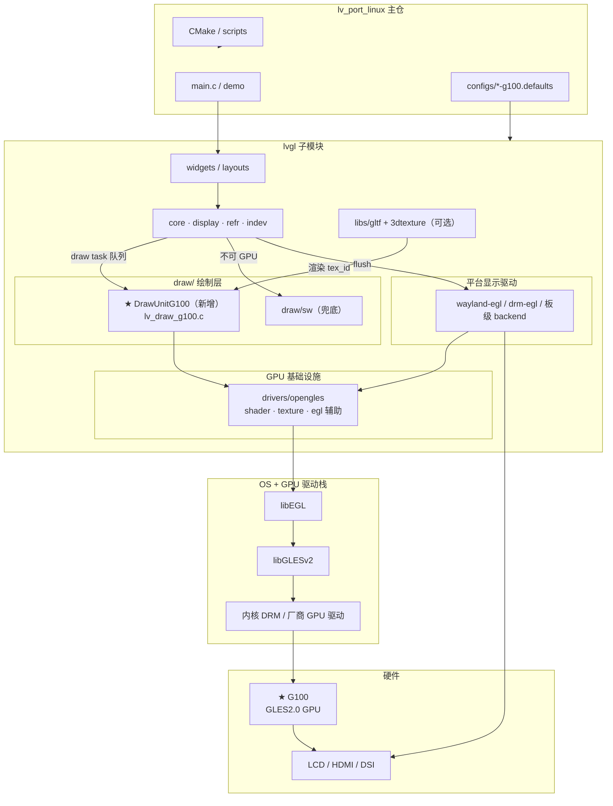
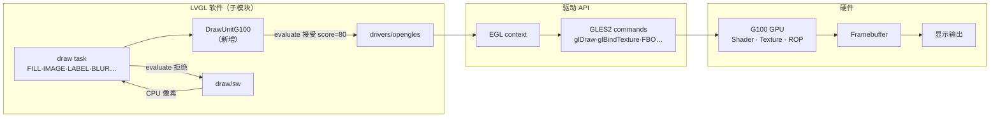
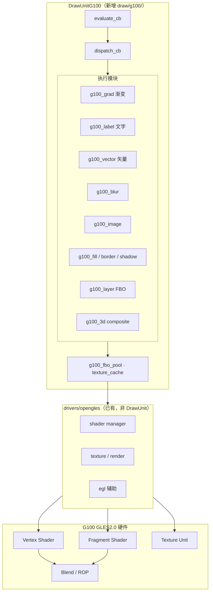
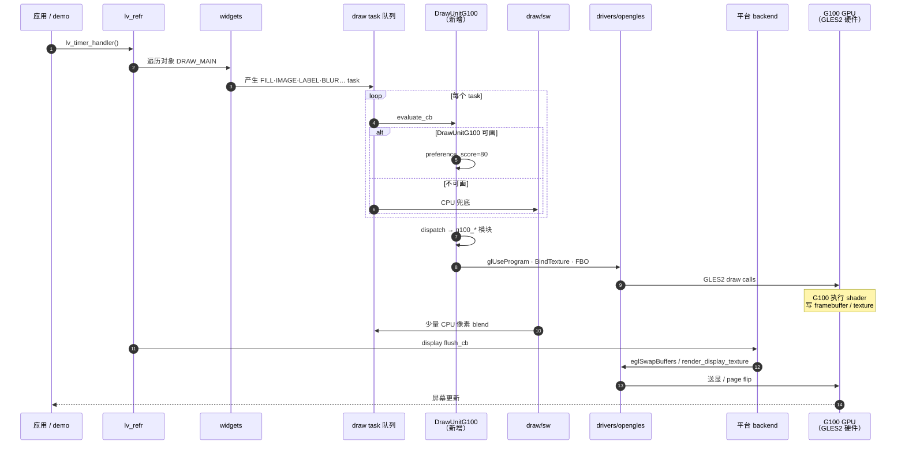
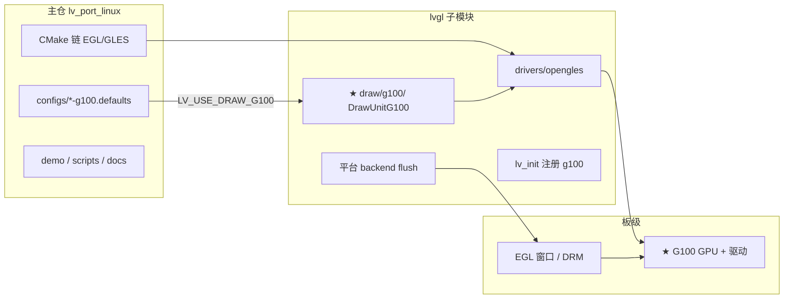
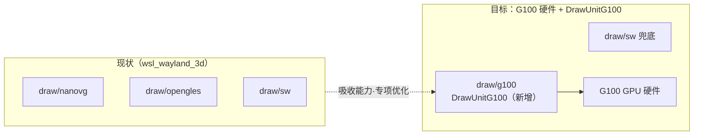
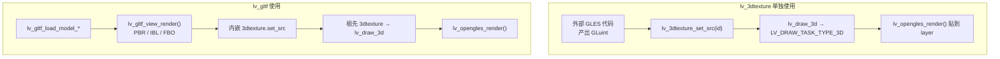
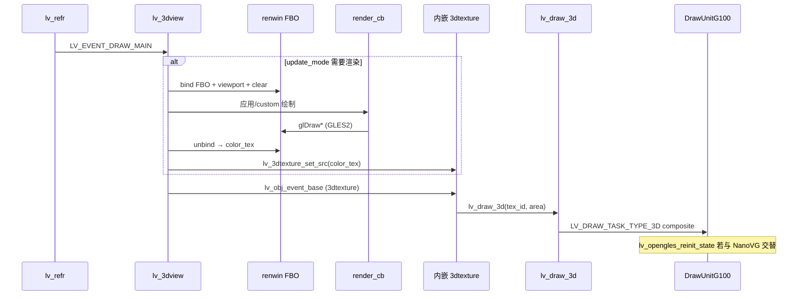
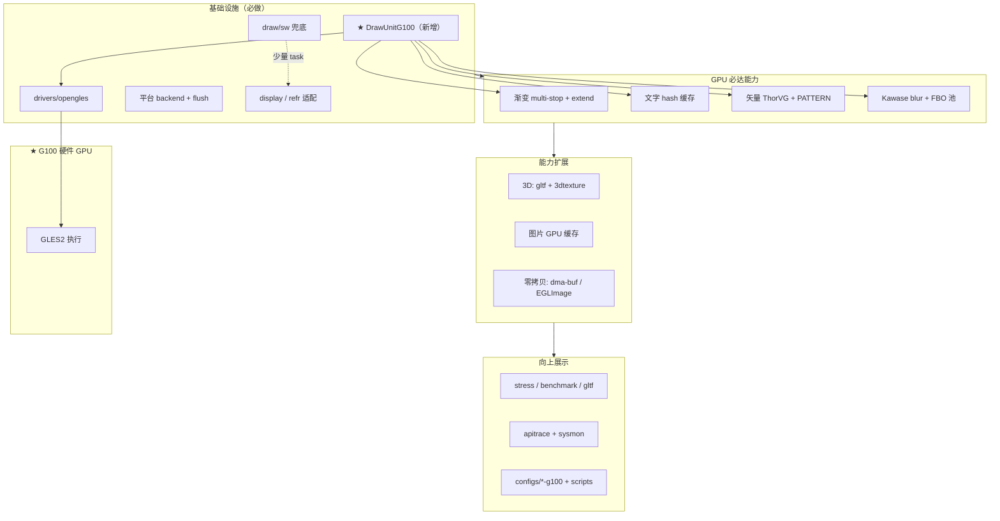

# OpenGL ES 2.0 GPU 与 LVGL 集成指南

> 基于当前 `wsl_wayland_3d` 分支上的 LVGL 子模块与 `lv_port_linux` 主仓结构整理。  
> 目标：在 **G100（GLES 2.0 硬件 GPU）** 上让 LVGL 跑通 GPU 路径，并向上完整展示 GPU 能力。  
> **新增 DrawUnitG100** 驱动 G100 硬件；改造计划见 [gles2_gpu_porting_plan.md](./gles2_gpu_porting_plan.md)，设计规格见 [drawunit_g100_design.md](./drawunit_g100_design.md)。

---

## 结论（先说）

1. **只增加一个 DrawUnit 远远不够**。DrawUnit 只解决「如何把 draw task 变成 GPU 像素/纹理」；上下还有 EGL 驱动、平台 flush、display 缓冲模型、refr 适配等层。
2. **G100 硬件 + DrawUnitG100（新增）**：**G100** 指 **GLES 2.0 硬件 GPU**；**DrawUnitG100** 是 LVGL 新增 `draw/g100/` 模块，通过 `drivers/opengles` 向 G100 下发 GLES2 命令。
3. **要「展示 GPU 全部能力」**，除基础设施外，还需补齐 **渐变 / 矢量 / 文字 / BLUR（GPU 必达）**、3D、零拷贝送显、综合 demo 等；做不到的部分由 `draw/sw` 兜底。

---

## 1. G100 硬件与 DrawUnitG100 整体架构

### 1.1 术语

| 名称 | 是什么 | 不是什么 |
|------|--------|----------|
| **G100** | **GLES 2.0 硬件 GPU**（SoC 图形加速器 + 厂商驱动提供的 EGL/GLES2 API） | 不是 DrawUnit 本身 |
| **DrawUnitG100** | LVGL **新增**软件模块：`lvgl/src/draw/g100/`，`evaluate` / `dispatch` 把 draw task 变为 GL 绘制 | 不是 GPU 驱动，不是 EGL |
| **drivers/opengles** | LVGL GLES **基础设施**（context、shader、纹理、flush 辅助） | 不是 DrawUnit；被 DrawUnitG100 **调用** |
| **draw/sw** | CPU 软绘 Draw Unit，G100 做不了时的 **兜底** | 不替代 G100 主路径 |

关系一句话：

**应用 → LVGL → DrawUnitG100（新增）→ drivers/opengles → libGLESv2 → G100 硬件 GPU → 屏幕**

### 1.2 总览（应用 → G100 硬件 → 屏幕）



### 1.3 DrawUnitG100 与 G100 硬件关系



### 1.4 DrawUnitG100 内部分层 → G100 执行



### 1.5 一帧数据流（DrawUnitG100 → G100 硬件）



### 1.6 主仓与子模块分工



### 1.7 与现有 Draw Unit 的演进



上线 DrawUnitG100 后：**关闭** `LV_USE_DRAW_NANOVG`（Draw Unit）与 `LV_USE_DRAW_OPENGLES`，保留 `LV_USE_DRAW_SW=1`。G0 Bootstrap 仍保留 **`LV_USE_NANOVG=1`**（NanoVG **库**，非 Draw Unit），绘制代码在 `draw/g100/` 独立维护。

### 1.8 LVGL 通用分层表

| 层级 | 目录/模块 | 职责 |
|------|-----------|------|
| **DrawUnitG100（新增）** | `draw/g100/` | 面向 G100 硬件，接管 GPU 可画 task |
| **draw/sw** | `draw/sw/` | MASK_BITMAP、Canvas、稀有格式等兜底 |
| **GPU 基础设施** | `drivers/opengles/` | EGL 上下文、shader、纹理、`lv_opengles_render()` |
| **平台后端** | `drivers/wayland`、`drivers/display/drm` 等 | surface、`flush_cb`、`eglSwapBuffers` |
| **显示抽象** | `display/`、`core/lv_refr.c` | layer、脏区、透明背景 GPU clear |
| **向上展示** | demo、主仓 config、文档 | 可测、可对比、可复现 |

---

## 2. 除 DrawUnit 外必须补齐的基础设施

### 2.1 `drivers/opengles/` — GPU 公共层（几乎必做）

即使自定义 DrawUnit，通常也需复用或仿照此层：

| 文件/模块 | 作用 |
|-----------|------|
| `lv_opengles_egl.c` | EGL Display / Context / Surface、`eglSwapBuffers` |
| `glad/` | 动态加载 `libGLESv2.so`、`libEGL.so` |
| `opengl_shader/` | GLSL 编译、链接、缓存 |
| `lv_opengles_driver.c` | 纹理 quad、`lv_opengles_render()`、`lv_opengles_render_display()` |
| `lv_opengles_texture.c` | display 纹理、`fb1` 占位缓冲 |
| `lv_opengles_init()` | 初始化 shader/VBO；`LV_USE_DRAW_NANOVG` 时 `lv_draw_nanovg_init()`；**`LV_USE_DRAW_G100` 时 `lv_draw_g100_init()`** |

无 EGL 上下文与 GL 函数指针，DrawUnit 内 `glDraw*` 无法执行。

### 2.2 平台显示后端

需为板子实现或选用 **带 EGL 的 display backend**：

| 后端 | 路径示例 |
|------|----------|
| Wayland + EGL | `drivers/wayland/lv_wayland_backend_egl.c` |
| DRM/KMS + EGL | `drivers/display/drm/lv_linux_drm_egl.c` |
| 板级自研 | fbdev+EGL、厂商 SDK window surface |

后端必须完成：

1. **`init_display()`** — 创建 surface，注册 `flush_cb` / `flush_wait_cb`
2. **`flush_cb`** — 与 DrawUnit 输出模型**匹配**（见下表）
3. **EGL config** — 兼容 **OpenGL ES 2.0**
4. **vsync / frame callback** — 与 compositor 或 KMS 同步

**flush 与 DrawUnit 对应关系：**

| DrawUnit 类型 | flush 行为 |
|---------------|------------|
| **纹理型**（`draw/opengles`） | `lv_opengles_render_display_texture()` → `eglSwapBuffers` |
| **NanoVG 主屏** | 直接 `eglSwapBuffers`（画在 EGL 默认 framebuffer） |
| **DrawUnitG100 主屏** | 与 NanoVG 相同：直接 `eglSwapBuffers`；**不**经 `glTexImage2D(fb1)` |
| **SW + EGL 传统** | `glTexImage2D(fb1)` → `lv_opengles_render_display()` → swap |

新 DrawUnit 必须明确属于哪一类，并改对应 `flush_cb`。G100 在 `lv_wayland_backend_egl.c` 中与 NanoVG 共用 `#if LV_USE_DRAW_OPENGLES || LV_USE_DRAW_NANOVG || LV_USE_DRAW_G100` 分支。

### 2.3 `display/` 层 — 缓冲与渲染模式

| 配置项 | 说明 |
|--------|------|
| `lv_display_set_render_mode()` | NanoVG / **G100** 常用 `FULL`；OpenGLES draw unit 常用 `DIRECT` |
| `layer->user_data` | **纹理型**（`draw/opengles`）在此挂 GL texture id；**NanoVG / G100** 根 layer 必须为 `NULL`（子 layer 为 FBO cache entry） |
| `draw_buf` | 纹理型输出时多为 **dummy 占位**，真实像素在 GPU |
| `LV_COLOR_DEPTH` | 与 EGL config、纹理格式（RGB565/RGBA）一致 |

**G0 踩坑（已修）：** `wayland-g100` 关闭 `LV_USE_DRAW_NANOVG` 时，若 `lv_opengles_texture.c` 仍把 `texture_id` 写入 `display->layer_head->user_data`，DrawUnitG100 的 `on_layer_changed()` 会误当作 FBO cache entry，首帧 `lv_draw_rect()` **SIGSEGV**。修复：`#if !LV_USE_DRAW_NANOVG && !LV_USE_DRAW_G100` 才写入。

### 2.4 `core/lv_refr.c` — 刷新管线适配

| 场景 | 需求 |
|------|------|
| **透明背景** | CPU `lv_draw_buf_clear` 清不到 GPU 纹理 → `lv_draw_opengles_clear_layer_area()` 或等价 GPU clear |
| **tile / partial** | 与 `RENDER_MODE_FULL` 冲突时需定义策略 |
| **旋转 / matrix** | 与 `lv_opengles_render_display` 行为对齐 |
| **子 layer (LAYER task)** | FBO 合成、blend、纹理生命周期 |

### 2.5 配置与初始化顺序

**最小 GPU 2D 配置示例：**

```ini
LV_USE_OPENGLES      1      # 启用 drivers/opengles
LV_USE_EGL           1      # Wayland/DRM 嵌入式常用
LV_USE_DRAW_SW       1      # 兜底，强烈建议保留
LV_USE_DRAW_NANOVG   1      # 或 LV_USE_DRAW_OPENGLES=1（二者互斥）
LV_USE_NANOVG        1      # NanoVG 路径时需要
```

**初始化顺序（不可乱）：**

```text
lv_init()
  → lv_draw_xxx_init()              # lv_init.c
平台 backend init
  → lv_opengles_egl_context_create()
  → lv_opengles_init()              # 可能内部 lv_draw_nanovg_init()
  → lv_opengles_texture_reshape()
display 注册 flush_cb
```

### 2.6 SW 兜底 DrawUnit

GPU unit **不接全部 task 类型**（VECTOR、BLUR、部分 MASK 等）。架构要求：

- `LV_USE_DRAW_SW=1`
- GPU unit `evaluate` 拒绝不支持的 task
- 子绘制可用 `draw_dsc->user_data` 标记强制回退 SW（`draw/opengles` 用 `user_data=1`）

### 2.7 构建与运行时

| 类别 | 内容 |
|------|------|
| 链接库 | `libEGL`、`libGLESv2`；可能还有 `libwayland-egl`、`libgbm`、`libdrm` |
| CMake | `configs/xxx.defaults`、主仓 `-DCONFIG=xxx` |
| 板级 | GPU 驱动（Mesa/厂商 blob）、`EGL_PLATFORM` |
| 权限 | DRM 设备节点、dma-buf 等 |

---

## 3. `draw/opengles` DrawUnit 理解（与 NanoVG 对比）

`draw/opengles` **不是**「用 GLES 直接画每种图元」，而是 **调度型 unit**：

```text
顶层 draw task (user_data=NULL)
  → OpenGLES unit 接手
  → 临时 CPU 缓冲 render_draw_buf
  → 递归 lv_draw_rect/label/...（user_data=1 → 强制 SW 画到 CPU）
  → glTexImage2D 上传
  → lv_opengles_render_texture 合成到 layer 纹理
```

| 维度 | `draw/opengles` | `draw/nanovg` |
|------|-----------------|---------------|
| 谁画像素 | SW → CPU → 上传纹理 | NanoVG GPU 矢量光栅 |
| layer 输出 | `layer->user_data` = GL 纹理 | 主屏 EGL 默认 FB；子 layer FBO |
| flush | `render_display_texture` + swap | 直接 swap |
| 能否共存 | **互斥**（源码 `#error`） | wayland-egl 默认 |

本仓库 `wayland-egl.defaults`：**NanoVG 开，draw/opengles 关**。

---

## 4. 3D 路径：Draw Task 体系与 Widget

> **★ 已认可新方向：** 3D 不再仅 = 一张纹理 blit。完整规格见 **[g100_3d_draw_tasks_design.md](./g100_3d_draw_tasks_design.md)**（8 类 3D DrawTask、VP 子队列、字段级 dsc、G8 贯通）。

### 4.0 架构摘要（新设计）

| 旧 | 新 |
|----|-----|
| 仅 `LV_DRAW_TASK_TYPE_3D` = blit `tex_id` | **8 类 3D task**：VP / CLR / MESH / LINE / SCENE / CB / **BLIT** / SYNC |
| Widget 内 `glDraw*` | **DrawUnitG100 dispatch** |
| 3D 必须先变纹理 | **3D_VIEWPORT** resolve 直接 composite；仅外部 tex 走 **3D_BLIT** |

```text
2D:  FILL → LABEL → …
3D:  3D_VIEWPORT → [3D_CLEAR → 3D_MESH* → …] → resolve → 继续 2D task
```

---

### 4.1 旧 `LV_DRAW_TASK_TYPE_3D`（G6 兼容 / BLIT 路径）

**G6 当前实现：** 把 **已渲染好的 GL 纹理（GLuint）** GPU blit 合成进 2D UI。新设计中此路径重命名为 **`LV_DRAW_TASK_TYPE_3D_BLIT`**（`lv_draw_3d()` 保留 alias）。

```text
（纹理来源：外部 或 lv_gltf_view_render — gltf 在 G8.3 迁移为 3D_SCENE task）
widgets/3dtexture    → 3D_BLIT task
lv_draw_3d_blit()  → DrawUnitG100 composite
```

配置：

```ini
LV_USE_3D_DRAW_TASKS 1   # ★ 新：VP/MESH/SCENE 族（G8）
LV_USE_3DTEXTURE      1    # 3D_BLIT + lv_3dtexture widget
LV_USE_3DVIEWPORT     1    # lv_3dviewport（G8.0，原 3dview 规划演进）
LV_USE_GLTF           1    # G8.3 起改发 3D_SCENE task
LV_USE_DEMO_GLTF      1
```

**Widget 关系（新设计）：** `lv_3dtexture`（BLIT）| **`lv_3dviewport`**（VP pass）| `lv_3dscene` / `lv_3dmesh` | `lv_gltf`（→ SCENE）。详见 [g100_3d_draw_tasks_design.md §8](./g100_3d_draw_tasks_design.md#8-widget--task-映射修订)。

---

### 4.2 `lv_3dtexture` 与 `lv_gltf`：两个 Widget，不同层级

是的，**`lv_gltf` 和 `lv_3dtexture` 是两个 widget**，但关系不是平行的，而是 **「3D 引擎 + 显示窗口」**：

| Widget | 角色 |
|--------|------|
| **`lv_3dtexture`** | **显示层**：把一块已有的 **OpenGL 纹理（GLuint）** 贴进 2D UI |
| **`lv_gltf`** | **3D 引擎层**：加载 glTF、相机、光照、PBR 渲染，**输出纹理后再交给内嵌的 `3dtexture` 显示** |

```text
lv_gltf       =  3D 渲染器（gltf_view）  +  内嵌 lv_3dtexture（输出到 UI）
lv_3dtexture  =  只负责「把 tex_id 画到屏幕上」
```

#### 继承关系（源码）

`lv_gltf` **继承自** `lv_3dtexture`，不是两个无关控件：

```text
lv_gltf_class.base_class = &lv_3dtexture_class   // lv_gltf_view.cpp
```

`lv_gltf` 对象内部**第一个成员**就是 `lv_3dtexture_t`（`lv_gltf_view_internal.h`）。

一帧内的调用链：

```text
LV_EVENT_DRAW_MAIN（lv_gltf）
  → lv_gltf_view_render()              /* ① 3D 渲到 FBO/纹理 */
  → lv_3dtexture_set_src(tex_id)
  → lv_obj_event_base()                /* ② 祖先 3dtexture 的 draw */
       → lv_draw_3d()                  /* LV_DRAW_TASK_TYPE_3D */
            → lv_opengles_render()     /* GPU 合成进 2D layer */
```

#### 详细对比表

| 维度 | **`lv_3dtexture`** | **`lv_gltf`** |
|------|-------------------|---------------|
| **定位** | 通用 **GPU 纹理显示器** | **glTF 3D 场景查看器** |
| **配置宏** | `LV_USE_3DTEXTURE` | `LV_USE_GLTF`（依赖 `LV_USE_3DTEXTURE`） |
| **源码** | `widgets/3dtexture/`（纯 **C**） | `libs/gltf/gltf_view/`（**C++**） |
| **代码量** | ~160 行 | 数千行（loader + render + shader + env） |
| **谁产生纹理** | **外部**（你自己或其它引擎） | **内部** `lv_gltf_view_render()` |
| **3D 能力** | 无（只显示 2D 纹理） | 模型、骨骼动画、PBR、IBL、多 pass、深度/透明 |
| **公共 API** | 3 个：`create` / `set_src` / `set_flip` | 几十个：相机、FOV、环境、动画、射线拾取等 |
| **模型加载** | 无 | `lv_gltf_load_model_from_file/bytes` |
| **相机** | 无 | yaw/pitch/distance/FOV/focal、场景相机切换 |
| **光照/环境** | 无 | IBL、`lv_gltf_environment`、曝光、背景模糊 |
| **动画** | 无 | glTF 动画、速度控制 |
| **拾取/3D 数学** | 无 | `lv_gltf_get_ray_from_2d_coordinate`、`world_to_screen` |
| **绘制 task** | 产生 `LV_DRAW_TASK_TYPE_3D` | 同样最终走 3D task（通过内嵌 3dtexture） |
| **默认翻转** | h=false, v=false | 内嵌 texture：**v_flip=true** |
| **典型用途** | 自定义 GL 渲染、视频帧、第三方引擎输出 | 展示 `.gltf/.glb` 3D 模型 |

#### `lv_3dtexture` 详解

**职责：** 在 LVGL 布局里显示一块 GL 纹理，不负责 3D 计算。

```c
lv_3dtexture_create(parent);
lv_3dtexture_set_src(obj, GLuint_texture_id);  // 外部提供的纹理
lv_3dtexture_set_flip(obj, h_flip, v_flip);
```

`LV_EVENT_DRAW_MAIN` 时调用 `lv_draw_3d()` → `LV_DRAW_TASK_TYPE_3D`（`widgets/3dtexture/lv_3dtexture.c`）。

**适用：** 自有 GLES 管线已产出纹理，只需嵌进 LVGL UI；不限于 glTF。

**不负责：** 加载模型、管理相机、创建纹理（只 **引用** 已有 `tex_id`）。

#### `lv_gltf` 详解

**职责：** 完整 **glTF 2.0 查看器**，渲染完成后把纹理交给内嵌 `3dtexture`。

| 子系统 | 路径 |
|--------|------|
| 模型加载 | `gltf_data/` + fastgltf |
| 渲染 | `gltf_view_render.cpp` |
| Shader | `gltf_view_shader.cpp` |
| IBL 环境 | `gltf_environment/` |

典型用法：

```c
lv_obj_t * viewer = lv_gltf_create(parent);
lv_gltf_load_model_from_file(viewer, "model.glb");
lv_gltf_set_yaw(viewer, 45.0f);
lv_gltf_set_distance(viewer, 2.5f);
```

Demo：`lv_demo_gltf()`（`demos/gltf/lv_demo_gltf.c`）。

**额外机制：** 创建时注册 `LV_EVENT_REFR_READY` 推送动画；渲染用独立 FBO（`lv_gltf_renwin_state_t`）；与 NanoVG 共存时需 `lv_opengles_reinit_state()`。

#### 绘制路径对比



**共同点：** 最终进 2D UI 都是 **`LV_DRAW_TASK_TYPE_3D` + `lv_opengles_render()`**。  
**不同点：** 纹理来源——外部提供 vs gltf 内部渲染。

#### 选型建议（两层极端；中间层见 §4.3）

| 需求 | 选谁 |
|------|------|
| 展示 `.gltf` / `.glb`，要 PBR/IBL/动画 | **`lv_gltf`** |
| 自定义 GLES2 场景，要 FBO/相机但不想上 glTF 引擎 | **`lv_3dview`**（§4.3 规划）+ `render_cb` |
| 自有 3D 引擎，只要嵌进 LVGL UI | **`lv_3dtexture`** + 自管 `tex_id` |
| 最小 3D demo（网格/立方体） | **`lv_3dview`** + builtin shapes |
| 只做 2D UI | **都不需要** |

#### 类比

| 类比 | `lv_3dtexture` | `lv_gltf` |
|------|----------------|-----------|
| 视频 | `<video>` 标签（只显示画面） | 带解码器+播放器的完整播放器 |
| 2D GUI | `lv_image` 显示外部图 | 内置相机拍好再显示的相机 App |

`lv_gltf` 不是替代 `3dtexture`，而是在其上增加 **一整套 3D 生产能力**，输出仍通过 `3dtexture` 机制进入 LVGL 对象树。

---

### 4.3 `lv_3dviewport` / `lv_3dview`（规划 → G8 Draw Task 路径）

> **演进说明：** 原 §4.3 `lv_3dview`（FBO + render_cb）已纳入 **[g100_3d_draw_tasks_design.md](./g100_3d_draw_tasks_design.md)**。Widget 名建议 **`lv_3dviewport`**；实现为提交 **`3D_VIEWPORT`** task，而非 widget 内偷跑 GL。

#### 4.3.1 定位（与 BLIT 路径对比）

现有 3D 控件形成 **两层极端**：

| 现有 | 能力边界 | 缺口 |
|------|----------|------|
| `lv_3dtexture` | 只显示外部 `tex_id` | 无 FBO、相机、深度、渲染时机 |
| `lv_gltf` | 完整 glTF/PBR/IBL（C++，数千行） | 过重；非 glTF 场景、自定义 mesh/Shader 不友好 |

**`lv_3dview`** 填补中间层：**LVGL 自管的 3D 视口** —— 自带 FBO/深度缓冲、简易相机、每帧渲染回调，输出仍走 `lv_3dtexture` → `LV_DRAW_TASK_TYPE_3D` 合成进 2D UI。

```text
                    ┌─────────────────────────────────────┐
  外部 tex_id  ───► │ lv_3dtexture   （显示层，已有）      │
                    ├─────────────────────────────────────┤
  FBO + 回调   ───► │ lv_3dview ★   （视口层，规划）       │
                    ├─────────────────────────────────────┤
  glTF 全引擎  ───► │ lv_gltf        （引擎层，已有）       │
                    └─────────────────────────────────────┘
                              ↓ 均产出 tex_id
                    lv_draw_3d() → DrawUnitG100/NanoVG composite
```

#### 4.3.2 设计目标

| 目标 | 说明 |
|------|------|
| **GLES2 可落地** | 仅 vertex + fragment shader；深度纹理 `GL_OES_depth_texture` 或 renderbuffer |
| **与 LVGL 刷新对齐** | 脏区/动画时渲染；可选 `LV_3DVIEW_UPDATE_MODE_CONTINUOUS` |
| **复用 3D task** | 不新增 draw task 类型；内嵌 `lv_3dtexture_t`，与 gltf 同合成路径 |
| **应用可扩展** | `render_cb` 注入自定义绘制；内置可选 grid/axes/cube 便于 demo |
| **G100 友好** | composite 走 `lv_draw_g100_3d` / `lv_opengles_render_texture`；刷新后 `lv_opengles_reinit_state()` |

#### 4.3.3 配置与依赖

```ini
LV_USE_OPENGLES      1
LV_USE_3DTEXTURE     1      # 必须：3D draw task + 内嵌显示
LV_USE_3DVIEW        1      # ★ 新增宏（规划）
LV_USE_MATRIX        1      # 相机矩阵
# 与 gltf 互斥可选：同屏可同时存在，但各自独立 FBO
```

| 宏 | 依赖 |
|----|------|
| `LV_USE_3DVIEW` | `LV_USE_3DTEXTURE`、`LV_USE_OPENGLES` |
| 可选内置 primitive | `LV_USE_3DVIEW_BUILTIN_SHAPES` |

#### 4.3.4 类关系与内存布局

**推荐：与 `lv_gltf` 相同模式 —— 继承 `lv_3dtexture_class`，首成员为 `lv_3dtexture_t`。**

```c
/* lv_3dview_private.h（规划） */
typedef struct {
    lv_3dtexture_t texture;   /* 基类：最终 tex_id 给 lv_draw_3d */
    lv_3dview_renwin_t * ren; /* FBO + color_tex + depth_rb */
    lv_3dview_camera_t camera;
    lv_3dview_render_cb_t render_cb;
    void * render_user_data;
    lv_3dview_update_mode_t update_mode;
    bool clear_color_set;
    lv_color32_t clear_color;
} lv_3dview_t;
```

```text
lv_3dview_class.base_class = &lv_3dtexture_class
```

#### 4.3.5 目录结构（规划）

```text
lvgl/src/widgets/3dview/
├── lv_3dview.c / lv_3dview.h
├── lv_3dview_private.h
├── lv_3dview_camera.c      # 轨道相机 yaw/pitch/distance/FOV
├── lv_3dview_renwin.c      # FBO 创建/resize/销毁（类比 gltf renwin）
└── lv_3dview_builtin.c     # 可选：grid / axes / unit cube（GLES2 shader）

lvgl/include/lvgl/widgets/lv_3dview.h
```

渲染资源**放在 widget 目录**，不单独建 `libs/g100`（与 [drawunit_g100_design §2.7.1 路径 A](./drawunit_g100_design.md#271-规划目标g1-终态) 一致）；Shader 可薄封装 `drivers/opengles/opengl_shader/`。

#### 4.3.6 公共 API（规划）

| 分类 | API | 说明 |
|------|-----|------|
| 生命周期 | `lv_3dview_create(parent)` | 创建视口；默认轨道相机 |
| 渲染回调 | `lv_3dview_set_render_cb(obj, cb, user_data)` | 每帧在 FBO 绑定后调用；应用在此 `glDraw*` |
| 更新策略 | `lv_3dview_set_update_mode(obj, mode)` | `ON_DEMAND` / `CONTINUOUS` / `WHEN_DIRTY` |
| 相机 | `lv_3dview_set_yaw/pitch/distance/fov` | 与 gltf 语义对齐，便于迁移 |
| 相机 | `lv_3dview_get_view_proj_matrix()` | 供回调内 uniform 使用 |
| 清屏 | `lv_3dview_set_clear_color(obj, color)` | 透明背景 `alpha=0` 支持 |
| 拾取 | `lv_3dview_get_ray_from_point(obj, x, y)` | 可选；返回 `lv_3dray_t`（复用 `lv_3dmath`） |
| 纹理 | `lv_3dview_get_texture_id(obj)` | 只读；等价内嵌 `3dtexture` 的 id |
| 内置 | `lv_3dview_show_grid/axes/cube(obj, en)` | demo/调试 |

**渲染回调原型：**

```c
typedef void (*lv_3dview_render_cb_t)(lv_obj_t * view,
                                      const lv_3dview_camera_t * cam,
                                      const lv_matrix4x4_t * view_proj,
                                      void * user_data);
```

#### 4.3.7 一帧数据流



与 `lv_gltf` 差异：`lv_gltf_view_render()` 在库内完成 PBR；`lv_3dview` 把 **3D 绘制权** 交给 `render_cb`，widget 只负责 **视口基础设施**。

#### 4.3.8 与 DrawUnitG100 集成

| 环节 | G100 行为 |
|------|-----------|
| 3D composite | `lv_draw_g100_3d` → `lv_opengles_render_texture`（与现 Bootstrap 一致） |
| GL 状态 | `render_cb` 结束后恢复 blend/viewport；composite 前 `lv_opengles_reinit_state()` |
| 透明 UI | FBO 带 alpha；`clear_color` alpha=0；合成时 respect `opa` |
| 性能 | `ON_DEMAND` 默认；动画 widget 用 `CONTINUOUS` + `lv_anim` 驱动 invalidate |

详见 [drawunit_g100_design.md §G6 / 3D](./drawunit_g100_design.md#8-实施阶段g100-专项)。

#### 4.3.9 典型用法（规划）

```c
static void my_3d_render(lv_obj_t * view, const lv_3dview_camera_t * cam,
                         const lv_matrix4x4_t * vp, void * ud)
{
    LV_UNUSED(view);
    /* 绑定已由 lv_3dview 完成；在此绘制自定义 mesh */
    glUseProgram(my_program);
    glUniformMatrix4fv(loc_mvp, 1, GL_FALSE, (float *)vp);
    glDrawElements(GL_TRIANGLES, ...);
}

lv_obj_t * vp = lv_3dview_create(parent);
lv_obj_set_size(vp, 320, 240);
lv_3dview_set_render_cb(vp, my_3d_render, NULL);
lv_3dview_set_distance(vp, 5.0f);
lv_3dview_show_grid(vp, true);   /* 可选内置 */
```

#### 4.3.10 选型建议（更新）

| 需求 | 选谁 |
|------|------|
| 展示 `.gltf` / `.glb`，要 PBR/IBL/动画 | **`lv_gltf`** |
| 自定义 GLES2 场景（CAD、简单 3D UI、自研引擎） | **`lv_3dview`** + `render_cb` |
| 已有引擎产出纹理，仅嵌入 UI | **`lv_3dtexture`** alone |
| 最小 3D demo（网格+立方体） | **`lv_3dview`** + builtin shapes |
| 只做 2D UI | 都不需要 |

#### 4.3.11 实施阶段（建议）

| 阶段 | 交付 | 验证 |
|------|------|------|
| **V0** | `lv_3dview` 骨架 + renwin FBO + 继承 3dtexture | 空白视口可显示（clear color） |
| **V1** | 轨道相机 + `render_cb` + grid/axes | 与 2D UI 同屏 |
| **V2** | 拾取射线 + `ON_DEMAND`/`CONTINUOUS` | 点击 3D 对象 |
| **V3** | G100/NanoVG 路径 apitrace；`lv_demo_3dview` | D3 用例；无 GL 状态污染 |

---

## 5. 为「展示 GLES2 GPU 全部能力」还需增加的内容

### 5.1 GLES2 能力 vs LVGL 覆盖度

| GPU 能力类别 | LVGL 现状 | 覆盖度 |
|-------------|-----------|--------|
| **2D 纹理合成**（quad、blend、scissor） | `drivers/opengles` + NanoVG/OpenGLES unit | ✅ |
| **2D 矢量**（path、圆角、文字） | NanoVG / ThorVG | ⚠️ 部分 GPU |
| **离屏 FBO** | 子 layer、gltf、OpenGLES unit | ⚠️ 内部用，少对外展示 |
| **3D 网格 PBR** | `libs/gltf` + `lv_gltf` + 3D task | ✅ 需开配置 |
| **Shader 可编程** | 内嵌 NanoVG/opengles_shader/gltf | ⚠️ 应用层不可直接扩展 |
| **零拷贝送显**（dma-buf/EGLImage） | G2D 路径有；通用 GLES 弱 | ❌ 需板级扩展 |

「全部展示」= 每一类都有 **可运行 demo + 可测指标 + 文档**。

### 5.2 在 LVGL 子模块内要增加/启用的模块

#### A. 3D 展示栈

```ini
LV_USE_OPENGLES      1
LV_USE_3DTEXTURE     1
LV_USE_3DVIEW        1    # ★ 规划：通用 3D 视口
LV_USE_GLTF          1
LV_USE_DEMO_GLTF     1
```

还需：glTF 资源、FS 路径、IBL 环境贴图、3D/2D 刷新同步策略；`lv_3dview` demo 资源（可选 builtin shader）。

#### B. 矢量 / SVG / Lottie

```ini
LV_USE_VECTOR_GRAPHIC   1
LV_USE_THORVG_INTERNAL  1
LV_USE_LOTTIE           1   # 可选
```

涉及 `LV_DRAW_TASK_TYPE_VECTOR`；否则 demo 难以展示复杂矢量 GPU 负载。

#### C. 图片 / 字体 GPU 管线增强

| 建议增加 | 说明 |
|----------|------|
| GPU 纹理缓存 | 解码后常驻 GPU，避免重复 `glTexImage2D` |
| 压缩纹理 ETC1/OES | GLES2 扩展，减带宽 |
| 字形 GPU 缓存 / SDF | 大屏缩放 |
| 异步上传 | 大图分帧 `glTexSubImage2D` |

#### D. 特效类 draw task 的 GPU 实现

| Task | GPU 现状 | 展示需补 |
|------|----------|----------|
| `BLUR` | NanoVG 部分 | FBO ping-pong + blur shader |
| `MASK` | 多走 SW | GPU stencil/mask shader |
| `VECTOR` | ThorVG/NanoVG | 开 `LV_USE_VECTOR_GRAPHIC` |
| `LAYER` | 两路有 | 验证旋转、blend |

#### E. 零拷贝 / 硬件合成（嵌入式关键）

| 模块 | 作用 |
|------|------|
| EGLImage / dma-buf 互操作 | GPU 纹理 ↔ 显示 buffer |
| GBM + DRM EGL | `configs/drm-egl-*.defaults` |
| Wayland linux-dmabuf | compositor 零拷贝 |
| 自定义 `lv_egl_interface` | 非 Wayland 板子 |

#### F. 向上接口层（应用可感知）

| 类型 | 现状 | 建议增加 |
|------|------|----------|
| 3D 控件 `lv_gltf` / `lv_3dtexture` / **`lv_3dview`（§4.3 规划）** | ✅ / ✅ / 🔲 | `lv_3dview` 通用视口 + `render_cb` |
| Canvas GPU/FBO | ⚠️ 多 CPU | GPU 离屏 API |
| 自定义 Shader / 3D 绘制 | ⚠️ 仅外部引擎 + 3dtexture | **`lv_3dview` render_cb** |
| GPU 能力查询 `lv_gpu_caps` | ❌ | GLES 版本、扩展、MAX_TEXTURE_SIZE |
| sysmon GPU 分项 | ⚠️ render/flush ms | 可选 GL 计数 |

#### G. 演示与验证资产

| 增加项 | 目的 |
|--------|------|
| `lv_demo_gpu_showcase`（或扩展现有 demo） | 分场景：2D / 3D / 矢量 / 模糊 / 透明 / 旋转 |
| GPU benchmark 脚本 | SW vs NanoVG vs 自定义 unit |
| apitrace 验收文档 | 证明无多余 `glReadPixels`、无每帧全屏 upload |
| 板级 `configs/drm-egl-gles2-*.defaults` | 一键配置 |

`lv_demo_gltf` 只覆盖 3D 一条线；**全部能力需多场景 demo 矩阵**。

### 5.3 主仓 `lv_port_linux` 还要增加

| 项 | 说明 |
|----|------|
| 板级 `configs/*.defaults` | 针对目标 SoC |
| `src/main.c` demo 路由 | `gltf` / `gpu_showcase` / `benchmark` |
| 构建脚本 | 交叉编译、EGL/GLES/GBM/DRM 依赖 |
| 资源目录 | glTF、字体、大图、Lottie |
| 文档 | 能力矩阵：每个 demo 对应哪条 GPU 路径 |
| 运行时 | DRM 权限、`LD_LIBRARY_PATH`、EGL platform |

---

## 6. 三条技术路线选择

### 路线 A：复用 NanoVG DrawUnit（工作量最小）

- 已有 `nvgCreateGLES2()`，面向 GLES2。
- 还需：平台 EGL backend + `LV_USE_OPENGLES` + flush(swap)。
- **不必新写 DrawUnit**，除非 Mali 等硬件需专项优化（如 image cache、VBO batch）。

参考配置：`configs/wayland-egl.defaults`

### 路线 B：复用 `draw/opengles` DrawUnit

- 参考 `configs/glfw-3d.defaults`：`LV_USE_DRAW_OPENGLES=1`。
- 策略：SW 画小图 → LRU 纹理缓存 → GPU 合成。
- flush 走 `render_display_texture`。

### 路线 C：全新自定义 DrawUnit（工作量最大）

除 unit 本身，还必须对接：drivers/opengles、flush_cb 语义、SW 分工、GL 状态管理、纹理/FBO 池、板级 EGL、benchmark。

---

## 7. 实施分档建议

### 基础设施（上次 + 本次共用）

| 阶段 | 内容 |
|------|------|
| **P0** | 板级 EGL 能创建 GLES2 context 并 `eglSwapBuffers` 出图 |
| **P1** | display backend + 与 DrawUnit 匹配的 `flush_cb` |
| **P2** | `drivers/opengles` + 选定 DrawUnit + `lv_conf` + SW 兜底 |
| **P3** | `lv_refr` 透明/旋转/layer 对接 |
| **P4** | 3D / 矢量 / 零拷贝 / 纹理缓存等能力扩展 |
| **P5** | showcase demo + benchmark + apitrace 文档 |
| **P6** | 主仓 config、资源、交叉编译、板级验收 |

### 能力展示三档

| 档位 | 目标 | 包含 |
|------|------|------|
| **档 1** | 2D 能跑、能对比 | P0–P3 + stress/benchmark + 文档 |
| **档 2** | 2D+3D+矢量全覆盖 | 档1 + GLTF + ThorVG + gpu_showcase demo + 图片 GPU 缓存 |
| **档 3** | 嵌入式满血 | 档2 + dma-buf/EGLImage + 压缩纹理 + BLUR GPU + `lv_gpu_caps` |

---

## 8. 总览关系图（DrawUnitG100 + G100）



---

## 9. 本仓库相关配置速查

| 配置文件 | Draw Unit | 3D/GLTF | 说明 |
|----------|-----------|---------|------|
| `configs/wayland-g100.defaults` | SW + **DrawUnitG100** | ✅ 开（库） | WSLg G0 Bootstrap |
| `configs/<soc>-g100.defaults`（板级） | SW + **DrawUnitG100** | 可选 | **G100 硬件目标配置** |
| `configs/wayland-egl.defaults` | SW + **NANOVG** | ✅ 开 | WSLg 现状参考 |
| `configs/glfw-3d.defaults` | SW + **OPENGLES** | ✅ 开 | 桌面 GLFW 纹理路径 |
| `configs/drm-egl-3d.defaults` | SW + **NANOVG** | ✅ 开 | DRM + 3D |
| `configs/wayland.defaults` | **SW only** | — | SHM CPU 路径 |

---

## 10. 不必从零写的现有模块

| 模块 | 路径 |
|------|------|
| **DrawUnitG100（G0 已实现）** | `draw/g100/`（22 文件，见 [design §2.7](./drawunit_g100_design.md#27-目录结构lvgl-子模块)） |
| **G100 GLES2 库（可选 G7）** | `libs/g100/`（规划，[§2.7.1 路径 B](./drawunit_g100_design.md#271-规划目标g1-终态)） |
| NanoVG Draw Unit（对照） | `draw/nanovg/`（与 g100 编译互斥） |
| NanoVG GLES2 库（G0 后端，G1+ 移除） | `libs/nanovg/`（`LV_USE_NANOVG=1` 时链接） |
| OpenGLES draw unit（现状参考） | `draw/opengles/` |
| OpenGLES 驱动 | `drivers/opengles/` |
| 3D / glTF / 3DView | `libs/gltf/` + `widgets/3dtexture/` + `widgets/3dview/`（规划）+ `demos/gltf/` |
| Wayland EGL backend | `drivers/wayland/lv_wayland_backend_egl.c` |
| DRM EGL backend | `drivers/display/drm/lv_linux_drm_egl.c` |

重点：**新增 DrawUnitG100 驱动 G100 硬件**，按能力类别补缺口 + 板级集成 + 展示层。

---

## 11. 相关文档

| 文档 | 内容 |
|------|------|
| [drawunit_g100_design.md §8](./drawunit_g100_design.md#8-实施阶段g100-专项与总体计划) | **总体实施计划（G0～G8 贯通）**、MVP、3D Task 索引 |
| [g100_3d_draw_tasks_design.md](./g100_3d_draw_tasks_design.md) | **3D Draw Task 全族**（8 类 task、dsc 字段、VP 子队列，已认可） |
| [drawunit_g100_design.md](./drawunit_g100_design.md) | **DrawUnitG100** 设计规格、GPU 必达、SW 兜底、架构 §2 |
| [g100_test_results.md](./g100_test_results.md) | **Checkpoint 验证结果**勾选表 |
| [drawunit_g100_design.md §8.8](./drawunit_g100_design.md#88-checkpoint-步步为营验证与提交) | **CP 步步为营**验证与 git push SOP |
| [gles2_gpu_porting_plan.md](./gles2_gpu_porting_plan.md) | **改造计划**：P0–P5 步骤、子模块/主仓分工 |
| [lvgl_submodule_code_layout.md](./lvgl_submodule_code_layout.md) | 子模块目录、16 层架构、OpenGLES 调用链、NanoVG 路径澄清、display 纹理改造草案 |
| [simple_button_guide.md](./simple_button_guide.md) | Wayland SHM/EGL 对比、NanoVG 函数链（已校正 flush 路径） |
| [benchmark_stress_2x_10x_wslg.md](./benchmark_stress_2x_10x_wslg.md) | WSLg stress 实测数据 |

---

## 12. 检查清单（落地前自检）

- [ ] GLES2 EGL context 创建成功
- [ ] `lv_opengles_init()` 在 GL context 之后调用
- [ ] `flush_cb` 与所选 DrawUnit 类型一致
- [ ] `LV_USE_DRAW_SW=1` 兜底保留
- [ ] NanoVG 与 draw/opengles **未同时启用**
- [ ] 透明屏刷新无 GPU 纹理残留（GPU clear）
- [ ] 3D demo 能加载 glTF 并嵌入 2D UI（若展示 3D）
- [ ] benchmark 记录 render/flush/FPS
- [ ] apitrace 确认主路径无多余 `glReadPixels` / 全屏 `glTexImage2D`（NanoVG 主屏）
- [ ] 主仓 config、资源、启动脚本可一键复现
