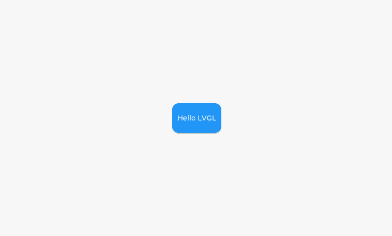
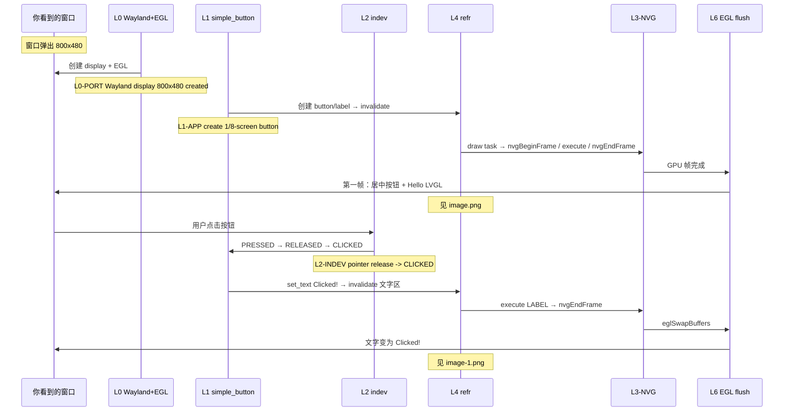
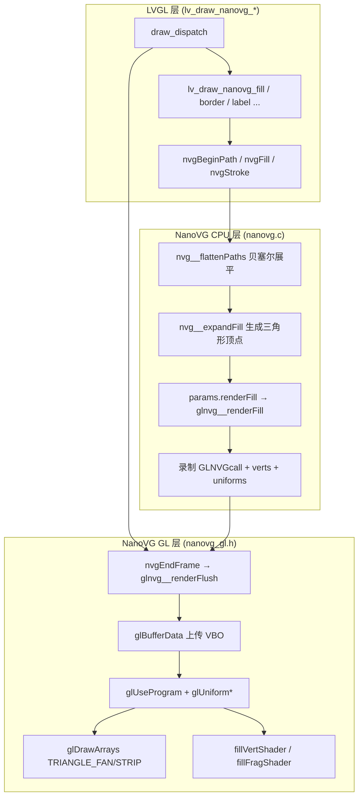
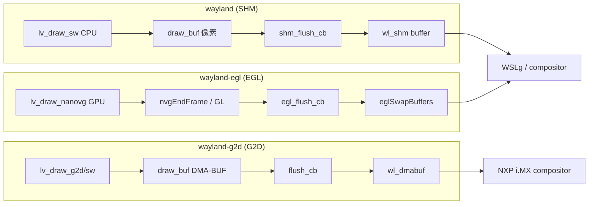
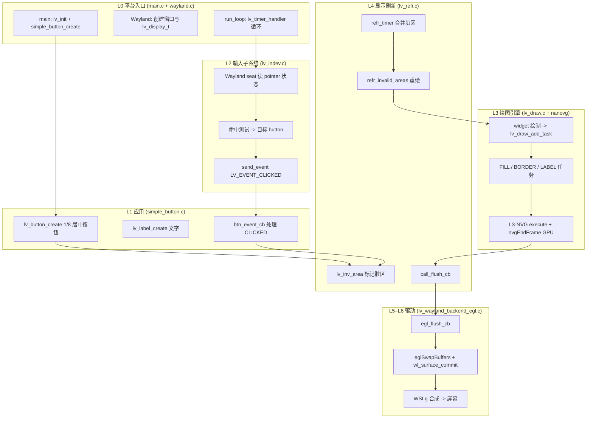
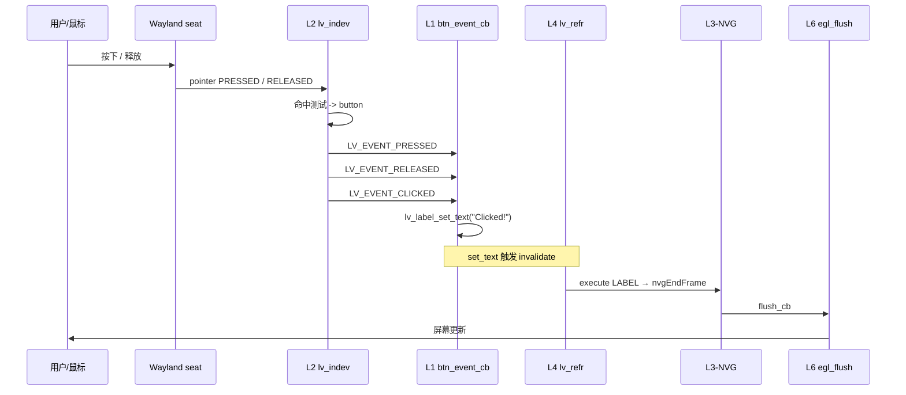

# 最简单 LVGL 示例：居中 Button（屏幕 1/8 大小）

本示例在屏幕中央放一个 **宽、高各为屏幕 1/8** 的按钮，代码独立在 `src/simple_button.c`，`main.c` 只负责初始化与主循环，不再加载 `lv_demo_widgets`。

## 运行

```bash
cmake -B build-egl -DCONFIG=wayland-egl && cmake --build build-egl
./build-egl/bin/lvglsim -b wayland 2>trace.log
```

点击按钮后，标签会从 `Hello LVGL` 变为 `Clicked!`。  
stderr 会输出各层 trace（`[LVGL:Lx-...]`，含 **`L3-NVG`** / **`L6 EGL flush`**），可用 `2>trace.log` 保存。

关闭 trace：CMake 配置时加 `-DLVGL_SIMPLE_BUTTON_TRACE=OFF`。

SHM（CPU）路径：`cmake -B build -DCONFIG=wayland && cmake --build build`。三种后端对比见下文「Wayland 三种后端对比」一节。

快捷脚本（默认 `build-egl`）：

```bash
chmod +x scripts/run_simple_button_demo.sh
LVGL_BUILD_DIR=./build-egl ./scripts/run_simple_button_demo.sh trace.log
```

---

## 五、实况运行讲解（WSL2 + Wayland-EGL）

> 以下基于 **2026-07-11** 在本机 WSLg 环境实际运行 `./build-egl/bin/lvglsim -b wayland`（**wayland-egl + NanoVG**）的界面与 stderr 日志整理。  
> 讲解方式：**先看屏幕看到什么 → 再对照日志里哪一行对应哪一层**。  
> SHM 路径的日志结构类似，但无 `L3-NVG`，L6 为 `Wayland SHM flush`（见「Wayland 三种后端对比」）。

### 5.1 你看到的界面（800×480 窗口）

**点击前（`Hello LVGL`）：**



**点击后（`Clicked!`）：**


说明：

| 屏幕元素 | 实测表现 | 来源 |
|----------|----------|------|
| 背景 | 浅灰铺满 800×480 | 默认 screen 样式 |
| 按钮 | 约 **100×60**（800/8 × 480/8），蓝色圆角，**居中** | `simple_button.c` |
| 文字 | 点击前 `Hello LVGL`，点击后 `Clicked!` | `lv_label` 子对象 |
| 右下角 FPS | **EGL 默认开启** | `configs/wayland-egl.defaults` 中 `LV_USE_PERF_MONITOR 1`（截图可能未含 FPS 条，以实际运行为准） |

> 截图文件与本文档同目录：`docs/image.png`（点击前）、`docs/image-1.png`（点击后）。界面布局与 SHM 相同，绘制走 **GPU NanoVG** 而非 CPU `lv_draw_sw`。

---

### 5.2 讲解员旁白：启动 → 第一帧上屏

**【画面】** 见 `image.png`：窗口弹出，**中央**出现一块小按钮（约为屏幕 1/8 宽高），写着 `Hello LVGL`。EGL 配置下右下角可能还有 **FPS 性能条**。

**【日志】** 按时间顺序，关键几行是（WSLg + wayland-egl 实测，已省略 FPS 条相关的重复 invalidate）：

```
[LVGL:L0-PORT] Wayland display 800x480 created
[LVGL:L1-APP] create 1/8-screen button on screen 0x...
[LVGL:L1-APP] button ready; first invalidate/refresh follows from lv_timer_handler()
[LVGL:L4-REFR] refresh timer: draw 1 dirty region(s)
[LVGL:L3-DRAW] add task FILL at (0,0)-(799,479)
[LVGL:L3-NVG] nvgBeginFrame 800x480
[LVGL:L3-NVG] execute FILL at (0,0)-(799,479)
[LVGL:L3-DRAW] add task OTHER at (350,210)-(449,269)
[LVGL:L3-NVG] execute OTHER at (350,210)-(449,269)
[LVGL:L3-DRAW] add task FILL at (350,210)-(449,269)
[LVGL:L3-NVG] execute FILL at (350,210)-(449,269)
[LVGL:L3-DRAW] add task LABEL at (361,232)-(438,247)
[LVGL:L3-NVG] execute LABEL at (361,232)-(438,247)
[LVGL:L3-NVG] nvgEndFrame -> glnvg__renderFlush (GPU draw)
[LVGL:L5-FLUSH] flush_cb area (0,0)-(799,479) px=0x...
[LVGL:L6-DRIVER] Wayland EGL flush (0,0)-(799,479) last=1 (nanovg/opengles swap)
```

**逐层解说：**

1. **L0-PORT** — “平台层先把窗户开好”  
   Wayland + **EGL** 在 WSLg 里创建 800×480 的 `lv_display_t`（`wl_egl_window` + OpenGL ES context）。

2. **L1-APP** — “应用层只干一件事：造按钮”  
   `simple_button_create()` 创建 **屏幕 1/8 大小**、居中的 `lv_button` 和子对象 `lv_label`。  
   此时**还没有像素**，只是对象树搭好了。

3. **L4-REFR** — “刷新层发现有一块脏区域要画”  
   创建/改样式时内部调用了 `lv_obj_invalidate()`，刷新定时器合并脏区后触发重绘。

4. **L3-DRAW** — “绘图层把 UI 拆成多个 draw task”  
   - 首帧可能先有一个全屏 `FILL`（背景）  
   - `OTHER` / `FILL` at **(350,210)-(449,269)**：居中按钮区 → **蓝色块**  
   - `LABEL`：**“Hello LVGL”** 文字

5. **L3-NVG** — “NanoVG 在 GPU 上真正画出来”  
   每个 task 对应一行 `execute ...`；一帧末尾 **`nvgEndFrame`** 批量 `glDrawArrays`（见「lv_draw_nanovg_* 详解」）。

6. **L5-FLUSH → L6-DRIVER** — “EGL 交换缓冲并提交 Wayland surface”  
   `flush_cb` → `egl_flush_cb` → **`eglSwapBuffers`** → `wl_surface_commit`，WSLg → D3D12 合成。  
   **这一刻，你在窗口里第一次看到 `image.png` 中的画面。**

---

### 5.3 讲解员旁白：点击按钮 → 改字 → 局部刷新

**【操作】** 用鼠标点击中央蓝色按钮（位置见 `image.png`）。

**【画面变化】** 见 `image-1.png`：  
- 文字从 `Hello LVGL` 变成 `Clicked!`  
- 按钮仍居中，尺寸不变

**【日志】** 一次完整点击的关键序列（结构与 SHM 相同，驱动层为 EGL）：

```
[LVGL:L1-APP] LV_EVENT_PRESSED on button 0x...
[LVGL:L1-APP] LV_EVENT_RELEASED on button 0x...
[LVGL:L2-INDEV] pointer release -> LV_EVENT_CLICKED on 0x...
[LVGL:L1-APP] LV_EVENT_CLICKED -> update label text
[LVGL:L4-REFR] invalidate area (357,228)-(442,251)
...
[LVGL:L4-REFR] refresh timer: draw 1 dirty region(s)
[LVGL:L3-DRAW] add task LABEL at (372,232)-(428,247)
[LVGL:L3-NVG] execute LABEL at (372,232)-(428,247)
[LVGL:L3-NVG] nvgEndFrame -> glnvg__renderFlush (GPU draw)
[LVGL:L5-FLUSH] flush_cb area (0,0)-(799,479) px=0x...
[LVGL:L6-DRIVER] Wayland EGL flush (0,0)-(799,479) last=1 (nanovg/opengles swap)
```

**逐层解说：**

| 步骤 | 层 | 界面现象 | 日志关键词 |
|------|-----|----------|------------|
| 1 | L2 输入 | 鼠标按下 | （Wayland seat → indev；PRESSED 由 L1 收到） |
| 2 | L1 应用 | 按钮按下态 | `LV_EVENT_PRESSED on button` |
| 3 | L2 输入 | 鼠标释放，命中测试仍落在 button 上 | `pointer release -> LV_EVENT_CLICKED` |
| 4 | L1 应用 | 回调执行，`lv_label_set_text("Clicked!")` | `LV_EVENT_CLICKED -> update label text` |
| 5 | L4 刷新 | 文字区域被标脏 | `invalidate area (357,228)-(...)` |
| 6 | L3-DRAW / L3-NVG | 只重画 label（GPU） | `add task LABEL` → `execute LABEL` |
| 7 | L3-NVG | 提交 GL 绘制 | `nvgEndFrame -> glnvg__renderFlush` |
| 8 | L5–L6 | EGL swap + Wayland commit | `Wayland EGL flush ... last=1` |

**要点（讲解员总结）：**

- **事件从 L2 进、L1 收**：应用层 `btn_event_cb` 不直接读硬件，只处理 LVGL 派发的 `LV_EVENT_*`。  
- **改文字 ≠ 立刻改屏幕**：`lv_label_set_text` 先 invalidate，等下一拍 `refr_timer` 才真正画。  
- **EGL 比 SHM 多一层 L3-NVG**：`add task` 之后还有 `execute` / `nvgEndFrame`，才是 GPU 绘制。  
- **脏区比按钮小得多**：invalidate 主要覆盖 label 包围盒，与 `image-1.png` 中仅文字变化一致。

---

### 5.4 界面 ↔ 日志 对照速查



---

### 5.5 自己复现本次讲解

**构建（若尚未 build-egl）：**

```bash
cmake -B build-egl -DCONFIG=wayland-egl && cmake --build build-egl
```

**终端 1 — 运行并写日志：**

```bash
LVGL_BUILD_DIR=./build-egl ./scripts/run_simple_button_demo.sh trace.log
```

**终端 2 — 实时看日志：**

```bash
tail -f trace.log | grep --line-buffered '\[LVGL:'
```

**点击窗口**（纯 Wayland 时 `xdotool` 可能找不到窗口，可用下面任一方式）：

```bash
# 方式 A：手动用鼠标点窗口
# 方式 B：ydotool 模拟点击（WSL 下实测可用）
ydotool click 0xC0
```

**预期：** `trace.log` 中出现与 §5.2、§5.3 相同结构的 `[LVGL:Lx-...]` 行（含 **`L3-NVG`**、**`L6-DRIVER Wayland EGL flush`**）；界面文字变为 `Clicked!`。

---

## Wayland 三种后端对比（SHM / EGL / G2D）

Wayland 驱动在编译期 **三选一**，由 `lv_conf_internal.h` 根据 `LV_USE_OPENGLES` / `LV_USE_G2D` 自动设定 `LV_WAYLAND_USE_*`（互斥，只链接一个 `wl_backend_ops` 实现）。**应用层代码（`simple_button.c`）完全相同**，差异在 CMake 配置、绘制单元与 flush 回调。

### 总览对比

| 维度 | **SHM**（默认） | **EGL** | **G2D** |
|------|----------------|---------|---------|
| **CMake 配置** | `-DCONFIG=wayland` | `-DCONFIG=wayland-egl` | `-DCONFIG=wayland-g2d` |
| **配置文件** | `configs/wayland.defaults` | `configs/wayland-egl.defaults` | `configs/wayland-g2d.defaults` |
| **触发宏** | 无 `OPENGLES` / 无 `G2D` | `LV_USE_OPENGLES=1` | `LV_USE_G2D=1` + `LV_USE_DRAW_G2D=1` |
| **源码文件** | `lv_wayland_backend_shm.c` | `lv_wayland_backend_egl.c` | `lv_wayland_backend_g2d.c` |
| **flush 回调** | `shm_flush_cb` | `egl_flush_cb` | `flush_cb`（g2d） |
| **Wayland 协议** | `wl_shm` | `wayland-egl` + `wl_surface` | `zwp_linux_dmabuf_v1`（DMA-BUF） |
| **屏幕缓冲** | `shm_open` + `mmap` 共享内存 | `wl_egl_window` + EGL surface | DMA-BUF fd → `wl_buffer` |
| **提交方式** | `wl_surface_attach(shm_buffer)` + `commit` | `eglSwapBuffers` + `wl_surface_commit` | `wl_surface_attach(dmabuf)` + `commit` |
| **LVGL 绘制单元** | `lv_draw_sw`（CPU） | `lv_draw_nanovg`（GPU/OpenGL ES） | `lv_draw_g2d`（NXP 2D）+ `lv_draw_sw` 兜底 |
| **GPU 参与** | 否（CPU 写像素） | 是（NanoVG → GLES shader） | 是（NXP G2D 2D 引擎，非通用 GL） |
| **3D / glTF** | 不支持 | 支持 | 不支持 |
| **目标平台** | 任意 Wayland compositor | 有 OpenGL ES 的平台 | **NXP i.MX**（i.MX6/8/9 等） |
| **WSL2 / WSLg** | ✅ 可用 | ✅ 可用（Mesa D3D12） | ❌ 不可用（无 G2D、无 native DMA-BUF） |
| **额外依赖** | 无 | `libEGL`、`libGLESv2`、`libwayland-egl` | `libg2d`、DMA-BUF 协议、G2D 驱动 |

### 绘制与数据流

| 阶段 | **SHM** | **EGL** | **G2D** |
|------|---------|---------|---------|
| **L3 绘制** | `lv_draw_sw_*` CPU 写 `draw_buf` | `lv_draw_nanovg_*` → `nvgEndFrame` → GL | 纯矩形 FILL 可走 `lv_draw_g2d_fill`；圆角/边框/文字等回退 **`lv_draw_sw`** |
| **缓冲位置** | CPU 可写 mmap 内存 | GPU FBO / EGL 前后缓冲 | G2D 可访问的 DMA-BUF 内存 |
| **flush 做什么** | attach CPU 像素到 `wl_shm` | GPU swap + damage + commit | attach DMA-BUF；旋转时用 **`g2d_rotate`** |
| **典型数据流** | CPU 像素 → shm → WSLg | NanoVG/GLES → EGL swap → WSLg | CPU/G2D → dmabuf → compositor 零拷贝合成 |

```text
【wayland — SHM】
  LVGL CPU 画像素 → shm_flush_cb → wl_surface (共享内存) → WSLg

【wayland-egl — EGL】
  LVGL 绘制 → NanoVG/OpenGLES → egl_flush_cb → wl_egl_window
  → EGL swap → wl_surface → WSLg → D3D12 (Intel 630)

【wayland-g2d — G2D】
  lv_draw_g2d/sw → draw_buf (DMA-BUF) → flush_cb → wl_dmabuf → compositor (NXP i.MX)
```

### 能力与限制

| 能力 | **SHM** | **EGL** | **G2D** |
|------|---------|---------|---------|
| **Compositor 兼容性** | 最好（所有 Wayland） | 需 EGL 平台支持 | 需 **linux-dmabuf** 协议 |
| **双缓冲** | ✅（2 个 shm buffer） | ✅（EGL swap） | ✅（2 个 dmabuf buffer） |
| **屏幕旋转** | ✅（CPU `lv_draw_sw_rotate`） | ✅ | ✅（`g2d_rotate` 硬件旋转） |
| **圆角按钮（本示例）** | ✅ CPU | ✅ NanoVG GPU | 圆角 FILL **不走 G2D**，回退 CPU |
| **文字 LABEL** | ✅ CPU | ✅ GPU 纹理采样 | ✅ CPU（G2D 不接 LABEL task） |
| **IMAGE 贴图** | ✅ CPU | ✅ GPU | G2D IMAGE 路径 **当前禁用**（源码 `#if 0`） |
| **本仓库 layer trace** | L0–L6（含 `L6 SHM flush`） | L0–L6（含 `L3-NVG`、`L6 EGL flush`） | L0–L5 共用；**无 L6 / 无 L3-NVG** |

> G2D draw unit 仅加速 **无圆角、无渐变的纯矩形 FILL**（`lv_draw_g2d.c` 中 `radius != 0` 或渐变时回退 SW）。本示例按钮有圆角，G2D 配置下 FILL 仍主要由 CPU 完成；G2D 后端的价值主要在 **DMA-BUF 零拷贝提交** 与 **硬件旋转**。

### 选型建议

| 场景 | 推荐后端 |
|------|----------|
| WSL2 开发 / 桌面 Wayland 调试 | **EGL**（本指南实况）或 **SHM** |
| 需要 3D/glTF、GPU 加速 UI | **EGL** |
| 最低依赖、最大兼容 | **SHM** |
| NXP i.MX 嵌入式、dmabuf 零拷贝 | **G2D** |
| 无 G2D 硬件 / 无 dmabuf 的 compositor | **SHM** 或 **EGL** |

### 构建命令速查

```bash
# EGL + NanoVG（WSLg 推荐，与本指南 §5 一致）
cmake -B build-egl -DCONFIG=wayland-egl && cmake --build build-egl

# SHM（CPU，依赖最少）
cmake -B build -DCONFIG=wayland && cmake --build build

# G2D（NXP 板卡，如 imx93；WSL2 上不可用）
cmake -B build-g2d -DCONFIG=wayland-g2d && cmake --build build-g2d
```

运行命令相同：`./build*/bin/lvglsim -b wayland`。

### SHM vs EGL 压力测试对比（WSLg，2026-07-11）

使用 `lv_demo_stress`，各后端运行 **45 秒**，sysmon 日志模式统计 FPS（去掉前 3 个启动样本）。复现：

```bash
./scripts/benchmark_stress_shm_vs_egl.sh 45          # 800×480（默认）
./scripts/benchmark_stress_shm_vs_egl.sh 45 3200 1920  # 4× 分辨率
```

测试前在 `configs/wayland.defaults` / `wayland-egl.defaults` 中设置 `LV_DEF_REFR_PERIOD`，然后重新 cmake 构建 `build-stress-shm` / `build-stress-egl`。

#### `LV_DEF_REFR_PERIOD = 16`（理论上限 ~62 FPS）

| 指标 | SHM | EGL |
|------|-----|-----|
| **平均 FPS** | **61.2** | **61.1** |
| **中位 FPS** | 62 | 62 |
| **CPU** | 2.3% | 3.3% |
| **flush** | 2.6 ms | 7.1 ms |

#### `LV_DEF_REFR_PERIOD = 1`（极高刷新请求）

| 指标 | SHM | EGL |
|------|-----|-----|
| **稳定 FPS**（过滤 >120 离群值） | **61.6** | **63.1** |
| **中位 FPS** | 61 | 60 |
| **CPU** | 2.3% | 3.6% |
| **flush** | 14.7 ms | 14.4 ms |

> `REF_PERIOD=1` 时 sysmon 原始 `fps_avg` 会飙到 157 / 174（max 720 / 792），系 300 ms 统计窗口在极高刷新请求下的计数 artifact，**不能当真**；实际仍被 WSLg compositor / vsync 限制在 **~60 FPS**。

**结论（两次 stress 一致）：**

- SHM 与 EGL **帧率几乎相同**，瓶颈在 compositor / 刷新周期，而非 CPU 绘制 vs GPU NanoVG。
- EGL **flush 耗时更高**（16 ms 时约 7 ms vs 2.6 ms）；`REF_PERIOD=1` 时两条路径 flush 均升至 ~15 ms。
- 当前配置文件中 `LV_DEF_REFR_PERIOD` 仍为 **1**（stress 测试用）；simple button 日常调试可改回 **33** 或 **16**。

#### 分辨率 ×4（3200×1920，`LV_DEF_REFR_PERIOD = 1`）

命令：`./build-stress-*/bin/lvglsim -b wayland -W 3200 -H 1920`（默认 800×480 的 4 倍）。

| 指标 | SHM | EGL | 800×480 对照（REF=1） |
|------|-----|-----|------------------------|
| **稳定 FPS**（过滤 >120 离群值） | **57.3** | **25.2** | 61.6 / 63.1 |
| **中位 FPS** | 58 | 23 | 61 / 60 |
| **CPU** | 3.7% | 3.7% | 2.3% / 3.6% |
| **render** | 0.9 ms | 0.1 ms | ~0 / ~0 |
| **flush** | 14.6 ms | **44.2 ms** | 14.7 / 14.4 ms |

**4× 分辨率结论：**

- 像素面积增至 **16 倍**（800×480 → 3200×1920），SHM 仍维持 **~57 FPS**，仅略低于 800×480 的 ~61 FPS。
- EGL 降至 **~25 FPS**，瓶颈在 **flush / `eglSwapBuffers`**（平均 44 ms，峰值 flush 可达 146 ms），NanoVG GPU 绘制本身仍很快（render ≈ 0）。
- **高分辨率 stress 场景下 SHM 明显优于 EGL**；与 800×480 上「两者帧率几乎相同」形成对比。

---

### 公共入口（三种后端相同）

从 `main()` 到主循环，三种后端走同一套 Wayland 窗口框架；**分叉发生在 `wl_backend_ops.init()` / `init_display()`**（编译期按 `LV_WAYLAND_USE_SHM` / `LV_WAYLAND_USE_EGL` / `LV_WAYLAND_USE_G2D` 链接不同 backend 文件）。

```text
main()
  └─ lv_init()
  └─ driver_backends_init_backend("wayland")          [src/lib/display_backends/wayland.c]
       └─ init_wayland()
            └─ lv_wayland_window_create()              [lvgl/src/drivers/wayland/lv_wayland_window.c]
                 ├─ lv_wayland_init()                   [lvgl/src/drivers/wayland/lv_wayland.c]
                 │    ├─ wl_display_connect()
                 │    ├─ wl_backend_ops.init()          ← SHM / EGL 分叉
                 │    ├─ wl_display_get_registry()
                 │    └─ wl_registry_add_listener() → handle_global()
                 ├─ lv_display_create()
                 ├─ wl_compositor_create_surface()
                 ├─ lv_wl_xdg_create_window()
                 ├─ wl_backend_ops.init_display()     ← 注册 flush_cb 的分叉
                 ├─ lv_wayland_pointer_create() / keyboard ...
                 └─ lv_wayland_xdg_configure_surface()
  └─ simple_button_create()
  └─ driver_backends_run_loop()
       └─ while(1)
            └─ lv_wayland_timer_handler()               (= lv_timer_handler)
                 ├─ lv_display_refr_timer()            刷新 / 绘制
                 ├─ lv_indev_read_timer_cb()           输入
                 └─ read_compositor_events_timer_cb()
                      └─ lv_wayland_flush() → wl_display_flush()
```

输入路径（点击按钮）三种后端相同：

```text
lv_indev_read_timer_cb()
  └─ lv_indev_read()
       └─ Wayland pointer 回调
            └─ 命中测试 → lv_obj_send_event()
                 └─ LV_EVENT_PRESSED / RELEASED / CLICKED
                      └─ btn_event_cb()                [src/simple_button.c]
                           └─ lv_label_set_text()
                                └─ lv_obj_invalidate() → lv_inv_area()
```

---

### 【wayland — SHM】函数链

#### 初始化

```text
wl_backend_ops.init()
  └─ shm_init()                                        [lv_wayland_backend_shm.c]
       └─ (registry 回调中绑定 wl_shm)

wl_backend_ops.init_display()
  └─ shm_init_display()
       ├─ shm_create_display_data()
       │    ├─ create_shm_file() → shm_open / ftruncate / mmap
       │    ├─ wl_shm_create_pool()
       │    └─ wl_shm_pool_create_buffer()             → wl_buffer
       ├─ lv_display_set_flush_cb(shm_flush_cb)
       └─ lv_display_set_flush_wait_cb(flush_wait_cb)
```

#### 一帧刷新（CPU 软件绘制）

```text
lv_timer_handler()
  └─ lv_display_refr_timer()                           [lvgl/src/core/lv_refr.c]
       ├─ lv_obj_update_layout()
       ├─ lv_refr_join_area()
       └─ refr_invalid_areas()
            └─ refr_area()
                 └─ refr_configured_layer()
                      └─ refr_obj_and_children()
                           └─ lv_obj_redraw() / 控件 DRAW 事件
                                └─ lv_draw_add_task()    [lvgl/src/draw/lv_draw.c]
                                     (FILL / BORDER / LABEL …)
                 └─ draw_buf_flush()
                      └─ lv_draw_dispatch()
                           └─ lv_draw_sw::dispatch()    [lvgl/src/draw/sw/lv_draw_sw.c]
                                ├─ lv_draw_sw_fill()    [lv_draw_sw_fill.c]
                                ├─ lv_draw_sw_border()
                                ├─ lv_draw_sw_label() / lv_draw_sw_letter()
                                └─ … 纯 CPU 写 draw_buf 像素
                      └─ call_flush_cb()
                           └─ disp->flush_cb()
                                └─ shm_flush_cb()       [lv_wayland_backend_shm.c]
                                     ├─ (可选) lv_color_premultiply()
                                     ├─ (可选) lv_draw_sw_rotate()
                                     ├─ wl_surface_damage()
                                     ├─ wl_surface_attach(wl_buffer)
                                     ├─ wl_surface_frame() + frame_listener
                                     └─ wl_surface_commit()
                                          └─ lv_wayland_flush()
                                               └─ wl_display_flush()
                                                    └─ WSLg → D3D12 (Intel 630)
                                     └─ frame_done() → lv_display_flush_ready()
```

§5.2、§5.3 中的 `L6-DRIVER Wayland EGL flush` 即 `egl_flush_cb()` 内 trace；SHM 路径对应 `Wayland SHM flush`。

---

### 【wayland-egl — EGL】函数链

#### 初始化

```text
wl_backend_ops.init()
  └─ wl_egl_init()                                     [lv_wayland_backend_egl.c]（空操作）

wl_backend_ops.init_display()
  └─ wl_egl_init_display()
       ├─ egl_create_display_data()
       │    ├─ lv_opengles_egl_context_create()        [lv_opengles_egl.c]
       │    │    ├─ dlopen("libEGL.so") / dlopen("libGLESv2.so")
       │    │    ├─ eglGetDisplay()                     (EGL_PLATFORM_WAYLAND_KHR)
       │    │    ├─ eglInitialize()
       │    │    ├─ wl_egl_create_window()
       │    │    │    └─ wl_egl_window_create(wl_surface)
       │    │    ├─ eglChooseConfig()
       │    │    ├─ eglCreateWindowSurface()
       │    │    ├─ eglCreateContext()                  (OpenGL ES 2/3)
       │    │    └─ eglMakeCurrent()
       │    └─ lv_opengles_texture_reshape()            [lv_opengles_texture.c]
       ├─ lv_display_set_flush_cb(egl_flush_cb)
       ├─ lv_display_set_flush_wait_cb(flush_wait_cb)
       └─ lv_display_set_render_mode(FULL)              (NANOVG 时)

(启动时)
lv_draw_nanovg_init()                                  [lv_draw_nanovg.c]
  └─ nvgCreateGLES2/GLES3()                            ← NanoVG 绑定 OpenGL ES
  └─ lv_nanovg_*_init()
```

#### 一帧刷新（NanoVG + OpenGL ES 绘制）

```text
lv_timer_handler()
  └─ lv_display_refr_timer()
       └─ refr_invalid_areas()
            └─ refr_obj_and_children()
                 └─ lv_draw_add_task()                  (任务类型同上: FILL/LABEL…)
            └─ draw_buf_flush()
                 └─ lv_draw_dispatch()
                      └─ lv_draw_nanovg::draw_dispatch()  [lv_draw_nanovg.c]
                           ├─ on_layer_changed()
                           │    ├─ nvgluBindFramebuffer(FBO)
                           │    └─ glClear()
                           ├─ nvgBeginFrame()
                           └─ draw_execute()
                                ├─ lv_draw_nanovg_fill()
                                │    ├─ nvgBeginPath()
                                │    ├─ lv_nanovg_path_append_rect()
                                │    └─ lv_nanovg_fill() → nvgFill()  (录制，尚未 glDraw)
                                ├─ lv_draw_nanovg_border()
                                ├─ lv_draw_nanovg_label()
                                └─ …
                           └─ lv_nanovg_end_frame()
                                └─ nvgEndFrame()         → glnvg__renderFlush → glDrawArrays
                 └─ call_flush_cb()
                      └─ egl_flush_cb()                [lv_wayland_backend_egl.c]
                           ├─ glBindTexture()
                           ├─ glTexImage2D(..., fb1)    (像素上传到 GL 纹理)
                           ├─ lv_opengles_render_display()  [lv_opengles_driver.c]
                           │    ├─ glActiveTexture / glBindTexture
                           │    ├─ lv_opengles_shader_bind()
                           │    └─ lv_opengles_render_draw()  → GL 四边形贴图到 EGL surface
                           ├─ lv_opengles_egl_update()
                           │    └─ eglSwapBuffers()      ← GPU 交换前后缓冲
                           ├─ wl_surface_frame()
                           ├─ wl_surface_damage()
                           └─ wl_surface_commit()
                                └─ WSLg → D3D12 (Intel 630)
                           └─ frame_done() → lv_display_flush_ready()
```

> `wayland-egl.defaults` 中 **`LV_USE_DRAW_OPENGLES=0`，`LV_USE_DRAW_NANOVG=1`**，因此走 NanoVG 绘制 + `egl_flush_cb` 里 `eglSwapBuffers` 分支，而非 `LV_USE_DRAW_OPENGLES` 的 `lv_opengles_render_display_texture()` 分支。

---

### 【wayland-g2d — G2D】函数链（NXP i.MX）

> WSL2 上无法运行；以下供 NXP 板卡对照。本示例 layer trace **不含 G2D 专用 L6**（仅 L0–L5 共用）。

#### 初始化

```text
wl_backend_ops.init()
  └─ wl_g2d_init()                                     [lv_wayland_backend_g2d.c]

wl_backend_ops.init_display()
  └─ wl_g2d_init_display()
       ├─ wl_g2d_create_display_data()
       │    ├─ init_buffer() × 2（双缓冲）
       │    │    ├─ lv_draw_buf_create()
       │    │    ├─ g2d_get_buf_fd()                   → DMA-BUF fd
       │    │    └─ zwp_linux_buffer_params_v1_create() → wl_buffer
       │    └─ （若旋转）rotate_buffer
       ├─ lv_display_set_flush_cb(flush_cb)
       └─ lv_display_set_flush_wait_cb(flush_wait_cb)

(启动时，wayland-g2d.defaults)
lv_draw_g2d_init()                                     [lv_draw_g2d.c]
  └─ NXP G2D 2D 引擎初始化
```

#### 一帧刷新（G2D + SW 混合绘制）

```text
lv_timer_handler()
  └─ lv_display_refr_timer()
       └─ draw_buf_flush()
            └─ lv_draw_dispatch()
                 ├─ lv_draw_g2d::dispatch()            仅无圆角纯矩形 FILL
                 │    └─ lv_draw_g2d_fill()           → G2D 硬件 blit/fill
                 └─ lv_draw_sw::dispatch()            圆角/边框/文字等兜底
            └─ call_flush_cb()
                 └─ flush_cb()                         [lv_wayland_backend_g2d.c]
                      ├─ wl_surface_damage()
                      ├─ （若旋转）g2d_rotate()
                      ├─ wl_surface_attach(wl_buffer)  DMA-BUF
                      ├─ wl_surface_frame() + frame_listener
                      └─ wl_surface_commit()
                           └─ compositor 零拷贝合成
                      └─ frame_done() → lv_display_flush_ready()
```

---

### lv_draw_nanovg_* 详解：形状/效果如何变成 gl* 与 shader

在 `lv_draw_nanovg_*.c` 里搜不到 `glDraw*` 和 shader 字符串是**正常的**——这些文件只负责把 LVGL draw task 翻译成 NanoVG 的 `nvg*` 命令；真正调用 OpenGL ES 的代码在 **`lvgl/src/libs/nanovg/nanovg_gl.h`**，且采用 **「先录制、后 flush」** 的两段式架构。

#### 为什么 `lv_draw_nanovg_*` 里没有 `gl*`？

以按钮背景（FILL task）为例，链路止于 `nvgFill()`：

```text
lv_draw_nanovg_fill()              [lv_draw_nanovg_fill.c]
  └─ nvgBeginPath()
  └─ lv_nanovg_path_append_rect()  → nvgRoundedRect / nvgRect
  └─ lv_nanovg_fill()              [lv_nanovg_utils.c]
       └─ nvgPathWinding / nvgFillColor
       └─ nvgFill()                ← 到这里为止，仍无 gl*
```

`lv_draw_nanovg_*` 的职责是 **「描述要画什么形状、什么颜色/纹理」**，不负责发 GL draw call。

#### 两段式架构：录制 vs flush



**要点：**

- 每次 `nvgFill()` 调用时 **不会立即** `glDraw*`；CPU 侧完成路径三角化后，通过回调 **`glnvg__renderFill()` 把 draw call 排队**。
- 一帧内多个 `nvgFill` / `nvgStroke` 在 **`nvgEndFrame()`** 时由 **`glnvg__renderFlush()` 批量提交**，减少 GL state 切换。

#### 完整调用链（EGL 路径）

**阶段 A — LVGL 调度（每个 draw task）**

```text
lv_draw_dispatch()
  └─ lv_draw_nanovg::draw_dispatch()          [lv_draw_nanovg.c]
       ├─ glViewport(w, h)                     ← 此处已有少量 gl*
       ├─ nvgBeginFrame(u->vg, w, h, 1.0)
       └─ draw_execute()
            switch(task->type):
              FILL   → lv_draw_nanovg_fill()
              BORDER → lv_draw_nanovg_border()
              LABEL  → lv_draw_nanovg_label()
              IMAGE  → lv_draw_nanovg_image()
              LINE   → lv_draw_nanovg_line()
              ARC    → lv_draw_nanovg_arc()
              ...
       (layer 切换或 idle 时)
       └─ lv_nanovg_end_frame()
            └─ nvgEndFrame(u->vg)
```

**阶段 B — NanoVG CPU 侧（路径 → 三角形，仍无 GL draw）**

```text
nvgFill()                                     [nanovg.c]
  ├─ nvg__flattenPaths()                      贝塞尔 → 折线
  ├─ nvg__expandFill()                        生成 fill/stroke 顶点 (CPU)
  └─ ctx->params.renderFill(...)              回调 → glnvg__renderFill()
       └─ 拷贝顶点到 gl->verts[]，分配 uniform，记录 GLNVGcall（还不画）

nvgEndFrame()                                 [nanovg.c]
  └─ ctx->params.renderFlush(...)             回调 → glnvg__renderFlush()
```

**阶段 C — NanoVG GL backend（`nanovg_gl.h`，这里有 gl* 和 shader）**

`nvgCreateGLES2/3()` 注册回调表：

```text
params.renderFlush         = glnvg__renderFlush;
params.renderFill          = glnvg__renderFill;
params.renderStroke        = glnvg__renderStroke;
params.renderTriangles     = glnvg__renderTriangles;
params.renderCreateTexture = glnvg__renderCreateTexture;
```

`glnvg__renderFill()` — **录制** draw call：

```text
glnvg__renderFill()
  ├─ call->type = GLNVG_FILL
  ├─ lv_memcpy(&gl->verts[offset], path->fill, ...)   顶点数据
  ├─ glnvg__convertPaint(...)                         颜色/渐变/纹理 → uniform
  └─ call->shaderType = NSVG_SHADER_FILLGRAD 或 FILLIMG
```

`glnvg__renderFlush()` — **批量提交** 到 GPU：

```text
glnvg__renderFlush()
  ├─ glEnable(GL_BLEND)
  ├─ glBindBuffer(GL_ARRAY_BUFFER, ...)
  ├─ glBufferData(..., gl->verts, GL_STREAM_DRAW)     上传 VBO
  ├─ glVertexAttribPointer(0, ...)                    position
  ├─ glVertexAttribPointer(1, ...)                    texcoord
  └─ for each GLNVGcall:
       GLNVG_FILL   → glnvg__fill()    → glDrawArrays(...)
       GLNVG_STROKE → glnvg__stroke()  → glDrawArrays(...)
       ...
```

`glnvg__fill()` — 典型 fill 的三步 GL 绘制（stencil + AA + 着色）：

```text
glnvg__fill()
  ├─ glEnable(GL_STENCIL_TEST)
  ├─ glUseProgram(NSVG_SHADER_SIMPLE)                 stencil pass
  ├─ glDrawArrays(GL_TRIANGLE_FAN, ...)               1) 写 stencil
  ├─ glnvg__setUniforms(..., fill shader)
  │    ├─ glUseProgram(gl->shaders[shaderType].prog)
  │    ├─ glUniform4fv(...) 或 glBindBufferRange(UBO)
  │    └─ glBindTexture(...)
  ├─ glDrawArrays(GL_TRIANGLE_STRIP, ...)               2) AA 边缘
  └─ glDrawArrays(GL_TRIANGLE_STRIP, ...)               3) 填充颜色/渐变/纹理
```

#### Shader 在哪里？

**内嵌在 `lvgl/src/libs/nanovg/nanovg_gl.h` 的 `glnvg__renderCreate()` 中**，以 C 字符串形式定义，启动时用 `glCompileShader` / `glLinkProgram` 链成 4 个 program（`SHADER_TYPE 0..3`）：

| SHADER_TYPE | 名称 | fragment shader 做什么 |
|-------------|------|------------------------|
| 0 | `FILLGRAD` | 纯色/渐变 fill：`sdroundrect` SDF + `mix(innerCol, outerCol, d)` |
| 1 | `FILLIMG` | 图片 fill：`texture2D(tex, pt)` + recolor/tint |
| 2 | `SIMPLE` | stencil pass：输出 `(1,1,1,1)`，只写模板缓冲 |
| 3 | `IMG` | 文字/纹理三角形：`texture2D(tex, ftcoord)` |

GLES2 下 shader header 为 `#version 100`，通过 `#define NANOVG_GL2 1` 走 `attribute` / `varying` / `gl_FragColor` 分支。

#### 按 draw task 类型展开

| LVGL task | lv_draw_nanovg 入口 | NanoVG API | GL backend 最终行为 |
|-----------|---------------------|------------|---------------------|
| **FILL** | `lv_draw_nanovg_fill` | `nvgRoundedRect` → `nvgFill` | `GLNVG_FILL` + `NSVG_SHADER_FILLGRAD` |
| **BORDER** | `lv_draw_nanovg_border` | 外 rect + 内 rect（even-odd）→ `nvgFill` | 同上 |
| **LABEL** | `lv_draw_nanovg_label` → 逐 glyph | `nvgCreateImage` + `nvgImagePattern` + `nvgFill` | `glGenTextures`/`glTexImage2D` 上传字形 → `NSVG_SHADER_FILLIMG` |
| **IMAGE** | `lv_draw_nanovg_image` | `nvgImagePattern` + `nvgFill` | 纹理采样 shader |
| **LINE** | `lv_draw_nanovg_line` | `nvgMoveTo`/`nvgLineTo` → `nvgStroke` | `GLNVG_STROKE` |
| **ARC** | `lv_draw_nanovg_arc` | `nvgArc` → fill/stroke | fill 或 stroke shader |
| **BOX_SHADOW** | `lv_draw_nanovg_box_shadow` | 模糊 rect → `nvgFill` | fill shader + 可能 blur FBO |

文字（LABEL）示例——字形 bitmap 先上传为 GL 纹理，再按 rect fill：

```text
draw_letter_bitmap()
  ├─ nvgCreateImage(..., NVG_TEXTURE_ALPHA, bitmap)   → glGenTextures + glTexImage2D
  ├─ nvgImagePattern(..., image_handle, ...)
  ├─ nvgBeginPath → nvgRect → nvgFillPaint → nvgFill
  └─ nvgEndFrame 时 glDrawArrays 采样该纹理
```

#### simple button 一帧（EGL）的实际路径

```text
lv_draw_nanovg_fill        → nvgRoundedRect + nvgFillColor + nvgFill
lv_draw_nanovg_border      → 双 rect + nvgFill
lv_draw_nanovg_label       → 每字: nvgCreateImage(A8) + nvgImagePattern + nvgFill

(每个 nvgFill: CPU 三角化 → glnvg__renderFill 录制)

lv_nanovg_end_frame
  └─ nvgEndFrame → glnvg__renderFlush
       ├─ glBufferData(verts)
       ├─ glUseProgram(fill shader)
       └─ glDrawArrays (按钮 / 边框 / 文字)

egl_flush_cb (Wayland 后端，在 NanoVG 之外)
  └─ glTexImage2D / lv_opengles_render_display / eglSwapBuffers
```

#### 源码快速定位

| 想找什么 | 文件 |
|----------|------|
| LVGL task → nvg 命令 | `lvgl/src/draw/nanovg/lv_draw_nanovg_*.c` |
| 路径数学、三角化（CPU） | `lvgl/src/libs/nanovg/nanovg.c` |
| **gl*、shader、glDrawArrays** | `lvgl/src/libs/nanovg/nanovg_gl.h` |
| FBO / 额外 GL 工具 | `lvgl/src/libs/nanovg/nanovg_gl_utils.h` |
| 调度 nvgBeginFrame / EndFrame | `lvgl/src/draw/nanovg/lv_draw_nanovg.c` |

---

### NanoVG 是 CPU 还是 OpenGL ES？

**结论：在本项目中 NanoVG 走 GPU（OpenGL ES），不是 CPU 软件光栅化。**

| 组件 | 渲染位置 | 关键 API |
|------|----------|----------|
| `lv_draw_sw`（SHM 路径） | **CPU** 写内存像素 | `lv_draw_sw_fill()` 等 |
| **NanoVG**（EGL 路径） | **GPU**，OpenGL ES 2/3 | `nvgCreateGLES2/3()` → `nvgFill()`（录制）→ `nvgEndFrame()`（flush） |
| NanoVG 库内部 | CPU 三角化 + **GL shader 光栅化** | `nanovg_gl.h` 中的 `glnvg__renderFlush` |

源码依据：

- `lv_draw_nanovg_init()` 调用 `nvgCreateGLES2/GLES3()`（`lv_draw_nanovg.c`）
- `lv_draw_nanovg_fill()` 内部 `nvgBeginPath()` → `nvgFill()`（`lv_draw_nanovg_fill.c`）
- `nvgFill()` 回调 `glnvg__renderFill()` 录制顶点；`lv_nanovg_end_frame()` → `nvgEndFrame()` → `glnvg__renderFlush()` 发 GL 命令（`lv_nanovg_utils.c` + `nanovg_gl.h`）

补充：`wayland-egl.defaults` 仍保留 **`LV_USE_DRAW_SW=1`** 作为兜底（NanoVG 不支持的 draw task 时回退 CPU）；simple button 的 FILL/LABEL 等常规任务会优先被 **NanoVG draw unit** 接走（`draw_evaluate()` score=80）。

---

### 三种后端对照（一句话）

| 阶段 | SHM | EGL + NanoVG | G2D |
|------|-----|--------------|-----|
| **绘制** | `lv_draw_sw_*()` CPU | `lv_draw_nanovg_*()` → `nvg*` → OpenGL ES / GPU | `lv_draw_g2d`（部分 FILL）+ `lv_draw_sw` 兜底 |
| **缓冲** | `mmap` + `wl_shm` 共享内存 | GPU FBO/纹理 + `eglSwapBuffers` | DMA-BUF + G2D 可访问内存 |
| **提交** | `shm_flush_cb` → `wl_surface_commit` | `egl_flush_cb` → `eglSwapBuffers` → `wl_surface_commit` | `flush_cb` → `wl_dmabuf` → `wl_surface_commit` |
| **到屏幕** | WSLg → D3D12 | WSLg → D3D12 | NXP compositor（零拷贝） |
| **本示例 trace** | `L6-DRIVER Wayland SHM flush` | `L3-NVG` + `L6-DRIVER Wayland EGL flush` | L0–L5 共用；**无 L6 / 无 L3-NVG** |



---

## 代码结构

| 文件 | 层级 | 作用 |
|------|------|------|
| `src/main.c` | L0 入口 | `lv_init()`、初始化 Wayland、调用 `simple_button_create()`、进入 `driver_backends_run_loop()` |
| `src/simple_button.c` | L1 应用 | 创建 `lv_button` + `lv_label`，注册 `btn_event_cb` |
| `lvgl/src/indev/` | L2 输入 | 读取鼠标/触摸，命中测试，派发 `LV_EVENT_CLICKED` |
| `lvgl/src/draw/` | L3 绘图 | 把按钮/文字拆成 FILL、BORDER、LABEL 等 draw task；EGL 用 `lv_draw_nanovg_*`，G2D 用 `lv_draw_g2d` + SW 兜底 |
| `lvgl/src/draw/nanovg/` | L3 绘图（EGL） | LVGL task → `nvg*` 命令（无 gl*） |
| `lvgl/src/draw/nxp/g2d/` | L3 绘图（G2D） | NXP G2D 硬件 fill（仅部分矩形 FILL） |
| `lvgl/src/libs/nanovg/` | L3 绘图（EGL） | `nanovg.c` CPU 三角化；`nanovg_gl.h` 内 gl* / shader |
| `lvgl/src/core/lv_refr.c` | L4 刷新 | 合并脏区、调度重绘、调用 `flush_cb` |
| `lvgl/src/drivers/wayland/` | L5–L6 驱动 | SHM：`shm_flush_cb`；EGL：`egl_flush_cb`；G2D：`flush_cb` → WSLg / compositor |

---

## 分层架构（从应用到屏幕）

> 下图以 **wayland-egl（EGL + NanoVG）** 为主（与 §5 实况讲解一致）；SHM 见「Wayland 三种后端对比」— L3 为 `lv_draw_sw`（CPU），L6 为 `shm_flush_cb`；G2D 见 G2D 函数链。



---

## 场景一：启动后第一帧（绘制按钮）

### 1. L0 — 平台初始化

```
main()
  ├─ lv_init()
  ├─ driver_backends_init_backend("wayland")
  │    └─ lv_wayland_window_create()  → 创建 display + 输入设备
  ├─ simple_button_create()
  └─ driver_backends_run_loop()       → 内部循环 lv_timer_handler()
```

**Trace 示例（WSLg + wayland-egl 实测，详见 §5.2）：**
```
[LVGL:L0-PORT] Wayland display 800x480 created
[LVGL:L1-APP] create 1/8-screen button on screen 0x...
[LVGL:L1-APP] button ready; first invalidate/refresh follows from lv_timer_handler()
[LVGL:L4-REFR] refresh timer: draw 1 dirty region(s)
[LVGL:L3-DRAW] add task FILL at (350,210)-(449,269)
[LVGL:L3-NVG] nvgBeginFrame 800x480
[LVGL:L3-NVG] execute FILL at (350,210)-(449,269)
[LVGL:L3-DRAW] add task LABEL at (361,232)-(438,247)
[LVGL:L3-NVG] execute LABEL at (361,232)-(438,247)
[LVGL:L3-NVG] nvgEndFrame -> glnvg__renderFlush (GPU draw)
[LVGL:L5-FLUSH] flush_cb area (0,0)-(799,479) px=0x...
[LVGL:L6-DRIVER] Wayland EGL flush (0,0)-(799,479) last=1 (nanovg/opengles swap)
```

### 2. L1 — 创建控件

```c
lv_obj_t * btn = lv_button_create(scr);
lv_obj_set_size(btn,
                lv_display_get_horizontal_resolution(NULL) / 8,
                lv_display_get_vertical_resolution(NULL) / 8);
lv_obj_center(btn);
lv_obj_t * label = lv_label_create(btn);
lv_label_set_text(label, "Hello LVGL");
```

创建/改样式时会调用 `lv_obj_invalidate()`，把对象包围盒加入 display 的脏区列表。

### 3. L4 — 标记脏区 & 刷新定时器

```
lv_inv_area()
  └─ 记录 inv_areas[]，触发 LV_EVENT_REFR_REQUEST

lv_display_refr_timer()   // 由 lv_timer_handler() 周期调用
  ├─ lv_obj_update_layout()   // 计算 button/label 坐标
  ├─ lv_refr_join_area()      // 合并重叠脏区
  └─ refr_invalid_areas()     // 真正开画
```

**Trace 示例：**
```
[LVGL:L4-REFR] invalidate area (0,0)-(799,479)
[LVGL:L4-REFR] refresh timer: draw 1 dirty region(s)
```

### 4. L3 — 绘图任务

对 button 控件，LVGL 大致生成：

| 顺序 | Draw Task | 画什么 |
|------|-----------|--------|
| 1 | FILL | 按钮背景色 |
| 2 | BORDER | 圆角边框（如有） |
| 3 | LABEL | “Hello LVGL” 字形 |

**Trace 示例（WSLg + wayland-egl 实测，详见 §5.2）：**
```
[LVGL:L3-DRAW] add task FILL at (350,210)-(449,269)
[LVGL:L3-NVG] execute FILL at (350,210)-(449,269)
[LVGL:L3-DRAW] add task OTHER at (350,210)-(449,269)
[LVGL:L3-NVG] execute OTHER at (350,210)-(449,269)
[LVGL:L3-DRAW] add task LABEL at (361,232)-(438,247)
[LVGL:L3-NVG] execute LABEL at (361,232)-(438,247)
```
（`OTHER` 为按钮阴影等装饰；每个 `add task` 在 EGL 路径下紧跟一行 `L3-NVG execute`。）

### 5. L5–L6 — Flush 到 Wayland（EGL）

```
call_flush_cb()
  └─ disp->flush_cb()  →  egl_flush_cb()
       ├─ eglSwapBuffers()
       ├─ wl_surface_damage(脏矩形)
       └─ wl_surface_commit()  → WSLg 显示
```

**Trace 示例：**
```
[LVGL:L5-FLUSH] flush_cb area (0,0)-(799,479) px=0x...
[LVGL:L6-DRIVER] Wayland EGL flush (0,0)-(799,479) last=1 (nanovg/opengles swap)
```

---

## 场景二：用户点击按钮



**Trace 示例（点击一次，WSLg + wayland-egl 实测，详见 §5.3）：**
```
[LVGL:L1-APP] LV_EVENT_PRESSED on button 0x...
[LVGL:L1-APP] LV_EVENT_RELEASED on button 0x...
[LVGL:L2-INDEV] pointer release -> LV_EVENT_CLICKED on 0x...
[LVGL:L1-APP] LV_EVENT_CLICKED -> update label text
[LVGL:L4-REFR] invalidate area (368,228)-(432,251)
[LVGL:L3-DRAW] add task LABEL at (372,232)-(428,247)
[LVGL:L3-NVG] execute LABEL at (372,232)-(428,247)
[LVGL:L3-NVG] nvgEndFrame -> glnvg__renderFlush (GPU draw)
[LVGL:L6-DRIVER] Wayland EGL flush (0,0)-(799,479) last=1 (nanovg/opengles swap)
```

---

## Trace 插桩位置（便于对照源码）

| 标签 | 文件 | 触发时机 |
|------|------|----------|
| `L0-PORT` | `src/lib/display_backends/wayland.c` | Wayland 窗口创建 |
| `L1-APP` | `src/simple_button.c` | 创建按钮 / 事件回调 |
| `L2-INDEV` | `lvgl/src/indev/lv_indev.c` | 指针释放并发送 CLICKED |
| `L3-DRAW` | `lvgl/src/draw/lv_draw.c` | 新增 draw task |
| `L4-REFR` | `lvgl/src/core/lv_refr.c` | invalidate / 刷新脏区 / flush_cb |
| `L5-FLUSH` | `lvgl/src/core/lv_refr.c` | 调用 display flush 回调 |
| `L3-NVG` | `lvgl/src/draw/nanovg/lv_draw_nanovg.c`、`lv_nanovg_utils.c` | NanoVG 执行 draw task / `nvgBeginFrame` / `nvgEndFrame`（**仅 wayland-egl**） |
| `L6-DRIVER` | `lvgl/src/drivers/wayland/lv_wayland_backend_shm.c` | Wayland SHM 提交 |
| `L6-DRIVER` | `lvgl/src/drivers/wayland/lv_wayland_backend_egl.c` | Wayland EGL 提交（`eglSwapBuffers`） |

> **wayland-g2d** 无专用 layer trace（L0–L5 与 SHM/EGL 共用；不在 `lv_wayland_backend_g2d.c` 插桩）。

宏定义：
- 主仓：`src/lvgl_port_trace.h` → `LVGL_PORT_TRACE`
- 子仓：`lvgl/src/misc/lv_port_layer_trace.h` → `LV_PORT_LAYER_TRACE`

由 CMake 选项 `LVGL_SIMPLE_BUTTON_TRACE`（默认 ON）定义 `LV_USE_PORT_LAYER_TRACE=1`。

---

## 与 `hgz.md` 架构文档的对应关系

| hgz.md 概念 | 本示例中的体现 |
|-------------|----------------|
| Application Space | `simple_button.c` |
| LVGL Core（对象/事件/刷新/绘制） | L2–L4 trace |
| 硬件驱动空间 flush | L5–L6 Wayland SHM / EGL / G2D（见「Wayland 三种后端对比」） |
| `lv_timer_handler()` 驱动循环 | `driver_backends_run_loop()` → Wayland 循环 |
| `lv_obj_invalidate` | 创建按钮、改 label 文本时 |
| `disp_flush()` | `egl_flush_cb`（SHM 时为 `shm_flush_cb`） |

---

## 恢复复杂 Demo

在 `src/main.c` 中改回：

```c
#include "lvgl/demos/lv_demos.h"
// ...
lv_demo_widgets();
lv_demo_widgets_start_slideshow();
```

并去掉 `simple_button_create()` 调用即可。
