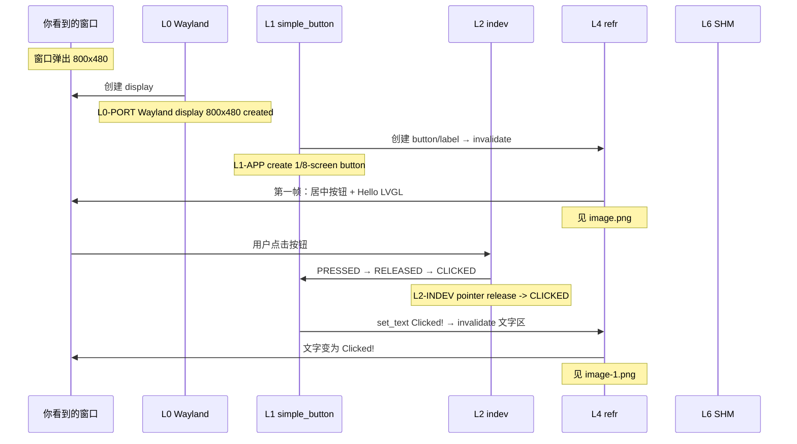
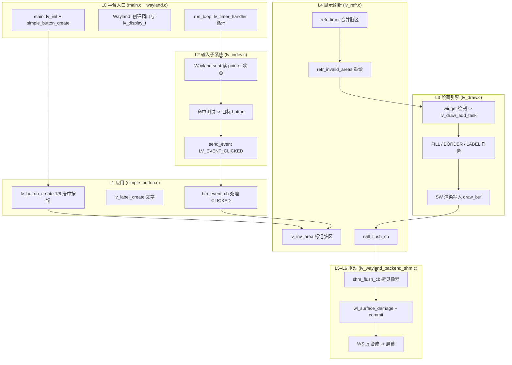
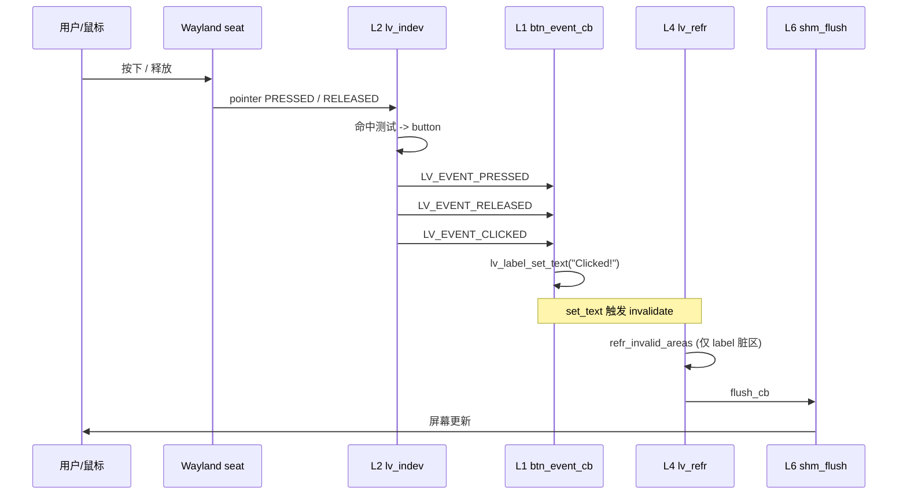

# 最简单 LVGL 示例：居中 Button（屏幕 1/8 大小）

本示例在屏幕中央放一个 **宽、高各为屏幕 1/8** 的按钮，代码独立在 `src/simple_button.c`，`main.c` 只负责初始化与主循环，不再加载 `lv_demo_widgets`。

## 运行

```bash
./scripts/build_wsl_wayland.sh
./build/bin/lvglsim -b wayland 2>trace.log
```

点击按钮后，标签会从 `Hello LVGL` 变为 `Clicked!`。  
stderr 会输出各层 trace（`[LVGL:Lx-...]`），可用 `2>trace.log` 保存。

关闭 trace：CMake 配置时加 `-DLVGL_SIMPLE_BUTTON_TRACE=OFF`。

快捷脚本：

```bash
chmod +x scripts/run_simple_button_demo.sh
./scripts/run_simple_button_demo.sh trace.log   # 另开终端 tail -f trace.log 观察
```

---

## 五、实况运行讲解（WSL2 + Wayland）

> 以下基于 **2026-07-11** 在本机 WSLg 环境实际运行 `./build/bin/lvglsim -b wayland` 的界面与 stderr 日志整理。  
> 讲解方式：**先看屏幕看到什么 → 再对照日志里哪一行对应哪一层**。

### 5.1 你看到的界面（800×480 窗口）

**点击前（`Hello LVGL`）：**


**点击后（`Clicked!`）：**


说明：

| 屏幕元素 | 实测表现 | 来源 |
|----------|----------|------|
| 背景 | 浅灰铺满 800×480 | 默认 screen 样式 |
| 按钮 | 约 **100×60**（800/8 × 480/8），蓝色圆角，**居中** | `simple_button.c` |
| 文字 | 点击前 `Hello LVGL`，点击后 `Clicked!` | `lv_label` 子对象 |
| 右下角 FPS | **已关闭** | `configs/wayland.defaults` 中 `LV_USE_PERF_MONITOR 0` |

> 截图文件与本文档同目录：`docs/image.png`（点击前）、`docs/image-1.png`（点击后）。

---

### 5.2 讲解员旁白：启动 → 第一帧上屏

**【画面】** 见 `image.png`：窗口弹出，**中央**出现一块小按钮（约为屏幕 1/8 宽高），写着 `Hello LVGL`，无 FPS 叠加层。

**【日志】** 按时间顺序，关键几行是：

```
[LVGL:L0-PORT] Wayland display 800x480 created
[LVGL:L1-APP] create 1/8-screen button on screen 0x...
[LVGL:L1-APP] button ready; first invalidate/refresh follows from lv_timer_handler()
[LVGL:L4-REFR] refresh timer: draw 1 dirty region(s)
[LVGL:L3-DRAW] add task FILL at (0,0)-(799,479)
[LVGL:L3-DRAW] add task OTHER at (0,0)-(799,479)
[LVGL:L3-DRAW] add task LABEL at (361,232)-(438,247)
[LVGL:L5-FLUSH] flush_cb area (0,0)-(799,479) px=0x7aeb49089000
[LVGL:L6-DRIVER] Wayland SHM flush (0,0)-(799,479) last=1
```

**逐层解说：**

1. **L0-PORT** — “平台层先把窗户开好”  
   Wayland 在 WSLg 里创建 800×480 的 `lv_display_t`，后面所有绘制都往这块显示对象上写。

2. **L1-APP** — “应用层只干一件事：造按钮”  
   `simple_button_create()` 创建 **屏幕 1/8 大小**、居中的 `lv_button` 和子对象 `lv_label`。  
   此时**还没有像素**，只是对象树搭好了。

3. **L4-REFR** — “刷新层发现有一块脏区域要画”  
   创建/改样式时内部调用了 `lv_obj_invalidate()`，刷新定时器合并脏区后触发重绘（首帧含背景 + 按钮区）。

4. **L3-DRAW** — “绘图层把 UI 拆成多个小任务”  
   - `FILL`：按钮背景（居中约 100×60 区域）→ **你看到的蓝色块**（`image.png`）  
   - `OTHER`：按钮阴影/装饰  
   - `LABEL`：**“Hello LVGL”** 文字

5. **L5-FLUSH → L6-DRIVER** — “把内存里的像素交给 Wayland”  
   `flush_cb` → `shm_flush_cb` → `wl_surface_commit`，WSLg 合成到屏幕。  
   **这一刻，你在窗口里第一次看到 `image.png` 中的画面。**

---

### 5.3 讲解员旁白：点击按钮 → 改字 → 局部刷新

**【操作】** 用鼠标点击中央蓝色按钮（位置见 `image.png`）。

**【画面变化】** 见 `image-1.png`：  
- 文字从 `Hello LVGL` 变成 `Clicked!`  
- 按钮仍居中，尺寸不变

**【日志】** 一次完整点击的关键序列（实测）：

```
[LVGL:L1-APP] LV_EVENT_PRESSED on button 0x6378e09d9110
[LVGL:L1-APP] LV_EVENT_RELEASED on button 0x6378e09d9110
[LVGL:L2-INDEV] pointer release -> LV_EVENT_CLICKED on 0x6378e09d9110
[LVGL:L1-APP] LV_EVENT_CLICKED -> update label text
[LVGL:L4-REFR] invalidate area (357,228)-(442,251)
...
[LVGL:L4-REFR] invalidate area (368,228)-(432,251)
[LVGL:L4-REFR] refresh timer: draw 1 dirty region(s)
[LVGL:L3-DRAW] add task LABEL at (372,232)-(428,247)
...
[LVGL:L5-FLUSH] flush_cb area (0,0)-(799,479) px=0x7aeb49089000
[LVGL:L6-DRIVER] Wayland SHM flush (0,0)-(799,479) last=1
```

**逐层解说：**

| 步骤 | 层 | 界面现象 | 日志关键词 |
|------|-----|----------|------------|
| 1 | L2 输入 | 鼠标按下 | （Wayland seat → indev；PRESSED 由 L1 收到） |
| 2 | L1 应用 | 按钮按下态 | `LV_EVENT_PRESSED on button` |
| 3 | L2 输入 | 鼠标释放，命中测试仍落在 button 上 | `pointer release -> LV_EVENT_CLICKED` |
| 4 | L1 应用 | 回调执行，`lv_label_set_text("Clicked!")` | `LV_EVENT_CLICKED -> update label text` |
| 5 | L4 刷新 | 旧字 “Hello LVGL” 与新字 “Clicked!” 所在矩形先后被标脏 | `invalidate area (357,228)-(...)` 多次，最终约 `(368,228)-(432,251)` |
| 6 | L3 绘图 | 只重画 label 区域 | `LABEL at (372,232)-(428,247)` |
| 7 | L5–L6 | 像素推到 Wayland | `SHM flush ... last=1` |

**要点（讲解员总结）：**

- **事件从 L2 进、L1 收**：应用层 `btn_event_cb` 不直接读硬件，只处理 LVGL 派发的 `LV_EVENT_*`。  
- **改文字 ≠ 立刻改屏幕**：`lv_label_set_text` 先 invalidate，等下一拍 `refr_timer` 才真正画。  
- **脏区比按钮小得多**：invalidate 主要覆盖 label 包围盒，与 `image-1.png` 中仅文字变化一致。

---

### 5.4 界面 ↔ 日志 对照速查



---

### 5.5 自己复现本次讲解

**终端 1 — 运行并写日志：**

```bash
./scripts/run_simple_button_demo.sh trace.log
```

**终端 2 — 实时看日志：**

```bash
tail -f trace.log | grep --line-buffered '\[LVGL:'
```

**点击窗口**（纯 Wayland 时 `xdotool` 可能找不到窗口，可用下面任一方式）：

```bash
# 方式 A：手动用鼠标点窗口
# 方式 B：ydotool 模拟点击（WSL 下实测可用）
ydotool click 0xC0
```

**预期：** `trace.log` 中出现与 §5.2、§5.3 相同结构的 `[LVGL:Lx-...]` 行；界面文字变为 `Clicked!`。

---

## 代码结构

| 文件 | 层级 | 作用 |
|------|------|------|
| `src/main.c` | L0 入口 | `lv_init()`、初始化 Wayland、调用 `simple_button_create()`、进入 `driver_backends_run_loop()` |
| `src/simple_button.c` | L1 应用 | 创建 `lv_button` + `lv_label`，注册 `btn_event_cb` |
| `lvgl/src/indev/` | L2 输入 | 读取鼠标/触摸，命中测试，派发 `LV_EVENT_CLICKED` |
| `lvgl/src/draw/` | L3 绘图 | 把按钮/文字拆成 FILL、BORDER、LABEL 等 draw task |
| `lvgl/src/core/lv_refr.c` | L4 刷新 | 合并脏区、调度重绘、调用 `flush_cb` |
| `lvgl/src/drivers/wayland/` | L5–L6 驱动 | SHM 缓冲、`wl_surface_commit` 提交到 WSLg |

---

## 分层架构（从应用到屏幕）



---

## 场景一：启动后第一帧（绘制按钮）

### 1. L0 — 平台初始化

```
main()
  ├─ lv_init()
  ├─ driver_backends_init_backend("wayland")
  │    └─ lv_wayland_window_create()  → 创建 display + 输入设备
  ├─ simple_button_create()
  └─ driver_backends_run_loop()       → 内部循环 lv_timer_handler()
```

**Trace 示例（WSLg 实测，详见 §5.2）：**
```
[LVGL:L0-PORT] Wayland display 800x480 created
[LVGL:L1-APP] create 1/8-screen button on screen 0x...
[LVGL:L1-APP] button ready; first invalidate/refresh follows from lv_timer_handler()
[LVGL:L4-REFR] refresh timer: draw 1 dirty region(s)
[LVGL:L3-DRAW] add task FILL at (0,0)-(799,479)
[LVGL:L3-DRAW] add task LABEL at (361,232)-(438,247)
[LVGL:L5-FLUSH] flush_cb area (0,0)-(799,479) px=0x7aeb49089000
[LVGL:L6-DRIVER] Wayland SHM flush (0,0)-(799,479) last=1
```

### 2. L1 — 创建控件

```c
lv_obj_t * btn = lv_button_create(scr);
lv_obj_set_size(btn,
                lv_display_get_horizontal_resolution(NULL) / 8,
                lv_display_get_vertical_resolution(NULL) / 8);
lv_obj_center(btn);
lv_obj_t * label = lv_label_create(btn);
lv_label_set_text(label, "Hello LVGL");
```

创建/改样式时会调用 `lv_obj_invalidate()`，把对象包围盒加入 display 的脏区列表。

### 3. L4 — 标记脏区 & 刷新定时器

```
lv_inv_area()
  └─ 记录 inv_areas[]，触发 LV_EVENT_REFR_REQUEST

lv_display_refr_timer()   // 由 lv_timer_handler() 周期调用
  ├─ lv_obj_update_layout()   // 计算 button/label 坐标
  ├─ lv_refr_join_area()      // 合并重叠脏区
  └─ refr_invalid_areas()     // 真正开画
```

**Trace 示例：**
```
[LVGL:L4-REFR] invalidate area (0,0)-(799,479)
[LVGL:L4-REFR] refresh timer: draw 1 dirty region(s)
```

### 4. L3 — 绘图任务

对 button 控件，LVGL 大致生成：

| 顺序 | Draw Task | 画什么 |
|------|-----------|--------|
| 1 | FILL | 按钮背景色 |
| 2 | BORDER | 圆角边框（如有） |
| 3 | LABEL | “Hello LVGL” 字形 |

**Trace 示例（WSLg 实测，详见 §5.2）：**
```
[LVGL:L3-DRAW] add task FILL at (0,0)-(799,479)
[LVGL:L3-DRAW] add task OTHER at (0,0)-(799,479)
[LVGL:L3-DRAW] add task LABEL at (361,232)-(438,247)
```
（`OTHER` 为按钮阴影等装饰。）

### 5. L5–L6 — Flush 到 Wayland

```
call_flush_cb()
  └─ disp->flush_cb()  →  shm_flush_cb()
       ├─ wl_surface_damage(脏矩形)
       └─ wl_surface_commit()  → WSLg 显示
```

**Trace 示例：**
```
[LVGL:L5-FLUSH] flush_cb area (0,0)-(799,479) px=0x...
[LVGL:L6-DRIVER] Wayland SHM flush (0,0)-(799,479) last=1
```

---

## 场景二：用户点击按钮



**Trace 示例（点击一次，WSLg 实测，详见 §5.3）：**
```
[LVGL:L1-APP] LV_EVENT_PRESSED on button 0x6378e09d9110
[LVGL:L1-APP] LV_EVENT_RELEASED on button 0x6378e09d9110
[LVGL:L2-INDEV] pointer release -> LV_EVENT_CLICKED on 0x6378e09d9110
[LVGL:L1-APP] LV_EVENT_CLICKED -> update label text
[LVGL:L4-REFR] invalidate area (368,228)-(432,251)
[LVGL:L3-DRAW] add task LABEL at (372,232)-(428,247)
[LVGL:L6-DRIVER] Wayland SHM flush (0,0)-(799,479) last=1
```

---

## Trace 插桩位置（便于对照源码）

| 标签 | 文件 | 触发时机 |
|------|------|----------|
| `L0-PORT` | `src/lib/display_backends/wayland.c` | Wayland 窗口创建 |
| `L1-APP` | `src/simple_button.c` | 创建按钮 / 事件回调 |
| `L2-INDEV` | `lvgl/src/indev/lv_indev.c` | 指针释放并发送 CLICKED |
| `L3-DRAW` | `lvgl/src/draw/lv_draw.c` | 新增 draw task |
| `L4-REFR` | `lvgl/src/core/lv_refr.c` | invalidate / 刷新脏区 / flush_cb |
| `L5-FLUSH` | `lvgl/src/core/lv_refr.c` | 调用 display flush 回调 |
| `L6-DRIVER` | `lvgl/src/drivers/wayland/lv_wayland_backend_shm.c` | Wayland SHM 提交 |

宏定义：
- 主仓：`src/lvgl_port_trace.h` → `LVGL_PORT_TRACE`
- 子仓：`lvgl/src/misc/lv_port_layer_trace.h` → `LV_PORT_LAYER_TRACE`

由 CMake 选项 `LVGL_SIMPLE_BUTTON_TRACE`（默认 ON）定义 `LV_USE_PORT_LAYER_TRACE=1`。

---

## 与 `hgz.md` 架构文档的对应关系

| hgz.md 概念 | 本示例中的体现 |
|-------------|----------------|
| Application Space | `simple_button.c` |
| LVGL Core（对象/事件/刷新/绘制） | L2–L4 trace |
| 硬件驱动空间 flush | L5–L6 Wayland SHM |
| `lv_timer_handler()` 驱动循环 | `driver_backends_run_loop()` → Wayland 循环 |
| `lv_obj_invalidate` | 创建按钮、改 label 文本时 |
| `disp_flush()` | `shm_flush_cb` |

---

## 恢复复杂 Demo

在 `src/main.c` 中改回：

```c
#include "lvgl/demos/lv_demos.h"
// ...
lv_demo_widgets();
lv_demo_widgets_start_slideshow();
```

并去掉 `simple_button_create()` 调用即可。
