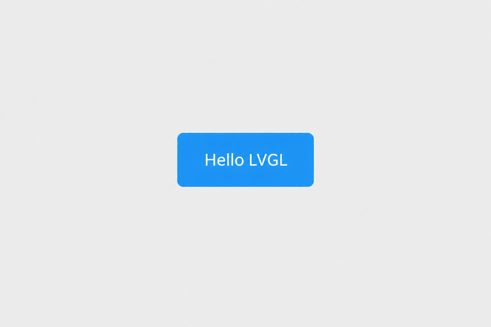
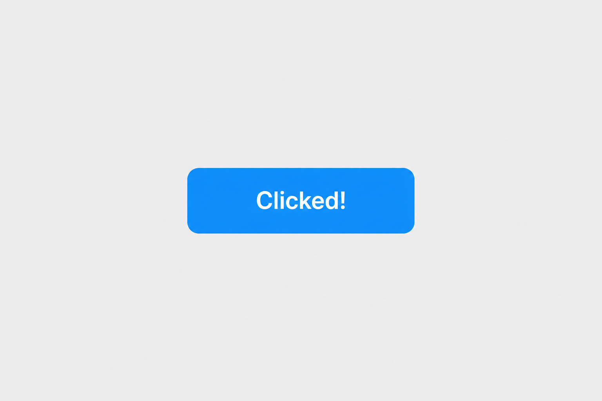
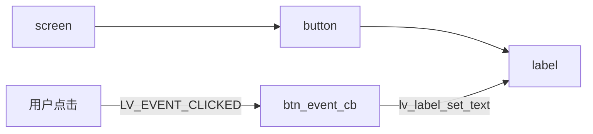

# 简单按钮：代码 + 图文说明

最小 LVGL 例子：屏幕中央放一个 **约为整屏 1/8** 的按钮；点击后文字从 `Hello LVGL` 变成 `Clicked!`。

源码：[`src/simple_button.c`](../src/simple_button.c)  
更长的分层 / 后端讲解见 [`simple_button_guide.md`](./simple_button_guide.md)。

---

## 1. 你看到的界面

**启动后（未点击）：**



**点击一次后：**



| 元素 | 说明 |
|------|------|
| 浅灰背景 | 默认活动 screen |
| 蓝色圆角按钮 | `lv_button`，宽≈屏宽/8，高≈屏高/8，居中 |
| 白色文字 | 子对象 `lv_label` |

---

## 2. 对象树

```text
lv_screen_active()          ← 整屏容器
└── lv_button               ← 可点击区域（居中，1/8 屏）
    └── lv_label            ← "Hello LVGL" / "Clicked!"
```



---

## 3. 核心代码

完整实现在 `src/simple_button.c`；精简如下：

```c
#include "lvgl/lvgl.h"

static void btn_event_cb(lv_event_t * e)
{
    if(lv_event_get_code(e) != LV_EVENT_CLICKED) return;

    lv_obj_t * btn = lv_event_get_target_obj(e);
    lv_obj_t * label = lv_obj_get_child(btn, 0);   /* 第一个子对象 = 文字 */
    lv_label_set_text(label, "Clicked!");
}

void simple_button_create(void)
{
    lv_obj_t * scr = lv_screen_active();

    /* 按钮：屏幕 1/8 大小，居中 */
    lv_obj_t * btn = lv_button_create(scr);
    lv_obj_set_size(btn,
                    lv_display_get_horizontal_resolution(NULL) / 8,
                    lv_display_get_vertical_resolution(NULL) / 8);
    lv_obj_center(btn);
    lv_obj_add_event_cb(btn, btn_event_cb, LV_EVENT_ALL, NULL);

    /* 文字：按钮的子对象，相对按钮居中 */
    lv_obj_t * label = lv_label_create(btn);
    lv_label_set_text(label, "Hello LVGL");
    lv_obj_center(label);
}
```

`main` 里在 `lv_init()`、创建 display 之后调用一次：

```c
simple_button_create();
```

（本仓 `src/main.c` 在未指定其它 demo 时默认走这条路径。）

---

## 4. 点击发生了什么（三步）

```text
手指/鼠标松开  →  LV_EVENT_CLICKED
                    ↓
              btn_event_cb()
                    ↓
         lv_label_set_text("Clicked!")
                    ↓
         invalidate → 下一帧 redraw → 屏幕更新
```

注意：改文字**不会立刻改像素**；`lv_label_set_text` 只把标签标脏，等主循环里的 `lv_timer_handler()` 刷新才真正重画。

---

## 5. 怎么跑

**Wayland + EGL（GPU，推荐本机 WSLg）：**

```bash
cmake -B build-egl -DCONFIG=wayland-egl && cmake --build build-egl -j$(nproc)
export LD_LIBRARY_PATH=/usr/lib/wsl/lib:${LD_LIBRARY_PATH:-}
./build-egl/bin/lvglsim -b wayland -W 800 -H 480
```

**Wayland SHM（CPU）：**

```bash
cmake -B build -DCONFIG=wayland && cmake --build build -j$(nproc)
./build/bin/lvglsim -b wayland -W 800 -H 480
```

快捷脚本：

```bash
./scripts/run_simple_button_demo.sh
```

---

## 6. 想改外观时改哪几行

| 目标 | 改法 |
|------|------|
| 更大按钮 | 把 `/ 8` 改成 `/ 4` 等 |
| 换文案 | `lv_label_set_text(..., "你的文字")` |
| 换颜色 | `lv_obj_set_style_bg_color(btn, lv_color_hex(0xE91E63), 0)` |
| 圆角 | `lv_obj_set_style_radius(btn, 12, 0)` |

官方控件说明：[Button (lv_button)](https://docs.lvgl.io/master/widgets/button.html)。
