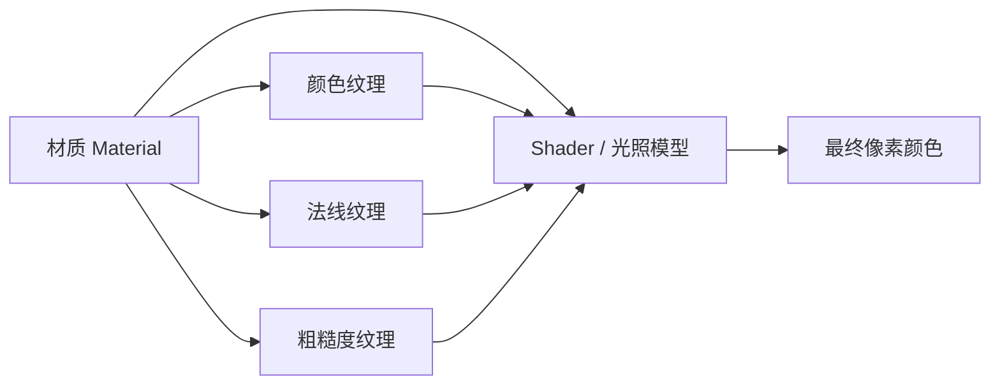

# 纹理与材质的区别

> 图形学基础概念说明，并结合本仓库 LVGL / OpenGLES / GLTF 语境举例。

## 一句话

| 概念 | 是什么 | 类比 |
|------|--------|------|
| **纹理（Texture）** | 贴在表面上的 **图像/数据**（颜色、法线、粗糙度等） | 墙纸、布料的印花 |
| **材质（Material）** | 描述表面 **光学与物理属性 + 用哪些纹理 + 怎么算颜色** 的 **参数集合** | 「这是哑光塑料 / 抛光金属 / 半透明玻璃」的完整配方 |

**记忆口诀**：**Texture = 数据（图）**；**Material = 配方（图 + 参数 + 怎么算光/色）**。

---

## 纹理（Texture）

- **本质**：GPU 里的一张（或多张）**采样用的图像/缓冲**。
- **内容可以是**：
  - **Albedo / Base Color**：表面颜色
  - **Normal**：凹凸细节（不改变几何，只改光照）
  - **Roughness / Metallic**：PBR 里的粗糙度、金属度
  - **Ambient Occlusion**：缝隙阴影
  - **Emissive**：自发光
- **典型操作**：创建、上传、绑定、按 UV 采样（如 `GL_TEXTURE_2D`、`glTexImage2D`、`glBindTexture`）。

在 **LVGL / OpenGLES** 里：display 纹理、NanoVG 的 `nvgImage`、draw/opengles 的 LRU 纹理缓存，都属于 **纹理层**——「有一块像素数据，shader 或 blit 按坐标/UV 取用」。

---

## 材质（Material）

- **本质**：一次绘制时用的 **着色模型 + 参数 + 纹理引用** 的打包。
- **通常包含**：
  - 使用 **哪几张纹理**（baseColorMap、normalMap 等）
  - **标量/向量参数**：`baseColor`、`metallic`、`roughness`、`opacity`
  - **渲染状态**：双面/单面、混合模式、是否受光、使用哪套 shader
- **在 GLTF / 3D 里**：一个 `material` 节点描述 baseColorTexture、metallicRoughnessTexture、alphaMode 等；**材质决定 shader 如何组合这些纹理**。
- **在 LVGL 2D 里**：很少直接叫 “Material”，但类似概念是 **`lv_style`**（颜色、opacity、gradient、shadow）+ **image 源**——样式是「怎么画」，image 是「贴什么图」。

---

## 关系（谁依赖谁）

- **一个材质** 可以 **不用纹理**（例如纯色 `baseColor = 红色`）。
- **一张纹理** 可以被 **多个材质** 复用（同一张 wood.png，一个哑光、一个高光，参数不同）。
- **仅有纹理、没有材质（或等价 shader 参数）** 时，通常不知道 **如何参与光照**（只是 raw 采样）。

---

## 对照表

| 维度 | 纹理 | 材质 |
|------|------|------|
| 类型 | 数据（图像/缓冲） | 描述 + 参数 + 引用 |
| 回答的问题 | 表面 **长什么样** 的像素图案？ | 表面 **是什么**，光怎么打上去？ |
| 典型 API / 概念 | `glGenTextures`、`glBindTexture`、FBO 纹理 | GLTF `material`、`setUniform`、`lv_style` |
| 能否单独存在 | ✅ 可以（仅采样贴图） | ✅ 可以（纯色、无纹理） |
| 典型组合 | 多通道纹理（颜色 + 法线 + …） | 把多通道 + 系数绑在一起 |

---

## 与本仓库 LVGL 栈的对应

| 场景 | 更像「纹理」 | 更像「材质」 |
|------|--------------|--------------|
| wayland-egl + NanoVG | FBO / display 上的 **GL 纹理** | NanoVG 的 fill color、gradient、opacity、blend |
| draw/opengles | LRU 缓存的 **task 纹理** | `lv_opengles_render` 的 shader + opa、flip |
| GLTF 3D widget | `baseColorTexture`、环境贴图 | `libs/gltf` 里的 **material** + PBR shader |
| 2D widget | `lv_image` 的图片源 | `lv_style`（背景色、边框、阴影） |
| wayland-shm | CPU `draw_buf` 像素（无 GL 纹理） | SW draw + `lv_style` |

---

## Windows 与 Linux 路径（补充）

| 环境 | 常见配置 | 「纹理」层 | 「材质/样式」层 |
|------|----------|------------|----------------|
| Linux wayland-shm | SW + wl_shm | CPU 帧缓冲 | `lv_style` / draw task |
| Linux wayland-egl | NanoVG + EGL | GL 纹理 / 默认 FB | NanoVG 绘制参数 |
| Windows 默认（`LV_USE_WINDOWS`） | SW + GDI | `CreateDIBSection` 位图 | `lv_style` |
| Windows 可选 OpenGL | GLFW + NanoVG / Draw_OpenGLES | GL 纹理 | shader + style |

---

## 延伸阅读（本仓库文档）

- OpenGLES 模块与纹理路径：[`docs/lvgl_submodule_code_layout.md`](lvgl_submodule_code_layout.md) — 「OpenGLES 模块」「draw/opengles 深度剖析」
- wayland-egl 实际数据流：同上 — 「本仓库 wayland-egl 实际调用链」
